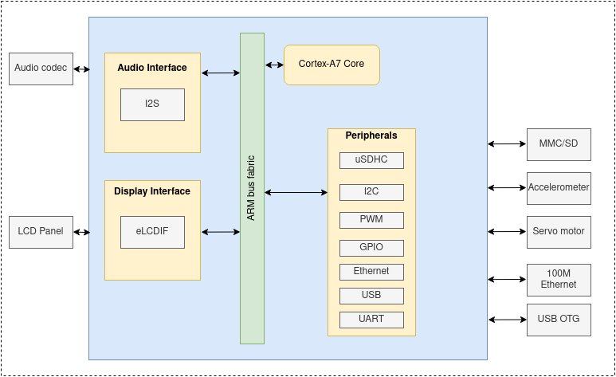
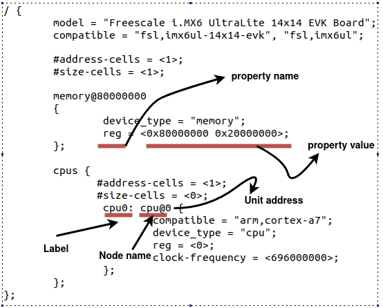

=========================
Kernel Development on ARM
=========================

Lab objectives
==============

* get a feeling of what System on a Chip (SoC) means
* get familiar with embedded world using ARM as a supported architecture
* understand what a Board Support Package means (BSP)
* compile and boot an ARM kernel with Qemu using i.MX6UL platform as an example
* get familiar with hardware description using Device Trees

System on a Chip
================

A System on a Chip (**SoC**) is an integrated circuit (**IC**) that integrates an entire system onto it. The components
that can be usually found on an SoC include a central processing unit (**CPU**), memory, input/output ports, storage devices
together with more sophisticated modules like audio digital interfaces, neural processing units (**NPU**) or graphical
processing units (**GPU**).

SoCs can be used in various applications most common are:
 - consumer electronics (TV sets, mobile phones, video game consoles)
 - industrial computers (medical imaging, etc)
 - automotive
 - home appliances

The leading architecture for SoCs is **ARM**. Worth mentioning here is that there are also x86-based SoCs platforms. Another thing
we need to keep an eye on is **RISC-V** an open standard instruction set architecture.

A simplified view of an **ARM** platform is shown in the image below:

We will refer as a reference platform at NXP's `i.MX6UL <imx6ul>`_ platform, but in general all SoC's contain the following building blocks:

  - one or more CPU cores
  - a system bus
  - clock and reset module

    - PLL
    - OSC
    - reset controller

 - interrupt controller
 - timers
 - memory controller
 - peripheral controllers

   - `I2C <https://en.wikipedia.org/wiki/I%C2%B2C>`_
   - `SPI <https://en.wikipedia.org/wiki/Serial_Peripheral_Interface>`_
   - `GPIO <https://en.wikipedia.org/wiki/General-purpose_input/output>`_
   - `Ethernet <https://en.wikipedia.org/wiki/Network_interface_controller>`_ (for network)
   - `uSDHC <https://en.wikipedia.org/wiki/MultiMediaCard>`_ (for storage)
   - USB
   - `UART <https://en.wikipedia.org/wiki/Universal_asynchronous_receiver-transmitter>`_
   - `I2S <https://en.wikipedia.org/wiki/I%C2%B2S>`_ (for sound)
   - eLCDIF (for LCD Panel)

Here is the complete block diagram for i.MX6UL platform:

.. image::  https://www.nxp.com/assets/images/en/block-diagrams/IMX6UL-BD.jpg
   :alt: IMX6UL-BD
   :width: 60 %
   :align: center

i.MX6UL Evaluation Kit board looks like this:

.. image:: https://www.compulab.com/wp-content/gallery/sbc-imx6ul/compulab_sbc-imx6ul_single-board-computer.jpg
   :alt: imx6ul-evk
   :width: 60 %
   :align: center

Other popular SoC boards:

        * `Broadcom Raspberry Pi <https://en.wikipedia.org/wiki/Raspberry_Pi>`_
        * `Texas Instruments Beagle board <https://en.wikipedia.org/wiki/BeagleBoard>`_
        * `Odroid Xu4 <https://wiki.odroid.com/odroid-xu4/odroid-xu4>`_
        * `Nvidia Jetson Nano <https://developer.nvidia.com/embedded/jetson-nano-developer-kit>`_

Board Support package
=====================

A board support package (**BSP**) is the minimal set of software packages that allow to demonstrate the capabilities of a certain hardware platform. This includes:

  - toolchain
  - bootloader
  - Linux kernel image, device tree files and drivers
  - root filesystem

Semiconductor manufacturers usually provide a **BSP** together with an evaluation board. BSP is typically bundled using `Yocto <https://www.yoctoproject.org/>`_

Toolchain
=========
Because our development machines are mostly x86-based we need a cross compiler that can produce executable
code for ARM platform.

We can build our own cross compiler from scratch using https://crosstool-ng.github.io/ or we can install one

.. code-block:: bash

  $ sudo apt-get install gcc-arm-linux-gnueabihf g++-arm-linux-gnueabihf # for arm32
  $ sudo apt-get install gcc-aarch64-linux-gnu g++-aarch64-linux-gnu     # for arm64

There are several of toolchain binaries depending on the configuration:

  - With "arm-eabi-gcc" you have the Linux system C library which will make calls into the kernel IOCTLs, e.g. for allocating memory pages to the process.
  - With "arm-eabi-none-gcc" you are running on platform which doesn't have an operating system at all - so the C library is different to cope with that.

Compiling the Linux kernel on ARM
---------------------------------

Compile the kernel for 32bit ARM boards:

.. code-block:: bash

  # select defconfig based on your platform
  $ ARCH=arm CROSS_COMPILE=arm-linux-gnueabihf- make imx_v6_v7_defconfig
  # compile the kernel
  $ ARCH=arm CROSS_COMPILE=arm-linux-gnueabihf- make -j8

Compile the kernel for 64bit ARM boards:

.. code-block:: bash

  # for 64bit ARM there is a single config for all supported boards
  $ ARCH=arm CROSS_COMPILE=arm-linux-gnueabihf- make defconfig
  # compile the kernel
  $ ARCH=arm64 CROSS_COMPILE=aarch64-linux-gnu- make -j8

Linux kernel image
==================

The kernel image binary is named ``vmlinux`` and it can be found in the root of the kernel tree. Compressed image used for booting can be found under:

- ``arch/arm/boot/Image``, for arm32
- ``arch/arm64/boot/Image``, for arm64

.. code-block:: bash

    $ file vmlinux
      vmlinux: ELF 32-bit LSB executable, ARM, EABI5 version 1 (SYSV), statically linked, not stripped

    $ file vmlinux
      vmlinux: ELF 64-bit LSB shared object, ARM aarch64, version 1 (SYSV), statically linked, not stripped

Rootfs
======

The root filesystem (``rootfs``) is the filesystem mounted at the top of files hierarchy (``/``). It should contain at least
the critical files allowing the system to boot to a shell.

.. code-block:: bash

   root@so2$ tree -d -L 2
   ├── bin
   ├── boot
   ├── dev
   ├── etc
   ├── home
   │   └── root
   ├── lib
   │   └── udev
   ├── mnt
   ├── proc
   ├── sbin
   │   └── init
   ├── sys
   ├── usr
   │   ├── bin
   │   ├── include
   │   ├── lib
   └── var

As for ``x86`` we will make use of Yocto rootfs images. In order to download an ``ext4`` rootfs image for ``arm32`` one needs to run:

.. code-block:: bash

   $ cd tools/labs/
   $ ARCH=arm make core-image-minimal-qemuarm.ext4

Device tree
===========

Device tree (**DT**) is a tree structure used to describe the hardware devices in a system. Each node in the tree describes a device hence it is called **device node**. DT was introduced
to provide a way to discover non-discoverable hardware (e.g a device on an I2C bus). This information was previously stored inside the source code for the Linux kernel. This meant that
each time we needed to modify a node for a device the kernel needed to be recompiled. This no longer holds true as device tree and kernel image are separate binaries now.

Device trees are stored inside device tree sources (*.dts*) and compiled into device tree blobs (*.dtb*).

.. code-block:: bash

   # compile dtbs
   $ make dtbs

   # location for DT sources on arm32
   $ ls arch/arm/boot/dts/
     imx6ul-14x14-evk.dtb imx6ull-14x14-evk.dtb bcm2835-rpi-a-plus.dts

   # location for DT source on arm64
   $ ls arch/arm64/boot/dts/<vendor>
     imx8mm-evk.dts imx8mp-evk.dts

The following image is a represantation of a simple device tree, describing board type, cpu and memory.

Notice that a device tree node can be defined using ``label: name@address``:

   - ``label``, is an identifier used to reference the node from other places
   - ``name``, node identifier
   - ``address``, used to differentiate nodes with the same name.

A node might contain several properties arranged in the ``name = value`` format. The name is a string
and the value can be bytes, strings, array of strings.

Here is an example:

.. code:: c

   / {
        node@0 {
             empty-property;
             string-property = "string value";
             string-list-property = "string value 1", "string value 2";
             int-list-property = <value1 value2>;

             child-node@0 {
                     child-empty-property;
                     child-string-property = "string value";
                     child-node-reference = <&child-node1>;
             };

             child-node1: child-node@1 {
                     child-empty-property;
                     child-string-property = "string value";
             };
      };
   };

Qemu
====

We will use ``qemu-system-arm`` to boot 32bit ARM platforms. Although, this can be installed from official distro repos, for example:

.. code:: bash

   sudo apt-get install -y qemu-system-arm

We strongly recommend using latest version of ``qemu-system-arm`` build from sources:

.. code:: bash

   $ git clone https://gitlab.com/qemu-project/qemu.git
   $ ./configure --target-list=arm-softmmu --disable-docs
   $ make -j8
   $ ./build/qemu-system-arm

Exercises
=========

.. include:: ../labs/exercises-summary.hrst
.. |LAB_NAME| replace:: arm_kernel_development

.. warning::

  The rules for working with the virtual machine for ``ARM`` are modified as follows

  .. code-block:: shell

     # modules build
     tools/labs $ ARCH=arm CROSS_COMPILE=arm-linux-gnueabihf- make build
     # modules copy
     tools/labs $ ARCH=arm make copy
     # kernel build 
     $ ARCH=arm CROSS_COMPILE=arm-linux-gnueabihf- make -j8

0. Intro
--------

Inspect the following locations in the Linux kernel code and identify platforms and vendors using
ARM architecture:

 - 32-bit: ``arch/arm/boot/dts``
 - 64-bit: ``arch/arm64/boot/dts``

Use ``qemu`` and look at the supported platforms:

.. code-block:: bash

   ../qemu/build/arm-softmmu/qemu-system-arm -M ?

.. note:: We used our own compiled version of ``Qemu`` for ``arm32``. See `Qemu`_ section for more details.

1. Boot
-------

Use ``qemu`` to boot ``i.MX6UL`` platform. In order to boot, we first need to compile the kernel.
Review `Compiling the Linux kernel on ARM`_ section.

Successful compilation will result in the following binaries:

   - ``arch/arm/boot/Image``, kernel image compiled for ARM
   - ``arch/arm/boot/dts/imx6ul-14x14-evk.dtb``, device tree blob for ``i.MX6UL`` board

Review `Rootfs`_ section and download ``core-image-minimal-qemuarm.ext4`` rootfs.
Run ``qemu`` using then following command:

.. code-block:: bash

   ../qemu/build/arm-softmmu/qemu-system-arm -M mcimx6ul-evk -cpu cortex-a7 -m 512M \
     -kernel arch/arm/boot/zImage -nographic  -dtb arch/arm/boot/dts/imx6ul-14x14-evk.dtb \
     -append "root=/dev/mmcblk0 rw console=ttymxc0 loglevel=8 earlycon printk" -sd tools/labs/core-image-minimal-qemuarm.ext4

.. note:: LCDIF and ASRC devices are not well supported with ``Qemu``. Remove them from compilation.

.. code-block:: bash

   $ ARCH=arm CROSS_COMPILE=arm-linux-gnueabihf- make menuconfig
   # set FSL_ASRC=n and DRM_MXSFB=n
   $ ARCH=arm CROSS_COMPILE=arm-linux-gnueabihf- make -j8

Once the kernel is booted check kernel version and cpu info:

.. code-block:: bash

   $ cat /proc/cpuinfo
   $ cat /proc/version

2. CPU information
------------------

Inspect the CPU configuration for ``NXP i.MX6UL`` board. Start with ``arch/arm/boot/dts/imx6ul-14x14-evk.dts``.

  - find ``cpu@0`` device tree node and look for ``operating-points`` property.
  - read the maximum and minimum operating frequency the processor can run

   .. code:: bash

      $ cat /sys/devices/system/cpu/cpu0/cpufreq/cpuinfo_min_freq
      $ cat /sys/devices/system/cpu/cpu0/cpufreq/cpuinfo_max_freq

3. I/O memory
-------------
Inspect I/O space configuration for ``NXP i.MX6UL`` board. Start with ``arch/arm/boot/dts/imx6ul-14x14-evk.dts`` and identify each device mentioned below.

.. code:: bash

   $ cat /proc/iomem
     00900000-0091ffff : 900000.sram sram@900000
     0209c000-0209ffff : 209c000.gpio gpio@209c000
     021a0000-021a3fff : 21a0000.i2c i2c@21a0000
     80000000-9fffffff : System RAM

Identify device tree nodes corresponding to:

  -  ``System RAM``, look for ``memory@80000000`` node in ``arch/arm/boot/dts/imx6ul-14x14-evk.dtsi``. What's the size of the System RAM?
  -  ``GPIO1``, look for ``gpio@209c000`` node in ``arch/arm/boot/dts/imx6ul.dtsi``. What's the size of the I/O space for this device?
  -  ``I2C1``,  look for ``i2c@21a0000`` node in ``arch/arm/boot/dts/imx6ul.dtsi``. What's the size of the I/O spaces for this device?

4. Hello World
--------------

Implement a simple kernel module that prints a message at load/unload time. Compile it and load it on ``i.MX6UL`` emulated platform.

.. code-block:: shell

   # modules build
   tools/labs $ ARCH=arm CROSS_COMPILE=arm-linux-gnueabihf- make build
   # modules copy
   tools/labs $ ARCH=arm make copy
   # kernel build
   $ ARCH=arm CROSS_COMPILE=arm-linux-gnueabihf- make -j8

5. Simple device
----------------

Implement a driver for a simple platform device. Find ``TODO 1`` and notice how ``simple_driver`` is declared and register as a platform driver.
Follow ``TODO 2`` and add the ``so2,simple-device-v1`` and ``so2,simple-device-v2`` compatible strings in the simple_device_ids array.

Create two device tree nodes in ``arch/arm/boot/dts/imx6ul.dtsi`` under ``soc`` node with compatible strings ``so2,simple-device-v1`` and
``so2,simple-device-v2`` respectively. Then notice the behavior when loading ``simple_driver`` module.

.. _imx6ul: https://www.nxp.com/products/processors-and-microcontrollers/arm-processors/i-mx-applications-processors/i-mx-6-processors/i-mx-6ultralite-processor-low-power-secure-arm-cortex-a7-core:i.MX6UL
