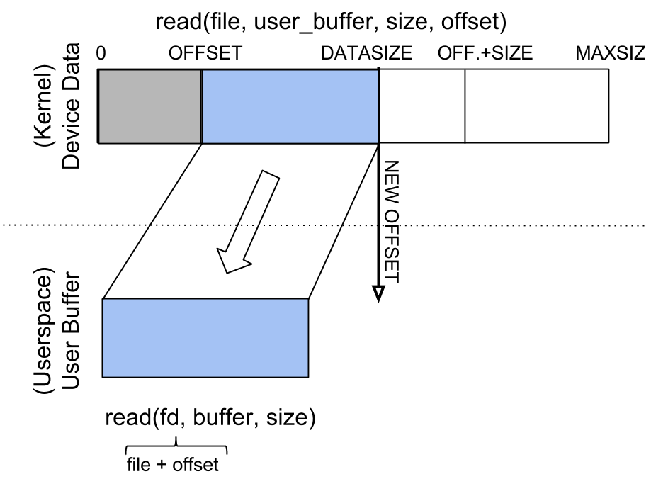

========================
Character device drivers
========================

Laboratory objectives
=====================

  * understand the concepts behind character device driver
  * understand the various operations that can be performed on character devices
  * working with waiting queues

Overview
========

In UNIX, hardware devices are accessed by the user through special device
files. These files are grouped into the /dev directory, and system calls
``open``, ``read``, ``write``, ``close``, ``lseek``, ``mmap`` etc. are
redirected by the operating system to the device driver associated with the
physical device. The device driver is a kernel component (usually a module)
that interacts with a hardware device.

In the UNIX world there are two categories of device files and thus
device drivers: character and block. This division is done by the speed,
volume and way of organizing the data to be transferred from the device to the
system and vice versa. In the first category, there are slow devices, which
manage a small amount of data, and access to data does not require frequent
seek queries. Examples are devices such as keyboard, mouse, serial ports,
sound card, joystick. In general, operations with these devices (read, write)
are performed sequentially byte by byte. The second category includes devices
where data volume is large, data is organized on blocks, and search is common.
Examples of devices that fall into this category are hard drives, cdroms, ram
disks, magnetic tape drives. For these devices, reading and writing is done at
the data block level.

For the two types of device drivers, the Linux kernel offers different APIs.
If for character devices system calls go directly to device drivers, in case of
block devices, the drivers do not work directly with system calls. In
the case of block devices, communication between the user-space and the block
device driver is mediated by the file management subsystem and the block device
subsystem. The role of these subsystems is to prepare the device driver's
necessary resources (buffers), to keep the recently read data in the cache
buffer, and to order the read and write operations for performance reasons.

Majors and minors
=================

In UNIX, the devices traditionally had a unique, fixed identifier associated
with them. This tradition is preserved in Linux, although identifiers can be
dynamically allocated (for compatibility reasons, most drivers still use static
identifiers). The identifier consists of two parts: major and minor. The first
part identifies the device type (IDE disk, SCSI disk, serial port, etc.)
and the second one identifies the device (first disk, second serial port,
etc.). Most times, the major identifies the driver, while the minor identifies
each physical device served by the driver. In general, a driver will have a
major associate and will be responsible for all minors associated with that
major.

.. code-block:: bash

   $ ls -la /dev/hda? /dev/ttyS?
   brw-rw----  1 root disk    3,  1 2004-09-18 14:51 /dev/hda1
   brw-rw----  1 root disk    3,  2 2004-09-18 14:51 /dev/hda2
   crw-rw----  1 root dialout 4, 64 2004-09-18 14:52 /dev/ttyS0
   crw-rw----  1 root dialout 4, 65 2004-09-18 14:52 /dev/ttyS1

As can be seen from the example above, device-type information can be found
using the ls command. The special character files are identified by the ``c``
character in the first column of the command output, and the block type by the
character ``b``. In columns ``5`` and ``6`` of the result  you can see the
major, respectively the minor for each device.

Certain major identifiers are statically assigned to devices (in the
``Documentation/admin-guide/devices.txt`` file from the kernel sources). When choosing the
identifier for a new device, you can use two methods: static (choose a number
that does not seem to be used already) or dynamically. In /proc/devices are the
loaded devices, along with the major identifier.

To create a device type file, use the ``mknod`` command; the command receives the
type (``block`` or ``character``), ``major`` and ``minor`` of the device
(``mknod name type major minor``). Thus, if you want to create a character device
named ``mycdev`` with the major ``42`` and minor ``0``, use the command:

.. code-block:: bash

   # mknod /dev/mycdev c 42 0

To create the block device with the name ``mybdev`` with the major 240 and minor 0
the command will be:

.. code-block:: bash

   # mknod /dev/mybdev b 240 0

Next, we'll refer to character devices as drivers.

Data structures for a character device
======================================

In the kernel, a character-type device is represented by
:c:type:`struct cdev <cdev>`, a structure used to register it in the
system. Most driver operations use three important structures:
``struct file_operations``, ``struct file`` and ``struct inode``.

:c:type:`struct file_operations`
--------------------------------

As mentioned above, the character device drivers receive unaltered system calls
made by users over device-type files. Consequently, implementation of a character
device driver means implementing the system calls specific to files: ``open``,
``close``, ``read``, ``write``, ``lseek``, ``mmap``, etc. These operations are
described in the fields of the ``struct file_operations`` structure:

.. code-block:: c

   #include <linux/fs.h>

   struct file_operations {
       struct module *owner;
       loff_t (*llseek) (struct file *, loff_t, int);
       ssize_t (*read) (struct file *, char __user *, size_t, loff_t *);
       ssize_t (*write) (struct file *, const char __user *, size_t, loff_t *);
       [...]
       long (*unlocked_ioctl) (struct file *, unsigned int, unsigned long);
       [...]
       int (*open) (struct inode *, struct file *);
       int (*flush) (struct file *, fl_owner_t id);
       int (*release) (struct inode *, struct file *);
       [...]

.. **

It can be noticed that the signature of the function differs from the system
call that the user uses. The operating system sits between the user and
the device driver to simplify implementation in the device driver.

``open`` does not receive the parameter path or the various parameters that control
the file opening mode. Similarly, ``read``, ``write``, ``release``, ``ioctl``, ``lseek``
do not receive as a parameter a file descriptor. Instead, these routines receive as
parameters two structures: ``file`` and ``inode``. Both structures represent a file,
but from different perspectives.

Most parameters for the presented operations have a direct meaning:
   * ``file`` and ``inode`` identifies the device type file;
   * ``size`` is the number of bytes to be read or written;
   * ``offset`` is the displacement to be read or written (to be updated
     accordingly);
   * ``user_buffer`` user buffer from which it reads / writes;
   * ``whence`` is the way to seek (the position where the search operation starts);
   * ``cmd`` and ``arg`` are the parameters sent by the users to the ioctl call (IO
     control).

``inode`` and ``file`` structures
---------------------------------

An ``inode`` represents a file from the point of view of the file system. Attributes
of an inode are the size, rights, times associated with the file. An inode uniquely
identifies a file in a file system.

The ``file`` structure is still a file, but closer to the user's point of view.
From the attributes of the file structure we list: the inode, the file name,
the file opening attributes, the file position. All open files at a given time
have associated a ``file`` structure.

To understand the differences between inode and file, we will use an analogy
from object-oriented programming: if we consider a class inode, then the files
are objects, that is, instances of the inode class. Inode represents the static
image of the file (the inode has no state), while the file represents the
dynamic image of the file (the file has state).

Returning to device drivers, the two entities have almost always standard ways
of using: the inode is used to determine the major and minor of the device on
which the operation is performed, and the file is used to determine the flags
with which the file was opened, but also to save and access (later) private
data.

The file structure contains, among many fields:

   * ``f_mode``, which specifies read ``FMODE_READ`` (``FMODE_READ``) or write
     (``FMODE_WRITE``);
   * ``f_flags``, which specifies the file opening flags (``O_RDONLY``,
     ``O_NONBLOCK``, ``O_SYNC``, ``O_APPEND``, ``O_TRUNC``, etc.);
   * ``f_op``, which specifies the operations associated with the file (pointer to
     the ``file_operations`` structure );
   * ``private_data``, a pointer that can be used by the programmer to store
     device-specific data; The pointer will be initialized to a memory location
     assigned by the programmer.
   * ``f_pos``, the offset within the file

The inode structure contains, among many information, an ``i_cdev``
field, which is a pointer to the structure that defines the character
device (when the inode corresponds to a character device).

Implementation of operations
============================

To implement a device driver, it is recommended that you create a structure
that contains information about the device, information used in the module. In
the case of a driver for a character device, the structure will contain a cdev
structure field to refer to the device. The following example uses the struct
my_device_data:

.. code-block:: c

   #include <linux/fs.h>
   #include <linux/cdev.h>

   struct my_device_data {
       struct cdev cdev;
       /* my data starts here */
       //...
   };

   static int my_open(struct inode *inode, struct file *file)
   {
       struct my_device_data *my_data;

       my_data = container_of(inode->i_cdev, struct my_device_data, cdev);

       file->private_data = my_data;
       //...
   }

   static int my_read(struct file *file, char __user *user_buffer, size_t size, loff_t *offset)
   {
       struct my_device_data *my_data;

       my_data = (struct my_device_data *) file->private_data;

       //...
   }

.. **

A structure like ``my_device_data`` will contain the data associated with a device.
The ``cdev`` field (``cdev`` type) is a character-type device and is used to record it
in the system and identify the device. The pointer to the ``cdev`` member can be
found using the ``i_cdev`` field of the ``inode`` structure (using the ``container_of``
macro). In the private_data field of the file structure, information can be
stored at open which is then available in the ``read``, ``write``, ``release``, etc.
routines.

Registration and unregistration of character devices
====================================================

The registration/unregistration of a device is made by specifying the major and
minor. The ``dev_t`` type is used to keep the identifiers of a device (both major
and minor) and can be obtained using the ``MKDEV`` macro.

For the static assignment and unallocation of device identifiers, the
``register_chrdev_region`` and ``unregister_chrdev_region`` functions are used:

.. code-block:: c

   #include <linux/fs.h>

   int register_chrdev_region(dev_t first, unsigned int count, char *name);
   void unregister_chrdev_region(dev_t first, unsigned int count);

.. **

It is recommended that device identifiers be dynamically assigned to the
``alloc_chrdev_region`` function.

The ``my_minor_count`` sequence reserves my_minor_count devices, starting with
``my_major`` major and my_first_minor minor (if the max value for minor is
exceeded, move to the next major):

.. code-block:: c

   #include <linux/fs.h>
   ...

   err = register_chrdev_region(MKDEV(my_major, my_first_minor), my_minor_count,
                                "my_device_driver");
   if (err != 0) {
       /* report error */
       return err;
   }
   ...

.. **

After assigning the identifiers, the character device will have to be
initialized (``cdev_init``) and the kernel will have to be notified(``cdev_add``). The
``cdev_add`` function must be called only after the device is ready to receive
calls. Removing a device is done using the ``cdev_del`` function.

.. code-block:: c

   #include <linux/cdev.h>

   void cdev_init(struct cdev *cdev, struct file_operations *fops);
   int cdev_add(struct cdev *dev, dev_t num, unsigned int count);
   void cdev_del(struct cdev *dev);

.. **

The following sequence registers and initializes MY_MAX_MINORS devices:

.. code-block:: c

    #include <linux/fs.h>
    #include <linux/cdev.h>

    #define MY_MAJOR       42
    #define MY_MAX_MINORS  5

    struct my_device_data {
        struct cdev cdev;
        /* my data starts here */
        //...
    };

    struct my_device_data devs[MY_MAX_MINORS];

    const struct file_operations my_fops = {
        .owner = THIS_MODULE,
        .open = my_open,
        .read = my_read,
        .write = my_write,
        .release = my_release,
        .unlocked_ioctl = my_ioctl
    };

    int init_module(void)
    {
        int i, err;

        err = register_chrdev_region(MKDEV(MY_MAJOR, 0), MY_MAX_MINORS,
                                     "my_device_driver");
        if (err != 0) {
            /* report error */
            return err;
        }

        for(i = 0; i < MY_MAX_MINORS; i++) {
            /* initialize devs[i] fields */
            cdev_init(&devs[i].cdev, &my_fops);
            cdev_add(&devs[i].cdev, MKDEV(MY_MAJOR, i), 1);
        }

        return 0;
    }

.. **

While the following sequence deletes and unregisters them:

.. code-block:: c

   void cleanup_module(void)
   {
       int i;

       for(i = 0; i < MY_MAX_MINORS; i++) {
           /* release devs[i] fields */
           cdev_del(&devs[i].cdev);
       }
       unregister_chrdev_region(MKDEV(MY_MAJOR, 0), MY_MAX_MINORS);
   }

.. **

.. note:: initialization of the struct my_fops used the initialization
          of members by name, defined in C99 standard (see designated
          initializers and the file_operations structure). Structure
          members who do not explicitly appear in this initialization
          will be set to the default value for their type. For
          example, after the initialization above, ``my_fops.mmap`` will
          be NULL.

.. _access_to_process_address_space:

Access to the address space of the process
==========================================

A driver for a device is the interface between an application and hardware. As
a result, we often have to access a given user-space driver device. Accessing
process address space can not be done directly (by de-referencing a user-space
pointer). Direct access of a user-space pointer can lead to incorrect behavior
(depending on architecture, a user-space pointer may not be valid or mapped to
kernel-space), a kernel oops (the user-mode pointer can refer to a non-resident
memory area) or security issues. Proper access to user-space data is done by
calling the macros / functions below:

.. code-block:: c

   #include <asm/uaccess.h>

   put_user(type val, type *address);
   get_user(type val, type *address);
   unsigned long copy_to_user(void __user *to, const void *from, unsigned long n);
   unsigned long copy_from_user(void *to, const void __user *from, unsigned long n)

.. **

All macros / functions return 0 in case of success and another value in case of
error and have the following roles:

   * ``put_user`` put in the user-space at the address address value of the val;
     Type can be one on 8, 16, 32, 64 bit (the maximum supported type depends on the
     hardware platform);
   * ``get_user`` analogue to the previous function, only that val will be set to a
     value identical to the value at the user-space address given by address;
   * ``copy_to_user`` copies ``n`` bytes from the kernel-space, from the address
     referenced by ``from`` in user-space to the address referenced by ``to``;
   * ``copy_from_user`` copies ``n`` bytes from user-space from the address
     referenced by ``from`` in kernel-space to the address referenced by ``to``.

A common section of code that works with these functions is:

.. code-block:: c

   #include <asm/uaccess.h>

   /*
    * Copy at most size bytes to user space.
    * Return ''0'' on success and some other value on error.
    */
   if (copy_to_user(user_buffer, kernel_buffer, size))
       return -EFAULT;
   else
       return 0;

Open and release
================

The ``open`` function performs the initialization of a device. In most cases,
these operations refer to initializing the device and filling in specific data
(if it is the first open call). The release function is about releasing
device-specific resources: unlocking specific data and closing the device if
the last call is close.

In most cases, the open function will have the following structure:

.. code-block:: c

   static int my_open(struct inode *inode, struct file *file)
   {
       struct my_device_data *my_data =
                container_of(inode->i_cdev, struct my_device_data, cdev);

       /* validate access to device */
       file->private_data = my_data;

       /* initialize device */
       ...

       return 0;
   }

.. **

A problem that occurs when implementing the ``open`` function is access control.
Sometimes a device needs to be opened once at a time; More specifically, do not
allow the second open before the release. To implement this restriction, you
choose a way to handle an open call for an already open device: it can return
an error (``-EBUSY``), block open calls until a release operation, or shut down
the device before do the open.

At the user-space call of the open and close functions on the device, call
my_open and my_release in the driver. An example of a user-space call:

.. code-block:: c

    int fd = open("/dev/my_device", O_RDONLY);
    if (fd < 0) {
        /* handle error */
    }

    /* do work */
    //..

    close(fd);

.. **

Read and write
==============

The read and write operations are reaching the device driver as a
result of a userspace program calling the read or write system calls:

.. code-block:: c

    if (read(fd, buffer, size) < 0) {
        /* handle error */
    }

    if (write(fd, buffer, size) < 0) {
        /* handle error */
    }

.. **

The ``read`` and ``write`` functions transfer data between the device and the
user-space: the read function reads the data from the device and transfers it
to the user-space, while writing reads the user-space data and writes it to the
device. The buffer received as a parameter is a user-space pointer, which is
why it is necessary to use the ``copy_to_user`` or ``copy_from_user`` functions.

The value returned by read or write can be:

  * the number of bytes transferred; if the returned value is less than the size
    parameter (the number of bytes requested), then it means that a partial
    transfer was made. Most of the time, the user-space app calls the system call
    (read or write) function until the required data number is transferred.
  * 0 to mark the end of the file in the case of read ; if write returns the
    value 0 then it means that no byte has been written and that no error has
    occurred; In this case, the user-space application retries the write call.
  * a negative value indicating an error code.

To perform a data transfer consisting of several partial transfers, the
following operations should be performed:

  * transfer the maximum number of possible bytes between the buffer received
    as a parameter and the device (writing to the device/reading from the device
    will be done from the offset received as a parameter);
  * update the offset received as a parameter to the position from which the
    next read / write data will begin;
  * return the number of bytes transferred.

The sequence below shows an example for the read function that takes
into account the internal buffer size, user buffer size and the offset:

.. code-block:: c

   static int my_read(struct file *file, char __user *user_buffer,
                      size_t size, loff_t *offset)
   {
       struct my_device_data *my_data = (struct my_device_data *) file->private_data;
       ssize_t len = min(my_data->size - *offset, size);

       if (len <= 0)
           return 0;

       /* read data from my_data->buffer to user buffer */
       if (copy_to_user(user_buffer, my_data->buffer + *offset, len))
           return -EFAULT;

       *offset += len;
       return len;
   }

.. **

The images below illustrate the read operation and how data is
transferred between the userspace and the driver:

   1. when the driver has enough data available (starting with the OFFSET
      position) to accurately transfer the required size (SIZE) to the user.
   2. when a smaller amount is transferred than required.

.. image:: read.png
   :width: 49 %

We can look at the read operation implemented by the driver as a response to a
userpace read request. In this case, the driver is responsible for advancing
the offset according to how much it reads and returning the read size (which
may be less than what is required).

The structure of the write function is similar:

.. code-block:: c

   static int my_write(struct file *file, const char __user *user_buffer,
                       size_t size, loff_t * offset)
   {
       struct my_device_data *my_data = (struct my_device_data *) file->private_data;
       ssize_t len = min(my_data->size - *offset, size);

       if (len <= 0)
           return 0;

       /* read data from user buffer to my_data->buffer */
       if (copy_from_user(my_data->buffer + *offset, user_buffer, len))
           return -EFAULT;

       *offset += len;
       return len;
   }

.. **

The write operation will respond to a write request from userspace. In
this case, depending on the maximum driver capacity (MAXSIZ), it can
write more or less than the required size.

.. image:: write.png
   :width: 49 %
.. image:: write2.png
   :width: 49 %

.. _ioctl:

ioctl
=====

In addition to read and write operations, a driver needs the ability to perform
certain physical device control tasks. These operations are accomplished by
implementing a ``ioctl`` function. Initially, the ioctl system call used Big Kernel
Lock. That's why the call was gradually replaced with its unlocked version
called ``unlocked_ioctl``. You can read more on LWN:
http://lwn.net/Articles/119652/

.. code-block:: c

  static long my_ioctl (struct file *file, unsigned int cmd, unsigned long arg);

.. **

``cmd`` is the command sent from user-space. If a value is being sent to the
user-space call, it can be accessed directly. If a buffer is fetched, the arg
value will be a pointer to it, and must be accessed through the ``copy_to_user``
or ``copy_from_user``.

Before implementing the ``ioctl`` function, the numbers corresponding to the
commands must be chosen. One method is to choose consecutive numbers starting
at 0, but it is recommended to use ``_IOC(dir, type, nr, size)`` macrodefinition
to generate ioctl codes. The macrodefinition parameters are as follows:

   * ``dir`` represents the data transfer (``_IOC_NONE`` , ``_IOC_READ``,
     ``_IOC_WRITE``).
   * ``type`` represents the magic number (``Documentation/ioctl/ioctl-number.txt``);
   * ``nr`` is the ioctl code for the device;
   * ``size`` is the size of the transferred data.

The following example shows an implementation for a ``ioctl`` function:

.. code-block:: c

   #include <asm/ioctl.h>

   #define MY_IOCTL_IN _IOC(_IOC_WRITE, 'k', 1, sizeof(my_ioctl_data))

   static long my_ioctl (struct file *file, unsigned int cmd, unsigned long arg)
   {
       struct my_device_data *my_data =
            (struct my_device_data*) file->private_data;
        my_ioctl_data mid;

        switch(cmd) {
        case MY_IOCTL_IN:
           if( copy_from_user(&mid, (my_ioctl_data *) arg,
                              sizeof(my_ioctl_data)) )
               return -EFAULT;

           /* process data and execute command */

           break;
       default:
           return -ENOTTY;
       }

       return 0;
   }

.. **

At the user-space call for the ioctl function, the my_ioctl function of the
driver will be called. An example of such a user-space call:

.. code-block:: c

    if (ioctl(fd, MY_IOCTL_IN, buffer) < 0) {
        /* handle error */
    }

.. **

Waiting queues
==============

It is often necessary for a thread to wait for an operation to finish,
but it is desirable that this wait is not busy-waiting. Using waiting
queues we can block a thread until an event occurs. When the condition
is satisfied, elsewhere in the kernel, in another process, in an
interrupt or deferrable work, we will wake-up the process.

A waiting queue is a list of processes that are waiting for a specific
event. A queue is defined with the ``wait_queue_head_t`` type and can
be used by the functions/macros:

.. code-block:: c

   #include <linux/wait.h>

   DECLARE_WAIT_QUEUE_HEAD(wq_name);

   void init_waitqueue_head(wait_queue_head_t *q);

   int wait_event(wait_queue_head_t q, int condition);

   int wait_event_interruptible(wait_queue_head_t q, int condition);

   int wait_event_timeout(wait_queue_head_t q, int condition, int timeout);

   int wait_event_interruptible_timeout(wait_queue_head_t q, int condition, int timeout);

   void wake_up(wait_queue_head_t *q);

   void wake_up_interruptible(wait_queue_head_t *q);

.. **

The roles of the macros / functions above are:

   * :c:func:`init_waitqueue_head` initializes the queue; to initialize the
     queue at compile time, you can use the :c:macro:`DECLARE_WAIT_QUEUE_HEAD` macro;
   * :c:func:`wait_event` and :c:func:`wait_event_interruptible` adds the current thread to the
     queue while the condition is false, sets it to TASK_UNINTERRUPTIBLE or
     TASK_INTERRUPTIBLE and calls the scheduler to schedule a new thread; Waiting
     will be interrupted when another thread will call the wake_up function;
   * :c:func:`wait_event_timeout` and :c:func:`wait_event_interruptible_timeout` have the same
     effect as the above functions, only waiting can be interrupted at the end of
     the timeout received as a parameter;
   * :c:func:`wake_up` puts all threads off from state TASK_INTERRUPTIBLE and
     TASK_UNINTERRUPTIBLE in TASK_RUNNING status; Remove these threads from the
     queue;
   * :c:func:`wake_up_interruptible` same action, but only threads with TASK_INTERRUPTIBLE
     status are woken up.

A simple example is that of a thread waiting to change the value of a flag. The
initializations are done by the sequence:

.. code-block:: c

   #include <linux/sched.h>

   wait_queue_head_t wq;
   int flag = 0;

   init_waitqueue_head(&wq);

.. **

A thread will wait for the flag to be changed to a value other than zero:

.. code-block:: c

   wait_event_interruptible(wq, flag != 0);

.. **

While another thread will change the flag value and wake up the waiting threads:

.. code-block:: c

   flag = 1 ;
   wake_up_interruptible (&wq);

.. **

Exercises
=========

.. include:: exercises-summary.hrst
.. |LAB_NAME| replace:: device_drivers

0. Intro
--------

Using `LXR <http://elixir.free-electrons.com/linux/latest/source>`_ find the definitions
of the following symbols in the Linux kernel:

    * :c:type:`struct file`
    * :c:type:`struct file_operations`
    * :c:type:`generic_ro_fops`
    * :c:func:`vfs_read`

1. Register/unregister
----------------------

The driver will control a single device with the ``MY_MAJOR`` major and
``MY_MINOR`` minor (the macros defined in the kernel/so2_cdev.c file).

   1. Create **/dev/so2_cdev** character device node using **mknod**.

      .. hint:: Read `Majors and minors`_ section in the lab.

   2. Implement the registration and deregistration of the device with the name
      ``so2_cdev``, respectively in the init and exit module functions. Implement **TODO 1**.

      .. hint:: Read the section `Registration and unregistration of character devices`_

   3. Display, using ``pr_info``, a message after the registration and unregistration
      operations to confirm that they were successful. Then load the module into the kernel:

      .. code-block:: bash

         $ insmod so2_cdev.ko

      And see character devices in ``/proc/devices``:

      .. code-block:: bash

         $ cat /proc/devices | less

      Identify the device type registered with major 42 . Note that ``/proc/devices``
      contains only the device types (major) but not the actual devices (i.e. minors).

      .. note:: Entries in /dev are not created by loading the module. These can be created
                in two ways:

                * manually, using the ``mknod`` command as we will do in the following exercises.
                * automatically using udev daemon

   4. Unload the kernel module

      .. code-block:: bash

         rmmod so2_cdev

2. Register an already registered major
---------------------------------------

Modify **MY_MAJOR** so that it points to an already used major number.

.. hint:: See ``/proc/devices`` to get an already assigned major.

See `errno-base.h <http://elixir.free-electrons.com/linux/v4.9/source/include/uapi/asm-generic/errno-base.h>`_
and figure out what does the error code mean.
Return to the initial configuration of the module.

3. Open and close
-----------------

Run ``cat /dev/so2_cdev`` to read data from our char device.
Reading does not work because the driver does not have the open function implemented.
Follow comments marked with TODO 2 and implement them.

   1. Initialize your device

      * add a cdev struct field to ``so2_device_data`` structure.
      * Read the section `Registration and unregistration of character devices`_ in the lab.

   2. Implement the open and release functions in the driver.
   3. Display a message in the open and release functions.
   4. Read again ``/dev/so2_cdev`` file. Follow the messages displayed by the kernel.
      We still get an error because ``read`` function is not yet implemented.

.. note:: The prototype of a device driver's operations is in the ``file_operations``
          structure. Read `Open and release`_ section.

4. Access restriction
---------------------

Restrict access to the device with atomic variables, so that a single process
can open the device at a time. The rest will receive the "device busy" error
(``-EBUSY``). Restricting access will be done in the open function displayed by
the driver. Follow comments marked with **TODO 3** and implement them.

   1. Add an ``atomic_t`` variable to the device structure.
   2. Initialize the variable at module initialization.
   3. Use the variable in the open function to restrict access to the device. We
      recommend using :c:func:`atomic_cmpxchg`.
   4. Reset the variable in the release function to retrieve access to the device.
   5. To test your deployment, you'll need to simulate a long-term use of your
      device. To simulate a sleep, call the scheduler at the end of the device opening:

.. code-block:: bash

         set_current_state(TASK_INTERRUPTIBLE);
         schedule_timeout(1000);

.. **

   6. Test using ``cat /dev/so2_cdev`` & ``cat /dev/so2_cdev``.

.. note:: The advantage of the atomic_cmpxchg function is that it can check the
          old value of the variable and set it up to a new value, all in one
          atomic operation. Read more details about `atomic_cmpxchg <https://www.khronos.org/registry/OpenCL/sdk/1.1/docs/man/xhtml/atomic_cmpxchg.html>`_
          An example of use is `here <http://elixir.free-electrons.com/linux/v4.9/source/lib/dump_stack.c#L24>`_.

5. Read operation
-----------------

Implement the read function in the driver. Follow comments marked with ``TODO 4`` and implement them.

   1. Keep a buffer in ``so2_device_data`` structure initialized with the value of ``MESSAGE`` macro.
      Initializing this buffer will be done in module ``init`` function.
   2. At a read call, copy the contents of the kernel space buffer into the user
      space buffer.

      * Use the :c:func:`copy_to_user` function to copy information from kernel space to
        user space.
      * Ignore the size and offset parameters at this time. You can assume that
        the buffer in user space is large enough. You do not need to check the
        validity of the size argument of the read function.
      * The value returned by the read call is the number of bytes transmitted
        from the kernel space buffer to the user space buffer.

   3. After implementation, test using ``cat /dev/so2_cdev``.

.. note:: The command ``cat /dev/so2_cdev`` does not end (use Ctrl+C).
          Read the `read and write`_ sections and `Access to the address space of the process`_
          If you want to display the offset value use a construction of the form:
          ``pr_info("Offset: %lld \n", *offset)``; The data type loff_t (used by offset ) is a typedef for long long int.

The ``cat`` command reads to the end of the file, and the end of the file is
signaled by returning the value 0 in the read. Thus, for a correct implementation,
you will need to update and use the offset received as a parameter in the read
function and return the value 0 when the user has reached the end of the buffer.

Modify the driver so that the ``cat`` commands ends:

    1. Use the size parameter.
    2. For every read, update the offset parameter accordingly.
    3. Ensure that the read function returns the number of bytes that were copied
       into the user buffer.

.. note:: By dereferencing the offset parameter it is possible to read and move the current
          position in the file. Its value needs to be updated every time a read is done
          successfully.

6. Write operation
------------------

Add the ability to write a message into kernel buffer to replace the predefined message. Implement
the write function in the driver. Follow comments marked with ``TODO 5``

Ignore the offset parameter at this time. You can assume that the driver buffer is
large enough. You do not need to check the validity of the write function size
argument.

.. note:: The prototype of a device driver's operations is in the file_operations
          structure.
          Test using commands:

          .. code-block:: bash

             echo "arpeggio"> /dev/so2_cdev
             cat /dev/so2_cdev

          Read the `read and write`_ sections and `Access to the address space of the process`_

7. ioctl operation
------------------

For this exercise, we want to add the ioctl ``MY_IOCTL_PRINT`` to display the
message from the ``IOCTL_MESSAGE`` macro in the driver.
Follow the comments marked with ``TODO 6``

For this:

   1. Implement the ioctl function in the driver.
   2. We need to use ``user/so2_cdev_test.c`` to call the
      ioctl function with the appropriate parameters.
   3. To test, we will use an user-space program (``user/so2_cdev_test.c``)
      which will call the ``ioctl`` function with the required arguments.

.. note:: The macro ``MY_IOCTL_PRINT`` is defined in the file ``include/so2_cdev.h``,
          which is shared between the kernel module and the user-space program.

          Read the `ioctl`_ section in the lab.

.. note:: The userspace code is compiled automatically at ``make build`` and
          copied at ``make copy``.

          Because we need to compile the program for qemu machine which is 32 bit,
          if your host is 64 bit then you need to install ``gcc-multilib`` package.

Extra Exercises
===============

Ioctl with messaging
--------------------

Add two ioctl operations to modify the message associated with the
driver. Use fixed-length buffer ( BUFFER_SIZE ).

  1. Add the ``ioctl`` function from the driver the following operations:

     * ``MY_IOCTL_SET_BUFFER`` for writing a message to the device;
     * ``MY_IOCTL_GET_BUFFER`` to read a message from your device.

  2. For testing, pass the required command line arguments to the
     user-space program.

.. note:: Read the `ioctl`_ and `Access to the address space of the process`_
   sections of the lab.

Ioctl with waiting queues
-------------------------

Add two ioctl operations to the device driver for queuing.

   1. Add the ``ioctl`` function from the driver the following operations:

      * ``MY_IOCTL_DOWN`` to add the process to a queue;
      * ``MY_IOCTL_UP`` to remove the process from a queue.

   2. Fill the device structure with a ``wait_queue_head_t`` field and a
      ``wait_queue_head_t`` flag.
   3. Do not forget to initialize the wait queue and flag.
   4. Remove exclusive access condition from previous exercise
   5. For testing, pass the required command line arguments to the
      user-space program.

When the process is added to the queue, it will remain blocked in execution; To
run the queue command open a new console in the virtual machine with Alt+F2 ;
You can return to the previous console with Alt+F1 . If you're connected via
SSH to the virtual machine, open a new console.

.. note:: Read the `ioctl`_ and `Waiting queues`_ sections in the lab.

O_NONBLOCK implementation
-------------------------

.. note:: If a file is open with the ``O_NONBLOCK`` flag, then its
          operations will be non-blocking.

          In case data is not available when performing a read, the following
          happens:

           * if the file has been open with ``O_NONBLOCK``, the read call
             will return ``-EWOULDBLOCK``.
           * otherwise, the current task (process) will be placed in a waiting
             queue and will be unblocked as soon as data becomes available
             (in our case, at write).

* To allow unblocking the read operation, remove the exclusive access
  condition from previous exercises.
* You can use the queue defined for the previous exercise.
* You can ignore the file offset.
* Modify the initial size of data to ``0``, to allow testing.
* For testing, pass the required command line arguments to the
  user-space program.

  * when using the ``n`` option, the test program will change the open flags
    to ``O_NONBLOCK`` and then perform a ``read``.

* What are the flags used to open the file when running ``cat /dev/so2_dev``?

