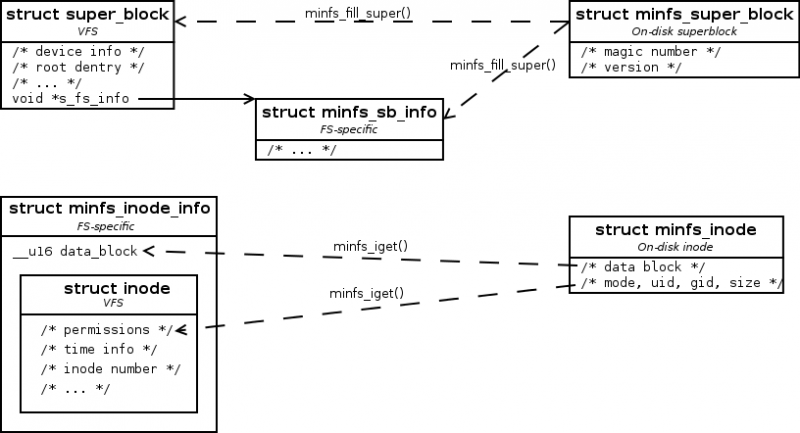

============================
File system drivers (Part 1)
============================

Lab objectives
==============

  * acquiring knowledge about the Virtual Filesystem (VFS) in Linux and understanding concepts regarding 'inode', 'dentry', 'file', superblock and data block.
  * understanding the process of mounting a file system inside VFS.
  * knowledge regarding various file system types and understanding differences between file systems with physical support (on disk) and the ones without physical support.

Virtual Filesystem (VFS)
========================

The Virtual Filesystem (also known as VFS) is a component of the kernel that handles all system calls related to files and file systems.
VFS is a generic interface between the user and a particular file system.
This abstraction simplifies the implementation of file systems and provides an easier integration of multiple file systems. This way, the implementation of a file system is accomplished by using the API provided by the VFS, and the generic hardware and I/O subsystem communication parts are handled by VFS.

From a functional point of view, file systems can be grouped into:

  * disk file systems (ext3, ext4, xfs, fat, ntfs, etc.)
  * network file systems (nfs, smbfs/cifs, ncp, etc.)
  * virtual filesystems (procfs, sysfs, sockfs, pipefs, etc.)

A Linux kernel instance will use VFS for the hierarchy (a tree) of directories and files.
A new file system will be added as a VFS subtree using the mount operation.
A file system is usually mounted from the environment for which it was built (from a block type device, from network, etc.).
In particular, however, the VFS can use a normal file as a virtual block device, so it is possible to mount disk file systems over normal files. This way, stacks of file systems can be created.

The basic idea of VFS is to provide a single file model that can represent files from any file system.
The file system driver is responsible for bringing to the common denominator.
This way the kernel can create a single directory structure that contains the entire system.
There will be a file system that will be the root, the rest being mounted in its various directories.

The general file system model
=============================

The general file system model, to which any implemented file system needs to be reduced, consists of several well-defined entities: :c:type:`superbloc`, :c:type:`inode`, :c:type:`file`, and :c:type:`dentry`.
These entities are file system metadata (they contain information about data or other metadata).

Model entities interact using some VFS or kernel subsystems: dentry cache, inode cache, buffer cache.
Each entity is treated as an object: it has a associated data structure and a pointer to a table of methods. The induction of particular behavior for each component is done by replacing the associated methods.

superblock
----------

The superblock stores the information needed for a mounted file system:

  * inode and blocks locations
  * file system block size
  * maximum filename length
  * maximum file size
  * the location of the root inode

Localization:
~~~~~~~~~~~~~

  * In the case of disk file systems, the superblock has a correspondent in the first block of the disk. (Filesystem Control Block).
  * In VFS, all superblocks of filesystems are retained in a list of structures of type :c:type:`struct super_block` and the methods in structures of type :c:type:`struct super_operations`.

inode
-----

The inode (index node) keeps information about a file in the general sense (abstraction): regular file, directory, special file (pipe, fifo), block device, character device, link, or anything that can be abstracted as a file.

An inode stores information like:

  * file type;
  * file size;
  * access rights;
  * access or modify time;
  * location of data on the disk (pointers to disk blocks containing data).

.. note::
  Usually, the inode does not contain the file name. The name is stored by the :c:type:`dentry` entity. This way, an inode can have multiple names (hardlinks).

Localization:
~~~~~~~~~~~~~

Like the superblock, the :c:type:`inode` has a disk correspondent.
The inodes on disk are generally grouped into a specialized area (inode area) separated from the data blocks area; In some file systems, the equivalents of the inodes are spread in the file system structure (FAT);
As a VFS entity, an inode is represented by the structure :c:type:`struct inode` and by the operations with it defined in the structure :c:type:`struct inode_operations`.

Each inode is generally identified by a number. On Linux, the ``-i`` argument of the ``ls`` command shows the inode number associated with each file:

.. code-block:: console

    razvan@valhalla:~/school/so2/wiki$ ls -i
    1277956 lab10.wiki  1277962 lab9.wikibak  1277964 replace_lxr.sh
    1277954 lab9.wiki   1277958 link.txt      1277955 homework.wiki

file
----

File is the component of the file system model that is closest to the user.
The structure exists only as a VFS entity in memory and has no physical correspondent on disk.

While the inode abstracts a file on the disk, the file structure abstracts an open file.
From the point of view of the process, the file entity abstracts the file. From the point of view of the file system implementation, however, the inode is the entity that abstracts the file.

The file structure maintains information such as:

  * file cursor position;
  * file opening rights;
  * pointer to the associated inode (eventually its index).

Localization:
~~~~~~~~~~~~~

  * The structure :c:type:`struct file` is the associated VFS entity, and the structure :c:type:`struct file_operations` represents the operations associated with it.

dentry
------

The dentry (directory entry) associates an inode with a file name.

Generally, a dentry structure contains two fields:

  * an integer that identifies the inode;
  * a string representing its name.

The dentry is a specific part of a path that can be a directory or a file. For example, for the path ``/bin/vi``, dentry objects will be created for ``/``, ``bin``, and ``vi`` (a total of 3 dentry objects).

  * the dentry has a correspondent on the disk, but the correspondence is not direct because each file system keeps the dentries in a specific way
  * in VFS, the dentry entity is represented by the structure :c:type:`struct dentry` and the operations with it are defined in the :c:type:`struct dentry_operations` structure.

.. _RegisterUnregisterSection:

Register and unregister filesystems
===================================

In the current version, the Linux kernel supports about 50 file systems, including:

  * ext2/ ext4
  * reiserfs
  * xfs
  * fat
  * ntfs
  * iso9660
  * udf for CDs and DVDs
  * hpfs

On a single system, however, it is unlikely that there will be more than 5-6 file systems. For this reason, file systems (or, more correctly, file system types) are implemented as modules and can be loaded or unloaded at any time.

In order to be able to dynamically load / unload a file system module, a file system registration / deregistration API is required. The structure describing a particular file system is :c:type:`struct file_system_type`:

	.. code-block:: c

	  #include <linux/fs.h>

	  struct file_system_type {
		   const char *name;
		   int fs_flags;
		   struct dentry *(*mount) (struct file_system_type *, int,
		                             const char *, void *);
		   void (*kill_sb) (struct super_block *);
		   struct module *owner;
		   struct file_system_type * next;
		   struct hlist_head fs_supers;
		   struct lock_class_key s_lock_key;
		   struct lock_class_key s_umount_key;
		   //...
	  };

  * ``name`` is a string representing the name that will identify a file system (the argument passed to ``mount -t``).
  * ``owner`` is ``THIS_MODULE`` for file systems implemented in modules, and ``NULL`` if they are written directly into the kernel.
  * The ``mount`` function reads the superblock from the disk in memory when loading the file system. The function is unique to each file system.
  * The ``kill_sb`` function releases the super-block from memory.
  * ``fs_flags`` specifies the flags with which the file system must be mounted. An example of such flag is ``FS_REQUIRES_DEV`` that specifies to VFS that the file system needs a disk (it is not a virtual file system).
  * ``fs_supers`` is a list containing all the superblocks associated with this file system. Since the same file system can be mounted multiple times, there will be a separate superblock for each mount.

The *registration of a file system* into the kernel is generally performed in the module initialization function. For registration, the programmer will have to

  #. initialize a structure of type :c:type:`struct file_system_type` with the name, the flags, the function that implements the superblock reading operation and the reference to the structure that identifies the current module
  #. call the :c:func:`register_filesystem` function.

When unloading the module, you must unregister the file system by calling the :c:func:`unregister_filesystem` function.

An example of registering a virtual file system is found in the code for ``ramfs``:

.. code-block:: c

  static struct file_system_type ramfs_fs_type = {
          .name           = "ramfs",
          .mount          = ramfs_mount,
          .kill_sb        = ramfs_kill_sb,
          .fs_flags       = FS_USERNS_MOUNT,
  };

  static int __init init_ramfs_fs(void)
  {
          if (test_and_set_bit(0, &once))
                  return 0;
          return register_filesystem(&ramfs_fs_type);
  }

.. _FunctionsMountKillSBSection:

Functions mount, kill_sb
------------------------

When mounting  the file system, the kernel calls the mount function defined within the structure :c:type:`file_system_type`. The function makes a set of initializations and returns a dentry (the structure :c:type:`struct dentry`) that represents the mount point directory. Usually :c:func:`mount` is a simple function that calls one of the functions:

  * :c:func:`mount_bdev`, which mounts a file system stored on a block device
  * :c:func:`mount_single`, which mounts a file system that shares an instance between all mount operations
  * :c:func:`mount_nodev`, which mounts a file system that is not on a physical device
  * :c:func:`mount_pseudo`, a helper function for pseudo-file systems (``sockfs``, ``pipefs``, generally file systems that can not be mounted)

These functions get as parameter a pointer to a function :c:func:`fill_super` that will be called after the superblock initialization to finish its initialization by the driver. An example of such a function can be found in the ``fill_super`` section.

When unmounting the file system, the kernel calls :c:func:`kill_sb`, which performs cleanup operations and invokes one of the functions:

  * :c:func:`kill_block_super`, which unmounts a file system on a block device
  * :c:func:`kill_anon_super`, which unmounts a virtual file system (information is generated when requested)
  * :c:func:`kill_litter_super`, which unmounts a file system that is not on a physical device (the information is kept in memory)

An example for a file system without disk support is the :c:func:`ramfs_mount` function in the ``ramfs`` file system:

.. code-block:: c

  struct dentry *ramfs_mount(struct file_system_type *fs_type,
          int flags, const char *dev_name, void *data)
  {
          return mount_nodev(fs_type, flags, data, ramfs_fill_super);
  }

An example for a file system from disk is the :c:func:`minix_mount` function in the ``minix`` file system:

.. code-block:: c

  struct dentry *minix_mount(struct file_system_type *fs_type,
          int flags, const char *dev_name, void *data)
  {
           return mount_bdev(fs_type, flags, dev_name, data, minix_fill_super);
  }

Superblock in VFS
=================

The superblock exists both as a physical entity (entity on disk) and as a VFS entity (within the :c:type:`struct super_block` structure).
The superblock contains only metainformation and is used to write and read metadata from the disk (inodes, directory entries).
A superblock (and implicitly the :c:type:`struct super_block` structure) will contain information about the block device used, the list of inodes, a pointer to the inode of the file system root directory, and a pointer to the superblock operations.

The :c:type:`struct super_block` structure
------------------------------------------

Part of the :c:type:`struct super_block` structure definition is presented below:

.. code-block:: c

  struct super_block {
          //...
          dev_t                   s_dev;              /* identifier */
          unsigned char           s_blocksize_bits;   /* block size in bits */
          unsigned long           s_blocksize;        /* block size in bytes */
          unsigned char           s_dirt;             /* dirty flag */
          loff_t                  s_maxbytes;         /* max file size */
          struct file_system_type *s_type;            /* filesystem type */
          struct super_operations *s_op;              /* superblock methods */
          //...
          unsigned long           s_flags;            /* mount flags */
          unsigned long           s_magic;            /* filesystem’s magic number */
          struct dentry           *s_root;            /* directory mount point */
          //...
          char                    s_id[32];           /* informational name */
          void                    *s_fs_info;         /* filesystem private info */
  };

The superblock stores global information for an instance of a file system:
  * the physical device on which it resides
  * block size
  * the maximum size of a file
  * file system type
  * the operations it supports
  * magic number (identifies the file system)
  * the root directory ``dentry``

Additionally, a generic pointer (``void *``) stores the private data of the file system.
The superblock can be viewed as an abstract object to which its own data is added when there is a concrete implementation.

.. _SuperblockSection:

Superblock operations
---------------------

The superbloc operations are described by the :c:type:`struct super_operations` structure:

.. code-block:: c

	struct super_operations {
	       //...
	       int (*write_inode) (struct inode *, struct writeback_control *wbc);
	       struct inode *(*alloc_inode)(struct super_block *sb);
	       void (*destroy_inode)(struct inode *);
	 
	       void (*put_super) (struct super_block *);
	       int (*statfs) (struct dentry *, struct kstatfs *);
	       int (*remount_fs) (struct super_block *, int *, char *);
	       //...
	};

The fields of the structure are function pointers with the following meanings:

  * ``write_inode``, ``alloc_inode``, ``destroy_inode`` write, allocate, respectively release resources associated with an inode and are described in the next lab
  * ``put_super`` is called when the superblock is released at ``umount``; within this function, any resources (generally memory) from the file system's private data must be released;
  * ``remount_fs`` is called when the kernel detects a remount attempt (mount flag ``MS_REMOUNTM``); most of the time here must be detected if a switch from read-only to read-write or vice versa is attempted; this can be done simply because both the old flags (in ``sb->s_flags``) and the new flags (the ``flags`` argument) can be accessed; ``data`` is a pointer to the data sent by :c:func:`mount` that represent file system specific options;
  * ``statfs`` is called when a ``statfs`` system call is done (try ``stat –f`` or ``df``); this call must fill the fields of the :c:type:`struct kstatfs` structure, as it is done, for example, in the :c:func:`ext4_statfs` function.

.. _FillSuperSection:

The :c:func:`fill_super` function
=====================================

As specified, the :c:func:`fill_super` function is called to terminate the superblock initialization. This initialization involves filling the :c:type:`struct super_block` structure fields and the initialization of the root directory inode.

An example of implementation is the :c:func:`ramfs_fill_super` function which is called to initialize the remaining fields in the superblock:

.. code-block:: c

	#include <linux/pagemap.h>
	 
	#define RAMFS_MAGIC     0x858458f6
	 
	static const struct super_operations ramfs_ops = {
		.statfs         = simple_statfs,
		.drop_inode     = generic_delete_inode,
		.show_options   = ramfs_show_options,
	};
	 
	static int ramfs_fill_super(struct super_block *sb, void *data, int silent)
	{
		struct ramfs_fs_info *fsi;
		struct inode *inode;
		int err;
	 
		save_mount_options(sb, data);
	 
		fsi = kzalloc(sizeof(struct ramfs_fs_info), GFP_KERNEL);
		sb->s_fs_info = fsi;
		if (!fsi)
			return -ENOMEM;
	 
		err = ramfs_parse_options(data, &fsi->mount_opts);
		if (err)
			return err;
	 
		sb->s_maxbytes          = MAX_LFS_FILESIZE;
		sb->s_blocksize         = PAGE_SIZE;
		sb->s_blocksize_bits    = PAGE_SHIFT;
		sb->s_magic             = RAMFS_MAGIC;
		sb->s_op                = &ramfs_ops;
		sb->s_time_gran         = 1;
	 
		inode = ramfs_get_inode(sb, NULL, S_IFDIR | fsi->mount_opts.mode, 0);
		sb->s_root = d_make_root(inode);
		if (!sb->s_root)
			return -ENOMEM;
	 
		return 0;
	}

The kernel provides generic function to implement operations with file system structures.
The :c:func:`generic_drop_inode` and :c:func:`simple_statfs` functions used in the above code are such functions and can be used to implement the drivers if their functionality is sufficient.

The :c:func:`ramfs_fill_super` function in the above code fills some fields in the superblock, then reads the root inode and allocates the root dentry.
Reading the root inode is done in the :c:func:`ramfs_get_inode` function, and consists of allocating a new inode using :c:func:`new_inode` and initializing it. In order to free the inode, :c:func:`iput` is used, and :c:func:`d_make_root` is used to allocate the root dentry.

An example implementation for a disk file system is the :c:func:`minix_fill_super` function in the minix file system.
The functionality for the disk file system is similar to that of the virtual file system, with the exception of using the buffer cache.
Also, the minix file system keeps private data using the :c:type:`struct minix_sb_info` structure.
A large part of this function deals with the initialization of these private data (not included in the code snippet above for clarity).
The private data is allocated using the :c:func:`kzalloc` function and stored in the ``s_fs_info`` field of the superblock structure.

VFS functions typically get as arguments the superblock, an inode and/or a dentry that contain a pointer to the superblock so that these private data can be easily accessed.

.. _BufferCacheSection:

Buffer cache
============

Buffer cache is a kernel subsystem that handles caching (both read and write) blocks from block devices.
The base entity used by cache buffer is the :c:type:`struct buffer_head` structure.
The most important fields in this structure are:

  * ``b_data``, pointer to a memory area where the data was read from or where the data must be written to
  * ``b_size``, buffer size
  * ``b_bdev``, the block device
  * ``b_blocknr``, the number of block on the device that has been loaded or needs to be saved on the disk
  * ``b_state``, the status of the buffer

There are some important functions that work with these structures:

  * :c:func:`__bread`: reads a block with the given number and given size in a ``buffer_head`` structure; in case of success returns a pointer to the ``buffer_head`` structure, otherwise it returns ``NULL``;
  * :c:func:`sb_bread`: does the same thing as the previous function, but the size of the read block is taken from the superblock, as well as the device from which the read is done;
  * :c:func:`mark_buffer_dirty`: marks the buffer as dirty (sets the ``BH_Dirty`` bit); the buffer will be written to the disk at a later time (from time to time the ``bdflush`` kernel thread wakes up and writes the buffers to disk);
  * :c:func:`brelse`: frees up the memory used by the buffer, after it has previously written the buffer on disk if needed;
  * :c:func:`map_bh`: associates the buffer-head with the corresponding sector.

Functions and useful macros
===========================

The super block typically contains a map of occupied blocks (by inodes, dentries, data) in the form of a bitmap (vector of bits). To work with such maps, it is recommend to use the following features:

  * :c:func:`find_first_zero_bit`, to find the first zero bit in a memory area. The size parameter means the number of bits in the search area;
  * :c:func:`test_and_set_bit`, to set a bit and get the old value;
  * :c:func:`test_and_clear_bit`, to delete a bit and get the old value;
  * :c:func:`test_and_change_bit`, to invert the value of a bit and get the old value.

The following macrodefinitions can be used to verify the type of an inode:

  * ``S_ISDIR`` (``inode->i_mode``) to check if the inode is a directory;
  * ``S_ISREG`` (``inode->i_mode``) to check if the inode is a regular file (not a link or device file).

Further reading
===============

#. Robert Love -- Linux Kernel Development, Second Edition -- Chapter
   12. The Virtual Filesystem
#. Understanding the Linux Kernel, 3rd edition - Chapter 12. The Virtual
   Filesystem
#. `Linux Virtual File System (presentation)`_
#. `Understanding Unix/Linux Filesystem`_
#. `Creating Linux virtual filesystems`_
#. `The Linux Documentation Project - VFS`_
#. `The "Virtual File System" in Linux`_
#. `A Linux Filesystem Tutorial`_
#. `The Linux Virtual File System`_
#. `Documentation/filesystems/vfs.txt`_
#. `File systems sources`_

.. _Linux Virtual File System (presentation): http://www.coda.cs.cmu.edu/doc/talks/linuxvfs/
.. _Understanding Unix/Linux Filesystem: http://www.cyberciti.biz/tips/understanding-unixlinux-file-system-part-i.html
.. _Creating Linux virtual filesystems: http://lwn.net/Articles/57369/
.. _The Linux Documentation Project - VFS: http://www.tldp.org/LDP/tlk/fs/filesystem.html
.. _The "Virtual File System" in Linux: http://www.linux.it/~rubini/docs/vfs/vfs.html
.. _A Linux Filesystem Tutorial: http://inglorion.net/documents/tutorials/tutorfs/
.. _The Linux Virtual File System: http://www.win.tue.nl/~aeb/linux/lk/lk-8.html
.. _Documentation/filesystems/vfs.txt: http://lxr.free-electrons.com/source/Documentation/filesystems/vfs.txt
.. _File systems sources: http://lxr.free-electrons.com/source/fs/

Exercises
=========

.. include:: exercises-summary.hrst
.. |LAB_NAME| replace:: filesystems

myfs
----

To begin, we plan to get familiar with the interface exposed by the Linux kernel and the Virtual File System (VFS) component. That is why, for the beginning, we will work with a simple, virtual file system (i.e. without physical disk support). The file system is called ``myfs``.

For this we will access the ``myfs/`` subdirectory in the laboratory skeleton. We will implement the superblock operations within this lab, and the next lab will continue with the inode operations.

1. Register and unregister the myfs file system
~~~~~~~~~~~~~~~~~~~~~~~~~~~~~~~~~~~~~~~~~~~~~~~

The first step in working with the file system is to register and unregister it. We want to do this for the file system described in ``myfs.c``. Check the file contents and follow the directions marked with ``TODO 1``.

The steps you need to take are described in the section :ref:`RegisterUnregisterSection`. Use the ``"myfs"`` string for the file system name.

.. note::
  Within the file system structure, use the ``myfs_mount`` function present in the code skeleton to fill the superblock (done when mounting). In ``myfs_mount`` call the function specific to a file system without disk support. As an argument for the specific mount function, use the function of type ``fill_super`` defined in the code skeleton. You can review the :ref:`FunctionsMountKillSBSection` section.

  To destroy the superblock (done at unmounting) use ``kill_litter_super``, also a function specific to a file system without disk support. The function is already implemented, you need to fill it in the :c:type:`struct file_system_type` structure.

After completing the sections marked with ``TODO 1`` , compile the module, copy it to the QEMU virtual machine, and start the virtual machine. Load the kernel module and then check the presence of the ``myfs`` file system within the ``/proc/filesystems`` file.

At the moment, the file system is only registered, it does not expose operations to use it. If we try to mount it, the operation will fail. To try mounting, we create mount point ``/mnt/myfs/``.

.. code-block:: console

  # mkdir -p /mnt/myfs

and then we use the ``mount`` command:

.. code-block:: console

  # mount -t myfs none /mnt/myfs

The error message we get shows that we have not implemented the operations that work on the superblock. We will have to implement the operations on the superblock and initialize the root inode. We will do this further.

.. note::

  The ``none`` argument sent to the ``mount`` command indicates that we do not have a device from which to mount, the file system being a virtual one. Similarly, this is how the ``procfs`` or ``sysfs`` filesystems are mounted on Linux systems.

2. Completing myfs superblock
~~~~~~~~~~~~~~~~~~~~~~~~~~~~~

To be able to mount the file system, we need to fill its superblock's fields, that is, a generic VFS structure of type :c:type:`struct super_block`.
We will fill out the structure within the :c:func:`myfs_fill_super` function; the superblock is represented by the variable ``sb`` passed as an argument to the function.
Follow the hints marked with ``TODO 2``.

.. note::

  To fill the ``myfs_fill_super`` function, you can start from the example in the section :ref:`FillSuperSection`.

  For the superblock structure fields, use the macros defined within the code skeleton wherever possible.

The ``s_op`` field in the superblock structure must be initialized to the superblock operations structures (type :c:type:`struct super_operations`). You need to define such a structure.

For information on defining the :c:type:`struct super_operations` structure and filling the superblock, see the section :ref:`SuperblockSection`.

.. note::

  Initialize the ``drop_inode`` and ``statfs`` fields of :c:type:`struct super_operations` structure.

Although the superblock will be properly initialized at this time, the mount operation will continue to fail.
In order for the operation to be successfully completed, the root inode will have to be initialized, which we will do for the next exercise.

3. Initialize myfs root inode
~~~~~~~~~~~~~~~~~~~~~~~~~~~~~

The root inode is the inode of the file system root directory (i.e. ``/``).
Initialization is done when the file system is mounted.
The ``myfs_fill_super`` function, called at mount, is the one that calls the ``myfs_get_inode`` function that creates and initializes an inode.
Typically, this function is used to create and initialize all inodes; In this exercise, however, we will only create the root inode.

The :c:type:`inode` is allocated inside the ``myfs_get_inode`` function (local variable ``inode``, allocated using the :c:func:`new_inode` function call).

To successfully complete mounting the file system, you will need to fill the ``myfs_get_inode`` function. Follow directions marked with ``TODO 3``. A starting point is the `ramfs_get_inode <https://elixir.bootlin.com/linux/latest/source/fs/ramfs/inode.c#L63>`_ function.

.. note::

  To initialize ``uid``, ``gid`` and ``mode`` , you can use the :c:func:`inode_init_owner` function as it is used in :c:func:`ramfs_get_inode`.
  When you call :c:func:`inode_init_owner`, use ``NULL`` as the second parameter because there is no parent directory for the created inode.

  Initialize the ``i_atime``, ``i_ctime``, and ``i_mtime`` of the VFS inode to the value returned by the :c:func:`current_time` function.

  You will need to initialize the operations for the inode of type directory. To do this, follow the steps:

    #. Check if this is a directory type inode using the ``S_ISDIR`` macro.
    #. For the ``i_op`` and ``i_fop`` fields, use kernel functions that are already implemented:

       * for ``i_op``: :c:type:`simple_dir_inode_operations`.
       * for ``i_fop``: :c:type:`simple_dir_operations`

    #. Increase the number of links for the directory using the :c:func:`inc_nlink` function.

4. Test myfs mount and unmount
~~~~~~~~~~~~~~~~~~~~~~~~~~~~~~

Now we can mount the filesystem.
Follow the steps above to compile the kernel module, copy to the virtual machine, and start the virtual machine, then insert the kernel module, create the mount point ``/mnt/myfs/``, and mount the file system.
We verify that the file system was mounted by inspecting the ``/proc/mounts`` file.

What inode number does the ``/mnt/myfs`` directory have? Why?

.. note::

  To display the inode number of a directory, use the command:

  .. code-block:: console

    ls -di /path/to/directory

  where ``/path/to/directory/`` is the path to the directory whose inode number we want to display.

We check myfs file system statistics using the following command:

.. code-block:: console

  stat -f /mnt/myfs

We want to see what the mount point ``/mnt/myfs`` contains and if we can create files.
For this we run the commands:

.. code-block:: console

  # ls -la /mnt/myfs
  # touch /mnt/myfs/a.txt

We can see that we can not create the ``a.txt`` file on the file system.
This is because we have not implemented the operations to work with inodes in the :c:type:`struct super_operations` structure.
We will implement these operations within the next lab.

Unmount the file system using the command

.. code-block:: console

  umount /mnt/myfs

Unload the kernel module corresponding to the file system as well.

.. note::

  To test the entire functionality, you can use the ``test-myfs.sh`` script:

  .. code-block:: console

    ./test-myfs.sh

  The script is copied to the virtual machine using ``make copy`` only if it is executable:

  .. code-block:: console

    student@workstation:~/linux/tools/labs$ chmod +x skels/filesystems/myfs/test-myfs.sh

.. note::

  The statistics displayed for the file system are minimal because the information is provided by the simple_statfs function.

minfs
-----

Next, we will implement the basics of a very simple file system, called ``minfs``, with disk support.
We will use a disk in the virtual machine that we will format and mount with the ``minfs`` filesystem.

For this we will access the ``minfs/kernel`` directory from the laboratory skeleton and work with the code in ``minfs.c``.
Just like ``myfs`` we will not implement the operations for working with inodes. We will just limit to working with the superblock and, therefore, mounting.
The rest of the operations will be implemented in the next lab.

Follow the diagram below to clarify the role of structures within the ``minfs`` file system.

1. Registering and unregister the minfs file system
~~~~~~~~~~~~~~~~~~~~~~~~~~~~~~~~~~~~~~~~~~~~~~~~~~~

.. note::

  Before solving the exercise, we need to add a disk to the virtual machine. To do this, generate a file that we will use as the disk image using the following command:

  .. code-block:: console

    dd if=/dev/zero of=mydisk.img bs=1M count=100

  and add the ``-drive file=qemu/mydisk.img,if=virtio,format=raw`` argument to the ``qemu`` command in ``qemu/Makefile`` (in the ``QEMU_OPTS`` variable).
  The new argument for the ``qemu`` command must be added after the one for the existing disk (``YOCTO_IMAGE``).

To register and register the file system, you will need to fill the ``minfs_fs_type`` and ``minfs_mount`` functions in ``minfs.c``. Follow the directions marked with ``TODO 1``.

.. note::

  In the file system structure, for mount, use the ``minfs_mount`` function from in the code skeleton.
  In this function, call the function to mount a file system with disk support (See the :ref:`FunctionsMountKillSBSection` section. Use :c:func:`mount_bdev`).
  Choose the most suitable function for destroying the superblock (done at unmount); keep in mind that it is a file system with disk support. Use the :c:func:`kill_block_super` function.

  Initialize the ``fs_flags`` field of the :c:type:`minfs_fs_type` structure with the appropriate value for a file system with disk support. See the section :ref:`RegisterUnregisterSection`.

  The function for filling the superblock is ``minfs_fill_super``.

After completing the sections marked with ``TODO 1``, compile the module, copy it into the QEMU virtual machine, and start the virtual machine.
Load the kernel module and then check the presence of the ``minfs`` file system within the ``/proc/filesystems`` file.

To test the mounting of the ``minfs`` file system we will need to format the disk with its structure. Formatting requires the ``mkfs.minfs`` formatting tool from the ``minfs/user`` directory. The utility is automatically compiled when running ``make build`` and copied to the virtual machine at ``make copy``.

After compiling, copying, and starting the virtual machine, format the ``/dev/vdb`` using the formatting utility:

.. code-block:: console

  # ./mkfs.minfs /dev/vdb

Load the kernel module:

.. code-block:: console

  # insmod minfs.ko

Create mount point ``/mnt/minfs/``:

.. code-block:: console

  # mkdir -p /mnt/minfs/

and mount the filesystem

.. code-block:: console

  # mount -t minfs /dev/vdX /mnt/minfs/

The operation fails because the root inode is not initialized.

2. Completing minfs superblock
~~~~~~~~~~~~~~~~~~~~~~~~~~~~~~

To be able to mount the file system, you will need to fill the superblock (i.e a structure with type :c:type:`struct super_block`) within the ``minfs_fill_super`` function; it is the ``s`` argument of the function.
The structure of operations on the superblock is already defined: ``minfs_ops``.
Follow the directions marked with ``TODO 2``. You can also follow the implementation of the `minix_fill_super <https://elixir.bootlin.com/linux/latest/source/fs/minix/inode.c#L153>`_ function.

.. note::

  Some structures are found in the header file ``minfs.h``.

  For information on working with buffers, go to the :ref:`BufferCacheSection` section.

  Read the first block on the disk (block with index 0).
  To read the block, use the :c:func:`sb_bread` function.
  Cast the read data (the ``b_data`` field in the :c:type:`struct buffer_head` structure) to the structure storing the ``minfs`` superblock information on the disk: :c:type:`struct minfs_super_block`, defined in the source code file.

  Structure :c:type:`struct minfs_super_block` holds file system-specific information that is not found in the :c:type:`struct super_block` generic structure (in this case only version).
  Those additional information (found in :c:type:`struct minfs_super_block` (on disk) but not in :c:type:`struct super_block` (VFS)) will be stored in the :c:type:`struct minfs_sb_info` structure.

To check the functionality, we need a function for reading the root inode.
For the time being, use the ``myfs_get_inode`` function from ``myfs`` file system exercises.
Copy the function into the source code and call it the same as you did for myfs.
The second argument when calling the ``myfs_get_inode`` function is the inode creation permissions, similar to the virtual file system exercise (myfs).

Validate the implementation by executing the commands from the previous exercise.

3. Creating and destroying minfs inodes
~~~~~~~~~~~~~~~~~~~~~~~~~~~~~~~~~~~~~~~

For mounting, we need to initialize the root inode, and to get the root inode, we need to implement the functions to work with inodes.
That is, you need to implement the ``minfs_alloc_inode`` and ``minfs_destroy_inode`` functions.
Follow the directions marked with ``TODO 3``. You can use the :c:func:`minix_alloc_inode` and :c:func:`minix_destroy_inode` functions as a model.

For the implementation, look at the macros and structures in the ``minfs.h`` header file.

.. note::

  For memory allocation/deallocation in ``minfs_alloc_inode`` and ``minfs_destroy_inode``, we recommend using :c:func:`kzalloc` and :c:func:`kfree`.

  In ``minfs_alloc_inode`` allocate structures with type :c:type:`struct minfs_inode_info`, but only return structures with type :c:type:`struct inode`, i.e. return those given by the ``vfs_inode`` field.

  In the ``minfs_alloc_inode`` function, call :c:func:`inode_init_once` to initialize the inode.

  In the ``destroy_inode`` function, you can access the structure with type :c:type:`struct minfs_inode_info` using the ``container_of`` macro.

.. note::

  In this exercise, you have implemented the ``minfs_alloc_inode`` and ``minfs_destroy_inode`` functions, but they are not yet called. The correctness of the implementation will be checked at the end of the next exercise.

4. Initialize minfs root inode
~~~~~~~~~~~~~~~~~~~~~~~~~~~~~~

Initializing the root inode is required in order to mount the file system.
For this, you will need to complete the ``minfs_ops`` structure with the ``minfs_alloc_inode`` and ``minfs_destroy_inode`` functions and fill the ``minfs_iget`` function.

The ``minfs_iget`` function is the function called to allocate a VFS inode (i.e. :c:type:`struct inode`) and fill it with minfs inode-specific information from the disk (i.e. ``struct minfs_inode``).

Follow the directions marked with ``TODO 4``.
Fill out the ``alloc_inode`` and ``destroy_inode`` fields of :c:type:`struct super_operations` structure with the functions implemented in the previous step.

The information about the root inode is found in the second block on the disk (the inode with index 1).
Make ``minfs_iget`` read the root minfs inode from the disk (:c:type:`struct minfs_inode`) and fill in the VFS inode (:c:type:`struct inode`).

In the ``minfs_fill_super`` function, replace the ``myfs_get_inode`` call with the ``minfs_iget`` function call.

.. note::
  To implement the ``minfs_iget`` function, follow the implementation of `V1_minix_iget <https://elixir.bootlin.com/linux/v4.15/source/fs/minix/inode.c#L460>`_.
  To read a block, use the :c:func:`sb_bread` function.
  Cast the read data (the ``b_data`` field of the :c:type:`struct structure_head` structure) to the minfs inode from the disk (:c:type:`struct minfs_inode`).

  The ``i_uid``, ``i_gid``, ``i_mode``, ``i_size`` must be filled in the VFS inode with the values in the minfs inode structure read from disk.
  To initialize the ``i_uid`` and ``i_gid fields``, use the functions :c:func:`i_uid_write` , and :c:func:`i_gid_write`.

  Initialize the ``i_atime`` , ``i_atime``, and ``i_mtime`` fields of the VFS inode to the value returned by the :c:func:`current_time` function.

  You will need to initialize the operations for the inode with type directory. To do this, follow the steps:

    #. Check if this is a directory type inode using the ``S_ISDIR`` macro.
    #. For the ``i_op`` and ``i_fop`` fields, use kernel functions already implemented:

       * for ``i_op``: :c:func:`simple_dir_inode_operations` .
       * for ``i_fop``: :c:func:`simple_dir_operations`

    #. Increment the number of links for the directory using the :c:func:`inc_nlink` function.

5. Testing of minfs mount and unmount
~~~~~~~~~~~~~~~~~~~~~~~~~~~~~~~~~~~~~

Now we can mount the filesystem.
Follow the steps above to compile the kernel module, copy to the virtual machine, start the virtual machine, and then insert the kernel module, create mount point ``/mnt/minfs/`` and mount the file system.
We verify that the file system was mounted by investigating the ``/proc/mounts`` file.

We check that everything is fine by listing the mount point contents ``/mnt/minfs/``:

.. code-block:: console

  # ls /mnt/minfs/

After mount and verification, unmount the file system and unload the module from the kernel.

.. note::
  Alternatively, to test the entire functionality, you can use the ``test-minfs.sh`` script:

  .. code-block:: console

    # ./test-minfs.sh

  The script is copied to the virtual machine when running the ``make copy`` command only if is executable.

  .. code-block:: console

    student@workstation:~/linux/tools/labs$ chmod +x skels/filesystems/minfs/user/test-minfs.sh

