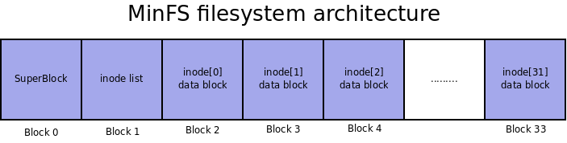

============================
File system drivers (Part 2)
============================

Lab objectives
==============

  * Improving the knowledge about inode, file and dentry.
  * Acquiring knowledge about adding support for working with regular files and directories in VFS (*Virtual File System*).
  * Acquiring knowledge about the internal implementation of a file system.

Inode
=====

The inode is an essential component of a UNIX file system and, at the same time, an important component of VFS. An inode is a metadata (it has information about information).
An inode uniquely identifies a file on disk and holds information about it (uid, gid, access rights, access times, pointers to data blocks, etc.).
An important aspect is that an inode does not have information about the file name (it is retained by the associated :c:type:`struct dentry` structure).

The inode refers to a file on the disk. To refer an open file (associated with a file descriptor within a process), the :c:type:`struct file` structure is used.
An inode can have any number of (zero or more) ``file`` structures associated (multiple processes can open the same file, or a process can open the same file several times).

Inode exists both as a VFS entity (in memory) and as a disk entity (for UNIX, HFS, NTFS, etc.).
The inode in VFS is represented by the structure :c:type:`struct inode`.
Like the other structures in VFS, :c:type:`struct inode` is a generic structure that covers the options for all supported file types, even those that do not have an associated disk entity (such as FAT).

The inode structure
-------------------

The inode structure is the same for all file systems. In general, file systems also have private information. These are referenced through the ``i_private`` field of the structure.
Conventionally, the structure that keeps that particular information is called ``<fsname>_inode_info``, where ``fsname`` represents the file system name. For example, minix and ext4 filesystems store particular information in structures :c:type:`struct minix_inode_info`, or :c:type:`struct ext4_inode_info`.

Some of the important fields of :c:type:`struct inode` are:

  * ``i_sb`` : The superblock structure of the file system the inode belongs to.
  * ``i_rdev``: the device on which this file system is mounted
  * ``i_ino`` : the number of the inode (uniquely identifies the inode within the file system)
  * ``i_blkbits``: number of bits used for the block size == log\ :sub:`2`\ (block size)
  * ``i_mode``, ``i_uid``, ``i_gid``: access rights, uid, gid

  * ``i_size``: file/directory/etc. size in bytes
  * ``i_mtime``, ``i_atime``, ``i_ctime``: change, access, and creation time
  * ``i_nlink``: the number of names entries (dentries) that use this inode; for file systems without links (either hard or symbolic) this is always set to 1
  * ``i_blocks``: the number of blocks used by the file (all blocks, not just data); this is only used by the quota subsystem
  * ``i_op``, ``i_fop``: pointers to operations structures: :c:type:`struct inode_operations` and :c:type:`struct file_operations`; ``i_mapping->a_ops`` contains a pointer to :c:type:`struct address_space_operations`.
  * ``i_count``: the inode counter indicating how many kernel components use it.

Some functions that can be used to work with inodes:

  * :c:func:`new_inode`: creates a new inode, sets the ``i_nlink`` field to 1 and initializes ``i_blkbits``, ``i_sb`` and ``i_dev``;
  * :c:func:`insert_inode_hash`: adds the inode to the hash table of inodes; an interesting effect of this call is that the inode will be written to the disk if it is marked as dirty;

    .. warning::

      An inode created with :c:func:`new_inode` is not in the hash table, and unless you have serious reasons not to, you must enter it in the hash table;

  * :c:func:`mark_inode_dirty`: marks the inode as dirty; at a later moment, it will be written on the disc;
  * :c:func:`iget_locked`: loads the inode with the given number from the disk, if it is not already loaded;
  * :c:func:`unlock_new_inode`: used in conjunction with :c:func:`iget_locked`, releases the lock on the inode;
  * :c:func:`iput`: tells the kernel that the work on the inode is finished; if no one else uses it, it will be destroyed (after being written on the disk if it is maked as dirty);
  * :c:func:`make_bad_inode`: tells the kernel that the inode can not be used; It is generally used from the function that reads the inode when the inode could not be read from the disk, being invalid.

Inode operations
----------------

Getting an inode
^^^^^^^^^^^^^^^^

One of the main inode operations is obtaining an inode (the :c:type:`struct inode` in VFS).
Until version ``2.6.24`` of the Linux kernel, the developer defined a ``read_inode`` function.
Starting with version ``2.6.25``, the developer must define a ``<fsname>_iget`` where ``<fsname>`` is the name of the file system.
This function is responsible with finding the VFS inode if it exists or creating a new one and filling it with the information from the disk.

Generally, this function will call :c:func:`iget_locked` to get the inode structure from VFS. If the inode is newly created then it will need to read the inode from the disk (using :c:func:`sb_bread`) and fill in the useful information.

An example of such a function is :c:func:`minix_iget`:

.. code-block:: c

  static struct inode *V1_minix_iget(struct inode *inode)
  {
  	struct buffer_head * bh;
  	struct minix_inode * raw_inode;
  	struct minix_inode_info *minix_inode = minix_i(inode);
  	int i;

  	raw_inode = minix_V1_raw_inode(inode->i_sb, inode->i_ino, &bh);
  	if (!raw_inode) {
  		iget_failed(inode);
  		return ERR_PTR(-EIO);
  	...
  }

  struct inode *minix_iget(struct super_block *sb, unsigned long ino)
  {
  	struct inode *inode;

  	inode = iget_locked(sb, ino);
  	if (!inode)
  		return ERR_PTR(-ENOMEM);
  	if (!(inode->i_state & I_NEW))
  		return inode;

  	if (INODE_VERSION(inode) == MINIX_V1)
  		return V1_minix_iget(inode);
      ...
  }

The minix_iget function gets the VFS inode using :c:func:`iget_locked`.
If the inode is already existing (not new == the ``I_NEW`` flag is not set) the function returns.
Otherwise, the function calls the :c:func:`V1_minix_iget` function that will read the inode from the disk using :c:func:`minix_V1_raw_inode` and then complete the VFS inode with the read information.

Superoperations
^^^^^^^^^^^^^^^

Many of the superoperations (components of the :c:type:`struct super_operations` structure used by the superblock) are used when working with inodes. These operations are described next:

  * ``alloc_inode``: allocates an inode.
    Usually, this funcion allocates a :c:type:`struct <fsname>_inode_info` structure and performs basic VFS inode initialization (using :c:func:`inode_init_once`);
    minix uses for allocation the :c:func:`kmem_cache_alloc` function that interacts with the SLAB subsystem.
    For each allocation, the cache construction is called, which in the case of minix is the :c:func:`init_once` function.
    Alternatively, :c:func:`kmalloc` can be used, in which case the :c:func:`inode_init_once` function should be called.
    The :c:func:`alloc_inode` function will be called by the :c:func:`new_inode` and :c:func:`iget_locked` functions.
  * ``write_inode`` : saves/updates the inode received as a parameter on disk; to update the inode, though inefficient, for beginners it is recommended to use the following sequence of operations:

    * load the inode from the disk using the :c:func:`sb_bread` function;
    * modify the buffer according to the saved inode;
    * mark the buffer as dirty using :c:func:`mark_buffer_dirty`; the kernel will then handle its writing on the disk;
    * an example is the :c:func:`minix_write_inode` function in the ``minix`` file system

  * ``evict_inode``: removes any information about the inode with the number received in the ``i_ino`` field from the disk and memory (both the inode on the disk and the associated data blocks). This involves performing the following operations:

    * delete the inode from the disk;
    * updates disk bitmaps (if any);
    * delete the inode from the page cache by calling :c:func:`truncate_inode_pages`;
    * delete the inode from memory by calling :c:func:`clear_inode` ;
    * an example is the :c:func:`minix_evict_inode` function from the minix file system.

  * ``destroy_inode`` releases the memory occupied by inode

inode_operations
^^^^^^^^^^^^^^^^

The inode operations are described by the :c:type:`struct inode_operations` structure.

Inodes are of several types: file, directory, special file (pipe, fifo), block device, character device, link etc.
For this reason, the operations that an inode needs to implement are different for each type of inode.
Below are detailed operations for a :ref:`file type inode <FileInodes>` and a :ref:`directory inode <DirectoryInodes>`.

The operations of an inode are initialized and accessed using the ``i_op`` field of the structure :c:type:`struct inode`.

The file structure
==================

The ``file`` structure corresponds to a file open by a process and exists only in memory, being associated with an inode.
It is the closest VFS entity to user-space; the structure fields contain familiar information of a user-space file (access mode, file position, etc.) and the operations with it are performed by known system calls (``read``, ``write`` , etc.).

The file operations are described by the :c:type:`struct file_operations` structure.

The file operations for a file system are initialized using the ``i_fop`` field of the :c:type:`struct inode` structure.
When opening a file, the VFS initializes the ``f_op`` field of the :c:type:`struct file` structure with address of ``inode->i_fop``, such that subsequent system calls use the value stored in the ``file->f_op``.

.. _FileInodes:

Regular files inodes
====================

To work with the inode, the ``i_op`` and ``i_fop`` fields of the inode structure must be filled in.
The type of the inode determines the operations that it needs to implement.

.. _FileOperations:

Regular files inode operations
------------------------------

In the ``minix`` file system, the ``minix_file_inode_operations`` structure is defined for the operations on an inode and for the file operations the ``minix_file_operations structure`` is defined:

.. code-block:: c

  const struct file_operations minix_file_operations = {
           .llseek         = generic_file_llseek,
           .read_iter      = generic_file_read_iter,
           //...
           .write_iter     = generic_file_write_iter,
           //...
           .mmap           = generic_file_mmap,
           //...
  };

  const struct inode_operations minix_file_inode_operations = {
          .setattr        = minix_setattr,
          .getattr        = minix_getattr,
  };

          //...
          if (S_ISREG(inode->i_mode)) {
                  inode->i_op = &minix_file_inode_operations;
                  inode->i_fop = &minix_file_operations;
          }
          //...

The functions :c:func:`generic_file_llseek` , :c:func:`generic_file_mmap` , :c:func:`generic_file_read_iter` and :c:func:`generic_file_write_iter` are implemented in the kernel.

For simple file systems, only the truncation operation (``truncate`` system call) must be implemented.
Although initially there was a dedicated operation, starting with 3.14 the operation was embedded in ``setattr``: if the paste size is different from the current size of the inode, then a truncate operation must be performed.
An example of implementing this verification is in the :c:func:`minix_setattr` function:

.. code-block:: c

  static int minix_setattr(struct dentry *dentry, struct iattr *attr)
  {
          struct inode *inode = d_inode(dentry);
          int error;

          error = setattr_prepare(dentry, attr);
          if (error)
                  return error;

          if ((attr->ia_valid & ATTR_SIZE) &&
              attr->ia_size != i_size_read(inode)) {
                  error = inode_newsize_ok(inode, attr->ia_size);
                  if (error)
                          return error;

                  truncate_setsize(inode, attr->ia_size);
                  minix_truncate(inode);
          }

          setattr_copy(inode, attr);
          mark_inode_dirty(inode);
          return 0;
  }

The truncate operation involves:

  * freeing blocks of data on the disk that are now extra (if the new dimension is smaller than the old one) or allocating new blocks (for cases where the new dimension is larger)
  * updating disk bit maps (if used);
  * updating the inode;
  * filling with zero the space that was left unused from the last block using the :c:func:`block_truncate_page` function.

An example of the implementation of the cropping operation is the :c:func:`minix_truncate` function in the ``minix`` file system.

.. _AddressSpaceOperations:

Address space operations
------------------------

There is a close link between the address space of a process and files: the execution of the programs is done almost exclusively by mapping the file into the process address space.
Because this approach works very well and is quite general, it can also be used for regular system calls such as ``read`` and ``write``.

The structure that describes the address space is :c:type:`struct address_space`, and the operations with it are described by the structure :c:type:`struct address_space_operations`. To initialize the address space operations, fill ``inode->i_mapping->a_ops`` of the file type inode.

An example is the ``minix_aops`` structure in the minix file system:

.. code-block:: c

  static const struct address_space_operations minix_aops = {
         .readpage = minix_readpage,
         .writepage = minix_writepage,
         .write_begin = minix_write_begin,
         .write_end = generic_write_end,
         .bmap = minix_bmap
  };

  //...
  if (S_ISREG(inode->i_mode)) {
        inode->i_mapping->a_ops = &minix_aops;
  }
  //...

The :c:func:`generic_write_end` function is already implemented.
Most of the specific functions are very easy to implement, as follows:

.. code-block:: c

  static int minix_writepage(struct page *page, struct writeback_control *wbc)
  {
           return block_write_full_page(page, minix_get_block, wbc);
  }

  static int minix_readpage(struct file *file, struct page *page)
  {
           return block_read_full_page(page, minix_get_block);
  }

  static void minix_write_failed(struct address_space *mapping, loff_t to)
  {
          struct inode *inode = mapping->host;

          if (to > inode->i_size) {
                  truncate_pagecache(inode, inode->i_size);
                  minix_truncate(inode);
          }
  }

  static int minix_write_begin(struct file *file, struct address_space *mapping,
                          loff_t pos, unsigned len, unsigned flags,
                          struct page **pagep, void **fsdata)
  {
          int ret;

          ret = block_write_begin(mapping, pos, len, flags, pagep,
                                  minix_get_block);
          if (unlikely(ret))
                  minix_write_failed(mapping, pos + len);

          return ret;
  }

  static sector_t minix_bmap(struct address_space *mapping, sector_t block)
  {
           return generic_block_bmap(mapping, block, minix_get_block);
  }

All that needs to be done is to implement :c:type:`minix_get_block`, which has to translate a block of a file into a block on the device.
If the flag ``create`` received as a parameter is set, a new block must be allocated.
In case a new block is created, the bit map must be updated accordingly.
To notify the kernel not to read the block from the disk, ``bh`` must be marked with :c:func:`set_buffer_new`. The buffer must be associated with the block through :c:func:`map_bh`.

Dentry structure
================

Directories operations use the :c:type:`struct dentry` structure.
Its main task is to make links between inodes and filenames.
The important fields of this structure are presented below:

.. code-block:: c

  struct dentry {
          //...
          struct inode             *d_inode;     /* associated inode */
          //...
          struct dentry            *d_parent;    /* dentry object of parent */
          struct qstr              d_name;       /* dentry name */
          //...

          struct dentry_operations *d_op;        /* dentry operations table */
          struct super_block       *d_sb;        /* superblock of file */
          void                     *d_fsdata;    /* filesystem-specific data */
          //...
  };

Fields meaning:

  * ``d_inode``: the inode referenced by this dentry;
  * ``d_parent``: the dentry associated with the parent directory;
  * ``d_name``: a :c:type:`struct qstr` structure that contains the fields ``name`` and ``len`` (the name and the length of the name).
  * ``d_op``: operations with dentries, represented by the :c:type:`struct dentry_operations` structure.
    The kernel implements default operations so there is no need to (re)implement them. Some file systems can do optimizations based on the specific structure of the dentries.
  * ``d_fsdata``: field reserved for the file system that implements dentry operations;

Dentry operations
-----------------

The most commonly operations applied to dentries are:

  * ``d_make_root``: allocates the root dentry. It is generally used in the function that is called to read the superblock (``fill_super``), which must initialize the root directory.
    So the root inode is obtained from the superblock and is used as an argument to this function, to fill the ``s_root`` field from the :c:type:`struct super_block` structure.
  * ``d_add``: associates a dentry with an inode; the dentry received as a parameter in the calls discussed above signifies the entry (name, length) that needs to be created. This function will be used when creating/loading a new inode that does not have a dentry associated with it and has not yet been introduced to the hash table of inodes (at ``lookup``);
  * ``d_instantiate``: The lighter version of the previous call, in which the dentry was previously added in the hash table.

.. warning::

  ``d_instantiate`` must be used to implement create calls (``mkdir``, ``mknod``, ``rename``, ``symlink``) and  NOT ``d_add``.

.. _DirectoryInodes:

Directory inodes operations
===========================

The operations for directory type inodes have a higher complexity level than the ones for files.
The developer must define operations for inodes and operations for files.
In ``minix``, these operations are defined in :c:type:`minix_dir_inode_operations` and :c:type:`minix_dir_operations`:

.. code-block:: c

  struct inode_operations minix_dir_inode_operations = {
        .create = minix_create,
        .lookup = minix_lookup,
        .link = minix_link,
        .unlink = minix_unlink,
        .symlink = minix_symlink,
        .mkdir = minix_mkdir,
        .rmdir = minix_rmdir,
        .mknod = minix_mknod,
        //...
  };

  struct file_operations minix_dir_operations = {
        .llseek = generic_file_llseek,
        .read = generic_read_dir,
        .iterate = minix_readdir,
        //...
  };

          //...
  	if (S_ISDIR(inode->i_mode)) {
  		inode->i_op = &minix_dir_inode_operations;
  		inode->i_fop = &minix_dir_operations;
  		inode->i_mapping->a_ops = &minix_aops;
  	}
         //...

The only function already implemented is :c:func:`generic_read_dir`.

The functions that implement the operations on directory inodes are the ones described below.

Creating an inode
-----------------

The inode creation function is indicated by the field ``create`` in the ``inode_operations`` structure.
In the minix case, the function is :c:func:`minix_create`.
This function is called by the ``open`` and ``creat`` system calls. Such a function performs the following operations:

  #. Introduces a new entry into the physical structure on the disk; the update of the bit maps on the disk must not be forgotten.
  #. Configures access rights to those received as a parameter.
  #. Marks the inode as dirty with the :c:func:`mark_inode_dirty` function.
  #. Instantiates the directory entry (``dentry``) with the ``d_instantiate`` function.

Creating a directory
--------------------

The directory creation function is indicated by the ``mkdir`` field in the ``inode_operations`` structure.
In the minix case, the function is :c:func:`minix_mkdir`.
This function is called by the ``mkdir`` system call. Such a function performs the following operations:

  #. Calls :c:func:`minix_create`.
  #. Allocates a data block for the directory.
  #. Creates the ``"."`` and ``".."`` entries.

Creating a link
---------------

The link creation function (hard link) is indicated by the ``symlink`` field in the ``inode_operations`` structure.
In the minix case, the function is :c:func:`minix_link`.
This function is called by the ``link`` system call. Such a function performs the following operations:

  * Binds the new dentry to the inode.
  * Increments the ``i_nlink`` field of the inode.
  * Marks the inode as dirty using the :c:func:`mark_inode_dirty` function.

Creating a symbolic link
------------------------

The symbolic link creation function is indicated by the ``symlink`` field in the ``inode_operations`` structure.
In the minix case, the function is :c:func:`minix_symlink`.
The operations to be performed are similar to ``minix_link`` with the differences being given by the fact that a symbolic link is created.

Deleting a link
---------------

The link delete function (hard link) is indicated by the ``unlink`` field in the ``inode_operations`` structure.
In the minix case, the function is :c:func:`minix_unlink`.
This function is called by the ``unlink`` system call. Such a function performs the following operations:

  #. Deletes the directory entry given as a parameter from the physical disk structure.
  #. Decrements the ``i_nlink`` counter of the inode to which the entry points (otherwise the inode will never be deleted).

Deleting a directory
--------------------

The directory delete function is indicated by the ``rmdir`` field in the ``inode_operations`` structure.
In the minix case, the function is :c:func:`minix_rmdir`.
This function is called by the ``rmdir`` system call.
Such a function performs the following operations:

  #. Performs the operations done by ``minix_unlink``.
  #. Ensures that the directory is empty; otherwise, returns ``ENOTEMPTY``.
  #. Also deletes the data blocks.

Searching for an inode in a directory
-------------------------------------

The function that searches for an entry in a directory and extracts the inode is indicated by the ``lookup`` field in the ``inode_operations`` structure.
In the minix case, the function is ``minix_lookup``.
This function is called indirectly when information about the inode associated with an entry in a directory is needed.
Such a function performs the following operations:

  #. Searces in the directory indicated by ``dir`` the entry having the name ``dentry->d_name.name``.
  #. If the entry is found, it will return ``NULL`` and associate the inode with the name using the :c:func:`d_add` function.
  #. Otherwise, returns ``ERR_PTR``.

Iterating through entries in a directory
----------------------------------------

The function which iterates through the entries in a directory (lists the directory contents) is indicated by the field ``iterate`` in the ``struct file_operations`` structure.
In the minix case, the function is ``minix_readdir``.
This function is called by the ``readdir`` system call.

The function returns either all entries in the directory or just a part when the buffer allocated for it is not available.
A call of this function can return:

  * a number equal to the existing number of entries if there is enough space in the corresponding user space buffer;
  * a number smaller than the actual number of entries, as much as there was space in the corresponding user space buffer;
  * ``0``, where there are no more entries to read.

The function will be called consecutively until all available entries are read. The function is called at least twice.

  * It is only called twice if:

    * the first call reads all entries and returns their number;
    * the second call returns 0, having no other entries to read.

  * It is called more than twice if the first call does not return the total number of entries.

The function performs the following operations:

  #. Iterates over the entries (the dentries) from the current directory.
  #. For each dentry found, increments ``ctx->pos``.
  #. For each valid dentry (an inode other than ``0``, for example), calls the :c:func:`dir_emit` function.
  #. If the :c:func:`dir_emit` function returns a value other than zero, it means that the buffer in the user space is full and the function returns.

The arguments of the ``dir_emit`` function are:

  * ``ctx`` is the directory iteration context, passed as an argument to the ``iterate`` function;
  * ``name`` is the name of the entry (a string of characters);
  * ``name_len`` is the length of the entry name;
  * ``ino`` is the inode number associated with the entry;
  * ``type`` identifies the entry type: ``DT_REG`` (file), ``DT_DIR`` (directory), ``DT_UNKNOWN`` etc. ``DT_UNKNOWN`` can be used when the entry type is unknown.

.. _BitmapOperations:

Bitmap operations
=================

When working with the file systems, management information (what block is free or busy, what inode is free or busy) is stored using bitmaps.
For this we often need to use bit operations. Such operations are:

  * searching the first 0 bit: representing a free block or inode
  * marking a bit as 1: marking a busy block or inode

The bitmap operations are found in headers from ``include/asm-generic/bitops``, especially in ``find.h`` and ``atomic.h``. Usual functions, with names indicating their role, are:

  * :c:func:`find_first_zero_bit`
  * :c:func:`find_first_bit`
  * :c:func:`set_bit`
  * :c:func:`clear_bit`
  * :c:func:`test_and_set_bit`
  * :c:func:`test_and_clear_bit`

These functions usually receive the address of the bitmap, possibly its size (in bytes) and, if necessary, the index of the bit that needs to be activated (set) or deactivated (clear).

Some usage examples are listed below:

.. code-block:: c

  unsigned int map;
  unsigned char array_map[NUM_BYTES];
  size_t idx;
  int changed;

  /* Find first zero bit in 32 bit integer. */
  idx = find_first_zero_bit(&map, 32);
  printk (KERN_ALERT "The %zu-th bit is the first zero bit.\n", idx);

  /* Find first one bit in NUM_BYTES bytes array. */
  idx = find_first_bit(array_map, NUM_BYTES * 8);
  printk (KERN_ALERT "The %zu-th bit is the first one bit.\n", idx);

  /*
   * Clear the idx-th bit in integer.
   * It is assumed idx is less the number of bits in integer.
   */
  clear_bit(idx, &map);

  /*
   * Test and set the idx-th bit in array.
   * It is assumed idx is less the number of bits in array.
   */
  changed = __test_and_set_bit(idx, &sbi->imap);
  if (changed)
  	printk(KERN_ALERT "%zu-th bit changed\n", idx);

Further reading
===============

#. Robert Love -- Linux Kernel Development, Second Edition -- Chapter
   12. The Virtual Filesystem
#. Understanding the Linux Kernel, 3rd edition - Chapter 12. The Virtual
   Filesystem
#. `Linux Virtual File System (presentation)`_
#. `Understanding Unix/Linux Filesystem`_
#. `Creating Linux virtual filesystems`_
#. `The Linux Documentation Project - VFS`_
#. `The "Virtual File System" in Linux`_
#. `A Linux Filesystem Tutorial`_
#. `The Linux Virtual File System`_
#. `Documentation/filesystems/vfs.txt`_
#. `File systems sources`_

.. _Linux Virtual File System (presentation): http://www.coda.cs.cmu.edu/doc/talks/linuxvfs/
.. _Understanding Unix/Linux Filesystem: http://www.cyberciti.biz/tips/understanding-unixlinux-file-system-part-i.html
.. _Creating Linux virtual filesystems: http://lwn.net/Articles/57369/
.. _The Linux Documentation Project - VFS: http://www.tldp.org/LDP/tlk/fs/filesystem.html
.. _The "Virtual File System" in Linux: http://www.linux.it/~rubini/docs/vfs/vfs.html
.. _A Linux Filesystem Tutorial: http://inglorion.net/documents/tutorials/tutorfs/
.. _The Linux Virtual File System: http://www.win.tue.nl/~aeb/linux/lk/lk-8.html
.. _Documentation/filesystems/vfs.txt: http://lxr.free-electrons.com/source/Documentation/filesystems/vfs.txt
.. _File systems sources: http://lxr.free-electrons.com/source/fs/

Exercises
=========

.. important::

   .. include:: exercises-summary.hrst

   .. |LAB_NAME| replace:: filesystems

.. important::

  In this lab, we will continue the implementation of the file systems started in the previous one.
  For this, we will generate the laboratory skeleton using the following command:

  .. code-block:: console

    TODO=5 LABS=filesystems make skels

  After this, we will start the implementation from ``TODO 5``.

myfs
----

For the exercises below, we will use the ``myfs`` file system whose implementation we started with the previous lab.
We stopped after mounting the file system and now we will continue with the operations for regular files and directories.
At the end of these exercises, we will be able to create, modify and delete regular directories and files.

We will mostly use the ``inode`` and ``dentry`` VFS structures.
The ``inode`` structure defines a file (of any type: regular, directory, link), while the ``dentry`` structure defines a name, which is an entry in a directory.

For this we will access the ``myfs/kernel`` directory in the lab skeleton.
The previously generated skeleton contains the solution for the previous lab; we will start from this. As in the previous lab, we will use the ``ramfs`` file system as a starting point.

1. Directory operations
^^^^^^^^^^^^^^^^^^^^^^^

To begin with, we will implement the operations for working with directories.
The operations of creating a file or deleting a file are also directory operations; these operations result in adding or deleting a directory entry (*dentry*).

At the end of this exercise we will be able to create and delete entries in the file system. We will not be able to read and write to regular files; we will do so in the next exercise.

Follow directions marked with ``TODO 5`` which will guide you through the steps you need to take.

You will need to specify the following directory operations:

  * create a file (``create`` function)
  * search (``lookup`` function)
  * link (``link`` function)
  * create directory (``mkdir`` function)
  * deletion (``rmdir`` and ``unlink`` functions)
  * create node (``mknod``)
  * rename (``rename`` function)

For this, define the ``myfs_dir_inode_operations`` structure in the code, where marked with ``TODO 5``.
To begin, just define the structure ``myfs_dir_inode_operations``; you will define the structures ``myfs_file_operations``, ``myfs_file_inode_operations`` , and ``myfs_aops`` in the next exercise.

.. tip::

  Read the section :ref:`DirectoryInodes`

  As a model, you are following the ``ramfs_dir_inode_operations`` structure.

Implement the ``mkdir``, ``mknod`` and ``create`` operations inside ``myfs_mkdir``, ``myfs_mknod`` and ``myfs_create``.
These operations will allow you to create directories and files in the file system.

.. tip::

  We recommend making the code modular using a ``mknod`` function, which you can also use for the next exercise.
  For inode reading and allocation, use ``myfs_get_inode``, which is already implemented.

  As a model, follow the next functions implemented in the ``ramfs`` file system:

    * :c:func:`ramfs_mknod`
    * :c:func:`ramfs_mkdir`
    * :c:func:`ramfs_create`

For the other functions, use generic calls (``simple_*``) already defined in VFS.

In the ``myfs_get_inode`` function, initialize the operations fields of the directory inodes:

  * ``i_op`` must be initialized to the address of the structure ``myfs_dir_inode_operations``;
  * ``i_fop`` must be initialized to the address of the structure ``simple_dir_operations``, defined in VFS.

.. note::

  ``i_op`` is a pointer to a structure of type :c:type:`struct inode_operations` containing operations that have to do with the inode, which are, for a directory, creating a new entry, listing entries, deleting entries, etc.

  ``i_fop`` is a pointer to a structure of type :c:type:`struct file_operations` containing operations that have to do with the ``file`` structure associated with the inode, such as ``read``, ``write``, and ``lseek``.

Testing
"""""""

Once the module is done, we can test the creation of files and directories.
To do this, we compile the kernel module (using ``make build``) and copy the resulting file (``myfs.ko``) and the test scripts (``test-myfs-{1,2}.sh``) in the virtual machine directory (using ``make copy``).

.. note::

  The test scripts are copied to the virtual machine using ``make copy`` only if they are executable:

  .. code-block:: console

    student@workstation:~/linux/tools/labs$ chmod +x skels/filesystems/myfs/test-myfs-*.sh

After starting the virtual machine, insert the module, create the mount point and mount the file system:

.. code-block:: console

  # insmod myfs.ko
  # mkdir -p /mnt/myfs
  # mount -t myfs none /mnt/myfs

Now we can create file hierarchies and subdirectories in the mounted directory (``/mnt/myfs``).
We use commands like the ones below:

.. code-block:: console

  # touch /mnt/myfs/peanuts.txt
  # mkdir -p /mnt/myfs/mountain/forest
  # touch /mnt/myfs/mountain/forest/tree.txt
  # rm /mnt/myfs/mountain/forest/tree.txt
  # rmdir /mnt/myfs/mountain/forest

At this time we can not read or write files. When running commands such as the following ones we will get errors.

.. code-block:: console

  # echo "chocolate" > /mnt/myfs/peanuts.txt
  # cat /mnt/myfs/peanuts.txt

This happens because we have not implemented the operations for working with files; we will do so further.

To unload the kernel module, use the command

.. code-block:: console

  rmmod myfs

To test the functionality provided by the kernel module, we can use the dedicated script ``test-myfs-1.sh``.
If the implementation is correct, no error messages will be displayed.

2. File operations
^^^^^^^^^^^^^^^^^^

We want to implement the operations for working with files, which are used for accessing a file's content: read, write, truncate, etc.
For this you will specify the operations described in the structures :c:type:`struct inode_operations`, :c:type:`struct file_operations` and :c:type:`struct address_space_operations`.

Follow the locations marked with ``TODO`` 6 which will guide you through the steps you need to take.

Start by defining ``myfs_file_inode_operations`` and ``myfs_file_operations``.

.. tip::

  Read the section :ref:`FileOperations`.

  Use the generic function provided by VFS.

  An example of implementation is the ``ramfs`` file system.
  Follow the implementation of ``ramfs_file_inode_operations`` and ``ramfs_file_operations``.

Inside the function ``myfs_get_inode``, initialize the operations fields for the regular file inodes:

 * ``i_op`` must be initialized to ``myfs_file_inode_operations``;
 * ``i_fop`` msust be initialized to ``myfs_file_operations``.

Continue with defining the structure ``myfs_aops``.

.. tip::

  Read the section :ref:`AddressSpaceOperations`.

  Use the generic functions provided by VFS.

  An implementation example is the ``ramfs`` file system: the ``ramfs_aops`` structure.

  You do not need to define the function of type ``set_page_dirty``.

Initialize the ``i_mapping->a_ops`` field of the inode structure to ``myfs_aops``.

Testing
"""""""

For testing, we use the steps described in the previous exercise.
In addition to those steps, we will now be able to read, write and modify a file using commands like the ones below:

.. code-block:: console

  # echo "chocolate" > /mnt/myfs/peanuts.txt
  # cat /mnt/myfs/peanuts.txt

To test the functionality provided by the module, we can use the dedicated script:

.. code-block:: console

  # ./test-myfs-2.sh

If the implementation is correct, no error messages will be displayed when running the above script.

minfs
-----

For the exercises below, we will use the minfs file system whose development we started in the previous lab.
This is a file system with disk support.
We stopped after mounting the file system and now we will continue with the operations on regular files and directories.
At the end of these exercises we will be able to create and delete entries in the file system.

We will mainly use the :c:type:`inode` and :c:type:`dentry` VFS structures.
The inode structure defines a file (of any type: regular, directory, link), while the dentry structure defines a name, which is a directory entry.

For this we will access the ``minfs/kernel`` directory from the laboratory skeleton.
The generated skeleton contains the solution from the previous lab; we will start from this.
As in the previous lab, we will use the ``minix`` file system as a starting point.

We will use the formatting tool ``mkfs.minfs`` in the ``minfs/user`` directory which is automatically compiled when running ``make build`` and copied to the virtual machine at ``make copy``.

The formatting tool prepares a virtual machine disk using a command like

.. code-block:: console

  # ./mkfs.minfs /dev/vdb

After formatting, the disk has a structure like the one in the diagram below:

As shown in the diagram, ``minfs`` is a minimalist file system.
``minfs`` contains a maximum of 32 inodes, each inode having a single data block (the file size is limited to block size).
The super block contains a 32-bit map (``imap``), each bit indicating the use of an inode.

.. note::

  Before you start working, go through the ``minfs/kernel/minfs.h`` header file.
  This file contains the structures and macros that will be used in these exercises.
  These structures and macros define the file system as described in the diagram above.

1. Iterate operation
^^^^^^^^^^^^^^^^^^^^

At first we want to be able to list the contents of the root directory.
For this we must be able to read the entries in the root directory, which means implementing the ``iterate`` operation.
The ``iterate`` operation is a field within the ``minfs_dir_operations`` structure (of type ``file_operations``) and is implemented by the function ``minfs_readdir``. We need to implement this function.

Follow directions marked with ``TODO 5`` which will guide you through the steps you need to take.

.. tip::

  Read the section :ref:`DirectoryInodes`

  As a starting point, follow the :c:func:`minix_readdir` function.
  The function is rather complicated, but it gives you an insight into the steps you have to do.

  Follow, in ``minfs.c`` and ``minfs.h``, the definitions of structures ``struct minfs_inode_info``, ``struct minfs_inode`` and ``struct minfs_dir_entry``.
  You will use them in the ``minfs_readdir`` implementation.

Obtain the inode and the structure ``struct minfs_inode_info`` associated with the directory.
The structure ``struct minfs_inode_info`` is useful to find out the directory's data block.
From this structure you get the ``data_block`` field, representing the data block index on the disk.

.. tip::

  To get the structure ``struct minfs_inode_info`` structure, use :c:func:`list_entry` or :c:func:`container_of`.

Use :c:func:`sb_bread` to read the directory data block.

.. tip::

  The data block of the directory is indicated by the ``data_block`` field of the structure ``struct minfs_inode_info`` corresponding to the directory.

  The data in the block is referenced by the ``b_data`` field of the ``buffer_head`` structure (the usual code will be ``bh->b_data``).
  This block (being the data block of a directory) contains an array of at most ``MINFS_NUM_ENTRIES`` entries of type ``struct minfs_dir_entry`` (directory entries specific to ``minfs``).
  Use casting to ``struct minfs_dir_entry *`` to work with the data in the block.

Iterate over all the entries in the data block and fill the user space buffer inside the ``for`` loop.

.. tip::

  For each index, get the corresponding entry of the ``struct minfs_dir_entry`` by using pointer arithmetics on the ``bh->b_data`` field.
  Ignore dentries that have an ``ino`` field equal to 0. Such a dentry is a free slot in the director's dentry list.

  For each valid entry, there is an existing call :c:func:`dir_emit` with the appropriate parameters. This is the call that sends the dentries to the caller (and then to user space).

  Check the call examples in :c:func:`qnx6_readdir` and :c:func:`minix_readdir`.

Testing
"""""""

Once the module is done, we can test the listing of the root directory contents.
To do this, we compile the kernel module (``make build``) and copy the result to the virtual machine together with the test scripts (``minfs/user/test-minfs-{0,1}.sh``) and the formatting utility (``minfs/user/mkfs.minfs``) using ``make copy``, then start the machine.

.. note::

  The test scripts are copied to the virtual machine only if they are executable:

  .. code-block:: console

    student@eg106:~/so2/linux/tools/labs$ chmod +x skels/filesystems/minfs/user/test-minfs*.sh

After we start the virtual machine, we format the ``/dev/vdb`` disk, create the mount point and mount the file system:

.. code-block:: console

  # ./mkfs.minfs /dev/vdb
  # mkdir -p /mnt/minfs
  # mount -t minfs /dev/vdb /mnt/minfs

Now we can list the contents of the root directory:

.. code-block:: console

  # ls -l /mnt/minfs

We notice that there is already a file (``a.txt``); it is created by the formatting utility.

We also notice that we are not allowed to display information for a file using the ``ls`` command.
This is because we have not implemented the ``lookup`` function. We will implement it in the next exercise.

To test the functionality provided by the module, we can use the dedicated script:

.. code-block:: console

  # ./test-minfs-0.sh
  # ./test-minfs-1.sh

2. Lookup operation
^^^^^^^^^^^^^^^^^^^

To properly list the contents of a directory, we need to implement the search functionality, ie the ``lookup`` operation.
The ``lookup`` operation is a field within the ``minfs_dir_inode_operations`` structure (of type ``inode_operations``) and is implemented by the ``minfs_lookup`` function.
This function (``minfs_lookup``) needs to be implemented.
We will actually implement the ``minfs_find_entry`` function called by ``minfs_lookup`` .

Follow directions marked with ``TODO 6`` which will tell you the steps you need to take.

.. tip::

  Read the section :ref:`DirectoryInodes`

  As a starting point, read the functions :c:func:`qnx6_find_entry` and :c:func:`minix_find_entry`.

In the ``minfs_find_entry`` function, iterate over the directory where the dentry is: ``dentry->d_parent->d_inode``.
Iterating means going through the entries in the directory's data block (of type ``struct minfs_dir_entry``) and locate, if it exists, the requested entry.

.. tip::

  From the structure of type ``struct minfs_inode_info`` corresponding to the directory, find out the data block index and read it (``sb_read``).
  You will access the block contents using ``bh->b_data``.
  The directory data block contains an array of at most ``MINFS_NUM_ENTRIES`` entries of type ``struct minfs_dir_entry``.
  Use pointer arithmetics to get entries of type ``struct minfs_dir_entry`` from the data block (``bh->b_data``).

  Check the presence of the name (stored in the local variable ``name``) in the directory (if there is an entry in the data block whose name is a string equal to the given name). Use :c:func:`strcmp` to verify.

  Ignore dentries that have an ``ino`` field equal to ``0``. Those dentries are free slots in the directory dentry list.

  Store in the ``final_de`` variable the dentry found.
  If you do not find any dentry, then the ``final_de`` variable will have the value ``NULL``, the value with which it was initialized.

Comment the ``simple_lookup`` call in the ``minfs_lookup`` function to invoke the implementation of ``minfs_readdir``.

Testing
"""""""

For testing, we use the steps described in the previous exercise.
The long file listing (``ls -l``) of the contents of a directory (root directory) will display permissions and other file-specific information:

.. code-block:: console

  # ls -l /mnt/minfs

To test the functionality provided by the module, we can use the dedicated scripts:

.. code-block:: console

  # ./test-minfs-0.sh
  # ./test-minfs-1.sh

If the implementation is correct, no error messages will be displayed when running the scripts above.

.. note::

  After mounting the file system using the command

  .. code-block:: console

    # mount -t minfs /dev/vdb /mnt/minfs

  we try to create a file using the command

  .. code-block:: console

    # touch /mnt/minfs/peanuts.txt

  We notice that we get an error because we did not implement the directory operations that allow us to create a file.
  We will do this for the next exercise.

3. Create operation
^^^^^^^^^^^^^^^^^^^

In order to allow the creation of a file in a directory, we must implement the ``create`` operation.
The ``create`` operation is a field in the ``minfs_dir_inode_operations`` structure (of type :c:type:`inode_operations`) and is implemented by the ``minfs_create`` function. We need to implement this function.
In fact, we will implement the ``minfs_new_inode`` (which creates and initializes an inode) and ``minfs_add_link`` which adds a link (or name or *dentry*) for the created inode.

Follow directions marked with ``TODO 7`` which will guide you through the steps you need to take.

.. tip::

  Read the section :ref:`DirectoryInodes`

  Inspect the code in the ``minfs_create`` and the skeleton of functions ``minfs_new_inode`` and ``minfs_add_link``.

Implement the function ``minfs_new_inode``. Inside this function you will create (using :c:func:`new_inode`) and initialize an inode. The initialization is done using the data from disk.

.. tip::

  Use the :c:func:`minix_new_inode` function as a model.
  Find the first free inode in imap (``sbi->imap``).
  Use bitwise operations (``find_first_zero_bit`` and ``set_bit``).
  Read the :ref:`BitmapOperations` section.

  The buffer for the superblock (``sbi->sbh``) must be marked as dirty .

  You must initialize the usual fields as it is done for the ``myfs`` file system.
  Initialize the ``i_mode`` field to ``0`` in the call to ``inode_init_owner``. It will be initialized in the caller later.

Implement the ``minfs_add_link`` function. The function adds a new dentry (``struct minfs_dir_entry``) to the parent directory data block (``dentry->d_parent->d_inode``).

.. tip::

  Use the function ``minix_add_link`` function as a model.

In ``minfs_add_link`` we want to find the first free place for the dentry.
For this, you will iterate over the directory data block and you will find the first free entry. A free dentry has the ``ino`` field equal to ``0``.

.. tip::

  In order to work with the directory, get the inode of type ``struct minfs_inode_info`` corresponding to the parent directory (the **dir** inode).
  Do not use the variable ``inode`` to get ``struct_minfs_inode_info``; that inode belongs to the file, not to the parent directory inside which you want to add the link/dentry.
  To get the ``struct minfs_inode_info`` structure, use :c:func:`container_of`.

  The structure ``struct minfs_inode_info`` is useful for finding the directory data block (the one indicated by the ``dentry->d_parent->d_inode``, which is the ``dir`` variable).
  From this structure, get the ``data_block`` field, representing index of the data block on the disk.
  This block contains the entries in the directory. Use :c:func:`sb_bread` to read the block and then ``bh->b_data`` to refer to the data.
  The block contains at most ``MINFS_NUM_ENTRIES`` entries of type ``struct minfs_dir_entry``.

  If all entries are occupied, return ``-ENOSPC``.

  Iterate over the entries in the data block using the variable ``de`` and extract the first free entry (for which the ``ino`` field is ``0``).

  When you have found a free place, fill in the corresponding entry:

    * the ``ino`` field in ``de->ino``
    * the ``dentry->d_name.name`` field in ``de->name``

  Then mark the buffer dirty.

Testing
"""""""

For testing, we use the steps described in the previous exercise.
Now we can create files within the file system:

.. code-block:: console

  # touch /mnt/minfs/peanuts.txt

To test the functionality provided by the module, we can use the dedicated script:

.. code-block:: console

  # ./test-minfs-2.sh

If the deployment is valid, no error messages will be displayed following the above script run.

.. note::

  The current implementation of the ``minfs`` file system is not definitive.
  To be complete, the implementations needs function to delete files, create and delete directories, rename entries, and modify the contents of a file.

