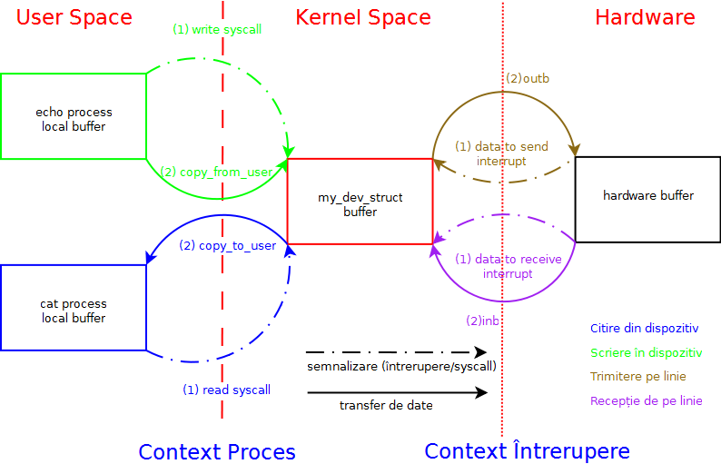

==========================
Assignment 2 - Driver UART
==========================

-  Deadline: :command:`Sunday, 30 April 2023, 23:00`
-  The assigment is individual

Assignment's Objectives
=======================

*  consolidating the knowledge of device drivers
*  read hardware documentation and track the desired functionality in the documentation
*  work with interrupts; use of non-blocking functions in interrupt context
*  use of buffers; synchronization
*  kernel modules with parameters

Statement
=========

Write a kernel module that implements a driver for the serial port (`UART16550`).
The device driver must support the two standard serial ports in a PC, `COM1` and `COM2` (`0x3f8` and `0x2f8`,
in fact the entire range of `8` addresses `0x3f8-0x3ff` and `0x2f8-0x2ff` specific to the two ports).
In addition to the standard routines (`open`, `read`, `write`, `close`),
the driver must also have support for changing communication parameters using an `ioctl` operation (`UART16550_IOCTL_SET_LINE`).

The driver must use interrupts for both reception and transmission to reduce latency and CPU usage time.
`Read` and `write` calls must also be blocking. :command:`Assignments that do not meet these requirements will not be considered.`
It is recommended that you use a buffer for the read routine and another buffer for the write routine for each serial port in the driver.

A blocking read call means that the read routine called from the user-space will be blocked until :command:`at least` one byte is read
(the read buffer in the kernel is empty and no data can be read).
A blocking write call means that the write routine called from the user-space will be blocked until :command:`at least` one byte is written
(the write buffer in the kernel is full and no data can be written).

Buffers Scheme
--------------

Data transfer between the various buffers is a `Producer-Consumer <https://en.wikipedia.org/wiki/Producer%E2%80%93consumer_problem>`__ problem. Example:

-   The process is the producer and the device is the consumer if it is written from the process to the device; the process will block until there is at least one free space in the consumer's buffer

-   The process is the consumer and the device is the producer if it is read from a process from the device; the process will block until there is at least one element in the producer's buffer.

Implementation Details
======================

-  the driver will be implemented as a kernel module named :command:`uart16550.ko`
-  the driver will be accessed as a character device driver, with different functions depending on the parameters transmitted to the load module:

   -  the `major` parameter will specify the major with which the device must be registered
   -  the `option` parameter will specify how it works:

      -  OPTION_BOTH: will also register COM1 and COM2, with the major given by the `major` parameter and the minors 0 (for COM1) and 1 (for COM2);
      -  OPTION_COM1: will only register COM1, with the major `major` and minor 0;
      -  OPTION_COM2: will only register COM2, with the major `major` and minor 1;
   -  to learn how to pass parameters in Linux, see `tldp <https://tldp.org/LDP/lkmpg/2.6/html/x323.html>`__
   -  the default values are `major=42` and `option=OPTION_BOTH`.
-  the interrupt number associated with COM1 is 4 (`IRQ_COM1`) and the interrupt number associated with COM2 is 3 (`IRQ_COM2`)
-  `the header <https://gitlab.cs.pub.ro/so2/2-uart/-/blob/master/src/uart16550.h>`__ with the definitions needed for special operations;
-  a starting point in implementing read / write routines is the `example <https://ocw.cs.pub.ro/courses/so2/laboratoare/lab04?&#sincronizare_-_cozi_de_asteptare>`__ of uppercase / lowercase character device driver; the only difference is that you have to use two buffers, one for read and one for write;
-  you can use `kfifo <https://lwn.net/Articles/347619/>`__ for buffers;
-  you do not have to use deferred functions to read / write data from / to ports (you can do everything from interrupt context);
-  you will need to synchronize the read / write routines with the interrupt handling routine for the routines to be blocking; it is recommended to use `synchronization with waiting queues <https://ocw.cs.pub.ro/courses/so2/laboratoare/lab04?&#sincronizare_-_cozi_de_asteptare>`__
-  In order for the assigment to work, the `default serial driver` must be disabled:

   -  `cat /proc/ioports | grep serial` will detect the presence of the default driver on the regions where COM1 and COM2 are defined
   -  in order to deactivate it, the kernel must be recompiled, either by setting the serial driver as the module, or by deactivating it completely (this modification is already made on the virtual machine)

      -  `Device Drivers -> Character devices -> Serial driver -> 8250/16550 and compatible serial support.`

Testing
=======
In order to simplify the assignment evaluation process, but also to reduce the mistakes of the submitted assignments,
the assignment evaluation will be done automatically with the help of a
`test script <https://gitlab.cs.pub.ro/so2/2-uart/-/blob/master/checker/2-uart-checker/_checker>`__ called `_checker`.
The test script assumes that the kernel module is called `uart16550.ko`.

QuickStart
==========

It is mandatory to start the implementation of the assignment from the code skeleton found in the `src <https://gitlab.cs.pub.ro/so2/2-uart/-/tree/master/src>`__ directory.
There is only one header in the skeleton called `uart16550.h <https://gitlab.cs.pub.ro/so2/2-uart/-/blob/master/src/uart16550.h>`__.
You will provide the rest of the implementation. You can add as many `*.c`` sources and additional `*.h`` headers.
You should also provide a Kbuild file that will compile the kernel module called `uart16550.ko`.
Follow the instructions in the `README.md file <https://gitlab.cs.pub.ro/so2/2-uart/-/blob/master/README.md>`__ of the `assignment's repo <https://gitlab.cs.pub.ro/so2/2-uart>`__.

Tips
----

To increase your chances of getting the highest grade, read and follow the Linux kernel
coding style described in the `Coding Style document <https://elixir.bootlin.com/linux/v4.19.19/source/Documentation/process/coding-style.rst>`__.

Also, use the following static analysis tools to verify the code:

- checkpatch.pl

.. code-block:: console

   $ linux/scripts/checkpatch.pl --no-tree --terse -f /path/to/your/list.c

- sparse

.. code-block:: console

   $ sudo apt-get install sparse
   $ cd linux
   $ make C=2 /path/to/your/list.c

- cppcheck

.. code-block:: console

   $ sudo apt-get install cppcheck
   $ cppcheck /path/to/your/list.c

Penalties
---------

Information about assigments penalties can be found on the
`General Directions page <https://ocw.cs.pub.ro/courses/so2/teme/general>`__.

In exceptional cases (the assigment passes the tests by not complying with the requirements)
and if the assigment does not pass all the tests, the grade will may decrease more than mentioned above.

Submitting the assigment
------------------------

The assignment will be graded automatically using the `vmchecker-next <https://github.com/systems-cs-pub-ro/vmchecker-next/wiki/Student-Handbook>`__ infrastructure.
The submission will be made on moodle on the `course's page <https://curs.upb.ro/2022/course/view.php?id=5121>`__ to the related assignment.
You will find the submission details in the `README.md file <https://gitlab.cs.pub.ro/so2/2-uart/-/blob/master/README.md>`__ of the `repo <https://gitlab.cs.pub.ro/so2/2-uart>`__.

Resources
=========

-  serial port documentation can be found on `tldp <https://tldp.org/HOWTO/Serial-HOWTO-19.html>`__
-  `table with registers <http://www.byterunner.com/16550.html>`__
-  `datasheet 16550 <https://pdf1.alldatasheet.com/datasheet-pdf/view/9301/NSC/PC16550D.html>`__
-  `alternative documentation <https://en.wikibooks.org/wiki/Serial_Programming/8250_UART_Programming>`__

We recommend that you use gitlab to store your homework. Follow the directions in
`README <https://gitlab.cs.pub.ro/so2/2-uart/-/blob/master/README.md>`__.

Questions
=========

For questions about the topic, you can consult the mailing `list archives <http://cursuri.cs.pub.ro/pipermail/so2/>`__
or you can write a question on the dedicated Teams channel.
