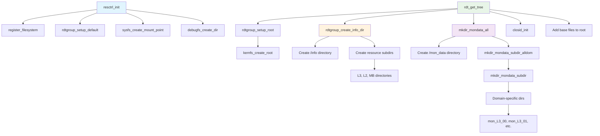
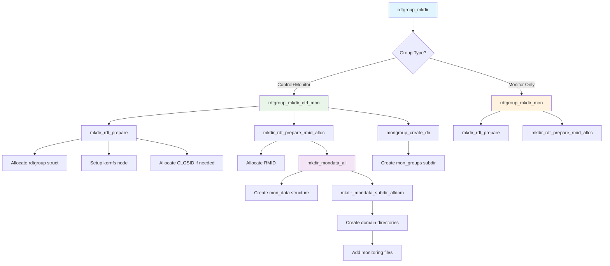
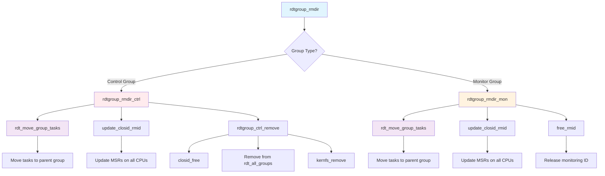
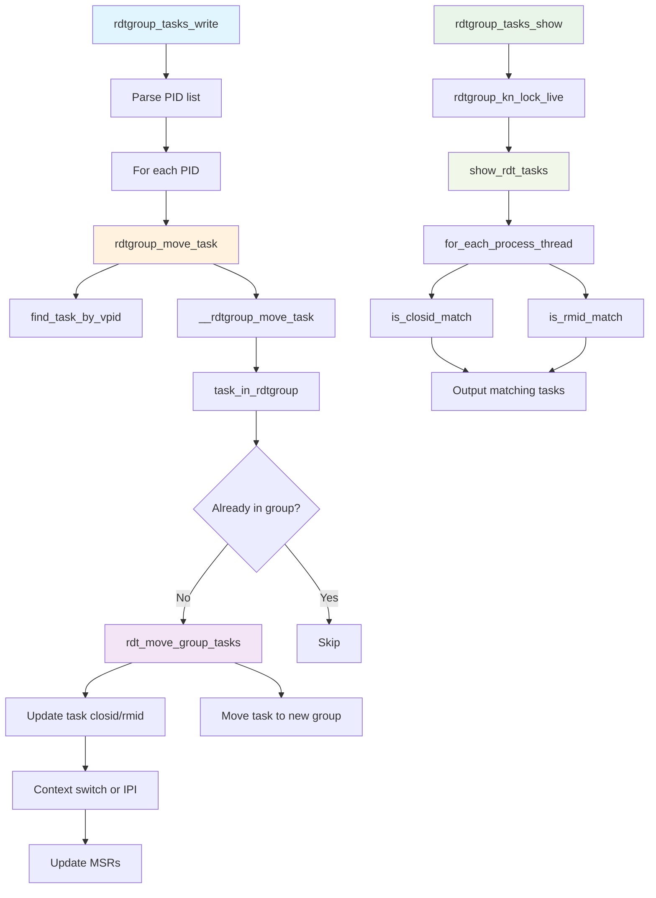
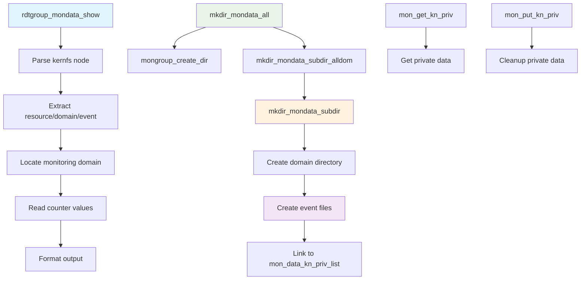
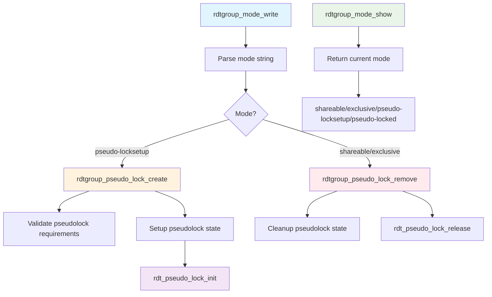
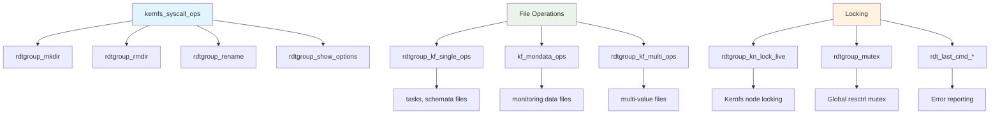

# ResCtrl Filesystem Function Flow Diagrams

This document contains mermaid diagrams showing the important function flows in the ResCtrl filesystem implementation (`fs/resctrl/rdtgroup.c`).

## 1. Initialization Flow - Directory Structure Creation

This diagram shows how the ResCtrl filesystem initializes and creates its directory structure during mount.

## 2. Resource Group Creation Flow (mkdir operation)

This diagram shows the flow when creating new resource groups via `mkdir`.

## 3. Resource Group Deletion Flow (rmdir operation)

This diagram shows the flow when removing resource groups via `rmdir`.

## 4. Task Assignment Flow (tasks file operations)

This diagram shows how tasks are assigned to resource groups via the tasks file.

## 5. Monitoring Data Flow (reading monitoring counters)

This diagram shows how monitoring data is read from the mon_data directories.

## 6. Pseudolock Flow (cache pseudo-locking)

This diagram shows the flow for setting up cache pseudo-locking via the mode file.

## 7. Overall Filesystem Operations Structure

This diagram shows the high-level structure of ResCtrl filesystem operations.

## Key Data Structures

The following key data structures are used throughout these flows:

- **`struct rdtgroup`**: Represents a resource group
- **`struct rdt_resource`**: Represents a hardware resource (L3, L2, MB)
- **`struct rdt_domain`**: Represents a domain within a resource
- **`struct kernfs_node`**: Kernel filesystem node
- **`struct rdt_fs_context`**: Filesystem context for mounting

These diagrams show the main function flows within the ResCtrl filesystem, focusing on the core operations of initialization, resource group management, task assignment, monitoring, and special features like pseudo-locking.