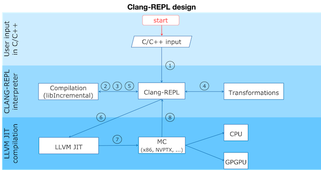

===========
Clang-Repl
===========

**Clang-Repl** is an interactive C++ interpreter that allows for incremental
compilation. It supports interactive programming for C++ in a
read-evaluate-print-loop (REPL) style. It uses Clang as a library to compile the
high level programming language into LLVM IR. Then the LLVM IR is executed by
the LLVM just-in-time (JIT) infrastructure.

Clang-Repl is suitable for exploratory programming and in places where time
to insight is important. Clang-Repl is a project inspired by the work in
`Cling <https://github.com/root-project/cling>`_, a LLVM-based C/C++ interpreter
developed by the field of high energy physics and used by the scientific data
analysis framework `ROOT <https://root.cern/>`_. Clang-Repl allows to move parts
of Cling upstream, making them useful and available to a broader audience.

Clang-Repl Basic Data Flow
==========================

Clang-Repl data flow can be divided into roughly 8 phases:

1. Clang-Repl controls the input infrastructure by an interactive prompt or by
   an interface allowing the incremental processing of input.

2. Then it sends the input to the underlying incremental facilities in Clang
   infrastructure.

3. Clang compiles the input into an AST representation.

4. When required the AST can be further transformed in order to attach specific
   behavior.

5. The AST representation is then lowered to LLVM IR.

6. The LLVM IR is the input format for LLVM’s JIT compilation infrastructure.
   The tool will instruct the JIT to run specified functions, translating them
   into machine code targeting the underlying device architecture (eg. Intel
   x86 or NVPTX).

7. The LLVM JIT lowers the LLVM IR to machine code.

8. The machine code is then executed.

Build Instructions:
===================

.. code-block:: console

   $ cd llvm-project
   $ mkdir build
   $ cd build
   $ cmake -DCMAKE_BUILD_TYPE=RelWithDebInfo -DLLVM_ENABLE_PROJECTS=clang -G "Unix Makefiles" ../llvm

**Note here**, above RelWithDebInfo - Debug / Release

.. code-block:: console

   cmake --build . --target clang clang-repl -j n
      OR
   cmake --build . --target clang clang-repl

**Clang-repl** is built under llvm-project/build/bin. Proceed into the directory **llvm-project/build/bin**

.. code-block:: console

   ./clang-repl
   clang-repl>

Clang-Repl Usage
================

**Clang-Repl** is an interactive C++ interpreter that allows for incremental
compilation. It supports interactive programming for C++ in a
read-evaluate-print-loop (REPL) style. It uses Clang as a library to compile the
high level programming language into LLVM IR. Then the LLVM IR is executed by
the LLVM just-in-time (JIT) infrastructure.

Basic:
======

.. code-block:: text

  clang-repl> #include <iostream>
  clang-repl> int f() { std::cout << "Hello Interpreted World!\n"; return 0; }
  clang-repl> auto r = f();
   // Prints Hello Interpreted World!

.. code-block:: text

   clang-repl> #include<iostream>
   clang-repl> using namespace std;
   clang-repl> std::cout << "Welcome to CLANG-REPL" << std::endl;
   Welcome to CLANG-REPL
   // Prints Welcome to CLANG-REPL

Function Definitions and Calls:
===============================

.. code-block:: text

   clang-repl> #include <iostream>
   clang-repl> int sum(int a, int b){ return a+b; };
   clang-repl> int c = sum(9,10);
   clang-repl> std::cout << c << std::endl;
   19
   clang-repl>

Iterative Structures:
=====================

.. code-block:: text

   clang-repl> #include <iostream>
   clang-repl> for (int i = 0;i < 3;i++){ std::cout << i << std::endl;}
   0
   1
   2
   clang-repl> while(i < 7){ i++; std::cout << i << std::endl;}
   4
   5
   6
   7

Classes and Structures:
=======================

.. code-block:: text

   clang-repl> #include <iostream>
   clang-repl> class Rectangle {int width, height; public: void set_values (int,int);\
   clang-repl... int area() {return width*height;}};
   clang-repl>  void Rectangle::set_values (int x, int y) { width = x;height = y;}
   clang-repl> int main () { Rectangle rect;rect.set_values (3,4);\
   clang-repl... std::cout << "area: " << rect.area() << std::endl;\
   clang-repl... return 0;}
   clang-repl> main();
   area: 12
   clang-repl>
   // Note: This '\' can be used for continuation of the statements in the next line

Lamdas:
=======

.. code-block:: text

   clang-repl> #include <iostream>
   clang-repl> using namespace std;
   clang-repl> auto welcome =   { std::cout << "Welcome to REPL" << std::endl;};
   clang-repl> welcome();
   Welcome to REPL

Using Dynamic Library:
======================

.. code-block:: text

   clang-repl> %lib print.so
   clang-repl> #include"print.hpp"
   clang-repl> print(9);
   9

**Generation of dynamic library**

.. code-block:: text

   // print.cpp
   #include <iostream>
   #include "print.hpp"

   void print(int a)
   {
      std::cout << a << std::endl;
   }

   // print.hpp
   void print (int a);

   // Commands
   clang++-17  -c -o print.o print.cpp
   clang-17 -shared print.o -o print.so

Comments:
=========

.. code-block:: text

   clang-repl> // Comments in Clang-Repl
   clang-repl> /* Comments in Clang-Repl */

Closure or Termination:
=======================

.. code-block:: text

   clang-repl>%quit

Just like Clang, Clang-Repl can be integrated in existing applications as a library
(using the clangInterpreter library). This turns your C++ compiler into a service that
can incrementally consume and execute code. The **Compiler as A Service** (**CaaS**)
concept helps support advanced use cases such as template instantiations on demand and
automatic language interoperability. It also helps static languages such as C/C++ become
apt for data science.

Execution Results Handling in Clang-Repl
========================================

Execution Results Handling features discussed below help extend the Clang-Repl
functionality by creating an interface between the execution results of a
program and the compiled program.

1. **Capture Execution Results**: This feature helps capture the execution results
of a program and bring them back to the compiled program.

2. **Dump Captured Execution Results**: This feature helps create a temporary dump
for Value Printing/Automatic Printf, that is, to display the value and type of
the captured data.

1. Capture Execution Results
============================

In many cases, it is useful to bring back the program execution result to the
compiled program. This result can be stored in an object of type **Value**.

How Execution Results are captured (Value Synthesis):
-----------------------------------------------------

The synthesizer chooses which expression to synthesize, and then it replaces
the original expression with the synthesized expression. Depending on the
expression type, it may choose to save an object (``LastValue``) of type 'value'
while allocating memory to it (``SetValueWithAlloc()``), or not (
``SetValueNoAlloc()``).

.. graphviz::
    :name: valuesynthesis
    :caption: Value Synthesis
    :alt: Shows how an object of type 'Value' is synthesized
    :align: center

     digraph "valuesynthesis" {
         rankdir="LR";
         graph [fontname="Verdana", fontsize="12"];
         node [fontname="Verdana", fontsize="12"];
         edge [fontname="Sans", fontsize="9"];

         start [label=" Create an Object \n 'Last Value' \n of type 'Value' ", shape="note", fontcolor=white, fillcolor="#3333ff", style=filled];
         assign [label=" Assign the result \n to the 'LastValue' \n (based on respective \n Memory Allocation \n scenario) ", shape="box"]
         print [label=" Pretty Print \n the Value Object ", shape="Msquare", fillcolor="yellow", style=filled];
         start -> assign;
         assign -> print;

           subgraph SynthesizeExpression {
             synth [label=" SynthesizeExpr() ", shape="note", fontcolor=white, fillcolor="#3333ff", style=filled];
             mem [label=" New Memory \n Allocation? ", shape="diamond"];
             withaloc [label=" SetValueWithAlloc() ", shape="box"];
             noaloc [label=" SetValueNoAlloc() ", shape="box"];
             right [label=" 1. RValue Structure \n (a temporary value)", shape="box"];
             left2 [label=" 2. LValue Structure \n (a variable with \n an address)", shape="box"];
             left3 [label=" 3. Built-In Type \n (int, float, etc.)", shape="box"];
             output [label=" move to 'Assign' step ", shape="box"];

             synth -> mem;
             mem -> withaloc [label="Yes"];
             mem -> noaloc [label="No"];
             withaloc -> right;
             noaloc -> left2;
             noaloc -> left3;
             right -> output;
             left2 -> output;
             left3 -> output;
      }
            output -> assign
      }

Where is the captured result stored?
------------------------------------

``LastValue`` holds the last result of the value printing. It is a class member
because it can be accessed even after subsequent inputs.

**Note:** If no value printing happens, then it is in an invalid state.

Improving Efficiency and User Experience
----------------------------------------

The Value object is essentially used to create a mapping between an expression
'type' and the allocated 'memory'. Built-in types (bool, char, int,
float, double, etc.) are copyable. Their memory allocation size is known
and the Value object can introduce a small-buffer optimization.
In case of objects, the ``Value`` class provides reference-counted memory
management.

The implementation maps the type as written and the Clang Type to be able to use
the preprocessor to synthesize the relevant cast operations. For example,
``X(char, Char_S)``, where ``char`` is the type from the language's type system
and ``Char_S`` is the Clang builtin type which represents it. This mapping helps
to import execution results from the interpreter in a compiled program and vice
versa. The ``Value.h`` header file can be included at runtime and this is why it
has a very low token count and was developed with strict constraints in mind.

This also enables the user to receive the computed 'type' back in their code
and then transform the type into something else (e.g., re-cast a double into
a float). Normally, the compiler can handle these conversions transparently,
but in interpreter mode, the compiler cannot see all the 'from' and 'to' types,
so it cannot implicitly do the conversions. So this logic enables providing
these conversions on request.

On-request conversions can help improve the user experience, by allowing
conversion to a desired 'to' type, when the 'from' type is unknown or unclear.

Significance of this Feature
----------------------------

The 'Value' object enables wrapping a memory region that comes from the
JIT, and bringing it back to the compiled code (and vice versa).
This is a very useful functionality when:

- connecting an interpreter to the compiled code, or
- connecting an interpreter in another language.

For example, this feature helps transport values across boundaries. A notable
example is the cppyy project code makes use of this feature to enable running C++
within Python. It enables transporting values/information between C++
and Python.

Note: `cppyy <https://github.com/wlav/cppyy/>`_ is an automatic, run-time,
Python-to-C++ bindings generator, for calling C++ from Python and Python from C++.
It uses LLVM along with a C++ interpreter (e.g., Cling) to enable features like
run-time instantiation of C++ templates, cross-inheritance, callbacks,
auto-casting, transparent use of smart pointers, etc.

In a nutshell, this feature enables a new way of developing code, paving the
way for language interoperability and easier interactive programming.

Implementation Details
======================

Interpreter as a REPL vs. as a Library
--------------------------------------

1 - If we're using the interpreter in interactive (REPL) mode, it will dump
the value (i.e., value printing).

.. code-block:: console

  if (LastValue.isValid()) {
    if (!V) {
      LastValue.dump();
      LastValue.clear();
    } else
      *V = std::move(LastValue);
  }

2 - If we're using the interpreter as a library, then it will pass the value
to the user.

Incremental AST Consumer
------------------------

The ``IncrementalASTConsumer`` class wraps the original code generator
``ASTConsumer`` and it performs a hook, to traverse all the top-level decls, to
look for expressions to synthesize, based on the ``isSemiMissing()`` condition.

If this condition is found to be true, then ``Interp.SynthesizeExpr()`` will be
invoked.

**Note:** Following is a sample code snippet. Actual code may vary over time.

.. code-block:: console

    for (Decl *D : DGR)
      if (auto *TSD = llvm::dyn_cast<TopLevelStmtDecl>(D);
          TSD && TSD->isSemiMissing())
        TSD->setStmt(Interp.SynthesizeExpr(cast<Expr>(TSD->getStmt())));

    return Consumer->HandleTopLevelDecl(DGR);

The synthesizer will then choose the relevant expression, based on its type.

Communication between Compiled Code and Interpreted Code
--------------------------------------------------------

In Clang-Repl there is **interpreted code**, and this feature adds a 'value'
runtime that can talk to the **compiled code**.

Following is an example where the compiled code interacts with the interpreter
code. The execution results of an expression are stored in the object 'V' of
type Value. This value is then printed, effectively helping the interpreter
use a value from the compiled code.

.. code-block:: console

    int Global = 42;
    void setGlobal(int val) { Global = val; }
    int getGlobal() { return Global; }
    Interp.ParseAndExecute(“void setGlobal(int val);”);
    Interp.ParseAndExecute(“int getGlobal();”);
    Value V;
    Interp.ParseAndExecute(“getGlobal()”, &V);
    std::cout << V.getAs<int>() << “\n”; // Prints 42

**Note:** Above is an example of interoperability between the compiled code and
the interpreted code. Interoperability between languages (e.g., C++ and Python)
works similarly.

2. Dump Captured Execution Results
==================================

This feature helps create a temporary dump to display the value and type
(pretty print) of the desired data. This is a good way to interact with the
interpreter during interactive programming.

How value printing is simplified (Automatic Printf)
---------------------------------------------------

The ``Automatic Printf`` feature makes it easy to display variable values during
program execution. Using the ``printf`` function repeatedly is not required.
This is achieved using an extension in the ``libclangInterpreter`` library.

To automatically print the value of an expression, simply write the expression
in the global scope **without a semicolon**.

.. graphviz::
    :name: automaticprintf
    :caption: Automatic PrintF
    :alt: Shows how Automatic PrintF can be used
    :align: center

     digraph "AutomaticPrintF" {
         size="6,4";
         rankdir="LR";
         graph [fontname="Verdana", fontsize="12"];
         node [fontname="Verdana", fontsize="12"];
         edge [fontname="Sans", fontsize="9"];

         manual [label=" Manual PrintF ", shape="box"];
         int1 [label=" int ( &) 42 ", shape="box"]
         auto [label=" Automatic PrintF ", shape="box"];
         int2 [label=" int ( &) 42 ", shape="box"]

         auto -> int2 [label="int x = 42; \n x"];
         manual -> int1 [label="int x = 42; \n printf(&quot;(int &) %d \\n&quot;, x);"];
     }

Significance of this feature
----------------------------

Inspired by a similar implementation in `Cling <https://github.com/root-project/cling>`_,
this feature added to upstream Clang repo has essentially extended the syntax of
C++, so that it can be more helpful for people that are writing code for data
science applications.

This is useful, for example, when you want to experiment with a set of values
against a set of functions, and you'd like to know the results right away.
This is similar to how Python works (hence its popularity in data science
research), but the superior performance of C++, along with this flexibility
makes it a more attractive option.

Implementation Details
======================

Parsing mechanism:
------------------

The Interpreter in Clang-Repl (``Interpreter.cpp``) includes the function
``ParseAndExecute()`` that can accept a 'Value' parameter to capture the result.
But if the value parameter is made optional and it is omitted (i.e., that the
user does not want to utilize it elsewhere), then the last value can be
validated and pushed into the ``dump()`` function.

.. graphviz::
    :name: parsing
    :caption: Parsing Mechanism
    :alt: Shows the Parsing Mechanism for Pretty Printing
    :align: center

     digraph "prettyprint" {
         rankdir="LR";
         graph [fontname="Verdana", fontsize="12"];
         node [fontname="Verdana", fontsize="12"];
         edge [fontname="Verdana", fontsize="9"];

         parse [label=" ParseAndExecute() \n in Clang ", shape="box"];
         capture [label=" Capture 'Value' parameter \n for processing? ", shape="diamond"];
         use [label="  Use for processing  ", shape="box"];
         dump [label="  Validate and push  \n to dump()", shape="box"];
         callp [label="  call print() function ", shape="box"];
         type [label="  Print the Type \n ReplPrintTypeImpl()", shape="box"];
         data [label="  Print the Data \n ReplPrintDataImpl() ", shape="box"];
         output [label="  Output Pretty Print \n to the user  ", shape="box", fontcolor=white, fillcolor="#3333ff", style=filled];

         parse -> capture [label="Optional 'Value' Parameter"];
         capture -> use [label="Yes"];
         use -> End;
         capture -> dump [label="No"];
         dump -> callp;
         callp -> type;
         callp -> data;
         type -> output;
         data -> output;
      }

**Note:** Following is a sample code snippet. Actual code may vary over time.

.. code-block:: console

    llvm::Error Interpreter::ParseAndExecute(llvm::StringRef Code, Value *V) {

    auto PTU = Parse(Code);
    if (!PTU)
        return PTU.takeError();
    if (PTU->TheModule)
        if (llvm::Error Err = Execute(*PTU))
        return Err;

    if (LastValue.isValid()) {
        if (!V) {
        LastValue.dump();
        LastValue.clear();
        } else
        *V = std::move(LastValue);
    }
    return llvm::Error::success();
    }

The ``dump()`` function (in ``value.cpp``) calls the ``print()`` function.

Printing the Data and Type are handled in their respective functions:
``ReplPrintDataImpl()`` and ``ReplPrintTypeImpl()``.

Annotation Token (annot_repl_input_end)
---------------------------------------

This feature uses a new token (``annot_repl_input_end``) to consider printing the
value of an expression if it doesn't end with a semicolon. When parsing an
Expression Statement, if the last semicolon is missing, then the code will
pretend that there one and set a marker there for later utilization, and
continue parsing.

A semicolon is normally required in C++, but this feature expands the C++
syntax to handle cases where a missing semicolon is expected (i.e., when
handling an expression statement). It also makes sure that an error is not
generated for the missing semicolon in this specific case.

This is accomplished by identifying the end position of the user input
(expression statement). This helps store and return the expression statement
effectively, so that it can be printed (displayed to the user automatically).

**Note:** This logic is only available for C++ for now, since part of the
implementation itself requires C++ features. Future versions may support more
languages.

.. code-block:: console

  Token *CurTok = nullptr;
  // If the semicolon is missing at the end of REPL input, consider if
  // we want to do value printing. Note this is only enabled in C++ mode
  // since part of the implementation requires C++ language features.
  // Note we shouldn't eat the token since the callback needs it.
  if (Tok.is(tok::annot_repl_input_end) && Actions.getLangOpts().CPlusPlus)
    CurTok = &Tok;
  else
    // Otherwise, eat the semicolon.
    ExpectAndConsumeSemi(diag::err_expected_semi_after_expr);

  StmtResult R = handleExprStmt(Expr, StmtCtx);
  if (CurTok && !R.isInvalid())
    CurTok->setAnnotationValue(R.get());

  return R;
    }

AST Transformation
-------------------

When Sema encounters the ``annot_repl_input_end`` token, it knows to transform
the AST before the real CodeGen process. It will consume the token and set a
'semi missing' bit in the respective decl.

.. code-block:: console

    if (Tok.is(tok::annot_repl_input_end) &&
        Tok.getAnnotationValue() != nullptr) {
        ConsumeAnnotationToken();
        cast<TopLevelStmtDecl>(DeclsInGroup.back())->setSemiMissing();
    }

In the AST Consumer, traverse all the Top Level Decls, to look for expressions
to synthesize. If the current Decl is the Top Level Statement
Decl(``TopLevelStmtDecl``) and has a semicolon missing, then ask the interpreter
to synthesize another expression (an internal function call) to replace this
original expression.

Detailed RFC and Discussion:
----------------------------

For more technical details, community discussion and links to patches related
to these features,
Please visit: `RFC on LLVM Discourse <https://discourse.llvm.org/t/rfc-handle-execution-results-in-clang-repl/68493>`_.

Some logic presented in the RFC (e.g. ValueGetter()) may be outdated,
compared to the final developed solution.

Related Reading
===============
`Cling Transitions to LLVM's Clang-Repl <https://root.cern/blog/cling-in-llvm/>`_

`Moving (parts of) the Cling REPL in Clang <https://lists.llvm.org/pipermail/llvm-dev/2020-July/143257.html>`_

`GPU Accelerated Automatic Differentiation With Clad <https://arxiv.org/pdf/2203.06139.pdf>`_
