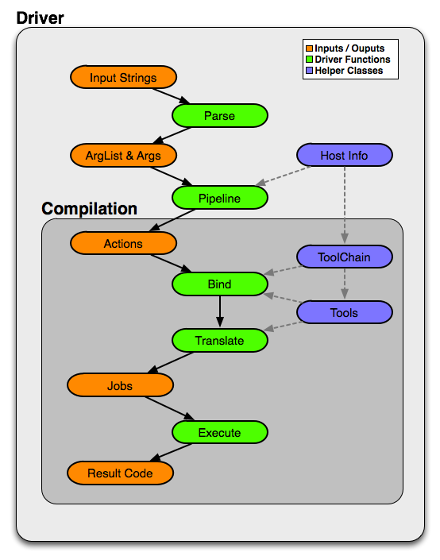

=========================
Driver Design & Internals
=========================

.. contents::
   :local:

Introduction
============

This document describes the Clang driver. The purpose of this document
is to describe both the motivation and design goals for the driver, as
well as details of the internal implementation.

Features and Goals
==================

The Clang driver is intended to be a production quality compiler driver
providing access to the Clang compiler and tools, with a command line
interface which is compatible with the gcc driver.

Although the driver is part of and driven by the Clang project, it is
logically a separate tool which shares many of the same goals as Clang:

.. contents:: Features
   :local:

GCC Compatibility
-----------------

The number one goal of the driver is to ease the adoption of Clang by
allowing users to drop Clang into a build system which was designed to
call GCC. Although this makes the driver much more complicated than
might otherwise be necessary, we decided that being very compatible with
the gcc command line interface was worth it in order to allow users to
quickly test clang on their projects.

Flexible
--------

The driver was designed to be flexible and easily accommodate new uses
as we grow the clang and LLVM infrastructure. As one example, the driver
can easily support the introduction of tools which have an integrated
assembler; something we hope to add to LLVM in the future.

Similarly, most of the driver functionality is kept in a library which
can be used to build other tools which want to implement or accept a gcc
like interface.

Low Overhead
------------

The driver should have as little overhead as possible. In practice, we
found that the gcc driver by itself incurred a small but meaningful
overhead when compiling many small files. The driver doesn't do much
work compared to a compilation, but we have tried to keep it as
efficient as possible by following a few simple principles:

-  Avoid memory allocation and string copying when possible.
-  Don't parse arguments more than once.
-  Provide a few simple interfaces for efficiently searching arguments.

Simple
------

Finally, the driver was designed to be "as simple as possible", given
the other goals. Notably, trying to be completely compatible with the
gcc driver adds a significant amount of complexity. However, the design
of the driver attempts to mitigate this complexity by dividing the
process into a number of independent stages instead of a single
monolithic task.

Internal Design and Implementation
==================================

.. contents::
   :local:
   :depth: 1

Internals Introduction
----------------------

In order to satisfy the stated goals, the driver was designed to
completely subsume the functionality of the gcc executable; that is, the
driver should not need to delegate to gcc to perform subtasks. On
Darwin, this implies that the Clang driver also subsumes the gcc
driver-driver, which is used to implement support for building universal
images (binaries and object files). This also implies that the driver
should be able to call the language specific compilers (e.g. cc1)
directly, which means that it must have enough information to forward
command line arguments to child processes correctly.

Design Overview
---------------

The diagram below shows the significant components of the driver
architecture and how they relate to one another. The orange components
represent concrete data structures built by the driver, the green
components indicate conceptually distinct stages which manipulate these
data structures, and the blue components are important helper classes.

Driver Stages
-------------

The driver functionality is conceptually divided into five stages:

#. **Parse: Option Parsing**

   The command line argument strings are decomposed into arguments
   (``Arg`` instances). The driver expects to understand all available
   options, although there is some facility for just passing certain
   classes of options through (like ``-Wl,``).

   Each argument corresponds to exactly one abstract ``Option``
   definition, which describes how the option is parsed along with some
   additional metadata. The Arg instances themselves are lightweight and
   merely contain enough information for clients to determine which
   option they correspond to and their values (if they have additional
   parameters).

   For example, a command line like "-Ifoo -I foo" would parse to two
   Arg instances (a JoinedArg and a SeparateArg instance), but each
   would refer to the same Option.

   Options are lazily created in order to avoid populating all Option
   classes when the driver is loaded. Most of the driver code only needs
   to deal with options by their unique ID (e.g., ``options::OPT_I``),

   Arg instances themselves do not generally store the values of
   parameters. In many cases, this would simply result in creating
   unnecessary string copies. Instead, Arg instances are always embedded
   inside an ArgList structure, which contains the original vector of
   argument strings. Each Arg itself only needs to contain an index into
   this vector instead of storing its values directly.

   The clang driver can dump the results of this stage using the
   ``-###`` flag (which must precede any actual command
   line arguments). For example:

   .. code-block:: console

      $ clang -### -Xarch_i386 -fomit-frame-pointer -Wa,-fast -Ifoo -I foo t.c
      Option 0 - Name: "-Xarch_", Values: {"i386", "-fomit-frame-pointer"}
      Option 1 - Name: "-Wa,", Values: {"-fast"}
      Option 2 - Name: "-I", Values: {"foo"}
      Option 3 - Name: "-I", Values: {"foo"}
      Option 4 - Name: "<input>", Values: {"t.c"}

   After this stage is complete the command line should be broken down
   into well defined option objects with their appropriate parameters.
   Subsequent stages should rarely, if ever, need to do any string
   processing.

#. **Pipeline: Compilation Action Construction**

   Once the arguments are parsed, the tree of subprocess jobs needed for
   the desired compilation sequence are constructed. This involves
   determining the input files and their types, what work is to be done
   on them (preprocess, compile, assemble, link, etc.), and constructing
   a list of Action instances for each task. The result is a list of one
   or more top-level actions, each of which generally corresponds to a
   single output (for example, an object or linked executable).

   The majority of Actions correspond to actual tasks, however there are
   two special Actions. The first is InputAction, which simply serves to
   adapt an input argument for use as an input to other Actions. The
   second is BindArchAction, which conceptually alters the architecture
   to be used for all of its input Actions.

   The clang driver can dump the results of this stage using the
   ``-ccc-print-phases`` flag. For example:

   .. code-block:: console

      $ clang -ccc-print-phases -x c t.c -x assembler t.s
      0: input, "t.c", c
      1: preprocessor, {0}, cpp-output
      2: compiler, {1}, assembler
      3: assembler, {2}, object
      4: input, "t.s", assembler
      5: assembler, {4}, object
      6: linker, {3, 5}, image

   Here the driver is constructing seven distinct actions, four to
   compile the "t.c" input into an object file, two to assemble the
   "t.s" input, and one to link them together.

   A rather different compilation pipeline is shown here; in this
   example there are two top level actions to compile the input files
   into two separate object files, where each object file is built using
   ``lipo`` to merge results built for two separate architectures.

   .. code-block:: console

      $ clang -ccc-print-phases -c -arch i386 -arch x86_64 t0.c t1.c
      0: input, "t0.c", c
      1: preprocessor, {0}, cpp-output
      2: compiler, {1}, assembler
      3: assembler, {2}, object
      4: bind-arch, "i386", {3}, object
      5: bind-arch, "x86_64", {3}, object
      6: lipo, {4, 5}, object
      7: input, "t1.c", c
      8: preprocessor, {7}, cpp-output
      9: compiler, {8}, assembler
      10: assembler, {9}, object
      11: bind-arch, "i386", {10}, object
      12: bind-arch, "x86_64", {10}, object
      13: lipo, {11, 12}, object

   After this stage is complete the compilation process is divided into
   a simple set of actions which need to be performed to produce
   intermediate or final outputs (in some cases, like ``-fsyntax-only``,
   there is no "real" final output). Phases are well known compilation
   steps, such as "preprocess", "compile", "assemble", "link", etc.

#. **Bind: Tool & Filename Selection**

   This stage (in conjunction with the Translate stage) turns the tree
   of Actions into a list of actual subprocess to run. Conceptually, the
   driver performs a top down matching to assign Action(s) to Tools. The
   ToolChain is responsible for selecting the tool to perform a
   particular action; once selected the driver interacts with the tool
   to see if it can match additional actions (for example, by having an
   integrated preprocessor).

   Once Tools have been selected for all actions, the driver determines
   how the tools should be connected (for example, using an inprocess
   module, pipes, temporary files, or user provided filenames). If an
   output file is required, the driver also computes the appropriate
   file name (the suffix and file location depend on the input types and
   options such as ``-save-temps``).

   The driver interacts with a ToolChain to perform the Tool bindings.
   Each ToolChain contains information about all the tools needed for
   compilation for a particular architecture, platform, and operating
   system. A single driver invocation may query multiple ToolChains
   during one compilation in order to interact with tools for separate
   architectures.

   The results of this stage are not computed directly, but the driver
   can print the results via the ``-ccc-print-bindings`` option. For
   example:

   .. code-block:: console

      $ clang -ccc-print-bindings -arch i386 -arch ppc t0.c
      # "i386-apple-darwin9" - "clang", inputs: ["t0.c"], output: "/tmp/cc-Sn4RKF.s"
      # "i386-apple-darwin9" - "darwin::Assemble", inputs: ["/tmp/cc-Sn4RKF.s"], output: "/tmp/cc-gvSnbS.o"
      # "i386-apple-darwin9" - "darwin::Link", inputs: ["/tmp/cc-gvSnbS.o"], output: "/tmp/cc-jgHQxi.out"
      # "ppc-apple-darwin9" - "gcc::Compile", inputs: ["t0.c"], output: "/tmp/cc-Q0bTox.s"
      # "ppc-apple-darwin9" - "gcc::Assemble", inputs: ["/tmp/cc-Q0bTox.s"], output: "/tmp/cc-WCdicw.o"
      # "ppc-apple-darwin9" - "gcc::Link", inputs: ["/tmp/cc-WCdicw.o"], output: "/tmp/cc-HHBEBh.out"
      # "i386-apple-darwin9" - "darwin::Lipo", inputs: ["/tmp/cc-jgHQxi.out", "/tmp/cc-HHBEBh.out"], output: "a.out"

   This shows the tool chain, tool, inputs and outputs which have been
   bound for this compilation sequence. Here clang is being used to
   compile t0.c on the i386 architecture and darwin specific versions of
   the tools are being used to assemble and link the result, but generic
   gcc versions of the tools are being used on PowerPC.

#. **Translate: Tool Specific Argument Translation**

   Once a Tool has been selected to perform a particular Action, the
   Tool must construct concrete Commands which will be executed during
   compilation. The main work is in translating from the gcc style
   command line options to whatever options the subprocess expects.

   Some tools, such as the assembler, only interact with a handful of
   arguments and just determine the path of the executable to call and
   pass on their input and output arguments. Others, like the compiler
   or the linker, may translate a large number of arguments in addition.

   The ArgList class provides a number of simple helper methods to
   assist with translating arguments; for example, to pass on only the
   last of arguments corresponding to some option, or all arguments for
   an option.

   The result of this stage is a list of Commands (executable paths and
   argument strings) to execute.

#. **Execute**

   Finally, the compilation pipeline is executed. This is mostly
   straightforward, although there is some interaction with options like
   ``-pipe``, ``-pass-exit-codes`` and ``-time``.

Additional Notes
----------------

The Compilation Object
^^^^^^^^^^^^^^^^^^^^^^

The driver constructs a Compilation object for each set of command line
arguments. The Driver itself is intended to be invariant during
construction of a Compilation; an IDE should be able to construct a
single long lived driver instance to use for an entire build, for
example.

The Compilation object holds information that is particular to each
compilation sequence. For example, the list of used temporary files
(which must be removed once compilation is finished) and result files
(which should be removed if compilation fails).

Unified Parsing & Pipelining
^^^^^^^^^^^^^^^^^^^^^^^^^^^^

Parsing and pipelining both occur without reference to a Compilation
instance. This is by design; the driver expects that both of these
phases are platform neutral, with a few very well defined exceptions
such as whether the platform uses a driver driver.

ToolChain Argument Translation
^^^^^^^^^^^^^^^^^^^^^^^^^^^^^^

In order to match gcc very closely, the clang driver currently allows
tool chains to perform their own translation of the argument list (into
a new ArgList data structure). Although this allows the clang driver to
match gcc easily, it also makes the driver operation much harder to
understand (since the Tools stop seeing some arguments the user
provided, and see new ones instead).

For example, on Darwin ``-gfull`` gets translated into two separate
arguments, ``-g`` and ``-fno-eliminate-unused-debug-symbols``. Trying to
write Tool logic to do something with ``-gfull`` will not work, because
Tool argument translation is done after the arguments have been
translated.

A long term goal is to remove this tool chain specific translation, and
instead force each tool to change its own logic to do the right thing on
the untranslated original arguments.

Unused Argument Warnings
^^^^^^^^^^^^^^^^^^^^^^^^

The driver operates by parsing all arguments but giving Tools the
opportunity to choose which arguments to pass on. One downside of this
infrastructure is that if the user misspells some option, or is confused
about which options to use, some command line arguments the user really
cared about may go unused. This problem is particularly important when
using clang as a compiler, since the clang compiler does not support
anywhere near all the options that gcc does, and we want to make sure
users know which ones are being used.

To support this, the driver maintains a bit associated with each
argument of whether it has been used (at all) during the compilation.
This bit usually doesn't need to be set by hand, as the key ArgList
accessors will set it automatically.

When a compilation is successful (there are no errors), the driver
checks the bit and emits an "unused argument" warning for any arguments
which were never accessed. This is conservative (the argument may not
have been used to do what the user wanted) but still catches the most
obvious cases.

Relation to GCC Driver Concepts
-------------------------------

For those familiar with the gcc driver, this section provides a brief
overview of how things from the gcc driver map to the clang driver.

-  **Driver Driver**

   The driver driver is fully integrated into the clang driver. The
   driver simply constructs additional Actions to bind the architecture
   during the *Pipeline* phase. The tool chain specific argument
   translation is responsible for handling ``-Xarch_``.

   The one caveat is that this approach requires ``-Xarch_`` not be used
   to alter the compilation itself (for example, one cannot provide
   ``-S`` as an ``-Xarch_`` argument). The driver attempts to reject
   such invocations, and overall there isn't a good reason to abuse
   ``-Xarch_`` to that end in practice.

   The upside is that the clang driver is more efficient and does little
   extra work to support universal builds. It also provides better error
   reporting and UI consistency.

-  **Specs**

   The clang driver has no direct correspondent for "specs". The
   majority of the functionality that is embedded in specs is in the
   Tool specific argument translation routines. The parts of specs which
   control the compilation pipeline are generally part of the *Pipeline*
   stage.

-  **Toolchains**

   The gcc driver has no direct understanding of tool chains. Each gcc
   binary roughly corresponds to the information which is embedded
   inside a single ToolChain.

   The clang driver is intended to be portable and support complex
   compilation environments. All platform and tool chain specific code
   should be protected behind either abstract or well defined interfaces
   (such as whether the platform supports use as a driver driver).
