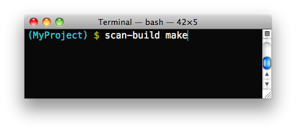

Command Line Usage: scan-build and CodeChecker
==============================================

This document provides guidelines for running the static analyzer from the command line on whole projects.
CodeChecker and scan-build are two CLI tools for using CSA on multiple files (tranlation units).
Both provide a way of driving the analyzer, detecting compilation flags, and generating reports.
CodeChecker is more actively maintained, provides heuristics for working with multiple versions of popular compilers and it also comes with a web-based GUI for viewing, filtering, categorizing and suppressing the results.
Therefore CodeChecker is recommended in case you need any of the above features or just more customizability in general.

Comparison of CodeChecker and scan-build
----------------------------------------

The static analyzer is by design a GUI tool originally intended to be consumed by the XCode IDE.
Its purpose is to find buggy execution paths in the program, and such paths are very hard to comprehend by looking at a non-interactive standard output.
It is possible, however, to invoke the static analyzer from the command line in order to obtain analysis results, and then later view them interactively in a graphical interface.
The following tools are used commonly to run the analyzer from the command line.
Both tools are wrapper scripts to drive the analysis and the underlying invocations of the Clang compiler:

1. scan-build_ is an old and simple command line tool that emits static analyzer warnings as HTML files while compiling your project. You can view the analysis results in your web browser.
    - Useful for individual developers who simply want to view static analysis results at their desk, or in a very simple collaborative environment.
    - Works on all major platforms (Windows, Linux, macOS) and is available as a package in many Linux distributions.
    - Does not include support for cross-translation-unit analysis.

2. CodeChecker_ is a driver and web server that runs the static analyzer on your projects on demand and maintains a database of issues.
    - Perfect for managing large amounts of thee static analyzer warnings in a collaborative environment.
    - Generally much more feature-rich than scan-build.
    - Supports incremental analysis: Results can be stored in a database, subsequent analysis runs can be compared to list the newly added defects.
    - :doc:`CrossTranslationUnit` is supported fully on Linux via CodeChecker.
    - Can run clang-tidy checkers too.
    - Open source, but out-of-tree, i.e. not part of the LLVM project.

scan-build
----------

**scan-build** is a command line utility that enables a user to run the static analyzer over their codebase as part of performing a regular build (from the command line).

How does it work?
~~~~~~~~~~~~~~~~~

During a project build, as source files are compiled they are also analyzed in tandem by the static analyzer.

Upon completion of the build, results are then presented to the user within a web browser.

Will it work with any build system?
~~~~~~~~~~~~~~~~~~~~~~~~~~~~~~~~~~~

**scan-build** has little or no knowledge about how you build your code. It works by overriding the ``CC`` and ``CXX`` environment variables to (hopefully) change your build to use a "fake" compiler instead of the one that would normally build your project. This fake compiler executes either ``clang`` or ``gcc`` (depending on the platform) to compile your code and then executes the static analyzer to analyze your code.

This "poor man's interposition" works amazingly well in many cases and falls down in others. Please consult the information on this page on making the best use of **scan-build**, which includes getting it to work when the aforementioned hack fails to work.

.. image:: ../images/analyzer_html.png

**Viewing static analyzer results in a web browser**

Basic Usage
~~~~~~~~~~~

Basic usage of ``scan-build`` is designed to be simple: just place the word "scan-build" in front of your build command::

  $ scan-build make
  $ scan-build xcodebuild

In the first case ``scan-build`` analyzes the code of a project built with ``make`` and in the second case ``scan-build`` analyzes a project built using ``xcodebuild``.

Here is the general format for invoking ``scan-build``::

  $ scan-build [scan-build options] <command> [command options]

Operationally, ``scan-build`` literally runs <command> with all of the subsequent options passed to it. For example, one can pass ``-j4`` to ``make`` get a parallel build over 4 cores::

  $ scan-build make -j4

In almost all cases, ``scan-build`` makes no effort to interpret the options after the build command; it simply passes them through. In general, ``scan-build`` should support parallel builds, but **not distributed builds**.

It is also possible to use ``scan-build`` to analyze specific files::

  $ scan-build gcc -c t1.c t2.c

This example causes the files ``t1.c`` and ``t2.c`` to be analyzed.

For Windows Users
~~~~~~~~~~~~~~~~~

Windows users must have Perl installed to use scan-build.

``scan-build.bat`` script allows you to launch scan-build in the same way as it described in the Basic Usage section above. To invoke scan-build from an arbitrary location, add the path to the folder containing scan-build.bat to your PATH environment variable.

If you have unexpected compilation/make problems when running scan-build with MinGW/MSYS the following information may be helpful:

- If getting unexpected ``"fatal error: no input files"`` while building with MSYS make from the Windows cmd, try one of these solutions:
  - Use MinGW ``mingw32-make`` instead of MSYS ``make`` and exclude the path to MSYS from PATH to prevent ``mingw32-make`` from using MSYS utils. MSYS utils are dependent on the MSYS runtime and they are not intended for being run from the Windows cmd. Specifically, makefile commands with backslashed quotes may be heavily corrupted when passed for execution.
  - Run ``make`` from the sh shell::

      $ scan-build [scan-build options] sh -c "make [make options]"

- If getting ``"Error : *** target pattern contains no `%'"`` while using GNU Make 3.81, try to use another version of make.

Other Options
~~~~~~~~~~~~~

As mentioned above, extra options can be passed to ``scan-build``. These options prefix the build command. For example::

  $ scan-build -k -V make
  $ scan-build -k -V xcodebuild

Here is a subset of useful options:

- **-o**: Target directory for HTML report files. Subdirectories will be created as needed to represent separate "runs" of the analyzer. If this option is not specified, a directory is created in ``/tmp`` to store the reports.
- **-h** *(or no arguments)*: Display all ``scan-build`` options.
- **-k**, **--keep-going**: Add a "keep on going" option to the specified build command. This option currently supports ``make`` and ``xcodebuild``. This is a convenience option; one can specify this behavior directly using build options.
- **-v**: Verbose output from scan-build and the analyzer. **A second and third "-v" increases verbosity**, and is useful for filing bug reports against the analyzer.
- **-V**: View analysis results in a web browser when the build command completes.
- **--use-analyzer Xcode** *(or)* **--use-analyzer [path to clang]**: ``scan-build`` uses the 'clang' executable relative to itself for static analysis. One can override this behavior with this option by using the 'clang' packaged with Xcode (on OS X) or from the PATH.

A complete list of options can be obtained by running ``scan-build`` with no arguments.

Output of scan-build
~~~~~~~~~~~~~~~~~~~~

The output of scan-build is a set of HTML files, each one which represents a separate bug report. A single ``index.html`` file is generated for surveying all of the bugs. You can then just open ``index.html`` in a web browser to view the bug reports.

Where the HTML files are generated is specified with a **-o** option to ``scan-build``. If **-o** isn't specified, a directory in ``/tmp`` is created to store the files (``scan-build`` will print a message telling you where they are). If you want to view the reports immediately after the build completes, pass **-V** to ``scan-build``.

Recommended Usage Guidelines
~~~~~~~~~~~~~~~~~~~~~~~~~~~~

This section describes a few recommendations with running the analyzer.

Always Analyze a Project in its "Debug" Configuration
~~~~~~~~~~~~~~~~~~~~~~~~~~~~~~~~~~~~~~~~~~~~~~~~~~~~~

Most projects can be built in a "debug" mode that enables assertions. Assertions are picked up by the static analyzer to prune infeasible paths, which in some cases can greatly reduce the number of false positives (bogus error reports) emitted by the tool.

Another option is to use ``--force-analyze-debug-code`` flag of **scan-build** tool which would enable assertions automatically.

Use Verbose Output when Debugging scan-build
~~~~~~~~~~~~~~~~~~~~~~~~~~~~~~~~~~~~~~~~~~~~

``scan-build`` takes a **-v** option to emit verbose output about what it's doing; two **-v** options emit more information. Redirecting the output of ``scan-build`` to a text file (make sure to redirect standard error) is useful for filing bug reports against ``scan-build`` or the analyzer, as we can see the exact options (and files) passed to the analyzer. For more comprehensible logs, don't perform a parallel build.

Run './configure' through scan-build
~~~~~~~~~~~~~~~~~~~~~~~~~~~~~~~~~~~~

If an analyzed project uses an autoconf generated ``configure`` script, you will probably need to run ``configure`` script through ``scan-build`` in order to analyze the project.

**Example**::

  $ scan-build ./configure
  $ scan-build --keep-cc make

The reason ``configure`` also needs to be run through ``scan-build`` is because ``scan-build`` scans your source files by *interposing* on the compiler. This interposition is currently done by ``scan-build`` temporarily setting the environment variable ``CC`` to ``ccc-analyzer``. The program ``ccc-analyzer`` acts like a fake compiler, forwarding its command line arguments over to the compiler to perform regular compilation and ``clang`` to perform static analysis.

Running ``configure`` typically generates makefiles that have hardwired paths to the compiler, and by running ``configure`` through ``scan-build`` that path is set to ``ccc-analyzer``.

Analyzing iPhone Projects
~~~~~~~~~~~~~~~~~~~~~~~~~

Conceptually Xcode projects for iPhone applications are nearly the same as their cousins for desktop applications. **scan-build** can analyze these projects as well, but users often encounter problems with just building their iPhone projects from the command line because there are a few extra preparative steps they need to take (e.g., setup code signing).

Recommendation: use "Build and Analyze"
~~~~~~~~~~~~~~~~~~~~~~~~~~~~~~~~~~~~~~~

The absolute easiest way to analyze iPhone projects is to use the `Analyze feature in Xcode <https://developer.apple.com/library/ios/recipes/xcode_help-source_editor/chapters/Analyze.html#//apple_ref/doc/uid/TP40009975-CH4-SW1>`_ (which is based on the static analyzer). There a user can analyze their project right from a menu without most of the setup described later.

`Instructions are available <../xcode.html>`_ on this website on how to use open source builds of the analyzer as a replacement for the one bundled with Xcode.

Using scan-build directly
~~~~~~~~~~~~~~~~~~~~~~~~~

If you wish to use **scan-build** with your iPhone project, keep the following things in mind:

- Analyze your project in the ``Debug`` configuration, either by setting this as your configuration with Xcode or by passing ``-configuration Debug`` to ``xcodebuild``.
- Analyze your project using the ``Simulator`` as your base SDK. It is possible to analyze your code when targeting the device, but this is much easier to do when using Xcode's *Build and Analyze* feature.
- Check that your code signing SDK is set to the simulator SDK as well, and make sure this option is set to ``Don't Code Sign``.

Note that you can most of this without actually modifying your project. For example, if your application targets iPhoneOS 2.2, you could run **scan-build** in the following manner from the command line::

  $ scan-build xcodebuild -configuration Debug -sdk iphonesimulator2.2

Alternatively, if your application targets iPhoneOS 3.0::

  $ scan-build xcodebuild -configuration Debug -sdk iphonesimulator3.0

Gotcha: using the right compiler
~~~~~~~~~~~~~~~~~~~~~~~~~~~~~~~~

Recall that **scan-build** analyzes your project by using a compiler to compile the project and ``clang`` to analyze your project. The script uses simple heuristics to determine which compiler should be used (it defaults to ``clang`` on Darwin and ``gcc`` on other platforms). When analyzing iPhone projects, **scan-build** may pick the wrong compiler than the one Xcode would use to build your project. For example, this could be because multiple versions of a compiler may be installed on your system, especially if you are developing for the iPhone.

When compiling your application to run on the simulator, it is important that **scan-build** finds the correct version of ``gcc/clang``. Otherwise, you may see strange build errors that only happen when you run ``scan-build``.

**scan-build** provides the ``--use-cc`` and ``--use-c++`` options to hardwire which compiler scan-build should use for building your code. Note that although you are chiefly interested in analyzing your project, keep in mind that running the analyzer is intimately tied to the build, and not being able to compile your code means it won't get fully analyzed (if at all).

If you aren't certain which compiler Xcode uses to build your project, try just running ``xcodebuild`` (without **scan-build**). You should see the full path to the compiler that Xcode is using, and use that as an argument to ``--use-cc``.

CodeChecker
-----------

Basic Usage
~~~~~~~~~~~

Install CodeChecker as described here: `CodeChecker Install Guide <https://github.com/Ericsson/codechecker/#Install-guide>`_.

Create a compilation database. If you use cmake then pass the ``-DCMAKE_EXPORT_COMPILE_COMMANDS=1`` parameter to cmake. Cmake will create a ``compile_commands.json`` file.
If you have a Makefile based or similar build system then you can log the build commands with the help of CodeChecker::

    make clean
    CodeChecker log -b "make" -o compile_commands.json

Analyze your project::

    CodeChecker analyze compile_commands.json -o ./reports

View the analysis results.
Print the detailed results in the command line::

    CodeChecker parse --print-steps ./reports

Or view the detailed results in a browser::

    CodeChecker parse ./reports -e html -o ./reports_html
    firefox ./reports_html/index.html

Optional: store the analysis results in a DB::

    mkdir ./ws
    CodeChecker server -w ./ws -v 8555 &
    CodeChecker store ./reports --name my-project --url http://localhost:8555/Default

Optional: manage (categorize, suppress) the results in your web browser::

    firefox http://localhost:8555/Default

Detailed Usage
~~~~~~~~~~~~~~

For extended documentation please refer to the `official site of CodeChecker <https://github.com/Ericsson/codechecker/blob/master/docs/usage.md>`_!

