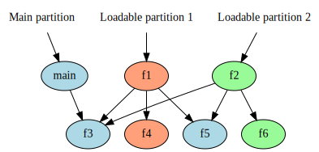

Partitions
==========

.. warning::

  This feature is currently experimental, and its interface is subject
  to change.

LLD's partitioning feature allows a program (which may be an executable
or a shared library) to be split into multiple pieces, or partitions. A
partitioned program consists of a main partition together with a number of
loadable partitions. The loadable partitions depend on the main partition
in a similar way to a regular ELF shared object dependency, but unlike a
shared object, the main partition and the loadable partitions share a virtual
address space at link time, and each loadable partition is assigned a fixed
offset from the main partition. This allows the loadable partitions to refer
to code and data in the main partition directly without the binary size and
performance overhead of PLTs, GOTs or symbol table entries.

Usage
-----

A program that uses the partitioning feature must decide which symbols are
going to be used as the "entry points" for each partition. An entry point
could, for example, be the equivalent of the partition's ``main`` function, or
there could be a group of functions that expose the functionality implemented
by the partition. The intent is that in order to use a loadable partition,
the program will use ``dlopen``/``dlsym`` or similar functions to dynamically
load the partition at its assigned address, look up an entry point by name
and call it. Note, however, that the standard ``dlopen`` function does not
allow specifying a load address. On Android, the ``android_dlopen_ext``
function may be used together with the ``ANDROID_DLEXT_RESERVED_ADDRESS``
flag to load a shared object at a specific address.

Once the entry points have been decided, the translation unit(s)
containing the entry points should be compiled using the Clang compiler flag
``-fsymbol-partition=<soname>``, where ``<soname>`` is the intended soname
of the partition. The resulting object files are passed to the linker in
the usual way.

The linker will then use these entry points to automatically split the program
into partitions according to which sections of the program are reachable from
which entry points, similarly to how ``--gc-sections`` removes unused parts of
a program. Any sections that are only reachable from a loadable partition's
entry point are assigned to that partition, while all other sections are
assigned to the main partition, including sections only reachable from
loadable partitions.

The following diagram illustrates how sections are assigned to partitions. Each
section is colored according to its assigned partition.

The result of linking a program that uses partitions is essentially an
ELF file with all of the partitions concatenated together. This file is
referred to as a combined output file. To extract a partition from the
combined output file, the ``llvm-objcopy`` tool should be used together
with the flag ``--extract-main-partition`` to extract the main partition, or
``-extract-partition=<soname>`` to extract one of the loadable partitions.
An example command sequence is shown below:

.. code-block:: shell

  # Compile the main program.
  clang -ffunction-sections -fdata-sections -c main.c

  # Compile a feature to be placed in a loadable partition.
  # Note that this is likely to be a separate build step to the main partition.
  clang -ffunction-sections -fdata-sections -fsymbol-partition=libfeature.so -c feature.c

  # Link the combined output file.
  clang main.o feature.o -fuse-ld=lld -shared -o libcombined.so -Wl,-soname,libmain.so -Wl,--gc-sections

  # Extract the partitions.
  llvm-objcopy libcombined.so libmain.so --extract-main-partition
  llvm-objcopy libcombined.so libfeature.so --extract-partition=libfeature.so

In order to allow a program to discover the names of its loadable partitions
and the locations of their reserved regions, the linker creates a partition
index, which is an array of structs with the following definition:

.. code-block:: c

  struct partition_index_entry {
    int32_t name_offset;
    int32_t addr_offset;
    uint32_t size;
  };

The ``name_offset`` field is a relative pointer to a null-terminated string
containing the soname of the partition, the ``addr_offset`` field is a
relative pointer to its load address and the ``size`` field contains the
size of the region reserved for the partition. To derive an absolute pointer
from the relative pointer fields in this data structure, the address of the
field should be added to the value stored in the field.

The program may discover the location of the partition index using the
linker-defined symbols ``__part_index_begin`` and ``__part_index_end``.

Restrictions
------------

This feature is currently only supported in the ELF linker.

The partitioning feature may not currently be used together with the
``SECTIONS`` or ``PHDRS`` linker script features, nor may it be used with the
``--section-start``, ``-Ttext``, ``-Tdata`` or ``-Tbss`` flags. All of these
features assume a single set of output sections and/or program headers, which
makes their semantics ambiguous in the presence of more than one partition.

The partitioning feature may not currently be used on the MIPS architecture
because it is unclear whether the MIPS multi-GOT ABI is compatible with
partitions.

The current implementation only supports creating up to 254 partitions due
to implementation limitations. This limit may be relaxed in the future.
