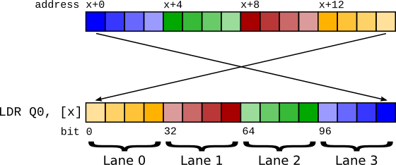
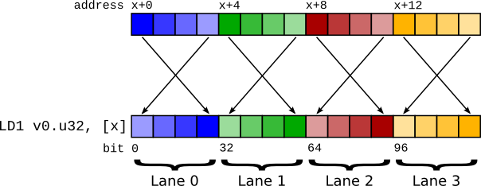
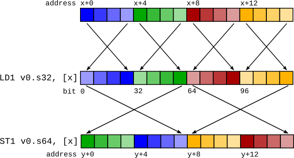
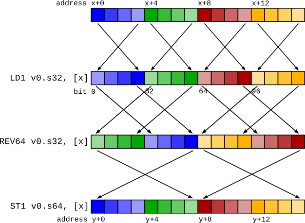

==============================================
Using ARM NEON instructions in big endian mode
==============================================

.. contents::
    :local:

Introduction
============

Generating code for big endian ARM processors is for the most part straightforward. NEON loads and stores however have some interesting properties that make code generation decisions less obvious in big endian mode.

The aim of this document is to explain the problem with NEON loads and stores, and the solution that has been implemented in LLVM.

In this document the term "vector" refers to what the ARM ABI calls a "short vector", which is a sequence of items that can fit in a NEON register. This sequence can be 64 or 128 bits in length, and can constitute 8, 16, 32 or 64 bit items. This document refers to A64 instructions throughout, but is almost applicable to the A32/ARMv7 instruction sets also. The ABI format for passing vectors in A32 is slightly different to A64. Apart from that, the same concepts apply.

Example: C-level intrinsics -> assembly
---------------------------------------

It may be helpful first to illustrate how C-level ARM NEON intrinsics are lowered to instructions.

This trivial C function takes a vector of four ints and sets the zero'th lane to the value "42"::

    #include <arm_neon.h>
    int32x4_t f(int32x4_t p) {
        return vsetq_lane_s32(42, p, 0);
    }

arm_neon.h intrinsics generate "generic" IR where possible (that is, normal IR instructions not ``llvm.arm.neon.*`` intrinsic calls). The above generates::

    define <4 x i32> @f(<4 x i32> %p) {
      %vset_lane = insertelement <4 x i32> %p, i32 42, i32 0
      ret <4 x i32> %vset_lane
    }

Which then becomes the following trivial assembly::

    f:                                      // @f
            movz	w8, #0x2a
            ins 	v0.s[0], w8
            ret

Problem
=======

The main problem is how vectors are represented in memory and in registers.

First, a recap. The "endianness" of an item affects its representation in memory only. In a register, a number is just a sequence of bits - 64 bits in the case of AArch64 general purpose registers. Memory, however, is a sequence of addressable units of 8 bits in size. Any number greater than 8 bits must therefore be split up into 8-bit chunks, and endianness describes the order in which these chunks are laid out in memory.

A "little endian" layout has the least significant byte first (lowest in memory address). A "big endian" layout has the *most* significant byte first. This means that when loading an item from big endian memory, the lowest 8-bits in memory must go in the most significant 8-bits, and so forth.

``LDR`` and ``LD1``
===================

    Big endian vector load using ``LDR``.

A vector is a consecutive sequence of items that are operated on simultaneously. To load a 64-bit vector, 64 bits need to be read from memory. In little endian mode, we can do this by just performing a 64-bit load - ``LDR q0, [foo]``. However if we try this in big endian mode, because of the byte swapping the lane indices end up being swapped! The zero'th item as laid out in memory becomes the n'th lane in the vector.

    Big endian vector load using ``LD1``. Note that the lanes retain the correct ordering.

Because of this, the instruction ``LD1`` performs a vector load but performs byte swapping not on the entire 64 bits, but on the individual items within the vector. This means that the register content is the same as it would have been on a little endian system.

It may seem that ``LD1`` should suffice to perform vector loads on a big endian machine. However there are pros and cons to the two approaches that make it less than simple which register format to pick.

There are two options:

    1. The content of a vector register is the same *as if* it had been loaded with an ``LDR`` instruction.
    2. The content of a vector register is the same *as if* it had been loaded with an ``LD1`` instruction.

Because ``LD1 == LDR + REV`` and similarly ``LDR == LD1 + REV`` (on a big endian system), we can simulate either type of load with the other type of load plus a ``REV`` instruction. So we're not deciding which instructions to use, but which format to use (which will then influence which instruction is best to use).

.. The 'clearer' container is required to make the following section header come after the floated
   images above.
.. container:: clearer

    Note that throughout this section we only mention loads. Stores have exactly the same problems as their associated loads, so have been skipped for brevity.

Considerations
==============

LLVM IR Lane ordering
---------------------

LLVM IR has first class vector types. In LLVM IR, the zero'th element of a vector resides at the lowest memory address. The optimizer relies on this property in certain areas, for example when concatenating vectors together. The intention is for arrays and vectors to have identical memory layouts - ``[4 x i8]`` and ``<4 x i8>`` should be represented the same in memory. Without this property there would be many special cases that the optimizer would have to cleverly handle.

Use of ``LDR`` would break this lane ordering property. This doesn't preclude the use of ``LDR``, but we would have to do one of two things:

   1. Insert a ``REV`` instruction to reverse the lane order after every ``LDR``.
   2. Disable all optimizations that rely on lane layout, and for every access to an individual lane (``insertelement``/``extractelement``/``shufflevector``) reverse the lane index.

AAPCS
-----

The ARM procedure call standard (AAPCS) defines the ABI for passing vectors between functions in registers. It states:

    When a short vector is transferred between registers and memory it is treated as an opaque object. That is a short vector is stored in memory as if it were stored with a single ``STR`` of the entire register; a short vector is loaded from memory using the corresponding ``LDR`` instruction. On a little-endian system this means that element 0 will always contain the lowest addressed element of a short vector; on a big-endian system element 0 will contain the highest-addressed element of a short vector.

    -- Procedure Call Standard for the ARM 64-bit Architecture (AArch64), 4.1.2 Short Vectors

The use of ``LDR`` and ``STR`` as the ABI defines has at least one advantage over ``LD1`` and ``ST1``. ``LDR`` and ``STR`` are oblivious to the size of the individual lanes of a vector. ``LD1`` and ``ST1`` are not - the lane size is encoded within them. This is important across an ABI boundary, because it would become necessary to know the lane width the callee expects. Consider the following code:

.. code-block:: c

    <callee.c>
    void callee(uint32x2_t v) {
      ...
    }

    <caller.c>
    extern void callee(uint32x2_t);
    void caller() {
      callee(...);
    }

If ``callee`` changed its signature to ``uint16x4_t``, which is equivalent in register content, if we passed as ``LD1`` we'd break this code until ``caller`` was updated and recompiled.

There is an argument that if the signatures of the two functions are different then the behaviour should be undefined. But there may be functions that are agnostic to the lane layout of the vector, and treating the vector as an opaque value (just loading it and storing it) would be impossible without a common format across ABI boundaries.

So to preserve ABI compatibility, we need to use the ``LDR`` lane layout across function calls.

Alignment
---------

In strict alignment mode, ``LDR qX`` requires its address to be 128-bit aligned, whereas ``LD1`` only requires it to be as aligned as the lane size. If we canonicalised on using ``LDR``, we'd still need to use ``LD1`` in some places to avoid alignment faults (the result of the ``LD1`` would then need to be reversed with ``REV``).

Most operating systems however do not run with alignment faults enabled, so this is often not an issue.

Summary
-------

The following table summarises the instructions that are required to be emitted for each property mentioned above for each of the two solutions.

+-------------------------------+-------------------------------+---------------------+
|                               | ``LDR`` layout                | ``LD1`` layout      |
+===============================+===============================+=====================+
| Lane ordering                 |   ``LDR + REV``               |    ``LD1``          |
+-------------------------------+-------------------------------+---------------------+
| AAPCS                         |   ``LDR``                     |    ``LD1 + REV``    |
+-------------------------------+-------------------------------+---------------------+
| Alignment for strict mode     |   ``LDR`` / ``LD1 + REV``     |    ``LD1``          |
+-------------------------------+-------------------------------+---------------------+

Neither approach is perfect, and choosing one boils down to choosing the lesser of two evils. The issue with lane ordering, it was decided, would have to change target-agnostic compiler passes and would result in a strange IR in which lane indices were reversed. It was decided that this was worse than the changes that would have to be made to support ``LD1``, so ``LD1`` was chosen as the canonical vector load instruction (and by inference, ``ST1`` for vector stores).

Implementation
==============

There are 3 parts to the implementation:

    1. Predicate ``LDR`` and ``STR`` instructions so that they are never allowed to be selected to generate vector loads and stores. The exception is one-lane vectors [1]_ - these by definition cannot have lane ordering problems so are fine to use ``LDR``/``STR``.

    2. Create code generation patterns for bitconverts that create ``REV`` instructions.

    3. Make sure appropriate bitconverts are created so that vector values get passed over call boundaries as 1-element vectors (which is the same as if they were loaded with ``LDR``).

Bitconverts
-----------

The main problem with the ``LD1`` solution is dealing with bitconverts (or bitcasts, or reinterpret casts). These are pseudo instructions that only change the compiler's interpretation of data, not the underlying data itself. A requirement is that if data is loaded and then saved again (called a "round trip"), the memory contents should be the same after the store as before the load. If a vector is loaded and is then bitconverted to a different vector type before storing, the round trip will currently be broken.

Take for example this code sequence::

    %0 = load <4 x i32> %x
    %1 = bitcast <4 x i32> %0 to <2 x i64>
         store <2 x i64> %1, <2 x i64>* %y

This would produce a code sequence such as that in the figure on the right. The mismatched ``LD1`` and ``ST1`` cause the stored data to differ from the loaded data.

.. container:: clearer

    When we see a bitcast from type ``X`` to type ``Y``, what we need to do is to change the in-register representation of the data to be *as if* it had just been loaded by a ``LD1`` of type ``Y``.

Conceptually this is simple - we can insert a ``REV`` undoing the ``LD1`` of type ``X`` (converting the in-register representation to the same as if it had been loaded by ``LDR``) and then insert another ``REV`` to change the representation to be as if it had been loaded by an ``LD1`` of type ``Y``.

For the previous example, this would be::

    LD1   v0.4s, [x]

    REV64 v0.4s, v0.4s                  // There is no REV128 instruction, so it must be synthesizedcd
    EXT   v0.16b, v0.16b, v0.16b, #8    // with a REV64 then an EXT to swap the two 64-bit elements.

    REV64 v0.2d, v0.2d
    EXT   v0.16b, v0.16b, v0.16b, #8

    ST1   v0.2d, [y]

It turns out that these ``REV`` pairs can, in almost all cases, be squashed together into a single ``REV``. For the example above, a ``REV128 4s`` + ``REV128 2d`` is actually a ``REV64 4s``, as shown in the figure on the right.

.. [1] One lane vectors may seem useless as a concept but they serve to distinguish between values held in general purpose registers and values held in NEON/VFP registers. For example, an ``i64`` would live in an ``x`` register, but ``<1 x i64>`` would live in a ``d`` register.
