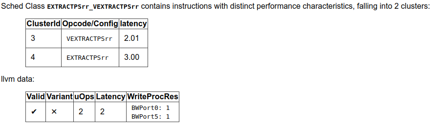

llvm-exegesis - LLVM Machine Instruction Benchmark
==================================================

.. program:: llvm-exegesis

SYNOPSIS
--------

:program:`llvm-exegesis` [*options*]

DESCRIPTION
-----------

:program:`llvm-exegesis` is a benchmarking tool that uses information available
in LLVM to measure host machine instruction characteristics like latency,
throughput, or port decomposition.

Given an LLVM opcode name and a benchmarking mode, :program:`llvm-exegesis`
generates a code snippet that makes execution as serial (resp. as parallel) as
possible so that we can measure the latency (resp. inverse throughput/uop decomposition)
of the instruction.
The code snippet is jitted and, unless requested not to, executed on the
host subtarget. The time taken (resp. resource usage) is measured using
hardware performance counters. The result is printed out as YAML
to the standard output.

The main goal of this tool is to automatically (in)validate the LLVM's TableDef
scheduling models. To that end, we also provide analysis of the results.

:program:`llvm-exegesis` can also benchmark arbitrary user-provided code
snippets.

SUPPORTED PLATFORMS
-------------------

:program:`llvm-exegesis` currently only supports X86 (64-bit only), ARM (AArch64
only), MIPS, and PowerPC (PowerPC64LE only) on Linux for benchmarking. Not all
benchmarking functionality is guaranteed to work on every platform.
:program:`llvm-exegesis` also has a separate analysis mode that is supported
on every platform that LLVM is.

SNIPPET ANNOTATIONS
-------------------

:program:`llvm-exegesis` supports benchmarking arbitrary snippets of assembly.
However, benchmarking these snippets often requires some setup so that they
can execute properly. :program:`llvm-exegesis` has five annotations and some
additional utilities to help with setup so that snippets can be benchmarked
properly.

* `LLVM-EXEGESIS-DEFREG <register name>` - Adding this annotation to the text
  assembly snippet to be benchmarked marks the register as requiring a definition.
  A value will automatically be provided unless a second parameter, a hex value,
  is passed in. This is done with the `LLVM-EXEGESIS-DEFREG <register name> <hex value>`
  format. `<hex value>` is a bit pattern used to fill the register. If it is a
  value smaller than the register, it is sign extended to match the size of the
  register.
* `LLVM-EXEGESIS-LIVEIN <register name>` - This annotation allows specifying
  registers that should keep their value upon starting the benchmark. Values
  can be passed through registers from the benchmarking setup in some cases.
  The registers and the values assigned to them that can be utilized in the
  benchmarking script with a `LLVM-EXEGESIS-LIVEIN` are as follows:

  * Scratch memory register - The specific register that this value is put in
    is platform dependent (e.g., it is the RDI register on X86 Linux). Setting
    this register as a live in ensures that a pointer to a block of memory (1MB)
    is placed within this register that can be used by the snippet.
* `LLVM-EXEGESIS-MEM-DEF <value name> <size> <value>` - This annotation allows
  specifying memory definitions that can later be mapped into the execution
  process of a snippet with the `LLVM-EXEGESIS-MEM-MAP` annotation. Each
  value is named using the `<value name>` argument so that it can be referenced
  later within a map annotation. The size is specified in a decimal number of
  bytes and the value is given in hexadecimal. If the size of the value is less
  than the specified size, the value will be repeated until it fills the entire
  section of memory. Using this annotation requires using the subprocess execution
  mode.
* `LLVM-EXEGESIS-MEM-MAP <value name> <address>` - This annotation allows for
  mapping previously defined memory definitions into the execution context of a
  process. The value name refers to a previously defined memory definition and
  the address is a decimal number that specifies the address the memory
  definition should start at. Note that a single memory definition can be
  mapped multiple times. Using this annotation requires the subprocess
  execution mode.
* `LLVM-EXEGESIS-SNIPPET-ADDRESS <address>` - This annotation allows for
  setting the address where the beginning of the snippet to be executed will
  be mapped in at. The address is given in hexadecimal. Note that the snippet
  also includes setup code, so the instruction exactly at the specified
  address will not be the first instruction in the snippet. Using this
  annotation requires the subprocess execution mode. This is useful in
  cases where the memory accessed by the snippet depends on the location
  of the snippet, like RIP-relative addressing.
* `LLVM-EXEGESIS-LOOP-REGISTER <register name>` - This annotation specifies
  the loop register to use for keeping track of the current iteration when
  using the loop repetition mode. :program:`llvm-exegesis` needs to keep track
  of the current loop iteration within the loop repetition mode in a performant
  manner (i.e., no memory accesses), and uses a register to do this. This register
  has an architecture specific default (e.g., `R8` on X86), but this might conflict
  with some snippets. This annotation allows changing the register to prevent
  interference between the loop index register and the snippet.

EXAMPLE 1: benchmarking instructions
------------------------------------

Assume you have an X86-64 machine. To measure the latency of a single
instruction, run:

.. code-block:: bash

    $ llvm-exegesis --mode=latency --opcode-name=ADD64rr

Measuring the uop decomposition or inverse throughput of an instruction works similarly:

.. code-block:: bash

    $ llvm-exegesis --mode=uops --opcode-name=ADD64rr
    $ llvm-exegesis --mode=inverse_throughput --opcode-name=ADD64rr

The output is a YAML document (the default is to write to stdout, but you can
redirect the output to a file using `--benchmarks-file`):

.. code-block:: none

  ---
  key:
    opcode_name:     ADD64rr
    mode:            latency
    config:          ''
  cpu_name:        haswell
  llvm_triple:     x86_64-unknown-linux-gnu
  num_repetitions: 10000
  measurements:
    - { key: latency, value: 1.0058, debug_string: '' }
  error:           ''
  info:            'explicit self cycles, selecting one aliasing configuration.
  Snippet:
  ADD64rr R8, R8, R10
  '
  ...

To measure the latency of all instructions for the host architecture, run:

.. code-block:: bash

    $ llvm-exegesis --mode=latency --opcode-index=-1

EXAMPLE 2: benchmarking a custom code snippet
---------------------------------------------

To measure the latency/uops of a custom piece of code, you can specify the
`snippets-file` option (`-` reads from standard input).

.. code-block:: bash

    $ echo "vzeroupper" | llvm-exegesis --mode=uops --snippets-file=-

Real-life code snippets typically depend on registers or memory.
:program:`llvm-exegesis` checks the liveliness of registers (i.e. any register
use has a corresponding def or is a "live in"). If your code depends on the
value of some registers, you need to use snippet annotations to ensure setup
is performed properly.

For example, the following code snippet depends on the values of XMM1 (which
will be set by the tool) and the memory buffer passed in RDI (live in).

.. code-block:: none

  # LLVM-EXEGESIS-LIVEIN RDI
  # LLVM-EXEGESIS-DEFREG XMM1 42
  vmulps	(%rdi), %xmm1, %xmm2
  vhaddps	%xmm2, %xmm2, %xmm3
  addq $0x10, %rdi

Example 3: benchmarking with memory annotations
-----------------------------------------------

Some snippets require memory setup in specific places to execute without
crashing. Setting up memory can be accomplished with the `LLVM-EXEGESIS-MEM-DEF`
and `LLVM-EXEGESIS-MEM-MAP` annotations. To execute the following snippet:

.. code-block:: none

    movq $8192, %rax
    movq (%rax), %rdi

We need to have at least eight bytes of memory allocated starting `0x2000`.
We can create the necessary execution environment with the following
annotations added to the snippet:

.. code-block:: none

  # LLVM-EXEGESIS-MEM-DEF test1 4096 7fffffff
  # LLVM-EXEGESIS-MEM-MAP test1 8192

  movq $8192, %rax
  movq (%rax), %rdi

EXAMPLE 4: analysis
-------------------

Assuming you have a set of benchmarked instructions (either latency or uops) as
YAML in file `/tmp/benchmarks.yaml`, you can analyze the results using the
following command:

.. code-block:: bash

    $ llvm-exegesis --mode=analysis \
  --benchmarks-file=/tmp/benchmarks.yaml \
  --analysis-clusters-output-file=/tmp/clusters.csv \
  --analysis-inconsistencies-output-file=/tmp/inconsistencies.html

This will group the instructions into clusters with the same performance
characteristics. The clusters will be written out to `/tmp/clusters.csv` in the
following format:

.. code-block:: none

  cluster_id,opcode_name,config,sched_class
  ...
  2,ADD32ri8_DB,,WriteALU,1.00
  2,ADD32ri_DB,,WriteALU,1.01
  2,ADD32rr,,WriteALU,1.01
  2,ADD32rr_DB,,WriteALU,1.00
  2,ADD32rr_REV,,WriteALU,1.00
  2,ADD64i32,,WriteALU,1.01
  2,ADD64ri32,,WriteALU,1.01
  2,MOVSX64rr32,,BSWAP32r_BSWAP64r_MOVSX64rr32,1.00
  2,VPADDQYrr,,VPADDBYrr_VPADDDYrr_VPADDQYrr_VPADDWYrr_VPSUBBYrr_VPSUBDYrr_VPSUBQYrr_VPSUBWYrr,1.02
  2,VPSUBQYrr,,VPADDBYrr_VPADDDYrr_VPADDQYrr_VPADDWYrr_VPSUBBYrr_VPSUBDYrr_VPSUBQYrr_VPSUBWYrr,1.01
  2,ADD64ri8,,WriteALU,1.00
  2,SETBr,,WriteSETCC,1.01
  ...

:program:`llvm-exegesis` will also analyze the clusters to point out
inconsistencies in the scheduling information. The output is an html file. For
example, `/tmp/inconsistencies.html` will contain messages like the following :

Note that the scheduling class names will be resolved only when
:program:`llvm-exegesis` is compiled in debug mode, else only the class id will
be shown. This does not invalidate any of the analysis results though.

OPTIONS
-------

.. option:: --help

 Print a summary of command line options.

.. option:: --opcode-index=<LLVM opcode index>

 Specify the opcode to measure, by index. Specifying `-1` will result
 in measuring every existing opcode. See example 1 for details.
 Either `opcode-index`, `opcode-name` or `snippets-file` must be set.

.. option:: --opcode-name=<opcode name 1>,<opcode name 2>,...

 Specify the opcode to measure, by name. Several opcodes can be specified as
 a comma-separated list. See example 1 for details.
 Either `opcode-index`, `opcode-name` or `snippets-file` must be set.

.. option:: --snippets-file=<filename>

 Specify the custom code snippet to measure. See example 2 for details.
 Either `opcode-index`, `opcode-name` or `snippets-file` must be set.

.. option:: --mode=[latency|uops|inverse_throughput|analysis]

 Specify the run mode. Note that some modes have additional requirements and options.

 `latency` mode can be  make use of either RDTSC or LBR.
 `latency[LBR]` is only available on X86 (at least `Skylake`).
 To run in `latency` mode, a positive value must be specified
 for `x86-lbr-sample-period` and `--repetition-mode=loop`.

 In `analysis` mode, you also need to specify at least one of the
 `-analysis-clusters-output-file=` and `-analysis-inconsistencies-output-file=`.

.. option:: --benchmark-phase=[prepare-snippet|prepare-and-assemble-snippet|assemble-measured-code|measure]

  By default, when `-mode=` is specified, the generated snippet will be executed
  and measured, and that requires that we are running on the hardware for which
  the snippet was generated, and that supports performance measurements.
  However, it is possible to stop at some stage before measuring. Choices are:
  * ``prepare-snippet``: Only generate the minimal instruction sequence.
  * ``prepare-and-assemble-snippet``: Same as ``prepare-snippet``, but also dumps an excerpt of the sequence (hex encoded).
  * ``assemble-measured-code``: Same as ``prepare-and-assemble-snippet``. but also creates the full sequence that can be dumped to a file using ``--dump-object-to-disk``.
  * ``measure``: Same as ``assemble-measured-code``, but also runs the measurement.

.. option:: --x86-lbr-sample-period=<nBranches/sample>

  Specify the LBR sampling period - how many branches before we take a sample.
  When a positive value is specified for this option and when the mode is `latency`,
  we will use LBRs for measuring.
  On choosing the "right" sampling period, a small value is preferred, but throttling
  could occur if the sampling is too frequent. A prime number should be used to
  avoid consistently skipping certain blocks.

.. option:: --x86-disable-upper-sse-registers

  Using the upper xmm registers (xmm8-xmm15) forces a longer instruction encoding
  which may put greater pressure on the frontend fetch and decode stages,
  potentially reducing the rate that instructions are dispatched to the backend,
  particularly on older hardware. Comparing baseline results with this mode
  enabled can help determine the effects of the frontend and can be used to
  improve latency and throughput estimates.

.. option:: --repetition-mode=[duplicate|loop|min|middle-half-duplicate|middle-half-loop]

 Specify the repetition mode. `duplicate` will create a large, straight line
 basic block with `min-instructions` instructions (repeating the snippet
 `min-instructions`/`snippet size` times). `loop` will, optionally, duplicate the
 snippet until the loop body contains at least `loop-body-size` instructions,
 and then wrap the result in a loop which will execute `min-instructions`
 instructions (thus, again, repeating the snippet
 `min-instructions`/`snippet size` times). The `loop` mode, especially with loop
 unrolling tends to better hide the effects of the CPU frontend on architectures
 that cache decoded instructions, but consumes a register for counting
 iterations. If performing an analysis over many opcodes, it may be best to
 instead use the `min` mode, which will run each other mode,
 and produce the minimal measured result. The middle half repetition modes
 will either duplicate or run the snippet in a loop depending upon the specific
 mode. The middle half repetition modes will run two benchmarks, one twice the
 length of the first one, and then subtract the difference between them to get
 values without overhead.

.. option:: --min-instructions=<Number of instructions>

 Specify the target number of executed instructions. Note that the actual
 repetition count of the snippet will be `min-instructions`/`snippet size`.
 Higher values lead to more accurate measurements but lengthen the benchmark.

.. option:: --loop-body-size=<Preferred loop body size>

 Only effective for `-repetition-mode=[loop|min]`.
 Instead of looping over the snippet directly, first duplicate it so that the
 loop body contains at least this many instructions. This potentially results
 in loop body being cached in the CPU Op Cache / Loop Cache, which allows to
 which may have higher throughput than the CPU decoders.

.. option:: --max-configs-per-opcode=<value>

 Specify the maximum configurations that can be generated for each opcode.
 By default this is `1`, meaning that we assume that a single measurement is
 enough to characterize an opcode. This might not be true of all instructions:
 for example, the performance characteristics of the LEA instruction on X86
 depends on the value of assigned registers and immediates. Setting a value of
 `-max-configs-per-opcode` larger than `1` allows `llvm-exegesis` to explore
 more configurations to discover if some register or immediate assignments
 lead to different performance characteristics.

.. option:: --benchmarks-file=</path/to/file>

 File to read (`analysis` mode) or write (`latency`/`uops`/`inverse_throughput`
 modes) benchmark results. "-" uses stdin/stdout.

.. option:: --analysis-clusters-output-file=</path/to/file>

 If provided, write the analysis clusters as CSV to this file. "-" prints to
 stdout. By default, this analysis is not run.

.. option:: --analysis-inconsistencies-output-file=</path/to/file>

 If non-empty, write inconsistencies found during analysis to this file. `-`
 prints to stdout. By default, this analysis is not run.

.. option:: --analysis-filter=[all|reg-only|mem-only]

 By default, all benchmark results are analysed, but sometimes it may be useful
 to only look at those that to not involve memory, or vice versa. This option
 allows to either keep all benchmarks, or filter out (ignore) either all the
 ones that do involve memory (involve instructions that may read or write to
 memory), or the opposite, to only keep such benchmarks.

.. option:: --analysis-clustering=[dbscan,naive]

 Specify the clustering algorithm to use. By default DBSCAN will be used.
 Naive clustering algorithm is better for doing further work on the
 `-analysis-inconsistencies-output-file=` output, it will create one cluster
 per opcode, and check that the cluster is stable (all points are neighbours).

.. option:: --analysis-numpoints=<dbscan numPoints parameter>

 Specify the numPoints parameters to be used for DBSCAN clustering
 (`analysis` mode, DBSCAN only).

.. option:: --analysis-clustering-epsilon=<dbscan epsilon parameter>

 Specify the epsilon parameter used for clustering of benchmark points
 (`analysis` mode).

.. option:: --analysis-inconsistency-epsilon=<epsilon>

 Specify the epsilon parameter used for detection of when the cluster
 is different from the LLVM schedule profile values (`analysis` mode).

.. option:: --analysis-display-unstable-clusters

 If there is more than one benchmark for an opcode, said benchmarks may end up
 not being clustered into the same cluster if the measured performance
 characteristics are different. by default all such opcodes are filtered out.
 This flag will instead show only such unstable opcodes.

.. option:: --ignore-invalid-sched-class=false

 If set, ignore instructions that do not have a sched class (class idx = 0).

.. option:: --mtriple=<triple name>

 Target triple. See `-version` for available targets.

.. option:: --mcpu=<cpu name>

 If set, measure the cpu characteristics using the counters for this CPU. This
 is useful when creating new sched models (the host CPU is unknown to LLVM).
 (`-mcpu=help` for details)

.. option:: --analysis-override-benchmark-triple-and-cpu

  By default, llvm-exegesis will analyze the benchmarks for the triple/CPU they
  were measured for, but if you want to analyze them for some other combination
  (specified via `-mtriple`/`-mcpu`), you can pass this flag.

.. option:: --dump-object-to-disk=true

 If set,  llvm-exegesis will dump the generated code to a temporary file to
 enable code inspection. Disabled by default.

.. option:: --use-dummy-perf-counters

 If set, llvm-exegesis will not read any real performance counters and
 return a dummy value instead. This can be used to ensure a snippet doesn't
 crash when hardware performance counters are unavailable and for
 debugging :program:`llvm-exegesis` itself.

.. option:: --execution-mode=[inprocess,subprocess]

  This option specifies what execution mode to use. The `inprocess` execution
  mode is the default. The `subprocess` execution mode allows for additional
  features such as memory annotations but is currently restricted to X86-64
  on Linux.

.. option:: --benchmark-repeat-count=<repeat-count>

  This option enables specifying the number of times to repeat the measurement
  when performing latency measurements. By default, llvm-exegesis will repeat
  a latency measurement enough times to balance run-time and noise reduction.

.. option:: --validation-counter=[instructions-retired,l1d-cache-load-misses,
   l1d-cache-store-misses,l1i-cache-load-misses,data-tlb-load-misses,
   data-tld-store-misses,instruction-tlb-load-misses]

   This option enables the use of validation counters, which measure additional
   microarchitectural events like cache misses to validate snippet execution
   conditions. These events are measured using the perf subsystem in a group
   with the performance counter used to measure the value of interest. This
   flag can be specified multiple times to measure multiple events. The maximum
   number of validation counters is platform dependent.

EXIT STATUS
-----------

:program:`llvm-exegesis` returns 0 on success. Otherwise, an error message is
printed to standard error, and the tool returns a non 0 value.
