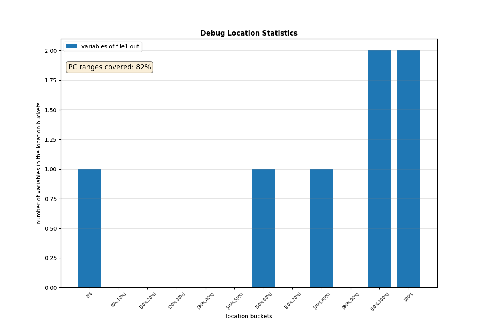
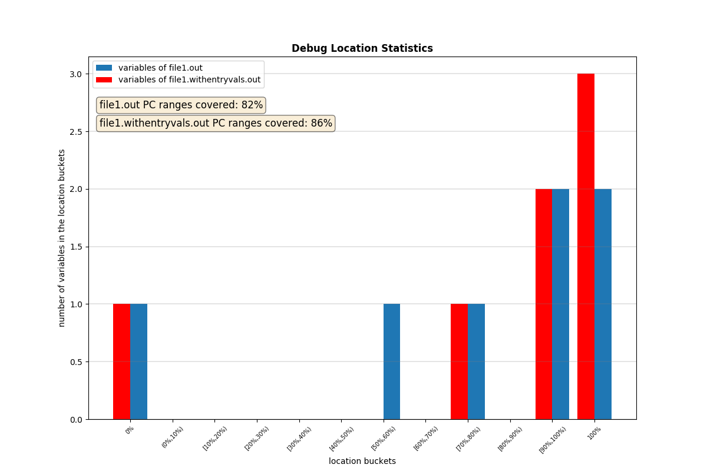

llvm-locstats - calculate statistics on DWARF debug location
============================================================

.. program:: llvm-locstats

SYNOPSIS
--------

:program:`llvm-locstats` [*options*] [*filename*]

DESCRIPTION
-----------

:program:`llvm-locstats` works like a wrapper around :program:`llvm-dwarfdump`.
It parses :program:`llvm-dwarfdump` statistics regarding debug location by
pretty printing it in a more human readable way.

The line 0% shows the number and the percentage of DIEs with no location
information, but the line 100% shows the information for DIEs where there is
location information in all code section bytes (where the variable or parameter
is in the scope). The line [50%,60%) shows the number and the percentage of DIEs
where the location information is between 50 and 60 percentage of its scope
covered.

OPTIONS
-------

.. option:: --only-variables

            calculate the location statistics only for local variables

.. option:: --only-formal-parameters

            calculate the location statistics only for formal parameters

.. option:: --ignore-debug-entry-values

            ignore the location statistics on locations containing the
            debug entry values DWARF operation

.. option:: --draw-plot

            make histogram of location buckets generated (requires
            matplotlib)

.. option:: --compare

            compare the debug location coverage on two files provided, and draw
            a plot showing the difference (requires matplotlib)

EXIT STATUS
-----------

:program:`llvm-locstats` returns 0 if the input file were parsed
successfully. Otherwise, it returns 1.

EXAMPLE 1
--------------

Pretty print the location coverage on the standard output.

.. code-block:: none

  llvm-locstats a.out

    =================================================
              Debug Location Statistics
    =================================================
          cov%          samples       percentage(~)
    -------------------------------------------------
       0%                    1              16%
       (0%,10%)              0               0%
       [10%,20%)             0               0%
       [20%,30%)             0               0%
       [30%,40%)             0               0%
       [40%,50%)             0               0%
       [50%,60%)             1              16%
       [60%,70%)             0               0%
       [70%,80%)             0               0%
       [80%,90%)             1              16%
       [90%,100%)            0               0%
       100%                  3              50%
    =================================================
    -the number of debug variables processed: 6
    -PC ranges covered: 81%
    -------------------------------------------------
    -total availability: 83%
    =================================================

EXAMPLE 2
--------------

Generate a plot as an image file.

.. code-block:: none

  llvm-locstats --draw-plot file1.out

EXAMPLE 3
--------------

Generate a plot as an image file showing the difference in the debug location
coverage.

.. code-block:: none

  llvm-locstats --compare file1.out file1.withentryvals.out

SEE ALSO
--------

:manpage:`llvm-dwarfdump(1)`
