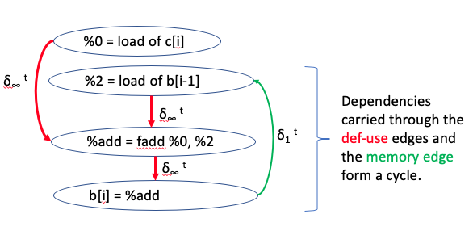
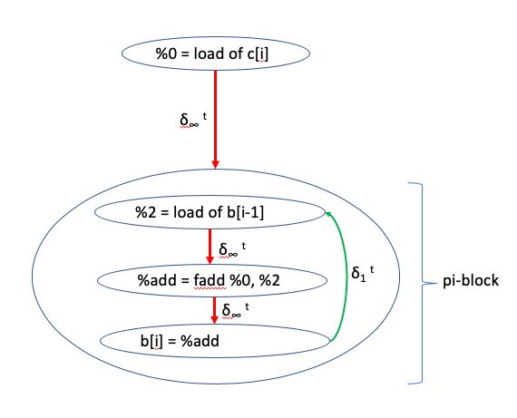
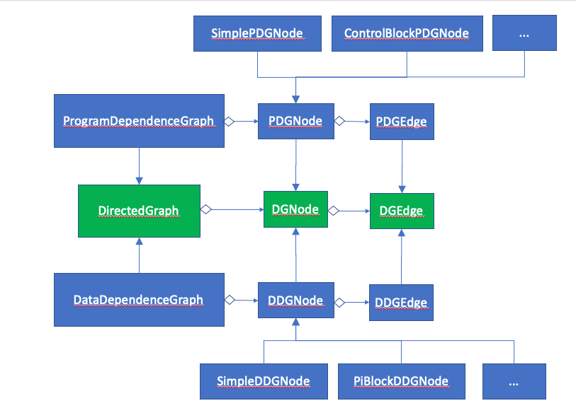
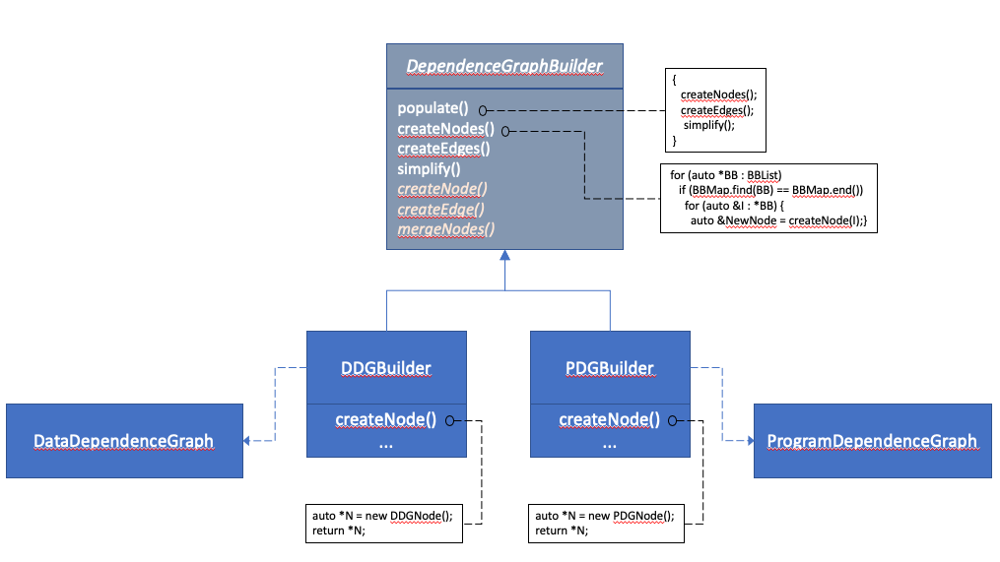

=========================
Dependence Graphs in LLVM
=========================

.. contents::
   :local:

Introduction
============
Dependence graphs are useful tools in compilers for analyzing relationships
between various program elements to help guide optimizations. The ideas
behind these graphs are described in papers [1]_ and [2]_.

The implementation of these ideas in LLVM may be slightly different than
what is mentioned in the papers. These differences are documented in
the `implementation details <implementation-details_>`_.

.. _DataDependenceGraph:

Data Dependence Graph
=====================
In its simplest form the Data Dependence Graph (or DDG) represents data
dependencies between individual instructions. Each node in such a graph
represents a single instruction and is referred to as an "atomic" node.
It is also possible to combine some atomic nodes that have a simple
def-use dependency between them into larger nodes that contain multiple-
instructions.

As described in [1]_ the DDG uses graph abstraction to group nodes
that are part of a strongly connected component of the graph
into special nodes called pi-blocks. pi-blocks represent cycles of data
dependency that prevent reordering transformations. Since any strongly
connected component of the graph is a maximal subgraph of all the nodes
that form a cycle, pi-blocks are at most one level deep. In other words,
no pi-blocks are nested inside another pi-block, resulting in a
hierarchical representation that is at most one level deep.

For example, consider the following:

.. code-block:: c++

  for (int i = 1; i < n; i++) {
    b[i] = c[i] + b[i-1];
  }

This code contains a statement that has a loop carried dependence on
itself creating a cycle in the DDG. The figure below illustrates
how the cycle of dependency is carried through multiple def-use relations
and a memory access dependency.

The DDG corresponding to this example would have a pi-block that contains
all the nodes participating in the cycle, as shown below:

Program Dependence Graph
========================

The Program Dependence Graph (or PDG) has a similar structure as the
DDG, but it is capable of representing both data dependencies and
control-flow dependencies between program elements such as
instructions, groups of instructions, basic blocks or groups of
basic blocks.

High-Level Design
=================

The DDG and the PDG are both directed graphs and they extend the
``DirectedGraph`` class. Each implementation extends its corresponding
node and edge types resulting in the inheritance relationship depicted
in the UML diagram below:

Graph Construction
------------------

The graph build algorithm considers dependencies between elements of
a given set of instructions or basic blocks. Any dependencies coming
into or going out of instructions that do not belong to that range
are ignored. The steps in the build algorithm for the DDG are very
similar to the steps in the build algorithm for the PDG. As such,
one of the design goals is to reuse the build algorithm code to
allow creation of both DDG and PDG representations while allowing
the two implementations to define their own distinct and independent
node and edge types. This is achieved by using the well-known builder
design pattern to isolate the construction of the dependence graph
from its concrete representation.

The following UML diagram depicts the overall structure of the design
pattern as it applies to the dependence graph implementation.

Notice that the common code for building the two types of graphs are
provided in the ``DependenceGraphBuilder`` class, while the ``DDGBuilder``
and ``PDGBuilder`` control some aspects of how the graph is constructed
by the way of overriding virtual methods defined in ``DependenceGraphBuilder``.

Note also that the steps and the names used in this diagram are for
illustrative purposes and may be different from those in the actual
implementation.

Design Trade-offs
-----------------

Advantages:
^^^^^^^^^^^
  - Builder allows graph construction code to be reused for DDG and PDG.
  - Builder allows us to create DDG and PDG as separate graphs.
  - DDG nodes and edges are completely disjoint from PDG nodes and edges allowing them to change easily and independently.

Disadvantages:
^^^^^^^^^^^^^^
  - Builder may be perceived as over-engineering at first.
  - There are some similarities between DDG nodes and edges compared to PDG nodes and edges, but there is little reuse of the class definitions.

    - This is tolerable given that the node and edge types are fairly simple and there is little code reuse opportunity anyway.

.. _implementation-details:

Implementation Details
======================

The current implementation of DDG differs slightly from the dependence
graph described in [1]_ in the following ways:

  1. The graph nodes in the paper represent three main program components, namely *assignment statements*, *for loop headers* and *while loop headers*. In this implementation, DDG nodes naturally represent LLVM IR instructions. An assignment statement in this implementation typically involves a node representing the ``store`` instruction along with a number of individual nodes computing the right-hand-side of the assignment that connect to the ``store`` node via a def-use edge.  The loop header instructions are not represented as special nodes in this implementation because they have limited uses and can be easily identified, for example, through ``LoopAnalysis``.
  2. The paper describes five types of dependency edges between nodes namely *loop dependency*, *flow-*, *anti-*, *output-*, and *input-* dependencies. In this implementation *memory* edges represent the *flow-*, *anti-*, *output-*, and *input-* dependencies. However, *loop dependencies* are not made explicit, because they mainly represent association between a loop structure and the program elements inside the loop and this association is fairly obvious in LLVM IR itself.
  3. The paper describes two types of pi-blocks; *recurrences* whose bodies are SCCs and *IN* nodes whose bodies are not part of any SCC. In this implementation, pi-blocks are only created for *recurrences*. *IN* nodes remain as simple DDG nodes in the graph.

References
----------
.. [1] "D. J. Kuck, R. H. Kuhn, D. A. Padua, B. Leasure, and M. Wolfe (1981). DEPENDENCE GRAPHS AND COMPILER OPTIMIZATIONS."
.. [2] "J. FERRANTE (IBM), K. J. OTTENSTEIN (Michigan Technological University) and JOE D. WARREN (Rice University), 1987. The Program Dependence Graph and Its Use in Optimization."
