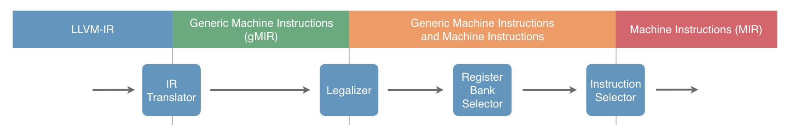
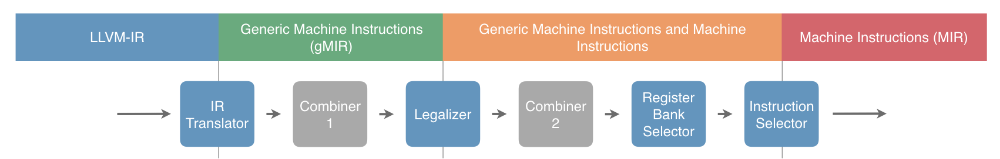
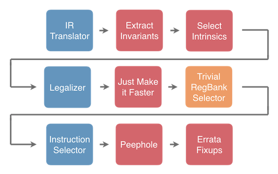
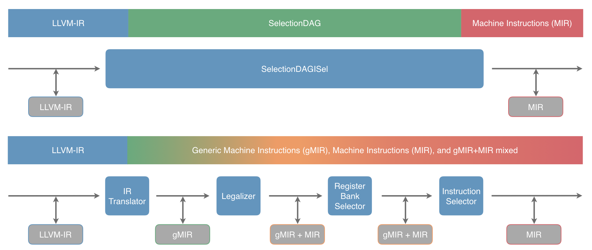
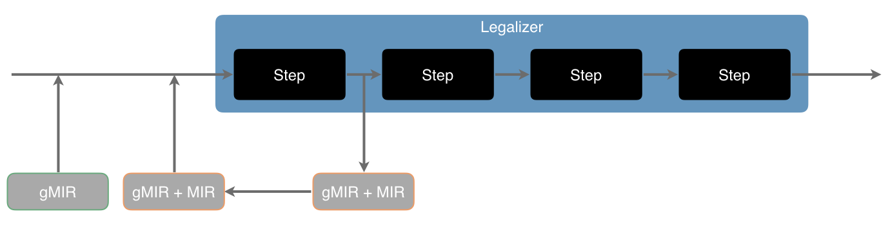
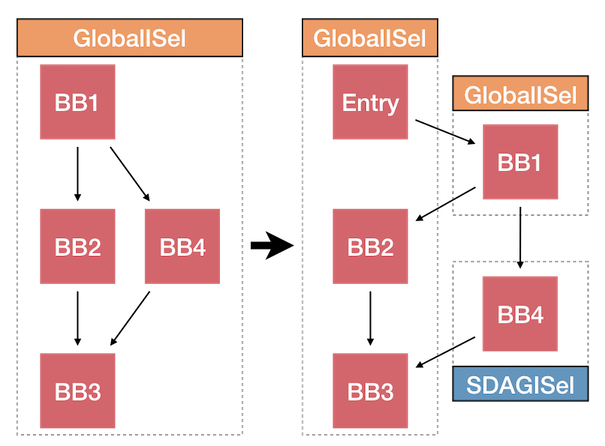

.. _pipeline:

Core Pipeline
=============

.. toctree::
  :hidden:

  IRTranslator
  Legalizer
  RegBankSelect
  InstructionSelect

The core pipeline of GlobalISel is:

The four passes shown in the diagram consist of:

:doc:`IRTranslator`

  Converts :doc:`LLVM-IR <../LangRef>` into :doc:`gMIR (Generic MIR) <GMIR>`.
  This is largely a direct translation and has little target customization.
  It's somewhat analogous to SelectionDAGBuilder but builds a flavour of MIR
  called gMIR instead of a specialized representation. gMIR uses exactly the
  same data structures as MIR but has more relaxed constraints. For example,
  a virtual register may be constrained to a particular type without also
  constraining it to a specific register class.

:doc:`Legalizer`

  Replaces unsupported operations with supported ones. In other words, it shapes
  the gMIR to suit what the backend can support. There is a very small set of
  operations which targets are required to support but aside from that targets
  can shape the MIR as they wish.

:doc:`Register Bank Selector <RegBankSelect>`

  Binds virtual registers to register banks. This pass is intended to minimize
  cross-register-bank copies by clustering portions of the MIR together.

:doc:`Instruction Select <InstructionSelect>`

  Select target instructions using the gMIR. At this point, the gMIR has been
  constrained enough that it becomes MIR.

Although we tend to talk about them as distinct passes, it should be noted that
there's a good deal of flexibility here and it's ok for things to happen
earlier than described below. For example, it's not unusual for the legalizer to
legalize an intrinsic directly to a target instruction. The concrete
requirement is that the following additional constraints are preserved after
each of these passes:

IRTranslator

  The representation must be gMIR, MIR, or a mixture of the two after this pass.
  The majority will typically be gMIR to begin with but later passes will
  gradually transition the gMIR to MIR.

Legalizer

  No illegal operations must remain or be introduced after this pass.

Register Bank Selector

  All virtual registers must have a register bank assigned after this pass.

Instruction Select

  No gMIR must remain or be introduced after this pass. In other words, we must
  have completed the conversion from gMIR to MIR.

In addition to these passes, there are also some optional passes that perform
an optimization. The current optional passes are:

Combiner

  Replaces patterns of instructions with a better alternative. Typically, this
  means improving run time performance by replacing instructions with faster
  alternatives but Combiners can also focus on code size or other metrics.

Additional passes such as these can be inserted to support higher optimization
levels or target specific needs. A likely pipeline is:

Of course, combiners can be inserted in other places too. Also passes can be
replaced entirely so long as their task is complete as shown in this (more
customized) example pipeline.

.. _maintainability-verifier:

MachineVerifier
---------------

The pass approach lets us use the ``MachineVerifier`` to enforce invariants
that are required beyond certain points of the pipeline. For example, a
function with the ``legalized`` property can have the ``MachineVerifier``
enforce that no illegal instructions occur. Similarly, a
``regBankSelected`` function may not have virtual registers without a register
bank assigned.

.. note::

  For layering reasons, ``MachineVerifier`` isn't able to be the sole verifier
  in GlobalISel. Currently some of the passes also perform verification while
  we find a way to solve this problem.

  The main issue is that GlobalISel is a separate library, so we can't
  directly reference it from CodeGen.

Testing
-------

The ability to test GlobalISel is significantly improved over SelectionDAG.
SelectionDAG is something of a black box and there's a lot going on inside it.
This makes it difficult to write a test that reliably tests a particular aspect
of its behaviour. For comparison, see the following diagram:

Each of the grey boxes indicates an opportunity to serialize the current state
and test the behaviour between two points in the pipeline. The current state
can be serialized using ``-stop-before`` or ``-stop-after`` and loaded using
``-start-before``, ``-start-after``, and ``-run-pass``.

We can also go further still, as many of GlobalISel's passes are readily unit
testable:

It's possible to create an imaginary target such as in `LegalizerHelperTest.cpp <https://github.com/llvm/llvm-project/blob/93b29d3882baf7df42e4e9bc26b977b00373ef56/llvm/unittests/CodeGen/GlobalISel/LegalizerHelperTest.cpp#L28-L57>`_
and perform a single step of the algorithm and check the result. The MIR and
FileCheck directives can be embedded using strings so you still have access to
the convenience available in llvm-lit.

Debugging
---------

One debugging technique that's proven particularly valuable is to use the
BlockExtractor to extract basic blocks into new functions. This can be used
to track down correctness bugs and can also be used to track down performance
regressions. It can also be coupled with function attributes to disable
GlobalISel for one or more of the extracted functions.

The command to do the extraction is:

.. code-block:: shell

  ./bin/llvm-extract -o - -S -b ‘foo:bb1;bb4’ <input> > extracted.ll

This particular example extracts two basic blocks from a function named ``foo``.
The new LLVM-IR can then be modified to add the ``failedISel`` attribute to the
extracted function containing bb4 to make that function use SelectionDAG.

This can prevent some optimizations as GlobalISel is generally able to work on a
single function at a time. This technique can be repeated for different
combinations of basic blocks until you have identified the critical blocks
involved in a bug.

Once the critical blocks have been identified, you can further increase the
resolution to the critical instructions by splitting the blocks like from:

.. code-block:: none

  bb1:
    ... instructions group 1 ...
    ... instructions group 2 ...

into:

.. code-block:: none

  bb1:
    ... instructions group 1 ...
    br %bb2

  bb2:
    ... instructions group 2 ...

and then repeating the process for the new blocks.

It's also possible to use this technique in a mode where the main function
is compiled with GlobalISel and the extracted basic blocks are compiled with
SelectionDAG (or the other way around) to leverage the existing quality of
another code generator to track down bugs. This technique can also be used to
improve the similarity between fast and slow code when tracking down performance
regressions and help you zero in on a particular cause of the regression.
