.. _loop-terminology:

===========================================
LLVM Loop Terminology (and Canonical Forms)
===========================================

.. contents::
   :local:

Loop Definition
===============

Loops are an important concept for a code optimizer. In LLVM, detection
of loops in a control-flow graph is done by :ref:`loopinfo`. It is based
on the following definition.

A loop is a subset of nodes from the control-flow graph (CFG; where
nodes represent basic blocks) with the following properties:

1. The induced subgraph (which is the subgraph that contains all the
   edges from the CFG within the loop) is strongly connected
   (every node is reachable from all others).

2. All edges from outside the subset into the subset point to the same
   node, called the **header**. As a consequence, the header dominates
   all nodes in the loop (i.e. every execution path to any of the loop's
   node will have to pass through the header).

3. The loop is the maximum subset with these properties. That is, no
   additional nodes from the CFG can be added such that the induced
   subgraph would still be strongly connected and the header would
   remain the same.

In computer science literature, this is often called a *natural loop*.
In LLVM, a more generalized definition is called a
:ref:`cycle <cycle-terminology>`.

Terminology
-----------

The definition of a loop comes with some additional terminology:

* An **entering block** (or **loop predecessor**) is a non-loop node
  that has an edge into the loop (necessarily the header). If there is
  only one entering block, and its only edge is to the
  header, it is also called the loop's **preheader**. The preheader
  dominates the loop without itself being part of the loop.

* A **latch** is a loop node that has an edge to the header.

* A **backedge** is an edge from a latch to the header.

* An **exiting edge** is an edge from inside the loop to a node outside
  of the loop. The source of such an edge is called an **exiting block**, its
  target is an **exit block**.

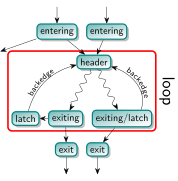

Important Notes
---------------

This loop definition has some noteworthy consequences:

* A node can be the header of at most one loop. As such, a loop can be
  identified by its header. Due to the header being the only entry into
  a loop, it can be called a Single-Entry-Multiple-Exits (SEME) region.

* For basic blocks that are not reachable from the function's entry, the
  concept of loops is undefined. This follows from the concept of
  dominance being undefined as well.

* The smallest loop consists of a single basic block that branches to
  itself. In this case that block is the header, latch (and exiting
  block if it has another edge to a different block) at the same time.
  A single block that has no branch to itself is not considered a loop,
  even though it is trivially strongly connected.

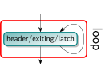

In this case, the role of header, exiting block and latch fall to the
same node. :ref:`loopinfo` reports this as:

.. code-block:: console

  $ opt input.ll -passes='print<loops>'
  Loop at depth 1 containing: %for.body<header><latch><exiting>

* Loops can be nested inside each other. That is, a loop's node set can
  be a subset of another loop with a different loop header. The loop
  hierarchy in a function forms a forest: Each top-level loop is the
  root of the tree of the loops nested inside it.

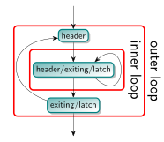

* It is not possible that two loops share only a few of their nodes.
  Two loops are either disjoint or one is nested inside the other. In
  the example below the left and right subsets both violate the
  maximality condition. Only the merge of both sets is considered a loop.

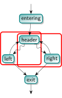

* It is also possible that two logical loops share a header, but are
  considered a single loop by LLVM:

.. code-block:: C

  for (int i = 0; i < 128; ++i)
    for (int j = 0; j < 128; ++j)
      body(i,j);

which might be represented in LLVM-IR as follows. Note that there is
only a single header and hence just a single loop.

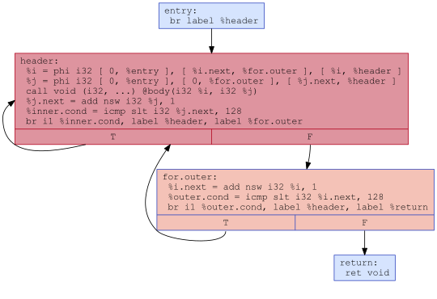

The :ref:`LoopSimplify <loop-terminology-loop-simplify>` pass will
detect the loop and ensure separate headers for the outer and inner loop.

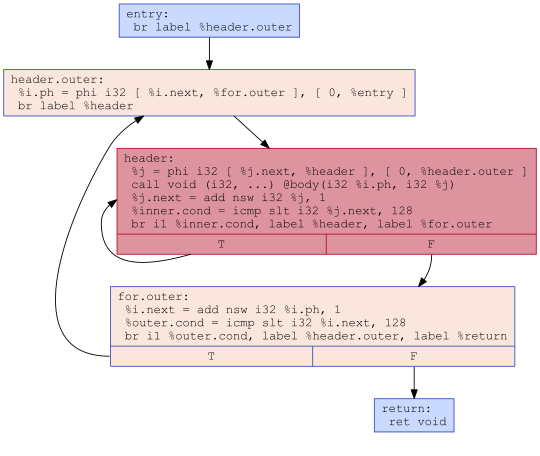

* A cycle in the CFG does not imply there is a loop. The example below
  shows such a CFG, where there is no header node that dominates all
  other nodes in the cycle. This is called **irreducible control-flow**.

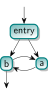

The term reducible results from the ability to collapse the CFG into a
single node by successively replacing one of three base structures with
a single node: A sequential execution of basic blocks, acyclic conditional
branches (or switches), and a basic block looping on itself.
`Wikipedia <https://en.wikipedia.org/wiki/Control-flow_graph#Reducibility>`_
has a more formal definition, which basically says that every cycle has
a dominating header.

* Irreducible control-flow can occur at any level of the loop nesting.
  That is, a loop that itself does not contain any loops can still have
  cyclic control flow in its body; a loop that is not nested inside
  another loop can still be part of an outer cycle; and there can be
  additional cycles between any two loops where one is contained in the other.
  However, an LLVM :ref:`cycle<cycle-terminology>` covers both, loops and
  irreducible control flow.

* The `FixIrreducible <https://llvm.org/doxygen/FixIrreducible_8h.html>`_
  pass can transform irreducible control flow into loops by inserting
  new loop headers. It is not included in any default optimization pass
  pipeline, but is required for some back-end targets.

* Exiting edges are not the only way to break out of a loop. Other
  possibilities are unreachable terminators, [[noreturn]] functions,
  exceptions, signals, and your computer's power button.

* A basic block "inside" the loop that does not have a path back to the
  loop (i.e. to a latch or header) is not considered part of the loop.
  This is illustrated by the following code.

.. code-block:: C

  for (unsigned i = 0; i <= n; ++i) {
    if (c1) {
      // When reaching this block, we will have exited the loop.
      do_something();
      break;
    }
    if (c2) {
      // abort(), never returns, so we have exited the loop.
      abort();
    }
    if (c3) {
      // The unreachable allows the compiler to assume that this will not rejoin the loop.
      do_something();
      __builtin_unreachable();
    }
    if (c4) {
      // This statically infinite loop is not nested because control-flow will not continue with the for-loop.
      while(true) {
        do_something();
      }
    }
  }

* There is no requirement for the control flow to eventually leave the
  loop, i.e. a loop can be infinite. A **statically infinite loop** is a
  loop that has no exiting edges. A **dynamically infinite loop** has
  exiting edges, but it is possible to be never taken. This may happen
  only under some circumstances, such as when n == UINT_MAX in the code
  below.

.. code-block:: C

  for (unsigned i = 0; i <= n; ++i)
    body(i);

It is possible for the optimizer to turn a dynamically infinite loop
into a statically infinite loop, for instance when it can prove that the
exiting condition is always false. Because the exiting edge is never
taken, the optimizer can change the conditional branch into an
unconditional one.

If a is loop is annotated with
:ref:`llvm.loop.mustprogress <langref_llvm_loop_mustprogress>` metadata,
the compiler is allowed to assume that it will eventually terminate, even
if it cannot prove it. For instance, it may remove a mustprogress-loop
that does not have any side-effect in its body even though the program
could be stuck in that loop forever. Languages such as C and
`C++ <https://eel.is/c++draft/intro.progress#1>`_ have such
forward-progress guarantees for some loops. Also see the
:ref:`mustprogress <langref_mustprogress>` and
:ref:`willreturn <langref_willreturn>` function attributes, as well as
the older :ref:`llvm.sideeffect <llvm_sideeffect>` intrinsic.

* The number of executions of the loop header before leaving the loop is
  the **loop trip count** (or **iteration count**). If the loop should
  not be executed at all, a **loop guard** must skip the entire loop:

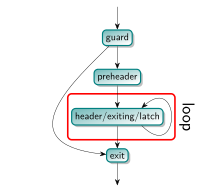

Since the first thing a loop header might do is to check whether there
is another execution and if not, immediately exit without doing any work
(also see :ref:`loop-terminology-loop-rotate`), loop trip count is not
the best measure of a loop's number of iterations. For instance, the
number of header executions of the code below for a non-positive n
(before loop rotation) is 1, even though the loop body is not executed
at all.

.. code-block:: C

  for (int i = 0; i < n; ++i)
    body(i);

A better measure is the **backedge-taken count**, which is the number of
times any of the backedges is taken before the loop. It is one less than
the trip count for executions that enter the header.

.. _loopinfo:

LoopInfo
========

LoopInfo is the core analysis for obtaining information about loops.
There are few key implications of the definitions given above which
are important for working successfully with this interface.

* LoopInfo does not contain information about non-loop cycles.  As a
  result, it is not suitable for any algorithm which requires complete
  cycle detection for correctness.

* LoopInfo provides an interface for enumerating all top level loops
  (e.g. those not contained in any other loop).  From there, you may
  walk the tree of sub-loops rooted in that top level loop.

* Loops which become statically unreachable during optimization *must*
  be removed from LoopInfo. If this can not be done for some reason,
  then the optimization is *required* to preserve the static
  reachability of the loop.

.. _loop-terminology-loop-simplify:

Loop Simplify Form
==================

The Loop Simplify Form is a canonical form that makes
several analyses and transformations simpler and more effective.
It is ensured by the LoopSimplify
(:ref:`-loop-simplify <passes-loop-simplify>`) pass and is automatically
added by the pass managers when scheduling a LoopPass.
This pass is implemented in
`LoopSimplify.h <https://llvm.org/doxygen/LoopSimplify_8h_source.html>`_.
When it is successful, the loop has:

* A preheader.
* A single backedge (which implies that there is a single latch).
* Dedicated exits. That is, no exit block for the loop
  has a predecessor that is outside the loop. This implies
  that all exit blocks are dominated by the loop header.

.. _loop-terminology-lcssa:

Loop Closed SSA (LCSSA)
=======================

A program is in Loop Closed SSA Form if it is in SSA form
and all values that are defined in a loop are used only inside
this loop.

Programs written in LLVM IR are always in SSA form but not necessarily
in LCSSA. To achieve the latter, for each value that is live across the
loop boundary, single entry PHI nodes are inserted to each of the exit blocks
[#lcssa-construction]_ in order to "close" these values inside the loop.
In particular, consider the following loop:

.. code-block:: C

    c = ...;
    for (...) {
      if (c)
        X1 = ...
      else
        X2 = ...
      X3 = phi(X1, X2);  // X3 defined
    }

    ... = X3 + 4;  // X3 used, i.e. live
                   // outside the loop

In the inner loop, the X3 is defined inside the loop, but used
outside of it. In Loop Closed SSA form, this would be represented as follows:

.. code-block:: C

    c = ...;
    for (...) {
      if (c)
        X1 = ...
      else
        X2 = ...
      X3 = phi(X1, X2);
    }
    X4 = phi(X3);

    ... = X4 + 4;

This is still valid LLVM; the extra phi nodes are purely redundant,
but all LoopPass'es are required to preserve them.
This form is ensured by the LCSSA (:ref:`-lcssa <passes-lcssa>`)
pass and is added automatically by the LoopPassManager when
scheduling a LoopPass.
After the loop optimizations are done, these extra phi nodes
will be deleted by :ref:`-instcombine <passes-instcombine>`.

Note that an exit block is outside of a loop, so how can such a phi "close"
the value inside the loop since it uses it outside of it ? First of all,
for phi nodes, as
`mentioned in the LangRef <https://llvm.org/docs/LangRef.html#id311>`_:
"the use of each incoming value is deemed to occur on the edge from the
corresponding predecessor block to the current block". Now, an
edge to an exit block is considered outside of the loop because
if we take that edge, it leads us clearly out of the loop.

However, an edge doesn't actually contain any IR, so in source code,
we have to choose a convention of whether the use happens in
the current block or in the respective predecessor. For LCSSA's purpose,
we consider the use happens in the latter (so as to consider the
use inside) [#point-of-use-phis]_.

The major benefit of LCSSA is that it makes many other loop optimizations
simpler.

First of all, a simple observation is that if one needs to see all
the outside users, they can just iterate over all the (loop closing)
PHI nodes in the exit blocks (the alternative would be to
scan the def-use chain [#def-use-chain]_ of all instructions in the loop).

Then, consider for example
:ref:`simple-loop-unswitch <passes-simple-loop-unswitch>` ing the loop above.
Because it is in LCSSA form, we know that any value defined inside of
the loop will be used either only inside the loop or in a loop closing
PHI node. In this case, the only loop closing PHI node is X4.
This means that we can just copy the loop and change the X4
accordingly, like so:

.. code-block:: C

    c = ...;
    if (c) {
      for (...) {
        if (true)
          X1 = ...
        else
          X2 = ...
        X3 = phi(X1, X2);
      }
    } else {
      for (...) {
        if (false)
          X1' = ...
        else
          X2' = ...
        X3' = phi(X1', X2');
      }
    }
    X4 = phi(X3, X3')

Now, all uses of X4 will get the updated value (in general,
if a loop is in LCSSA form, in any loop transformation,
we only need to update the loop closing PHI nodes for the changes
to take effect).  If we did not have Loop Closed SSA form, it means that X3 could
possibly be used outside the loop. So, we would have to introduce the
X4 (which is the new X3) and replace all uses of X3 with that.
However, we should note that because LLVM keeps a def-use chain
[#def-use-chain]_ for each Value, we wouldn't need
to perform data-flow analysis to find and replace all the uses
(there is even a utility function, replaceAllUsesWith(),
that performs this transformation by iterating the def-use chain).

Another important advantage is that the behavior of all uses
of an induction variable is the same.  Without this, you need to
distinguish the case when the variable is used outside of
the loop it is defined in, for example:

.. code-block:: C

  for (i = 0; i < 100; i++) {
    for (j = 0; j < 100; j++) {
      k = i + j;
      use(k);    // use 1
    }
    use(k);      // use 2
  }

Looking from the outer loop with the normal SSA form, the first use of k
is not well-behaved, while the second one is an induction variable with
base 100 and step 1.  Although, in practice, and in the LLVM context,
such cases can be handled effectively by SCEV. Scalar Evolution
(:ref:`scalar-evolution <passes-scalar-evolution>`) or SCEV, is a
(analysis) pass that analyzes and categorizes the evolution of scalar
expressions in loops.

In general, it's easier to use SCEV in loops that are in LCSSA form.
The evolution of a scalar (loop-variant) expression that
SCEV can analyze is, by definition, relative to a loop.
An expression is represented in LLVM by an
`llvm::Instruction <https://llvm.org/doxygen/classllvm_1_1Instruction.html>`_.
If the expression is inside two (or more) loops (which can only
happen if the loops are nested, like in the example above) and you want
to get an analysis of its evolution (from SCEV),
you have to also specify relative to what Loop you want it.
Specifically, you have to use
`getSCEVAtScope() <https://llvm.org/doxygen/classllvm_1_1ScalarEvolution.html#a21d6ee82eed29080d911dbb548a8bb68>`_.

However, if all loops are in LCSSA form, each expression is actually
represented by two different llvm::Instructions.  One inside the loop
and one outside, which is the loop-closing PHI node and represents
the value of the expression after the last iteration (effectively,
we break each loop-variant expression into two expressions and so, every
expression is at most in one loop).  You can now just use
`getSCEV() <https://llvm.org/doxygen/classllvm_1_1ScalarEvolution.html#a30bd18ac905eacf3601bc6a553a9ff49>`_.
and which of these two llvm::Instructions you pass to it disambiguates
the context / scope / relative loop.

.. rubric:: Footnotes

.. [#lcssa-construction] To insert these loop-closing PHI nodes, one has to
  (re-)compute dominance frontiers (if the loop has multiple exits).

.. [#point-of-use-phis] Considering the point of use of a PHI entry value
  to be in the respective predecessor is a convention across the whole LLVM.
  The reason is mostly practical; for example it preserves the dominance
  property of SSA. It is also just an overapproximation of the actual
  number of uses; the incoming block could branch to another block in which
  case the value is not actually used but there are no side-effects (it might
  increase its live range which is not relevant in LCSSA though).
  Furthermore, we can gain some intuition if we consider liveness:
  A PHI is *usually* inserted in the current block because the value can't
  be used from this point and onwards (i.e. the current block is a dominance
  frontier). It doesn't make sense to consider that the value is used in
  the current block (because of the PHI) since the value stops being live
  before the PHI. In some sense the PHI definition just "replaces" the original
  value definition and doesn't actually use it. It should be stressed that
  this analogy is only used as an example and does not pose any strict
  requirements. For example, the value might dominate the current block
  but we can still insert a PHI (as we do with LCSSA PHI nodes) *and*
  use the original value afterwards (in which case the two live ranges overlap,
  although in LCSSA (the whole point is that) we never do that).

.. [#def-use-chain] A property of SSA is that there exists a def-use chain
  for each definition, which is a list of all the uses of this definition.
  LLVM implements this property by keeping a list of all the uses of a Value
  in an internal data structure.

"More Canonical" Loops
======================

.. _loop-terminology-loop-rotate:

Rotated Loops
-------------

Loops are rotated by the LoopRotate (:ref:`loop-rotate <passes-loop-rotate>`)
pass, which converts loops into do/while style loops and is
implemented in
`LoopRotation.h <https://llvm.org/doxygen/LoopRotation_8h_source.html>`_.  Example:

.. code-block:: C

  void test(int n) {
    for (int i = 0; i < n; i += 1)
      // Loop body
  }

is transformed to:

.. code-block:: C

  void test(int n) {
    int i = 0;
    do {
      // Loop body
      i += 1;
    } while (i < n);
  }

**Warning**: This transformation is valid only if the compiler
can prove that the loop body will be executed at least once. Otherwise,
it has to insert a guard which will test it at runtime. In the example
above, that would be:

.. code-block:: C

  void test(int n) {
    int i = 0;
    if (n > 0) {
      do {
        // Loop body
        i += 1;
      } while (i < n);
    }
  }

It's important to understand the effect of loop rotation
at the LLVM IR level. We follow with the previous examples
in LLVM IR while also providing a graphical representation
of the control-flow graphs (CFG). You can get the same graphical
results by utilizing the :ref:`view-cfg <passes-view-cfg>` pass.

The initial **for** loop could be translated to:

.. code-block:: none

  define void @test(i32 %n) {
  entry:
    br label %for.header

  for.header:
    %i = phi i32 [ 0, %entry ], [ %i.next, %latch ]
    %cond = icmp slt i32 %i, %n
    br i1 %cond, label %body, label %exit

  body:
    ; Loop body
    br label %latch

  latch:
    %i.next = add nsw i32 %i, 1
    br label %for.header

  exit:
    ret void
  }

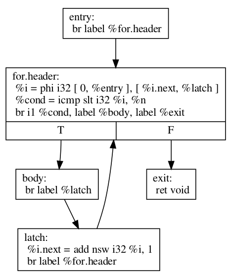

Before we explain how LoopRotate will actually
transform this loop, here's how we could convert
it (by hand) to a do-while style loop.

.. code-block:: none

  define void @test(i32 %n) {
  entry:
    br label %body

  body:
    %i = phi i32 [ 0, %entry ], [ %i.next, %latch ]
    ; Loop body
    br label %latch

  latch:
    %i.next = add nsw i32 %i, 1
    %cond = icmp slt i32 %i.next, %n
    br i1 %cond, label %body, label %exit

  exit:
    ret void
  }

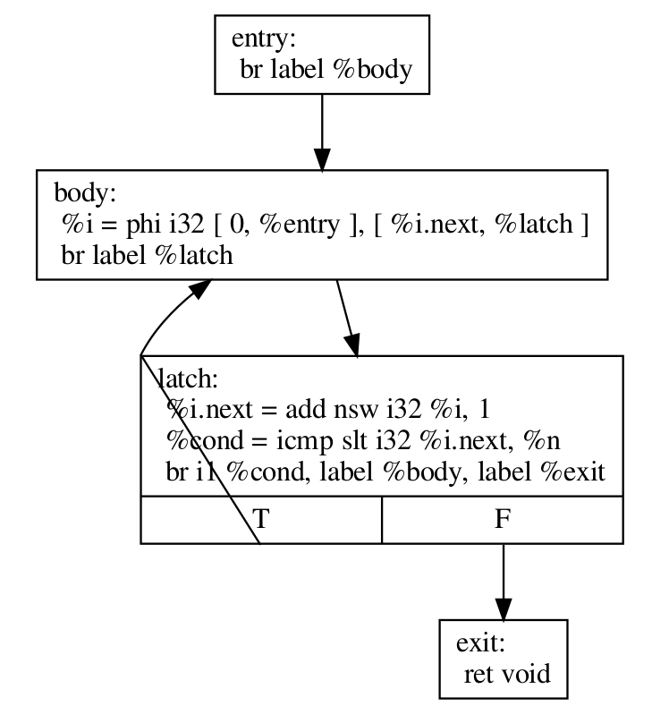

Note two things:

* The condition check was moved to the "bottom" of the loop, i.e.
  the latch. This is something that LoopRotate does by copying the header
  of the loop to the latch.
* The compiler in this case can't deduce that the loop will
  definitely execute at least once so the above transformation
  is not valid. As mentioned above, a guard has to be inserted,
  which is something that LoopRotate will do.

This is how LoopRotate transforms this loop:

.. code-block:: none

  define void @test(i32 %n) {
  entry:
    %guard_cond = icmp slt i32 0, %n
    br i1 %guard_cond, label %loop.preheader, label %exit

  loop.preheader:
    br label %body

  body:
    %i2 = phi i32 [ 0, %loop.preheader ], [ %i.next, %latch ]
    br label %latch

  latch:
    %i.next = add nsw i32 %i2, 1
    %cond = icmp slt i32 %i.next, %n
    br i1 %cond, label %body, label %loop.exit

  loop.exit:
    br label %exit

  exit:
    ret void
  }

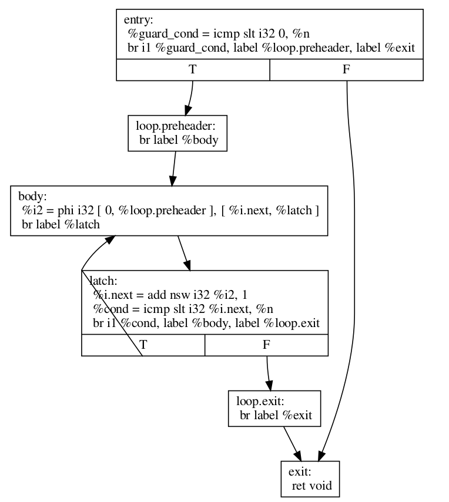

The result is a little bit more complicated than we may expect
because LoopRotate ensures that the loop is in
:ref:`Loop Simplify Form <loop-terminology-loop-simplify>`
after rotation.
In this case, it inserted the %loop.preheader basic block so
that the loop has a preheader and it introduced the %loop.exit
basic block so that the loop has dedicated exits
(otherwise, %exit would be jumped from both %latch and %entry,
but %entry is not contained in the loop).
Note that a loop has to be in Loop Simplify Form beforehand
too for LoopRotate to be applied successfully.

The main advantage of this form is that it allows hoisting
invariant instructions, especially loads, into the preheader.
That could be done in non-rotated loops as well but with
some disadvantages.  Let's illustrate them with an example:

.. code-block:: C

  for (int i = 0; i < n; ++i) {
    auto v = *p;
    use(v);
  }

We assume that loading from p is invariant and use(v) is some
statement that uses v.
If we wanted to execute the load only once we could move it
"out" of the loop body, resulting in this:

.. code-block:: C

  auto v = *p;
  for (int i = 0; i < n; ++i) {
    use(v);
  }

However, now, in the case that n <= 0, in the initial form,
the loop body would never execute, and so, the load would
never execute.  This is a problem mainly for semantic reasons.
Consider the case in which n <= 0 and loading from p is invalid.
In the initial program there would be no error.  However, with this
transformation we would introduce one, effectively breaking
the initial semantics.

To avoid both of these problems, we can insert a guard:

.. code-block:: C

  if (n > 0) {  // loop guard
    auto v = *p;
    for (int i = 0; i < n; ++i) {
      use(v);
    }
  }

This is certainly better but it could be improved slightly. Notice
that the check for whether n is bigger than 0 is executed twice (and
n does not change in between).  Once when we check the guard condition
and once in the first execution of the loop.  To avoid that, we could
do an unconditional first execution and insert the loop condition
in the end. This effectively means transforming the loop into a do-while loop:

.. code-block:: C

  if (0 < n) {
    auto v = *p;
    do {
      use(v);
      ++i;
    } while (i < n);
  }

Note that LoopRotate does not generally do such
hoisting.  Rather, it is an enabling transformation for other
passes like Loop-Invariant Code Motion (:ref:`-licm <passes-licm>`).
