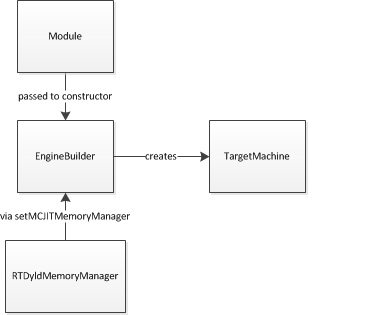
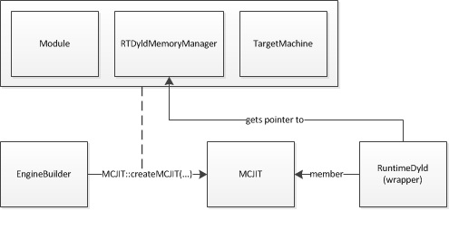
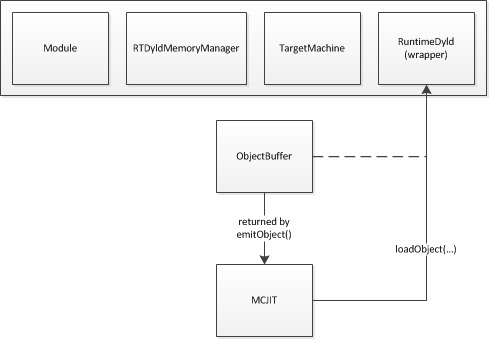
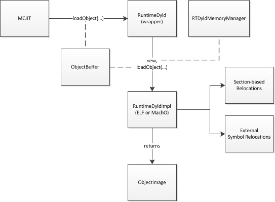
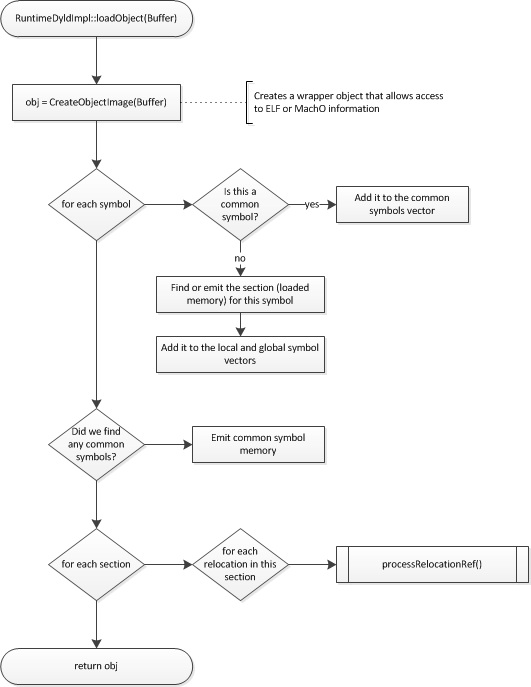
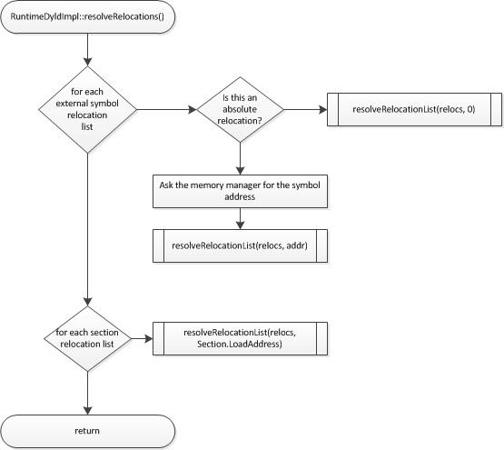

===============================
MCJIT Design and Implementation
===============================

Introduction
============

This document describes the internal workings of the MCJIT execution
engine and the RuntimeDyld component.  It is intended as a high level
overview of the implementation, showing the flow and interactions of
objects throughout the code generation and dynamic loading process.

Engine Creation
===============

In most cases, an EngineBuilder object is used to create an instance of
the MCJIT execution engine.  The EngineBuilder takes an llvm::Module
object as an argument to its constructor.  The client may then set various
options that we control the later be passed along to the MCJIT engine,
including the selection of MCJIT as the engine type to be created.
Of particular interest is the EngineBuilder::setMCJITMemoryManager
function.  If the client does not explicitly create a memory manager at
this time, a default memory manager (specifically SectionMemoryManager)
will be created when the MCJIT engine is instantiated.

Once the options have been set, a client calls EngineBuilder::create to
create an instance of the MCJIT engine.  If the client does not use the
form of this function that takes a TargetMachine as a parameter, a new
TargetMachine will be created based on the target triple associated with
the Module that was used to create the EngineBuilder.

EngineBuilder::create will call the static MCJIT::createJIT function,
passing in its pointers to the module, memory manager and target machine
objects, all of which will subsequently be owned by the MCJIT object.

The MCJIT class has a member variable, Dyld, which contains an instance of
the RuntimeDyld wrapper class.  This member will be used for
communications between MCJIT and the actual RuntimeDyldImpl object that
gets created when an object is loaded.

Upon creation, MCJIT holds a pointer to the Module object that it received
from EngineBuilder but it does not immediately generate code for this
module.  Code generation is deferred until either the
MCJIT::finalizeObject method is called explicitly or a function such as
MCJIT::getPointerToFunction is called which requires the code to have been
generated.

Code Generation
===============

When code generation is triggered, as described above, MCJIT will first
attempt to retrieve an object image from its ObjectCache member, if one
has been set.  If a cached object image cannot be retrieved, MCJIT will
call its emitObject method.  MCJIT::emitObject uses a local PassManager
instance and creates a new ObjectBufferStream instance, both of which it
passes to TargetMachine::addPassesToEmitMC before calling PassManager::run
on the Module with which it was created.

The PassManager::run call causes the MC code generation mechanisms to emit
a complete relocatable binary object image (either in either ELF or MachO
format, depending on the target) into the ObjectBufferStream object, which
is flushed to complete the process.  If an ObjectCache is being used, the
image will be passed to the ObjectCache here.

At this point, the ObjectBufferStream contains the raw object image.
Before the code can be executed, the code and data sections from this
image must be loaded into suitable memory, relocations must be applied and
memory permission and code cache invalidation (if required) must be completed.

Object Loading
==============

Once an object image has been obtained, either through code generation or
having been retrieved from an ObjectCache, it is passed to RuntimeDyld to
be loaded.  The RuntimeDyld wrapper class examines the object to determine
its file format and creates an instance of either RuntimeDyldELF or
RuntimeDyldMachO (both of which derive from the RuntimeDyldImpl base
class) and calls the RuntimeDyldImpl::loadObject method to perform that
actual loading.

RuntimeDyldImpl::loadObject begins by creating an ObjectImage instance
from the ObjectBuffer it received.  ObjectImage, which wraps the
ObjectFile class, is a helper class which parses the binary object image
and provides access to the information contained in the format-specific
headers, including section, symbol and relocation information.

RuntimeDyldImpl::loadObject then iterates through the symbols in the
image.  Information about common symbols is collected for later use.  For
each function or data symbol, the associated section is loaded into memory
and the symbol is stored in a symbol table map data structure.  When the
iteration is complete, a section is emitted for the common symbols.

Next, RuntimeDyldImpl::loadObject iterates through the sections in the
object image and for each section iterates through the relocations for
that sections.  For each relocation, it calls the format-specific
processRelocationRef method, which will examine the relocation and store
it in one of two data structures, a section-based relocation list map and
an external symbol relocation map.

When RuntimeDyldImpl::loadObject returns, all of the code and data
sections for the object will have been loaded into memory allocated by the
memory manager and relocation information will have been prepared, but the
relocations have not yet been applied and the generated code is still not
ready to be executed.

[Currently (as of August 2013) the MCJIT engine will immediately apply
relocations when loadObject completes.  However, this shouldn't be
happening.  Because the code may have been generated for a remote target,
the client should be given a chance to re-map the section addresses before
relocations are applied.  It is possible to apply relocations multiple
times, but in the case where addresses are to be re-mapped, this first
application is wasted effort.]

Address Remapping
=================

At any time after initial code has been generated and before
finalizeObject is called, the client can remap the address of sections in
the object.  Typically this is done because the code was generated for an
external process and is being mapped into that process' address space.
The client remaps the section address by calling MCJIT::mapSectionAddress.
This should happen before the section memory is copied to its new
location.

When MCJIT::mapSectionAddress is called, MCJIT passes the call on to
RuntimeDyldImpl (via its Dyld member).  RuntimeDyldImpl stores the new
address in an internal data structure but does not update the code at this
time, since other sections are likely to change.

When the client is finished remapping section addresses, it will call
MCJIT::finalizeObject to complete the remapping process.

Final Preparations
==================

When MCJIT::finalizeObject is called, MCJIT calls
RuntimeDyld::resolveRelocations.  This function will attempt to locate any
external symbols and then apply all relocations for the object.

External symbols are resolved by calling the memory manager's
getPointerToNamedFunction method.  The memory manager will return the
address of the requested symbol in the target address space.  (Note, this
may not be a valid pointer in the host process.)  RuntimeDyld will then
iterate through the list of relocations it has stored which are associated
with this symbol and invoke the resolveRelocation method which, through an
format-specific implementation, will apply the relocation to the loaded
section memory.

Next, RuntimeDyld::resolveRelocations iterates through the list of
sections and for each section iterates through a list of relocations that
have been saved which reference that symbol and call resolveRelocation for
each entry in this list.  The relocation list here is a list of
relocations for which the symbol associated with the relocation is located
in the section associated with the list.  Each of these locations will
have a target location at which the relocation will be applied that is
likely located in a different section.

Once relocations have been applied as described above, MCJIT calls
RuntimeDyld::getEHFrameSection, and if a non-zero result is returned
passes the section data to the memory manager's registerEHFrames method.
This allows the memory manager to call any desired target-specific
functions, such as registering the EH frame information with a debugger.

Finally, MCJIT calls the memory manager's finalizeMemory method.  In this
method, the memory manager will invalidate the target code cache, if
necessary, and apply final permissions to the memory pages it has
allocated for code and data memory.
