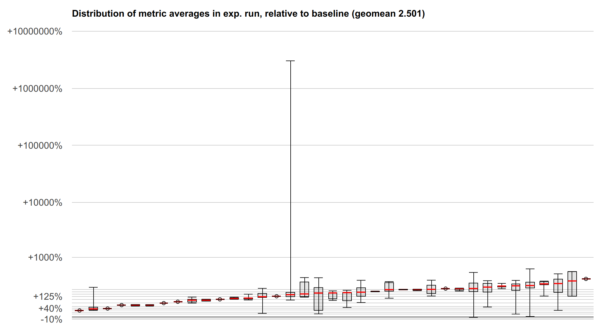

# Speculative Load Hardening

## A Spectre Variant #1 Mitigation Technique

Author: Chandler Carruth - [chandlerc@google.com](mailto:chandlerc@google.com)

## Problem Statement

Recently, Google Project Zero and other researchers have found information leak
vulnerabilities by exploiting speculative execution in modern CPUs. These
exploits are currently broken down into three variants:
* GPZ Variant #1 (a.k.a. Spectre Variant #1): Bounds check (or predicate) bypass
* GPZ Variant #2 (a.k.a. Spectre Variant #2): Branch target injection
* GPZ Variant #3 (a.k.a. Meltdown): Rogue data cache load

For more details, see the Google Project Zero blog post and the Spectre research
paper:
* https://googleprojectzero.blogspot.com/2018/01/reading-privileged-memory-with-side.html
* https://spectreattack.com/spectre.pdf

The core problem of GPZ Variant #1 is that speculative execution uses branch
prediction to select the path of instructions speculatively executed. This path
is speculatively executed with the available data, and may load from memory and
leak the loaded values through various side channels that survive even when the
speculative execution is unwound due to being incorrect. Mispredicted paths can
cause code to be executed with data inputs that never occur in correct
executions, making checks against malicious inputs ineffective and allowing
attackers to use malicious data inputs to leak secret data. Here is an example,
extracted and simplified from the Project Zero paper:
```
struct array {
  unsigned long length;
  unsigned char data[];
};
struct array *arr1 = ...; // small array
struct array *arr2 = ...; // array of size 0x400
unsigned long untrusted_offset_from_caller = ...;
if (untrusted_offset_from_caller < arr1->length) {
  unsigned char value = arr1->data[untrusted_offset_from_caller];
  unsigned long index2 = ((value&1)*0x100)+0x200;
  unsigned char value2 = arr2->data[index2];
}
```

The key of the attack is to call this with `untrusted_offset_from_caller` that
is far outside of the bounds when the branch predictor will predict that it
will be in-bounds. In that case, the body of the `if` will be executed
speculatively, and may read secret data into `value` and leak it via a
cache-timing side channel when a dependent access is made to populate `value2`.

## High Level Mitigation Approach

While several approaches are being actively pursued to mitigate specific
branches and/or loads inside especially risky software (most notably various OS
kernels), these approaches require manual and/or static analysis aided auditing
of code and explicit source changes to apply the mitigation. They are unlikely
to scale well to large applications. We are proposing a comprehensive
mitigation approach that would apply automatically across an entire program
rather than through manual changes to the code. While this is likely to have a
high performance cost, some applications may be in a good position to take this
performance / security tradeoff.

The specific technique we propose is to cause loads to be checked using
branchless code to ensure that they are executing along a valid control flow
path. Consider the following C-pseudo-code representing the core idea of a
predicate guarding potentially invalid loads:
```
void leak(int data);
void example(int* pointer1, int* pointer2) {
  if (condition) {
    // ... lots of code ...
    leak(*pointer1);
  } else {
    // ... more code ...
    leak(*pointer2);
  }
}
```

This would get transformed into something resembling the following:
```
uintptr_t all_ones_mask = std::numerical_limits<uintptr_t>::max();
uintptr_t all_zeros_mask = 0;
void leak(int data);
void example(int* pointer1, int* pointer2) {
  uintptr_t predicate_state = all_ones_mask;
  if (condition) {
    // Assuming ?: is implemented using branchless logic...
    predicate_state = !condition ? all_zeros_mask : predicate_state;
    // ... lots of code ...
    //
    // Harden the pointer so it can't be loaded
    pointer1 &= predicate_state;
    leak(*pointer1);
  } else {
    predicate_state = condition ? all_zeros_mask : predicate_state;
    // ... more code ...
    //
    // Alternative: Harden the loaded value
    int value2 = *pointer2 & predicate_state;
    leak(value2);
  }
}
```

The result should be that if the `if (condition) {` branch is mis-predicted,
there is a *data* dependency on the condition used to zero out any pointers
prior to loading through them or to zero out all of the loaded bits. Even
though this code pattern may still execute speculatively, *invalid* speculative
executions are prevented from leaking secret data from memory (but note that
this data might still be loaded in safe ways, and some regions of memory are
required to not hold secrets, see below for detailed limitations). This
approach only requires the underlying hardware have a way to implement a
branchless and unpredicted conditional update of a register's value. All modern
architectures have support for this, and in fact such support is necessary to
correctly implement constant time cryptographic primitives.

Crucial properties of this approach:
* It is not preventing any particular side-channel from working. This is
  important as there are an unknown number of potential side channels and we
  expect to continue discovering more. Instead, it prevents the observation of
  secret data in the first place.
* It accumulates the predicate state, protecting even in the face of nested
  *correctly* predicted control flows.
* It passes this predicate state across function boundaries to provide
  [interprocedural protection](#interprocedural-checking).
* When hardening the address of a load, it uses a *destructive* or
  *non-reversible* modification of the address to prevent an attacker from
  reversing the check using attacker-controlled inputs.
* It does not completely block speculative execution, and merely prevents
  *mis*-speculated paths from leaking secrets from memory (and stalls
  speculation until this can be determined).
* It is completely general and makes no fundamental assumptions about the
  underlying architecture other than the ability to do branchless conditional
  data updates and a lack of value prediction.
* It does not require programmers to identify all possible secret data using
  static source code annotations or code vulnerable to a variant #1 style
  attack.

Limitations of this approach:
* It requires re-compiling source code to insert hardening instruction
  sequences. Only software compiled in this mode is protected.
* The performance is heavily dependent on a particular architecture's
  implementation strategy. We outline a potential x86 implementation below and
  characterize its performance.
* It does not defend against secret data already loaded from memory and
  residing in registers or leaked through other side-channels in
  non-speculative execution. Code dealing with this, e.g cryptographic
  routines, already uses constant-time algorithms and code to prevent
  side-channels. Such code should also scrub registers of secret data following
  [these
  guidelines](https://github.com/HACS-workshop/spectre-mitigations/blob/master/crypto_guidelines.md).
* To achieve reasonable performance, many loads may not be checked, such as
  those with compile-time fixed addresses. This primarily consists of accesses
  at compile-time constant offsets of global and local variables. Code which
  needs this protection and intentionally stores secret data must ensure the
  memory regions used for secret data are necessarily dynamic mappings or heap
  allocations. This is an area which can be tuned to provide more comprehensive
  protection at the cost of performance.
* [Hardened loads](#hardening-the-address-of-the-load) may still load data from
  _valid_ addresses if not _attacker-controlled_ addresses. To prevent these
  from reading secret data, the low 2gb of the address space and 2gb above and
  below any executable pages should be protected.

Credit:
* The core idea of tracing misspeculation through data and marking pointers to
  block misspeculated loads was developed as part of a HACS 2018 discussion
  between Chandler Carruth, Paul Kocher, Thomas Pornin, and several other
  individuals.
* Core idea of masking out loaded bits was part of the original mitigation
  suggested by Jann Horn when these attacks were reported.


### Indirect Branches, Calls, and Returns

It is possible to attack control flow other than conditional branches with
variant #1 style mispredictions.
* A prediction towards a hot call target of a virtual method can lead to it
  being speculatively executed when an expected type is used (often called
  "type confusion").
* A hot case may be speculatively executed due to prediction instead of the
  correct case for a switch statement implemented as a jump table.
* A hot common return address may be predicted incorrectly when returning from
  a function.

These code patterns are also vulnerable to Spectre variant #2, and as such are
best mitigated with a
[retpoline](https://support.google.com/faqs/answer/7625886) on x86 platforms.
When a mitigation technique like retpoline is used, speculation simply cannot
proceed through an indirect control flow edge (or it cannot be mispredicted in
the case of a filled RSB) and so it is also protected from variant #1 style
attacks. However, some architectures, micro-architectures, or vendors do not
employ the retpoline mitigation, and on future x86 hardware (both Intel and
AMD) it is expected to become unnecessary due to hardware-based mitigation.

When not using a retpoline, these edges will need independent protection from
variant #1 style attacks. The analogous approach to that used for conditional
control flow should work:
```
uintptr_t all_ones_mask = std::numerical_limits<uintptr_t>::max();
uintptr_t all_zeros_mask = 0;
void leak(int data);
void example(int* pointer1, int* pointer2) {
  uintptr_t predicate_state = all_ones_mask;
  switch (condition) {
  case 0:
    // Assuming ?: is implemented using branchless logic...
    predicate_state = (condition != 0) ? all_zeros_mask : predicate_state;
    // ... lots of code ...
    //
    // Harden the pointer so it can't be loaded
    pointer1 &= predicate_state;
    leak(*pointer1);
    break;

  case 1:
    predicate_state = (condition != 1) ? all_zeros_mask : predicate_state;
    // ... more code ...
    //
    // Alternative: Harden the loaded value
    int value2 = *pointer2 & predicate_state;
    leak(value2);
    break;

    // ...
  }
}
```

The core idea remains the same: validate the control flow using data-flow and
use that validation to check that loads cannot leak information along
misspeculated paths. Typically this involves passing the desired target of such
control flow across the edge and checking that it is correct afterwards. Note
that while it is tempting to think that this mitigates variant #2 attacks, it
does not. Those attacks go to arbitrary gadgets that don't include the checks.


### Variant #1.1 and #1.2 attacks: "Bounds Check Bypass Store"

Beyond the core variant #1 attack, there are techniques to extend this attack.
The primary technique is known as "Bounds Check Bypass Store" and is discussed
in this research paper: https://people.csail.mit.edu/vlk/spectre11.pdf

We will analyze these two variants independently. First, variant #1.1 works by
speculatively storing over the return address after a bounds check bypass. This
speculative store then ends up being used by the CPU during speculative
execution of the return, potentially directing speculative execution to
arbitrary gadgets in the binary. Let's look at an example.
```
unsigned char local_buffer[4];
unsigned char *untrusted_data_from_caller = ...;
unsigned long untrusted_size_from_caller = ...;
if (untrusted_size_from_caller < sizeof(local_buffer)) {
  // Speculative execution enters here with a too-large size.
  memcpy(local_buffer, untrusted_data_from_caller,
         untrusted_size_from_caller);
  // The stack has now been smashed, writing an attacker-controlled
  // address over the return address.
  minor_processing(local_buffer);
  return;
  // Control will speculate to the attacker-written address.
}
```

However, this can be mitigated by hardening the load of the return address just
like any other load. This is sometimes complicated because x86 for example
*implicitly* loads the return address off the stack. However, the
implementation technique below is specifically designed to mitigate this
implicit load by using the stack pointer to communicate misspeculation between
functions. This additionally causes a misspeculation to have an invalid stack
pointer and never be able to read the speculatively stored return address. See
the detailed discussion below.

For variant #1.2, the attacker speculatively stores into the vtable or jump
table used to implement an indirect call or indirect jump. Because this is
speculative, this will often be possible even when these are stored in
read-only pages. For example:
```
class FancyObject : public BaseObject {
public:
  void DoSomething() override;
};
void f(unsigned long attacker_offset, unsigned long attacker_data) {
  FancyObject object = getMyObject();
  unsigned long *arr[4] = getFourDataPointers();
  if (attacker_offset < 4) {
    // We have bypassed the bounds check speculatively.
    unsigned long *data = arr[attacker_offset];
    // Now we have computed a pointer inside of `object`, the vptr.
    *data = attacker_data;
    // The vptr points to the virtual table and we speculatively clobber that.
    g(object); // Hand the object to some other routine.
  }
}
// In another file, we call a method on the object.
void g(BaseObject &object) {
  object.DoSomething();
  // This speculatively calls the address stored over the vtable.
}
```

Mitigating this requires hardening loads from these locations, or mitigating
the indirect call or indirect jump. Any of these are sufficient to block the
call or jump from using a speculatively stored value that has been read back.

For both of these, using retpolines would be equally sufficient. One possible
hybrid approach is to use retpolines for indirect call and jump, while relying
on SLH to mitigate returns.

Another approach that is sufficient for both of these is to harden all of the
speculative stores. However, as most stores aren't interesting and don't
inherently leak data, this is expected to be prohibitively expensive given the
attack it is defending against.


## Implementation Details

There are a number of complex details impacting the implementation of this
technique, both on a particular architecture and within a particular compiler.
We discuss proposed implementation techniques for the x86 architecture and the
LLVM compiler. These are primarily to serve as an example, as other
implementation techniques are very possible.


### x86 Implementation Details

On the x86 platform we break down the implementation into three core
components: accumulating the predicate state through the control flow graph,
checking the loads, and checking control transfers between procedures.


#### Accumulating Predicate State

Consider baseline x86 instructions like the following, which test three
conditions and if all pass, loads data from memory and potentially leaks it
through some side channel:
```
# %bb.0:                                # %entry
        pushq   %rax
        testl   %edi, %edi
        jne     .LBB0_4
# %bb.1:                                # %then1
        testl   %esi, %esi
        jne     .LBB0_4
# %bb.2:                                # %then2
        testl   %edx, %edx
        je      .LBB0_3
.LBB0_4:                                # %exit
        popq    %rax
        retq
.LBB0_3:                                # %danger
        movl    (%rcx), %edi
        callq   leak
        popq    %rax
        retq
```

When we go to speculatively execute the load, we want to know whether any of
the dynamically executed predicates have been misspeculated. To track that,
along each conditional edge, we need to track the data which would allow that
edge to be taken. On x86, this data is stored in the flags register used by the
conditional jump instruction. Along both edges after this fork in control flow,
the flags register remains alive and contains data that we can use to build up
our accumulated predicate state. We accumulate it using the x86 conditional
move instruction which also reads the flag registers where the state resides.
These conditional move instructions are known to not be predicted on any x86
processors, making them immune to misprediction that could reintroduce the
vulnerability. When we insert the conditional moves, the code ends up looking
like the following:
```
# %bb.0:                                # %entry
        pushq   %rax
        xorl    %eax, %eax              # Zero out initial predicate state.
        movq    $-1, %r8                # Put all-ones mask into a register.
        testl   %edi, %edi
        jne     .LBB0_1
# %bb.2:                                # %then1
        cmovneq %r8, %rax               # Conditionally update predicate state.
        testl   %esi, %esi
        jne     .LBB0_1
# %bb.3:                                # %then2
        cmovneq %r8, %rax               # Conditionally update predicate state.
        testl   %edx, %edx
        je      .LBB0_4
.LBB0_1:
        cmoveq  %r8, %rax               # Conditionally update predicate state.
        popq    %rax
        retq
.LBB0_4:                                # %danger
        cmovneq %r8, %rax               # Conditionally update predicate state.
        ...
```

Here we create the "empty" or "correct execution" predicate state by zeroing
`%rax`, and we create a constant "incorrect execution" predicate value by
putting `-1` into `%r8`. Then, along each edge coming out of a conditional
branch we do a conditional move that in a correct execution will be a no-op,
but if misspeculated, will replace the `%rax` with the value of `%r8`.
Misspeculating any one of the three predicates will cause `%rax` to hold the
"incorrect execution" value from `%r8` as we preserve incoming values when
execution is correct rather than overwriting it.

We now have a value in `%rax` in each basic block that indicates if at some
point previously a predicate was mispredicted. And we have arranged for that
value to be particularly effective when used below to harden loads.


##### Indirect Call, Branch, and Return Predicates

There is no analogous flag to use when tracing indirect calls, branches, and
returns. The predicate state must be accumulated through some other means.
Fundamentally, this is the reverse of the problem posed in CFI: we need to
check where we came from rather than where we are going. For function-local
jump tables, this is easily arranged by testing the input to the jump table
within each destination (not yet implemented, use retpolines):
```
        pushq   %rax
        xorl    %eax, %eax              # Zero out initial predicate state.
        movq    $-1, %r8                # Put all-ones mask into a register.
        jmpq    *.LJTI0_0(,%rdi,8)      # Indirect jump through table.
.LBB0_2:                                # %sw.bb
        testq   $0, %rdi                # Validate index used for jump table.
        cmovneq %r8, %rax               # Conditionally update predicate state.
        ...
        jmp     _Z4leaki                # TAILCALL

.LBB0_3:                                # %sw.bb1
        testq   $1, %rdi                # Validate index used for jump table.
        cmovneq %r8, %rax               # Conditionally update predicate state.
        ...
        jmp     _Z4leaki                # TAILCALL

.LBB0_5:                                # %sw.bb10
        testq   $2, %rdi                # Validate index used for jump table.
        cmovneq %r8, %rax               # Conditionally update predicate state.
        ...
        jmp     _Z4leaki                # TAILCALL
        ...

        .section        .rodata,"a",@progbits
        .p2align        3
.LJTI0_0:
        .quad   .LBB0_2
        .quad   .LBB0_3
        .quad   .LBB0_5
        ...
```

Returns have a simple mitigation technique on x86-64 (or other ABIs which have
what is called a "red zone" region beyond the end of the stack). This region is
guaranteed to be preserved across interrupts and context switches, making the
return address used in returning to the current code remain on the stack and
valid to read. We can emit code in the caller to verify that a return edge was
not mispredicted:
```
        callq   other_function
return_addr:
        testq   -8(%rsp), return_addr   # Validate return address.
        cmovneq %r8, %rax               # Update predicate state.
```

For an ABI without a "red zone" (and thus unable to read the return address
from the stack), we can compute the expected return address prior to the call
into a register preserved across the call and use that similarly to the above.

Indirect calls (and returns in the absence of a red zone ABI) pose the most
significant challenge to propagate. The simplest technique would be to define a
new ABI such that the intended call target is passed into the called function
and checked in the entry. Unfortunately, new ABIs are quite expensive to deploy
in C and C++. While the target function could be passed in TLS, we would still
require complex logic to handle a mixture of functions compiled with and
without this extra logic (essentially, making the ABI backwards compatible).
Currently, we suggest using retpolines here and will continue to investigate
ways of mitigating this.


##### Optimizations, Alternatives, and Tradeoffs

Merely accumulating predicate state involves significant cost. There are
several key optimizations we employ to minimize this and various alternatives
that present different tradeoffs in the generated code.

First, we work to reduce the number of instructions used to track the state:
* Rather than inserting a `cmovCC` instruction along every conditional edge in
  the original program, we track each set of condition flags we need to capture
  prior to entering each basic block and reuse a common `cmovCC` sequence for
  those.
  * We could further reuse suffixes when there are multiple `cmovCC`
    instructions required to capture the set of flags. Currently this is
    believed to not be worth the cost as paired flags are relatively rare and
    suffixes of them are exceedingly rare.
* A common pattern in x86 is to have multiple conditional jump instructions
  that use the same flags but handle different conditions. Naively, we could
  consider each fallthrough between them an "edge" but this causes a much more
  complex control flow graph. Instead, we accumulate the set of conditions
  necessary for fallthrough and use a sequence of `cmovCC` instructions in a
  single fallthrough edge to track it.

Second, we trade register pressure for simpler `cmovCC` instructions by
allocating a register for the "bad" state. We could read that value from memory
as part of the conditional move instruction, however, this creates more
micro-ops and requires the load-store unit to be involved. Currently, we place
the value into a virtual register and allow the register allocator to decide
when the register pressure is sufficient to make it worth spilling to memory
and reloading.


#### Hardening Loads

Once we have the predicate accumulated into a special value for correct vs.
misspeculated, we need to apply this to loads in a way that ensures they do not
leak secret data. There are two primary techniques for this: we can either
harden the loaded value to prevent observation, or we can harden the address
itself to prevent the load from occurring. These have significantly different
performance tradeoffs.


##### Hardening loaded values

The most appealing way to harden loads is to mask out all of the bits loaded.
The key requirement is that for each bit loaded, along the misspeculated path
that bit is always fixed at either 0 or 1 regardless of the value of the bit
loaded. The most obvious implementation uses either an `and` instruction with
an all-zero mask along misspeculated paths and an all-one mask along correct
paths, or an `or` instruction with an all-one mask along misspeculated paths
and an all-zero mask along correct paths. Other options become less appealing
such as multiplying by zero, or multiple shift instructions. For reasons we
elaborate on below, we end up suggesting you use `or` with an all-ones mask,
making the x86 instruction sequence look like the following:
```
        ...

.LBB0_4:                                # %danger
        cmovneq %r8, %rax               # Conditionally update predicate state.
        movl    (%rsi), %edi            # Load potentially secret data from %rsi.
        orl     %eax, %edi
```

Other useful patterns may be to fold the load into the `or` instruction itself
at the cost of a register-to-register copy.

There are some challenges with deploying this approach:
1. Many loads on x86 are folded into other instructions. Separating them would
   add very significant and costly register pressure with prohibitive
   performance cost.
1. Loads may not target a general purpose register requiring extra instructions
   to map the state value into the correct register class, and potentially more
   expensive instructions to mask the value in some way.
1. The flags registers on x86 are very likely to be live, and challenging to
   preserve cheaply.
1. There are many more values loaded than pointers & indices used for loads. As
   a consequence, hardening the result of a load requires substantially more
   instructions than hardening the address of the load (see below).

Despite these challenges, hardening the result of the load critically allows
the load to proceed and thus has dramatically less impact on the total
speculative / out-of-order potential of the execution. There are also several
interesting techniques to try and mitigate these challenges and make hardening
the results of loads viable in at least some cases. However, we generally
expect to fall back when unprofitable from hardening the loaded value to the
next approach of hardening the address itself.


###### Loads folded into data-invariant operations can be hardened after the operation

The first key to making this feasible is to recognize that many operations on
x86 are "data-invariant". That is, they have no (known) observable behavior
differences due to the particular input data. These instructions are often used
when implementing cryptographic primitives dealing with private key data
because they are not believed to provide any side-channels. Similarly, we can
defer hardening until after them as they will not in-and-of-themselves
introduce a speculative execution side-channel. This results in code sequences
that look like:
```
        ...

.LBB0_4:                                # %danger
        cmovneq %r8, %rax               # Conditionally update predicate state.
        addl    (%rsi), %edi            # Load and accumulate without leaking.
        orl     %eax, %edi
```

While an addition happens to the loaded (potentially secret) value, that
doesn't leak any data and we then immediately harden it.


###### Hardening of loaded values deferred down the data-invariant expression graph

We can generalize the previous idea and sink the hardening down the expression
graph across as many data-invariant operations as desirable. This can use very
conservative rules for whether something is data-invariant. The primary goal
should be to handle multiple loads with a single hardening instruction:
```
        ...

.LBB0_4:                                # %danger
        cmovneq %r8, %rax               # Conditionally update predicate state.
        addl    (%rsi), %edi            # Load and accumulate without leaking.
        addl    4(%rsi), %edi           # Continue without leaking.
        addl    8(%rsi), %edi
        orl     %eax, %edi              # Mask out bits from all three loads.
```


###### Preserving the flags while hardening loaded values on Haswell, Zen, and newer processors

Sadly, there are no useful instructions on x86 that apply a mask to all 64 bits
without touching the flag registers. However, we can harden loaded values that
are narrower than a word (fewer than 32-bits on 32-bit systems and fewer than
64-bits on 64-bit systems) by zero-extending the value to the full word size
and then shifting right by at least the number of original bits using the BMI2
`shrx` instruction:
```
        ...

.LBB0_4:                                # %danger
        cmovneq %r8, %rax               # Conditionally update predicate state.
        addl    (%rsi), %edi            # Load and accumulate 32 bits of data.
        shrxq   %rax, %rdi, %rdi        # Shift out all 32 bits loaded.
```

Because on x86 the zero-extend is free, this can efficiently harden the loaded
value.


##### Hardening the address of the load

When hardening the loaded value is inapplicable, most often because the
instruction directly leaks information (like `cmp` or `jmpq`), we switch to
hardening the _address_ of the load instead of the loaded value. This avoids
increasing register pressure by unfolding the load or paying some other high
cost.

To understand how this works in practice, we need to examine the exact
semantics of the x86 addressing modes which, in its fully general form, looks
like `(%base,%index,scale)offset`. Here `%base` and `%index` are 64-bit
registers that can potentially be any value, and may be attacker controlled,
and `scale` and `offset` are fixed immediate values. `scale` must be `1`, `2`,
`4`, or `8`, and `offset` can be any 32-bit sign extended value. The exact
computation performed to find the address is then: `%base + (scale * %index) +
offset` under 64-bit 2's complement modular arithmetic.

One issue with this approach is that, after hardening, the  `%base + (scale *
%index)` subexpression will compute a value near zero (`-1 + (scale * -1)`) and
then a large, positive `offset` will index into memory within the first two
gigabytes of address space. While these offsets are not attacker controlled,
the attacker could chose to attack a load which happens to have the desired
offset and then successfully read memory in that region. This significantly
raises the burden on the attacker and limits the scope of attack but does not
eliminate it. To fully close the attack we must work with the operating system
to preclude mapping memory in the low two gigabytes of address space.


###### 64-bit load checking instructions

We can use the following instruction sequences to check loads. We set up `%r8`
in these examples to hold the special value of `-1` which will be `cmov`ed over
`%rax` in misspeculated paths.

Single register addressing mode:
```
        ...

.LBB0_4:                                # %danger
        cmovneq %r8, %rax               # Conditionally update predicate state.
        orq     %rax, %rsi              # Mask the pointer if misspeculating.
        movl    (%rsi), %edi
```

Two register addressing mode:
```
        ...

.LBB0_4:                                # %danger
        cmovneq %r8, %rax               # Conditionally update predicate state.
        orq     %rax, %rsi              # Mask the pointer if misspeculating.
        orq     %rax, %rcx              # Mask the index if misspeculating.
        movl    (%rsi,%rcx), %edi
```

This will result in a negative address near zero or in `offset` wrapping the
address space back to a small positive address. Small, negative addresses will
fault in user-mode for most operating systems, but targets which need the high
address space to be user accessible may need to adjust the exact sequence used
above. Additionally, the low addresses will need to be marked unreadable by the
OS to fully harden the load.


###### RIP-relative addressing is even easier to break

There is a common addressing mode idiom that is substantially harder to check:
addressing relative to the instruction pointer. We cannot change the value of
the instruction pointer register and so we have the harder problem of forcing
`%base + scale * %index + offset` to be an invalid address, by *only* changing
`%index`. The only advantage we have is that the attacker also cannot modify
`%base`. If we use the fast instruction sequence above, but only apply it to
the index, we will always access `%rip + (scale * -1) + offset`. If the
attacker can find a load which with this address happens to point to secret
data, then they can reach it. However, the loader and base libraries can also
simply refuse to map the heap, data segments, or stack within 2gb of any of the
text in the program, much like it can reserve the low 2gb of address space.


###### The flag registers again make everything hard

Unfortunately, the technique of using `orq`-instructions has a serious flaw on
x86. The very thing that makes it easy to accumulate state, the flag registers
containing predicates, causes serious problems here because they may be alive
and used by the loading instruction or subsequent instructions. On x86, the
`orq` instruction **sets** the flags and will override anything already there.
This makes inserting them into the instruction stream very hazardous.
Unfortunately, unlike when hardening the loaded value, we have no fallback here
and so we must have a fully general approach available.

The first thing we must do when generating these sequences is try to analyze
the surrounding code to prove that the flags are not in fact alive or being
used. Typically, it has been set by some other instruction which just happens
to set the flags register (much like ours!) with no actual dependency. In those
cases, it is safe to directly insert these instructions. Alternatively we may
be able to move them earlier to avoid clobbering the used value.

However, this may ultimately be impossible. In that case, we need to preserve
the flags around these instructions:
```
        ...

.LBB0_4:                                # %danger
        cmovneq %r8, %rax               # Conditionally update predicate state.
        pushfq
        orq     %rax, %rcx              # Mask the pointer if misspeculating.
        orq     %rax, %rdx              # Mask the index if misspeculating.
        popfq
        movl    (%rcx,%rdx), %edi
```

Using the `pushf` and `popf` instructions saves the flags register around our
inserted code, but comes at a high cost. First, we must store the flags to the
stack and reload them. Second, this causes the stack pointer to be adjusted
dynamically, requiring a frame pointer be used for referring to temporaries
spilled to the stack, etc.

On newer x86 processors we can use the `lahf` and `sahf` instructions to save
all of the flags besides the overflow flag in a register rather than on the
stack. We can then use `seto` and `add` to save and restore the overflow flag
in a register. Combined, this will save and restore flags in the same manner as
above but using two registers rather than the stack. That is still very
expensive if slightly less expensive than `pushf` and `popf` in most cases.


###### A flag-less alternative on Haswell, Zen and newer processors

Starting with the BMI2 x86 instruction set extensions available on Haswell and
Zen processors, there is an instruction for shifting that does not set any
flags: `shrx`. We can use this and the `lea` instruction to implement analogous
code sequences to the above ones. However, these are still very marginally
slower, as there are fewer ports able to dispatch shift instructions in most
modern x86 processors than there are for `or` instructions.

Fast, single register addressing mode:
```
        ...

.LBB0_4:                                # %danger
        cmovneq %r8, %rax               # Conditionally update predicate state.
        shrxq   %rax, %rsi, %rsi        # Shift away bits if misspeculating.
        movl    (%rsi), %edi
```

This will collapse the register to zero or one, and everything but the offset
in the addressing mode to be less than or equal to 9. This means the full
address can only be guaranteed to be less than `(1 << 31) + 9`. The OS may wish
to protect an extra page of the low address space to account for this


##### Optimizations

A very large portion of the cost for this approach comes from checking loads in
this way, so it is important to work to optimize this. However, beyond making
the instruction sequences to *apply* the checks efficient (for example by
avoiding `pushfq` and `popfq` sequences), the only significant optimization is
to check fewer loads without introducing a vulnerability. We apply several
techniques to accomplish that.


###### Don't check loads from compile-time constant stack offsets

We implement this optimization on x86 by skipping the checking of loads which
use a fixed frame pointer offset.

The result of this optimization is that patterns like reloading a spilled
register or accessing a global field don't get checked. This is a very
significant performance win.


###### Don't check dependent loads

A core part of why this mitigation strategy works is that it establishes a
data-flow check on the loaded address. However, this means that if the address
itself was already loaded using a checked load, there is no need to check a
dependent load provided it is within the same basic block as the checked load,
and therefore has no additional predicates guarding it. Consider code like the
following:
```
        ...

.LBB0_4:                                # %danger
        movq    (%rcx), %rdi
        movl    (%rdi), %edx
```

This will get transformed into:
```
        ...

.LBB0_4:                                # %danger
        cmovneq %r8, %rax               # Conditionally update predicate state.
        orq     %rax, %rcx              # Mask the pointer if misspeculating.
        movq    (%rcx), %rdi            # Hardened load.
        movl    (%rdi), %edx            # Unhardened load due to dependent addr.
```

This doesn't check the load through `%rdi` as that pointer is dependent on a
checked load already.


###### Protect large, load-heavy blocks with a single lfence

It may be worth using a single `lfence` instruction at the start of a block
which begins with a (very) large number of loads that require independent
protection *and* which require hardening the address of the load. However, this
is unlikely to be profitable in practice. The latency hit of the hardening
would need to exceed that of an `lfence` when *correctly* speculatively
executed. But in that case, the `lfence` cost is a complete loss of speculative
execution (at a minimum). So far, the evidence we have of the performance cost
of using `lfence` indicates few if any hot code patterns where this trade off
would make sense.


###### Tempting optimizations that break the security model

Several optimizations were considered which didn't pan out due to failure to
uphold the security model. One in particular is worth discussing as many others
will reduce to it.

We wondered whether only the *first* load in a basic block could be checked. If
the check works as intended, it forms an invalid pointer that doesn't even
virtual-address translate in the hardware. It should fault very early on in its
processing. Maybe that would stop things in time for the misspeculated path to
fail to leak any secrets. This doesn't end up working because the processor is
fundamentally out-of-order, even in its speculative domain. As a consequence,
the attacker could cause the initial address computation itself to stall and
allow an arbitrary number of unrelated loads (including attacked loads of
secret data) to pass through.


#### Interprocedural Checking

Modern x86 processors may speculate into called functions and out of functions
to their return address. As a consequence, we need a way to check loads that
occur after a misspeculated predicate but where the load and the misspeculated
predicate are in different functions. In essence, we need some interprocedural
generalization of the predicate state tracking. A primary challenge to passing
the predicate state between functions is that we would like to not require a
change to the ABI or calling convention in order to make this mitigation more
deployable, and further would like code mitigated in this way to be easily
mixed with code not mitigated in this way and without completely losing the
value of the mitigation.


##### Embed the predicate state into the high bit(s) of the stack pointer

We can use the same technique that allows hardening pointers to pass the
predicate state into and out of functions. The stack pointer is trivially
passed between functions and we can test for it having the high bits set to
detect when it has been marked due to misspeculation. The callsite instruction
sequence looks like (assuming a misspeculated state value of `-1`):
```
        ...

.LBB0_4:                                # %danger
        cmovneq %r8, %rax               # Conditionally update predicate state.
        shlq    $47, %rax
        orq     %rax, %rsp
        callq   other_function
        movq    %rsp, %rax
        sarq    63, %rax                # Sign extend the high bit to all bits.
```

This first puts the predicate state into the high bits of `%rsp` before calling
the function and then reads it back out of high bits of `%rsp` afterward. When
correctly executing (speculatively or not), these are all no-ops. When
misspeculating, the stack pointer will end up negative. We arrange for it to
remain a canonical address, but otherwise leave the low bits alone to allow
stack adjustments to proceed normally without disrupting this. Within the
called function, we can extract this predicate state and then reset it on
return:
```
other_function:
        # prolog
        callq   other_function
        movq    %rsp, %rax
        sarq    63, %rax                # Sign extend the high bit to all bits.
        # ...

.LBB0_N:
        cmovneq %r8, %rax               # Conditionally update predicate state.
        shlq    $47, %rax
        orq     %rax, %rsp
        retq
```

This approach is effective when all code is mitigated in this fashion, and can
even survive very limited reaches into unmitigated code (the state will
round-trip in and back out of an unmitigated function, it just won't be
updated). But it does have some limitations. There is a cost to merging the
state into `%rsp` and it doesn't insulate mitigated code from misspeculation in
an unmitigated caller.

There is also an advantage to using this form of interprocedural mitigation: by
forming these invalid stack pointer addresses we can prevent speculative
returns from successfully reading speculatively written values to the actual
stack. This works first by forming a data-dependency between computing the
address of the return address on the stack and our predicate state. And even
when satisfied, if a misprediction causes the state to be poisoned the
resulting stack pointer will be invalid.


##### Rewrite API of internal functions to directly propagate predicate state

(Not yet implemented.)

We have the option with internal functions to directly adjust their API to
accept the predicate as an argument and return it. This is likely to be
marginally cheaper than embedding into `%rsp` for entering functions.


##### Use `lfence` to guard function transitions

An `lfence` instruction can be used to prevent subsequent loads from
speculatively executing until all prior mispredicted predicates have resolved.
We can use this broader barrier to speculative loads executing between
functions. We emit it in the entry block to handle calls, and prior to each
return. This approach also has the advantage of providing the strongest degree
of mitigation when mixed with unmitigated code by halting all misspeculation
entering a function which is mitigated, regardless of what occurred in the
caller. However, such a mixture is inherently more risky. Whether this kind of
mixture is a sufficient mitigation requires careful analysis.

Unfortunately, experimental results indicate that the performance overhead of
this approach is very high for certain patterns of code. A classic example is
any form of recursive evaluation engine. The hot, rapid call and return
sequences exhibit dramatic performance loss when mitigated with `lfence`. This
component alone can regress performance by 2x or more, making it an unpleasant
tradeoff even when only used in a mixture of code.


##### Use an internal TLS location to pass predicate state

We can define a special thread-local value to hold the predicate state between
functions. This avoids direct ABI implications by using a side channel between
callers and callees to communicate the predicate state. It also allows implicit
zero-initialization of the state, which allows non-checked code to be the first
code executed.

However, this requires a load from TLS in the entry block, a store to TLS
before every call and every ret, and a load from TLS after every call. As a
consequence it is expected to be substantially more expensive even than using
`%rsp` and potentially `lfence` within the function entry block.


##### Define a new ABI and/or calling convention

We could define a new ABI and/or calling convention to explicitly pass the
predicate state in and out of functions. This may be interesting if none of the
alternatives have adequate performance, but it makes deployment and adoption
dramatically more complex, and potentially infeasible.


## High-Level Alternative Mitigation Strategies

There are completely different alternative approaches to mitigating variant 1
attacks. [Most](https://lwn.net/Articles/743265/)
[discussion](https://lwn.net/Articles/744287/) so far focuses on mitigating
specific known attackable components in the Linux kernel (or other kernels) by
manually rewriting the code to contain an instruction sequence that is not
vulnerable. For x86 systems this is done by either injecting an `lfence`
instruction along the code path which would leak data if executed speculatively
or by rewriting memory accesses to have branch-less masking to a known safe
region. On Intel systems, `lfence` [will prevent the speculative load of secret
data](https://newsroom.intel.com/wp-content/uploads/sites/11/2018/01/Intel-Analysis-of-Speculative-Execution-Side-Channels.pdf).
On AMD systems `lfence` is currently a no-op, but can be made
dispatch-serializing by setting an MSR, and thus preclude misspeculation of the
code path ([mitigation G-2 +
V1-1](https://developer.amd.com/wp-content/resources/Managing-Speculation-on-AMD-Processors.pdf)).

However, this relies on finding and enumerating all possible points in code
which could be attacked to leak information. While in some cases static
analysis is effective at doing this at scale, in many cases it still relies on
human judgement to evaluate whether code might be vulnerable. Especially for
software systems which receive less detailed scrutiny but remain sensitive to
these attacks, this seems like an impractical security model. We need an
automatic and systematic mitigation strategy.


### Automatic `lfence` on Conditional Edges

A natural way to scale up the existing hand-coded mitigations is simply to
inject an `lfence` instruction into both the target and fallthrough
destinations of every conditional branch. This ensures that no predicate or
bounds check can be bypassed speculatively. However, the performance overhead
of this approach is, simply put, catastrophic. Yet it remains the only truly
"secure by default" approach known prior to this effort and serves as the
baseline for performance.

One attempt to address the performance overhead of this and make it more
realistic to deploy is [MSVC's /Qspectre
switch](https://blogs.msdn.microsoft.com/vcblog/2018/01/15/spectre-mitigations-in-msvc/).
Their technique is to use static analysis within the compiler to only insert
`lfence` instructions into conditional edges at risk of attack. However,
[initial](https://arstechnica.com/gadgets/2018/02/microsofts-compiler-level-spectre-fix-shows-how-hard-this-problem-will-be-to-solve/)
[analysis](https://www.paulkocher.com/doc/MicrosoftCompilerSpectreMitigation.html)
has shown that this approach is incomplete and only catches a small and limited
subset of attackable patterns which happen to resemble very closely the initial
proofs of concept. As such, while its performance is acceptable, it does not
appear to be an adequate systematic mitigation.


## Performance Overhead

The performance overhead of this style of comprehensive mitigation is very
high. However, it compares very favorably with previously recommended
approaches such as the `lfence` instruction. Just as users can restrict the
scope of `lfence` to control its performance impact, this mitigation technique
could be restricted in scope as well.

However, it is important to understand what it would cost to get a fully
mitigated baseline. Here we assume targeting a Haswell (or newer) processor and
using all of the tricks to improve performance (so leaves the low 2gb
unprotected and +/- 2gb surrounding any PC in the program). We ran both
Google's microbenchmark suite and a large highly-tuned server built using
ThinLTO and PGO. All were built with `-march=haswell` to give access to BMI2
instructions, and benchmarks were run on large Haswell servers. We collected
data both with an `lfence`-based mitigation and load hardening as presented
here. The summary is that mitigating with load hardening is 1.77x faster than
mitigating with `lfence`, and the overhead of load hardening compared to a
normal program is likely between a 10% overhead and a 50% overhead with most
large applications seeing a 30% overhead or less.

| Benchmark                              | `lfence` | Load Hardening | Mitigated Speedup |
| -------------------------------------- | -------: | -------------: | ----------------: |
| Google microbenchmark suite            |   -74.8% |         -36.4% |          **2.5x** |
| Large server QPS (using ThinLTO & PGO) |   -62%   |         -29%   |          **1.8x** |

Below is a visualization of the microbenchmark suite results which helps show
the distribution of results that is somewhat lost in the summary. The y-axis is
a log-scale speedup ratio of load hardening relative to `lfence` (up -> faster
-> better). Each box-and-whiskers represents one microbenchmark which may have
many different metrics measured. The red line marks the median, the box marks
the first and third quartiles, and the whiskers mark the min and max.



We don't yet have benchmark data on SPEC or the LLVM test suite, but we can
work on getting that. Still, the above should give a pretty clear
characterization of the performance, and specific benchmarks are unlikely to
reveal especially interesting properties.


### Future Work: Fine Grained Control and API-Integration

The performance overhead of this technique is likely to be very significant and
something users wish to control or reduce. There are interesting options here
that impact the implementation strategy used.

One particularly appealing option is to allow both opt-in and opt-out of this
mitigation at reasonably fine granularity such as on a per-function basis,
including intelligent handling of inlining decisions -- protected code can be
prevented from inlining into unprotected code, and unprotected code will become
protected when inlined into protected code. For systems where only a limited
set of code is reachable by externally controlled inputs, it may be possible to
limit the scope of mitigation through such mechanisms without compromising the
application's overall security. The performance impact may also be focused in a
few key functions that can be hand-mitigated in ways that have lower
performance overhead while the remainder of the application receives automatic
protection.

For both limiting the scope of mitigation or manually mitigating hot functions,
there needs to be some support for mixing mitigated and unmitigated code
without completely defeating the mitigation. For the first use case, it would
be particularly desirable that mitigated code remains safe when being called
during misspeculation from unmitigated code.

For the second use case, it may be important to connect the automatic
mitigation technique to explicit mitigation APIs such as what is described in
http://wg21.link/p0928 (or any other eventual API) so that there is a clean way
to switch from automatic to manual mitigation without immediately exposing a
hole. However, the design for how to do this is hard to come up with until the
APIs are better established. We will revisit this as those APIs mature.
