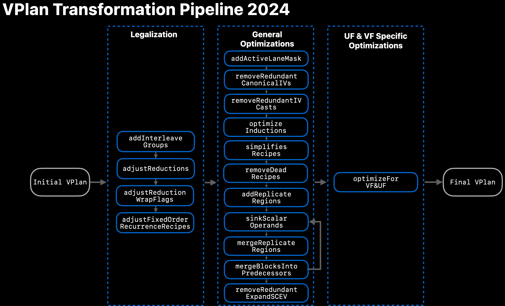
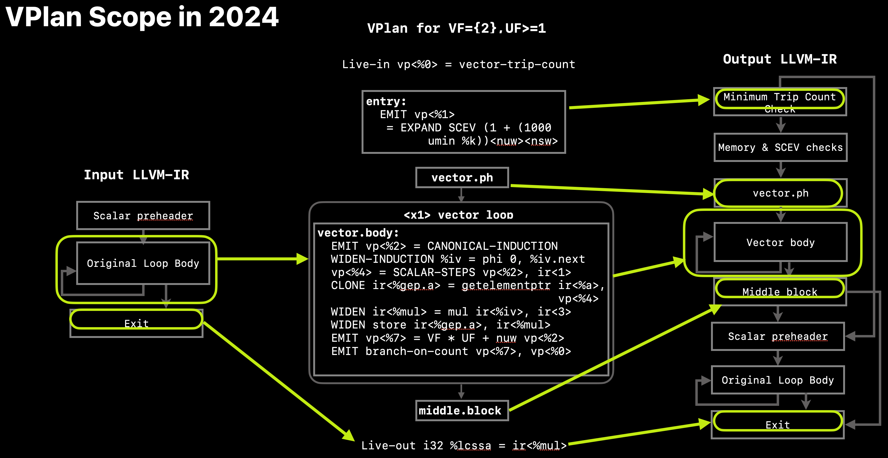

==================
Vectorization Plan
==================

.. contents::
   :local:

Abstract
========
The vectorization transformation can be rather complicated, involving several
potential alternatives, especially for outer-loops [1]_ but also possibly for
innermost loops. These alternatives may have significant performance impact,
both positive and negative. A cost model is therefore employed to identify the
best alternative, including the alternative of avoiding any transformation
altogether.

The Vectorization Plan is an explicit model for describing vectorization
candidates. It serves for both optimizing candidates including estimating their
cost reliably, and for performing their final translation into IR. This
facilitates dealing with multiple vectorization candidates.

Current Status
==============
VPlan is currently used to drive code-generation in LoopVectorize. VPlans are
constructed after all cost-based and most legality-related decisions have been
taken. As def-use chains between recipes are now fully modeled in VPlan,
VPlan-based analyses and transformations are used to simplify and modularize
the vectorization process [10]_. Those include transformations to

1. Legalize the initial VPlan, e.g. by introducing specialized recipes for
   reductions and interleave groups.

2. Optimize the legalized VPlan, e.g. by removing redundant recipes or
   introducing active-lane-masks.

3. Apply unroll- and vectorization-factor specific optimizations, e.g. removing
   the backedge to reiterate the vector loop based on VF & UF.

Refer to :numref:`fig-vplan-transform-pipeline` for an overview of the current
transformation pipeline.

Note that some legality checks are already done in VPlan, including checking if
all users of a fixed-order recurrence can be re-ordered. This is implemented as
a VPlan-to-VPlan transformation that either applies a valid re-ordering or
bails out marking the VPlan as invalid.

.. _fig-vplan-transform-pipeline:

   VPlan Transformation Pipeline in 2024

VPlan currently models the complete vector loop, as well as additional parts of
the vectorization skeleton. Refer to :numref:`fig-vplan-scope` for an overview
of the scope covered by VPlan.

.. _fig-vplan-scope:

   Scope modeled in VPlan in 2024

High-level Design
=================

Vectorization Workflow
----------------------
VPlan-based vectorization involves three major steps, taking a "scenario-based
approach" to vectorization planning:

1. Legal Step: check if a loop can be legally vectorized; encode constraints and
   artifacts if so.
2. Plan Step:

   a. Build initial VPlans following the constraints and decisions taken by
      Legal Step 1, and compute their cost.
   b. Apply optimizations to the VPlans, possibly forking additional VPlans.
      Prune sub-optimal VPlans having relatively high cost.
3. Execute Step: materialize the best VPlan. Note that this is the only step
   that modifies the IR.

Design Guidelines
-----------------
In what follows, the term "input IR" refers to code that is fed into the
vectorizer whereas the term "output IR" refers to code that is generated by the
vectorizer. The output IR contains code that has been vectorized or "widened"
according to a loop Vectorization Factor (VF), and/or loop unroll-and-jammed
according to an Unroll Factor (UF).
The design of VPlan follows several high-level guidelines:

1. Analysis-like: building and manipulating VPlans must not modify the input IR.
   In particular, if the best option is not to vectorize at all, the
   vectorization process terminates before reaching Step 3, and compilation
   should proceed as if VPlans had not been built.

2. Align Cost & Execute: each VPlan must support both estimating the cost and
   generating the output IR code, such that the cost estimation evaluates the
   to-be-generated code reliably.

3. Support vectorizing additional constructs:

   a. Outer-loop vectorization. In particular, VPlan must be able to model the
      control-flow of the output IR which may include multiple basic-blocks and
      nested loops.
   b. SLP vectorization.
   c. Combinations of the above, including nested vectorization: vectorizing
      both an inner loop and an outer-loop at the same time (each with its own
      VF and UF), mixed vectorization: vectorizing a loop with SLP patterns
      inside [4]_, (re)vectorizing input IR containing vector code.
   d. Function vectorization [2]_.

4. Support multiple candidates efficiently. In particular, similar candidates
   related to a range of possible VF's and UF's must be represented efficiently.
   Potential versioning needs to be supported efficiently.

5. Support vectorizing idioms, such as interleaved groups of strided loads or
   stores. This is achieved by modeling a sequence of output instructions using
   a "Recipe", which is responsible for computing its cost and generating its
   code.

6. Encapsulate Single-Entry Single-Exit regions (SESE). During vectorization
   such regions may need to be, for example, predicated and linearized, or
   replicated VF*UF times to handle scalarized and predicated instructions.
   Innerloops are also modelled as SESE regions.

7. Support instruction-level analysis and transformation, as part of Planning
   Step 2.b: During vectorization instructions may need to be traversed, moved,
   replaced by other instructions or be created. For example, vector idiom
   detection and formation involves searching for and optimizing instruction
   patterns.

Definitions
===========
The low-level design of VPlan comprises of the following classes.

:LoopVectorizationPlanner:
  A LoopVectorizationPlanner is designed to handle the vectorization of a loop
  or a loop nest. It can construct, optimize and discard one or more VPlans,
  each VPlan modelling a distinct way to vectorize the loop or the loop nest.
  Once the best VPlan is determined, including the best VF and UF, this VPlan
  drives the generation of output IR.

:VPlan:
  A model of a vectorized candidate for a given input IR loop or loop nest. This
  candidate is represented using a Hierarchical CFG. VPlan supports estimating
  the cost and driving the generation of the output IR code it represents.

:Hierarchical CFG:
  A control-flow graph whose nodes are basic-blocks or Hierarchical CFG's. The
  Hierarchical CFG data structure is similar to the Tile Tree [5]_, where
  cross-Tile edges are lifted to connect Tiles instead of the original
  basic-blocks as in Sharir [6]_, promoting the Tile encapsulation. The terms
  Region and Block are used rather than Tile [5]_ to avoid confusion with loop
  tiling.

:VPBlockBase:
  The building block of the Hierarchical CFG. A pure-virtual base-class of
  VPBasicBlock and VPRegionBlock, see below. VPBlockBase models the hierarchical
  control-flow relations with other VPBlocks. Note that in contrast to the IR
  BasicBlock, a VPBlockBase models its control-flow successors and predecessors
  directly, rather than through a Terminator branch or through predecessor
  branches that "use" the VPBlockBase.

:VPBasicBlock:
  VPBasicBlock is a subclass of VPBlockBase, and serves as the leaves of the
  Hierarchical CFG. It represents a sequence of output IR instructions that will
  appear consecutively in an output IR basic-block. The instructions of this
  basic-block originate from one or more VPBasicBlocks. VPBasicBlock holds a
  sequence of zero or more VPRecipes that model the cost and generation of the
  output IR instructions.

:VPRegionBlock:
  VPRegionBlock is a subclass of VPBlockBase. It models a collection of
  VPBasicBlocks and VPRegionBlocks which form a SESE subgraph of the output IR
  CFG. A VPRegionBlock may indicate that its contents are to be replicated a
  constant number of times when output IR is generated, effectively representing
  a loop with constant trip-count that will be completely unrolled. This is used
  to support scalarized and predicated instructions with a single model for
  multiple candidate VF's and UF's.

:VPRecipeBase:
  A pure-virtual base class modeling a sequence of one or more output IR
  instructions, possibly based on one or more input IR instructions. These
  input IR instructions are referred to as "Ingredients" of the Recipe. A Recipe
  may specify how its ingredients are to be transformed to produce the output IR
  instructions; e.g., cloned once, replicated multiple times or widened
  according to selected VF.

:VPValue:
  The base of VPlan's def-use relations class hierarchy. When instantiated, it
  models a constant or a live-in Value in VPlan. It has users, which are of type
  VPUser, but no operands.

:VPUser:
  A VPUser represents an entity that uses a number of VPValues as operands.
  VPUser is similar in some aspects to LLVM's User class.

:VPDef:
  A VPDef represents an entity that defines zero, one or multiple VPValues.
  It is used to model the fact that recipes in VPlan can define multiple
  VPValues.

:VPInstruction:
  A VPInstruction is a recipe characterized by a single opcode and optional
  flags, free of ingredients or other meta-data. VPInstructions also extend
  LLVM IR's opcodes with idiomatic operations that enrich the Vectorizer's
  semantics.

:VPTransformState:
  Stores information used for generating output IR, passed from
  LoopVectorizationPlanner to its selected VPlan for execution, and used to pass
  additional information down to VPBlocks and VPRecipes.

The Planning Process and VPlan Roadmap
======================================

Transforming the Loop Vectorizer to use VPlan follows a staged approach. First,
VPlan was only used to record the final vectorization decisions, and to execute
them: the Hierarchical CFG models the planned control-flow, and Recipes capture
decisions taken inside basic-blocks. Currently, VPlan is used also as the basis
for taking these decisions, effectively turning them into a series of
VPlan-to-VPlan algorithms. Finally, VPlan will support the planning process
itself including cost-based analyses for making these decisions, to fully
support compositional and iterative decision making.

Some decisions are local to an instruction in the loop, such as whether to widen
it into a vector instruction or replicate it, keeping the generated instructions
in place. Other decisions, however, involve moving instructions, replacing them
with other instructions, and/or introducing new instructions. For example, a
cast may sink past a later instruction and be widened to handle first-order
recurrence; an interleave group of strided gathers or scatters may effectively
move to one place where they are replaced with shuffles and a common wide vector
load or store; new instructions may be introduced to compute masks, shuffle the
elements of vectors, and pack scalar values into vectors or vice-versa.

In order for VPlan to support making instruction-level decisions and analyses,
it needs to model the relevant instructions along with their def/use relations.
This too follows a staged approach: first, the new instructions that compute
masks are modeled as VPInstructions, along with their induced def/use subgraph.
This effectively models masks in VPlan, facilitating VPlan-based predication.
Next, the logic embedded within each Recipe for generating its instructions at
VPlan execution time, will instead take part in the planning process by modeling
them as VPInstructions. Finally, only logic that applies to instructions as a
group will remain in Recipes, such as interleave groups and potentially other
idiom groups having synergistic cost.

Related LLVM components
-----------------------
1. SLP Vectorizer: one can compare the VPlan model with LLVM's existing SLP
   tree, where TSLP [3]_ adds Plan Step 2.b.

2. RegionInfo: one can compare VPlan's H-CFG with the Region Analysis as used by
   Polly [7]_.

3. Loop Vectorizer: the Vectorization Plan aims to upgrade the infrastructure of
   the Loop Vectorizer and extend it to handle outer loops [8]_, [9]_.

References
----------
.. [1] "Outer-loop vectorization: revisited for short SIMD architectures", Dorit
    Nuzman and Ayal Zaks, PACT 2008.

.. [2] "Proposal for function vectorization and loop vectorization with function
    calls", Xinmin Tian, [`cfe-dev
    <http://lists.llvm.org/pipermail/cfe-dev/2016-March/047732.html>`_].,
    March 2, 2016.
    See also `review <https://reviews.llvm.org/D22792>`_.

.. [3] "Throttling Automatic Vectorization: When Less is More", Vasileios
    Porpodas and Tim Jones, PACT 2015 and LLVM Developers' Meeting 2015.

.. [4] "Exploiting mixed SIMD parallelism by reducing data reorganization
    overhead", Hao Zhou and Jingling Xue, CGO 2016.

.. [5] "Register Allocation via Hierarchical Graph Coloring", David Callahan and
    Brian Koblenz, PLDI 1991

.. [6] "Structural analysis: A new approach to flow analysis in optimizing
    compilers", M. Sharir, Journal of Computer Languages, Jan. 1980

.. [7] "Enabling Polyhedral Optimizations in LLVM", Tobias Grosser, Diploma
    thesis, 2011.

.. [8] "Introducing VPlan to the Loop Vectorizer", Gil Rapaport and Ayal Zaks,
    European LLVM Developers' Meeting 2017.

.. [9] "Extending LoopVectorizer: OpenMP4.5 SIMD and Outer Loop
    Auto-Vectorization", Intel Vectorizer Team, LLVM Developers' Meeting 2016.

.. [10] "VPlan: Status Update and Future Roadmap", Ayal Zaks and Florian Hahn,
    LLVM Developers' Meeting 2023, https://www.youtube.com/watch?v=SzGP4PgMuLE
