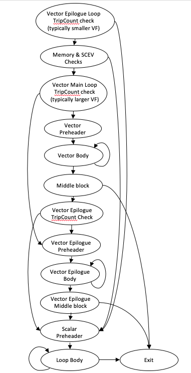
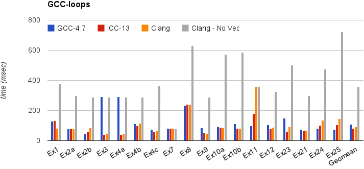
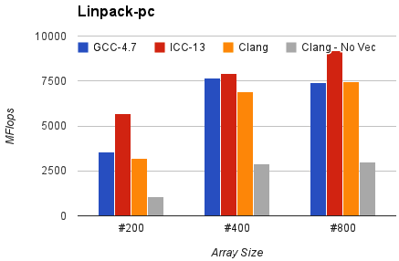

==========================
Auto-Vectorization in LLVM
==========================

.. contents::
   :local:

LLVM has two vectorizers: The :ref:`Loop Vectorizer <loop-vectorizer>`,
which operates on Loops, and the :ref:`SLP Vectorizer
<slp-vectorizer>`. These vectorizers
focus on different optimization opportunities and use different techniques.
The SLP vectorizer merges multiple scalars that are found in the code into
vectors while the Loop Vectorizer widens instructions in loops
to operate on multiple consecutive iterations.

Both the Loop Vectorizer and the SLP Vectorizer are enabled by default.

.. _loop-vectorizer:

The Loop Vectorizer
===================

Usage
-----

The Loop Vectorizer is enabled by default, but it can be disabled
through clang using the command line flag:

.. code-block:: console

   $ clang ... -fno-vectorize  file.c

Command line flags
^^^^^^^^^^^^^^^^^^

The loop vectorizer uses a cost model to decide on the optimal vectorization factor
and unroll factor. However, users of the vectorizer can force the vectorizer to use
specific values. Both 'clang' and 'opt' support the flags below.

Users can control the vectorization SIMD width using the command line flag "-force-vector-width".

.. code-block:: console

  $ clang  -mllvm -force-vector-width=8 ...
  $ opt -loop-vectorize -force-vector-width=8 ...

Users can control the unroll factor using the command line flag "-force-vector-interleave"

.. code-block:: console

  $ clang  -mllvm -force-vector-interleave=2 ...
  $ opt -loop-vectorize -force-vector-interleave=2 ...

Pragma loop hint directives
^^^^^^^^^^^^^^^^^^^^^^^^^^^

The ``#pragma clang loop`` directive allows loop vectorization hints to be
specified for the subsequent for, while, do-while, or c++11 range-based for
loop. The directive allows vectorization and interleaving to be enabled or
disabled. Vector width as well as interleave count can also be manually
specified. The following example explicitly enables vectorization and
interleaving:

.. code-block:: c++

  #pragma clang loop vectorize(enable) interleave(enable)
  while(...) {
    ...
  }

The following example implicitly enables vectorization and interleaving by
specifying a vector width and interleaving count:

.. code-block:: c++

  #pragma clang loop vectorize_width(2) interleave_count(2)
  for(...) {
    ...
  }

See the Clang
`language extensions
<https://clang.llvm.org/docs/LanguageExtensions.html#extensions-for-loop-hint-optimizations>`_
for details.

Diagnostics
-----------

Many loops cannot be vectorized including loops with complicated control flow,
unvectorizable types, and unvectorizable calls. The loop vectorizer generates
optimization remarks which can be queried using command line options to identify
and diagnose loops that are skipped by the loop-vectorizer.

Optimization remarks are enabled using:

``-Rpass=loop-vectorize`` identifies loops that were successfully vectorized.

``-Rpass-missed=loop-vectorize`` identifies loops that failed vectorization and
indicates if vectorization was specified.

``-Rpass-analysis=loop-vectorize`` identifies the statements that caused
vectorization to fail. If in addition ``-fsave-optimization-record`` is
provided, multiple causes of vectorization failure may be listed (this behavior
might change in the future).

Consider the following loop:

.. code-block:: c++

  #pragma clang loop vectorize(enable)
  for (int i = 0; i < Length; i++) {
    switch(A[i]) {
    case 0: A[i] = i*2; break;
    case 1: A[i] = i;   break;
    default: A[i] = 0;
    }
  }

The command line ``-Rpass-missed=loop-vectorize`` prints the remark:

.. code-block:: console

  no_switch.cpp:4:5: remark: loop not vectorized: vectorization is explicitly enabled [-Rpass-missed=loop-vectorize]

And the command line ``-Rpass-analysis=loop-vectorize`` indicates that the
switch statement cannot be vectorized.

.. code-block:: console

  no_switch.cpp:4:5: remark: loop not vectorized: loop contains a switch statement [-Rpass-analysis=loop-vectorize]
    switch(A[i]) {
    ^

To ensure line and column numbers are produced include the command line options
``-gline-tables-only`` and ``-gcolumn-info``. See the Clang `user manual
<https://clang.llvm.org/docs/UsersManual.html#options-to-emit-optimization-reports>`_
for details

Features
--------

The LLVM Loop Vectorizer has a number of features that allow it to vectorize
complex loops.

Loops with unknown trip count
^^^^^^^^^^^^^^^^^^^^^^^^^^^^^

The Loop Vectorizer supports loops with an unknown trip count.
In the loop below, the iteration ``start`` and ``finish`` points are unknown,
and the Loop Vectorizer has a mechanism to vectorize loops that do not start
at zero. In this example, 'n' may not be a multiple of the vector width, and
the vectorizer has to execute the last few iterations as scalar code. Keeping
a scalar copy of the loop increases the code size.

.. code-block:: c++

  void bar(float *A, float* B, float K, int start, int end) {
    for (int i = start; i < end; ++i)
      A[i] *= B[i] + K;
  }

Runtime Checks of Pointers
^^^^^^^^^^^^^^^^^^^^^^^^^^

In the example below, if the pointers A and B point to consecutive addresses,
then it is illegal to vectorize the code because some elements of A will be
written before they are read from array B.

Some programmers use the 'restrict' keyword to notify the compiler that the
pointers are disjointed, but in our example, the Loop Vectorizer has no way of
knowing that the pointers A and B are unique. The Loop Vectorizer handles this
loop by placing code that checks, at runtime, if the arrays A and B point to
disjointed memory locations. If arrays A and B overlap, then the scalar version
of the loop is executed.

.. code-block:: c++

  void bar(float *A, float* B, float K, int n) {
    for (int i = 0; i < n; ++i)
      A[i] *= B[i] + K;
  }

Reductions
^^^^^^^^^^

In this example the ``sum`` variable is used by consecutive iterations of
the loop. Normally, this would prevent vectorization, but the vectorizer can
detect that 'sum' is a reduction variable. The variable 'sum' becomes a vector
of integers, and at the end of the loop the elements of the array are added
together to create the correct result. We support a number of different
reduction operations, such as addition, multiplication, XOR, AND and OR.

.. code-block:: c++

  int foo(int *A, int n) {
    unsigned sum = 0;
    for (int i = 0; i < n; ++i)
      sum += A[i] + 5;
    return sum;
  }

We support floating point reduction operations when `-ffast-math` is used.

Inductions
^^^^^^^^^^

In this example the value of the induction variable ``i`` is saved into an
array. The Loop Vectorizer knows to vectorize induction variables.

.. code-block:: c++

  void bar(float *A, int n) {
    for (int i = 0; i < n; ++i)
      A[i] = i;
  }

If Conversion
^^^^^^^^^^^^^

The Loop Vectorizer is able to "flatten" the IF statement in the code and
generate a single stream of instructions. The Loop Vectorizer supports any
control flow in the innermost loop. The innermost loop may contain complex
nesting of IFs, ELSEs and even GOTOs.

.. code-block:: c++

  int foo(int *A, int *B, int n) {
    unsigned sum = 0;
    for (int i = 0; i < n; ++i)
      if (A[i] > B[i])
        sum += A[i] + 5;
    return sum;
  }

Pointer Induction Variables
^^^^^^^^^^^^^^^^^^^^^^^^^^^

This example uses the "accumulate" function of the standard c++ library. This
loop uses C++ iterators, which are pointers, and not integer indices.
The Loop Vectorizer detects pointer induction variables and can vectorize
this loop. This feature is important because many C++ programs use iterators.

.. code-block:: c++

  int baz(int *A, int n) {
    return std::accumulate(A, A + n, 0);
  }

Reverse Iterators
^^^^^^^^^^^^^^^^^

The Loop Vectorizer can vectorize loops that count backwards.

.. code-block:: c++

  void foo(int *A, int n) {
    for (int i = n; i > 0; --i)
      A[i] +=1;
  }

Scatter / Gather
^^^^^^^^^^^^^^^^

The Loop Vectorizer can vectorize code that becomes a sequence of scalar instructions
that scatter/gathers memory.

.. code-block:: c++

  void foo(int * A, int * B, int n) {
    for (intptr_t i = 0; i < n; ++i)
        A[i] += B[i * 4];
  }

In many situations the cost model will inform LLVM that this is not beneficial
and LLVM will only vectorize such code if forced with "-mllvm -force-vector-width=#".

Vectorization of Mixed Types
^^^^^^^^^^^^^^^^^^^^^^^^^^^^

The Loop Vectorizer can vectorize programs with mixed types. The Vectorizer
cost model can estimate the cost of the type conversion and decide if
vectorization is profitable.

.. code-block:: c++

  void foo(int *A, char *B, int n) {
    for (int i = 0; i < n; ++i)
      A[i] += 4 * B[i];
  }

Global Structures Alias Analysis
^^^^^^^^^^^^^^^^^^^^^^^^^^^^^^^^

Access to global structures can also be vectorized, with alias analysis being
used to make sure accesses don't alias. Run-time checks can also be added on
pointer access to structure members.

Many variations are supported, but some that rely on undefined behaviour being
ignored (as other compilers do) are still being left un-vectorized.

.. code-block:: c++

  struct { int A[100], K, B[100]; } Foo;

  void foo() {
    for (int i = 0; i < 100; ++i)
      Foo.A[i] = Foo.B[i] + 100;
  }

Vectorization of function calls
^^^^^^^^^^^^^^^^^^^^^^^^^^^^^^^

The Loop Vectorizer can vectorize intrinsic math functions.
See the table below for a list of these functions.

+-----+-----+---------+
| pow | exp |  exp2   |
+-----+-----+---------+
| sin | cos |  sqrt   |
+-----+-----+---------+
| log |log2 |  log10  |
+-----+-----+---------+
|fabs |floor|  ceil   |
+-----+-----+---------+
|fma  |trunc|nearbyint|
+-----+-----+---------+
|     |     | fmuladd |
+-----+-----+---------+

Note that the optimizer may not be able to vectorize math library functions
that correspond to these intrinsics if the library calls access external state
such as "errno". To allow better optimization of C/C++ math library functions,
use "-fno-math-errno".

The loop vectorizer knows about special instructions on the target and will
vectorize a loop containing a function call that maps to the instructions. For
example, the loop below will be vectorized on Intel x86 if the SSE4.1 roundps
instruction is available.

.. code-block:: c++

  void foo(float *f) {
    for (int i = 0; i != 1024; ++i)
      f[i] = floorf(f[i]);
  }

Partial unrolling during vectorization
^^^^^^^^^^^^^^^^^^^^^^^^^^^^^^^^^^^^^^

Modern processors feature multiple execution units, and only programs that contain a
high degree of parallelism can fully utilize the entire width of the machine.
The Loop Vectorizer increases the instruction level parallelism (ILP) by
performing partial-unrolling of loops.

In the example below the entire array is accumulated into the variable 'sum'.
This is inefficient because only a single execution port can be used by the processor.
By unrolling the code the Loop Vectorizer allows two or more execution ports
to be used simultaneously.

.. code-block:: c++

  int foo(int *A, int n) {
    unsigned sum = 0;
    for (int i = 0; i < n; ++i)
        sum += A[i];
    return sum;
  }

The Loop Vectorizer uses a cost model to decide when it is profitable to unroll loops.
The decision to unroll the loop depends on the register pressure and the generated code size.

Epilogue Vectorization
^^^^^^^^^^^^^^^^^^^^^^

When vectorizing a loop, often a scalar remainder (epilogue) loop is necessary
to execute tail iterations of the loop if the loop trip count is unknown or it
does not evenly divide the vectorization and unroll factors. When the
vectorization and unroll factors are large, it's possible for loops with smaller
trip counts to end up spending most of their time in the scalar (rather than
the vector) code. In order to address this issue, the inner loop vectorizer is
enhanced with a feature that allows it to vectorize epilogue loops with a
vectorization and unroll factor combination that makes it more likely for small
trip count loops to still execute in vectorized code. The diagram below shows
the CFG for a typical epilogue vectorized loop with runtime checks. As
illustrated the control flow is structured in a way that avoids duplicating the
runtime pointer checks and optimizes the path length for loops that have very
small trip counts.

Performance
-----------

This section shows the execution time of Clang on a simple benchmark:
`gcc-loops <https://github.com/llvm/llvm-test-suite/tree/main/SingleSource/UnitTests/Vectorizer>`_.
This benchmarks is a collection of loops from the GCC autovectorization
`page <http://gcc.gnu.org/projects/tree-ssa/vectorization.html>`_ by Dorit Nuzman.

The chart below compares GCC-4.7, ICC-13, and Clang-SVN with and without loop vectorization at -O3, tuned for "corei7-avx", running on a Sandybridge iMac.
The Y-axis shows the time in msec. Lower is better. The last column shows the geomean of all the kernels.

And Linpack-pc with the same configuration. Result is Mflops, higher is better.

Ongoing Development Directions
------------------------------

.. toctree::
   :hidden:

   VectorizationPlan

:doc:`VectorizationPlan`
   Modeling the process and upgrading the infrastructure of LLVM's Loop Vectorizer.

.. _slp-vectorizer:

The SLP Vectorizer
==================

Details
-------

The goal of SLP vectorization (a.k.a. superword-level parallelism) is
to combine similar independent instructions
into vector instructions. Memory accesses, arithmetic operations, comparison
operations, PHI-nodes, can all be vectorized using this technique.

For example, the following function performs very similar operations on its
inputs (a1, b1) and (a2, b2). The basic-block vectorizer may combine these
into vector operations.

.. code-block:: c++

  void foo(int a1, int a2, int b1, int b2, int *A) {
    A[0] = a1*(a1 + b1);
    A[1] = a2*(a2 + b2);
    A[2] = a1*(a1 + b1);
    A[3] = a2*(a2 + b2);
  }

The SLP-vectorizer processes the code bottom-up, across basic blocks, in search of scalars to combine.

Usage
------

The SLP Vectorizer is enabled by default, but it can be disabled
through clang using the command line flag:

.. code-block:: console

   $ clang -fno-slp-vectorize file.c
