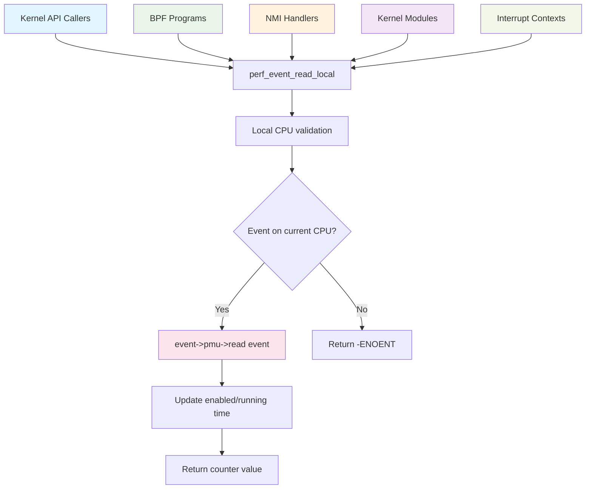
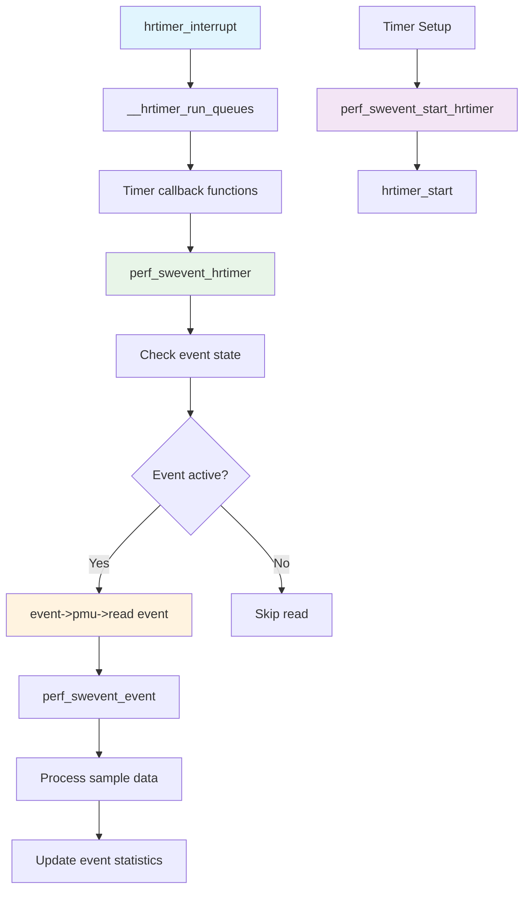
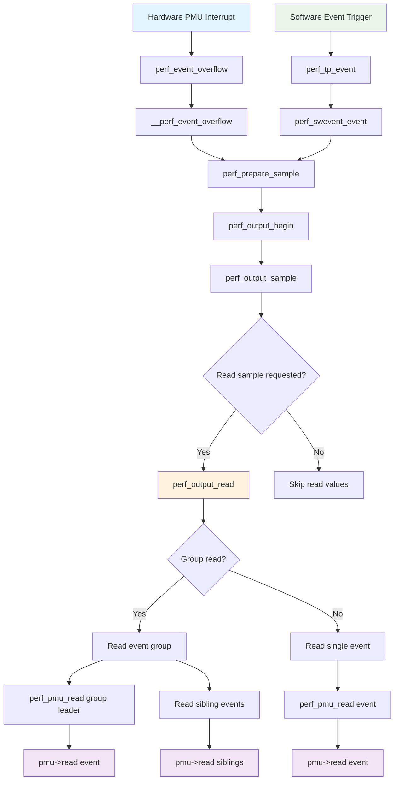
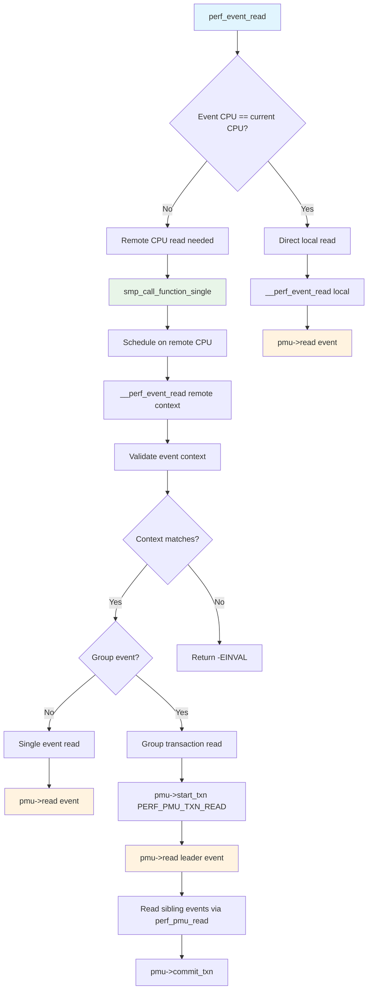
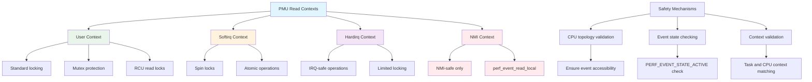

# Linux Kernel Perf Events - PMU Read Call Flow Diagrams

This document contains mermaid diagrams showing all the call flows in the Linux kernel perf events subsystem that lead to `pmu->read()` calls. These diagrams trace backwards from the `pmu->read()` invocations to show all the entry points and execution paths.

## Overview

The Linux perf events subsystem provides performance monitoring capabilities through a standardized PMU (Performance Monitoring Unit) interface. The `pmu->read()` function is the core interface for reading performance counter values from hardware or software PMUs. There are **4 distinct call sites** where `pmu->read()` is invoked, each serving different purposes and accessed through different entry points.

## 1. User-Space Read Operations Flow

This diagram shows how user-space read operations on perf event file descriptors lead to `pmu->read()` calls.

```mermaid
graph TD
    A[User-space read() system call] --> B[perf_read file operation]
    B --> C[__perf_read]
    C --> D{Single event or group?}
    
    D -->|Single event| E[perf_read_one]
    D -->|Event group| F[perf_read_group]
    
    E --> G[__perf_event_read_value]
    F --> H[__perf_read_group_add]
    
    G --> I[perf_event_read]
    H --> J[perf_pmu_read]
    
    I --> K{Event on current CPU?}
    K -->|Yes| L[__perf_event_read local]
    K -->|No| M[smp_call_function_single]
    
    L --> N[pmu->read event]
    M --> O[__perf_event_read remote]
    
    O --> P{Group read?}
    P -->|No| Q[pmu->read event]
    P -->|Yes| R[pmu->start_txn]
    
    R --> S[pmu->read event]
    S --> T[Read sibling events]
    T --> U[pmu->commit_txn]
    
    J --> V[pmu->read event]
    
    style A fill:#e1f5fe
    style B fill:#e8f5e8
    style N fill:#fff3e0
    style Q fill:#fff3e0
    style S fill:#fff3e0
    style V fill:#fff3e0
```

## 2. Local Event Read Flow (NMI-Safe)

This diagram shows the NMI-safe local event read path used by kernel APIs and interrupt contexts.



## 3. Timer-Based Sampling Flow

This diagram shows how high-resolution timer callbacks lead to `pmu->read()` calls for software event sampling.



## 4. Event Sampling and Output Flow

This diagram shows how event sampling during perf record operations triggers `pmu->read()` calls.



## 5. Cross-CPU Event Read Flow

This diagram shows how reading events on remote CPUs is handled through SMP function calls.



## 6. System Call and File Operation Entry Points

This diagram shows the various user-space entry points that can lead to PMU reads.

```mermaid
graph TD
    A[User-Space Applications] --> B[System Calls]
    A --> C[File Operations]
    A --> D[Library Interfaces]
    
    B --> E[sys_perf_event_open]
    B --> F[read syscall]
    B --> G[ioctl syscall]
    
    C --> H[/proc/sys/kernel/perf_*]
    C --> I[/sys/bus/event_source/devices/*]
    
    D --> J[libperf library]
    D --> K[perf user tools]
    
    E --> L[Create perf_event file descriptor]
    F --> M[perf_read file operation]
    G --> N[perf_ioctl operations]
    
    L --> O[Event setup and initialization]
    M --> P[Event value reading paths]
    N --> Q[Event control operations]
    
    P --> R[Leading to pmu->read calls]
    
    S[Kernel Internal APIs] --> T[perf_event_read_local]
    S --> U[perf_event_read_value]
    
    T --> V[Direct pmu->read calls]
    U --> W[Indirect pmu->read via read paths]
    
    style A fill:#e1f5fe
    style B fill:#e8f5e8
    style C fill:#fff3e0
    style D fill:#f3e5f5
    style R fill:#ffebee
    style V fill:#ffebee
```

## 7. Context and Safety Considerations

This diagram shows the different execution contexts and safety mechanisms for PMU reads.



## Key Integration Points

The diagrams show several critical aspects of the perf events PMU read architecture:

1. **Multiple Entry Points**: User-space syscalls, kernel APIs, timer callbacks, and interrupt handlers all lead to PMU reads
2. **Context Safety**: Different execution contexts (user, interrupt, NMI) use appropriate safety mechanisms
3. **CPU Topology Awareness**: Local vs. remote CPU reads are handled differently for performance
4. **Group Operations**: Event groups use PMU transactions for atomic reads
5. **Sampling Integration**: PMU reads are integrated into the sampling and profiling infrastructure
6. **Error Handling**: Comprehensive validation and error paths ensure system stability

## PMU Read Call Sites Summary

There are **4 distinct locations** where `pmu->read(event)` is called:

1. **perf_pmu_read()** - General-purpose read function used by most read paths
2. **__perf_event_read()** - Remote CPU read function (2 call sites for single and group reads)
3. **perf_event_read_local()** - NMI-safe local read function
4. **perf_swevent_hrtimer()** - Timer-based sampling read function

Each call site serves specific use cases and provides different guarantees about execution context and performance characteristics. This architecture allows the perf events subsystem to provide flexible, efficient, and safe performance monitoring across all execution contexts in the Linux kernel.