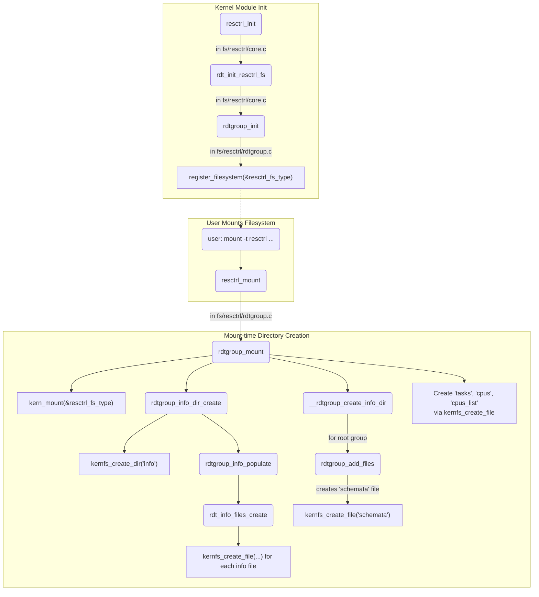
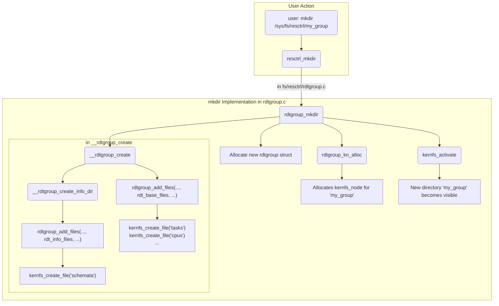

# Mermaid Diagrams for `resctrl` Function Flows

This document outlines the important function flows in `fs/resctrl/rdtgroup.c` for creating the `resctrl` filesystem directory structure.

## 1. Filesystem Initialization and Mount Flow

This flow describes the two main stages of `resctrl` setup:
1.  **Module Initialization**: Key data structures are initialized and the `resctrl` filesystem type is registered with the kernel. This happens when the `resctrl` kernel module is loaded.
2.  **Mount-time Creation**: When a user mounts the filesystem (e.g., `mount -t resctrl resctrl /sys/fs/resctrl`), the directory and file hierarchy is constructed in memory via `kernfs`.

## 2. New Resource Group Creation (`mkdir`) Flow

The `resctrl` filesystem allows users to create new resource groups by creating new directories. The `mkdir` operation triggers the following kernel flow to create a new `rdtgroup` and its associated control files (`schemata`, `tasks`, etc.).

These diagrams illustrate the core logic within `fs/resctrl` for managing the filesystem structure.