# x86 ResCtrl Architecture Function Flow Diagrams

This document contains mermaid diagrams showing the important function flows in the x86 ResCtrl architecture implementation, focusing on the interaction between the filesystem layer (`fs/resctrl/`) and the architecture-specific layer (`arch/x86/kernel/cpu/resctrl/`).

## 1. Reference Counting Flow - rdtgroup_kn_lock_live

This diagram shows the critical reference counting mechanism that ensures safe access to rdtgroup structures during concurrent operations.

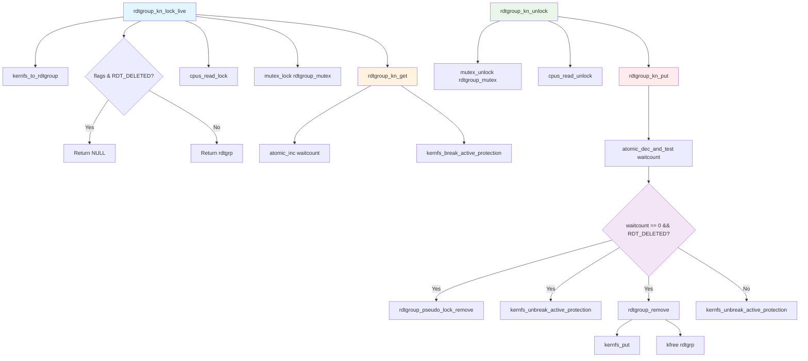

## 2. rmdir Operation Flow

This diagram shows how directory removal operations flow through both the filesystem and architecture layers.

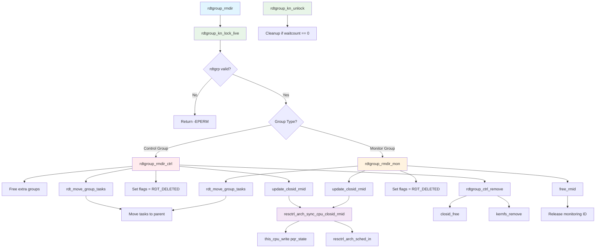

## 3. Monitoring Directory Creation Flow

This diagram shows how the monitoring directory structure is created, starting with mkdir_mondata_all().

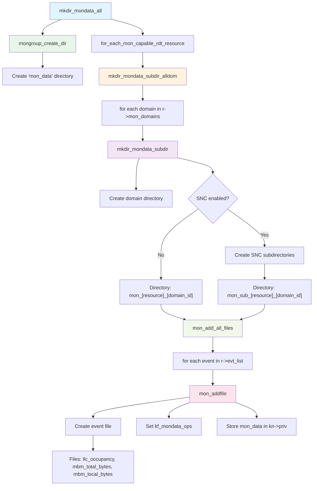

## 4. Monitoring Data Read Flow

This diagram shows how monitoring data flows from MSRs through the architecture layer to the filesystem layer.

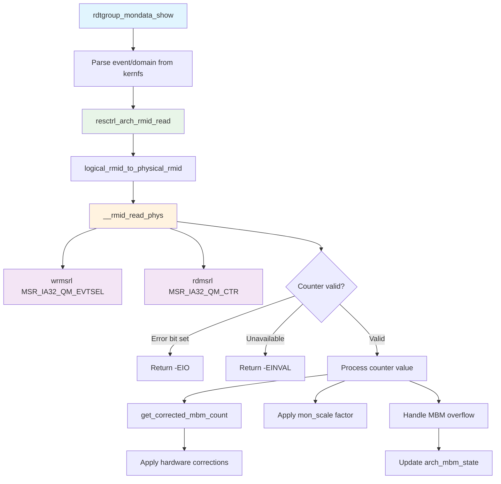

## 4. MSR Access and Hardware Interface

This diagram shows the low-level MSR access patterns for monitoring and control.

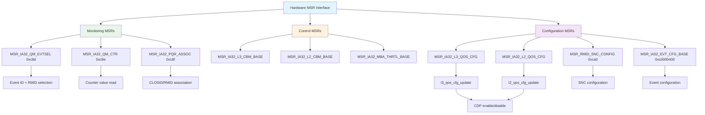

## 5. SNC (Sub-NUMA Cluster) Support Flow

This diagram shows how SNC support works for monitoring in multi-node configurations.

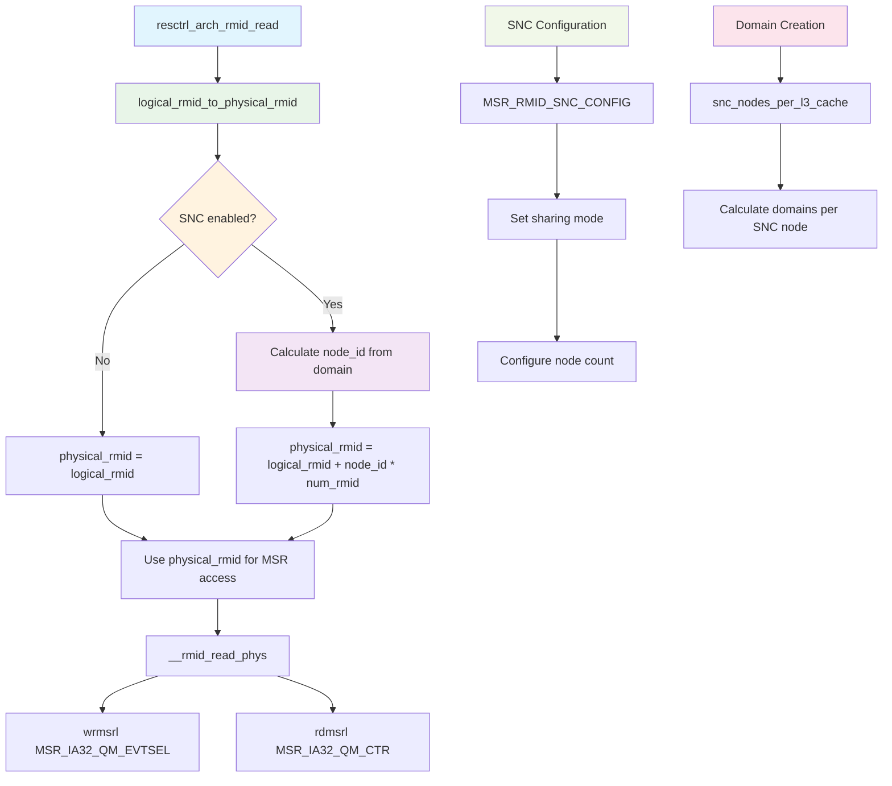

## 6. Architecture Resource Initialization

This diagram shows how architecture-specific resources are initialized and configured.

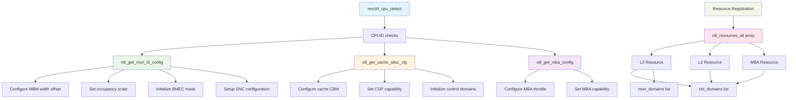

## 7. CPU Online and Domain Creation Flow

This diagram shows the complete flow from CPU coming online to domain creation and initialization.

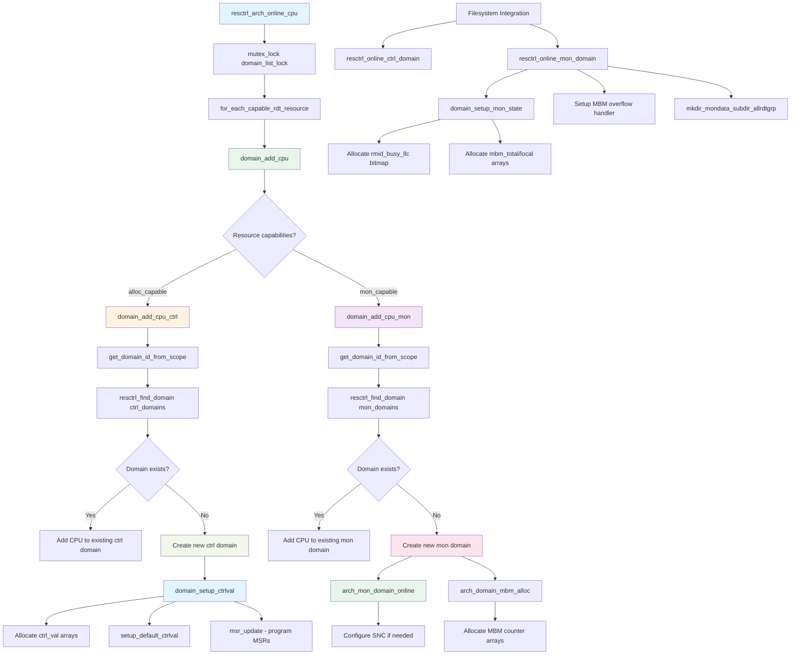

## 8. Domain ID Resolution and CPU Topology Mapping

This diagram shows how CPU topology is mapped to domain IDs for different resource scopes.

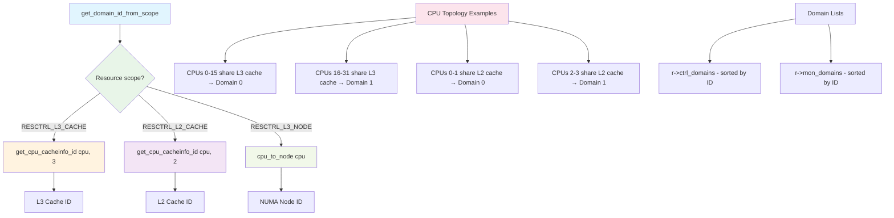

## 8. Event Configuration Interface

This diagram shows how monitoring events are configured through the architecture layer.

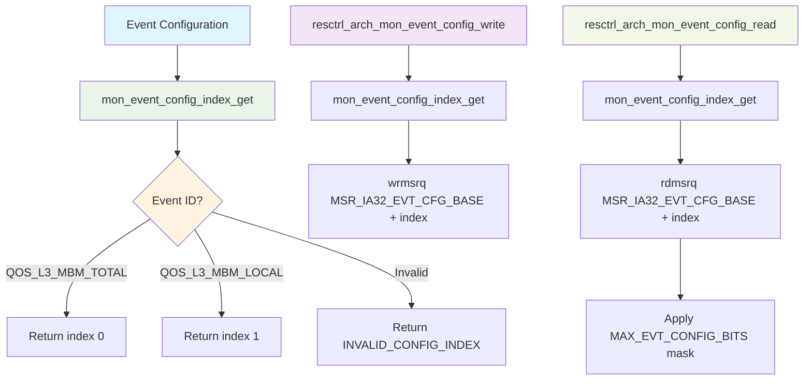

## 9. Rename/Move Operation Flow

This diagram shows the complete workflow for renaming/moving monitoring groups between parent control groups.

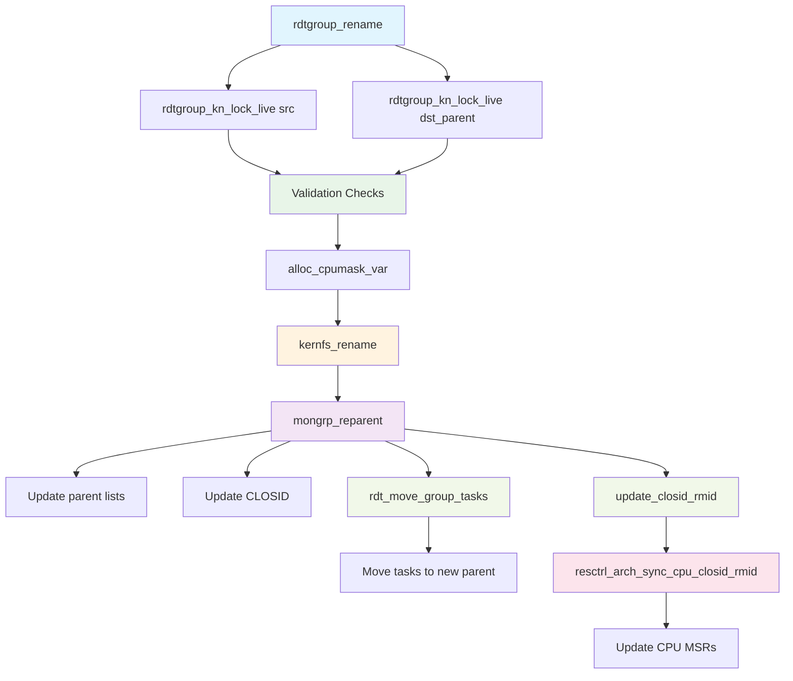

## 10. Group Reparenting Details - mongrp_reparent

This diagram shows the detailed steps within the `mongrp_reparent` function.

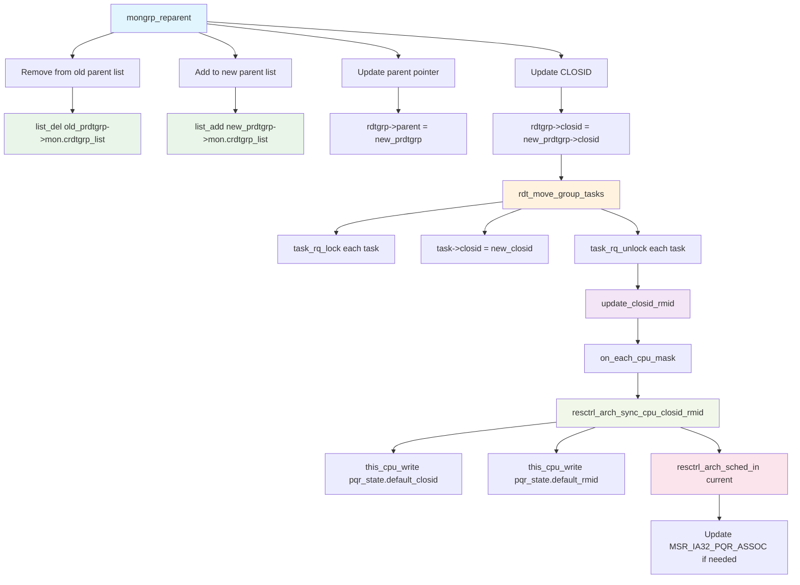

## 11. Pseudo-Lock Operation Overview

Pseudo-locking is a feature that allows loading specific memory regions into cache and preventing them from being evicted by future cache allocation operations. This provides deterministic cache allocation for critical workloads.

### Pseudo-Lock Concepts

**Cache Pseudo-Locking** works by:
1. **Isolation**: Setting up a dedicated cache capacity bitmask (CBM) for the region
2. **Loading**: Reading the target memory while using the dedicated CBM to load it into cache
3. **Protection**: Preventing future CBM allocations from overlapping with the pseudo-locked region

**Key Components**:
- **Pseudo-Lock Region**: Memory region to be locked into cache
- **CLOSID**: Cache allocation class used during the locking process
- **CBM**: Cache capacity bitmask defining which cache ways are reserved
- **Thread**: Kernel thread that performs the actual cache loading
- **Measurement**: Performance monitoring to verify locking effectiveness

## 12. Pseudo-Lock State Machine and Mode Transitions

This diagram shows the state transitions in the pseudo-lock lifecycle.

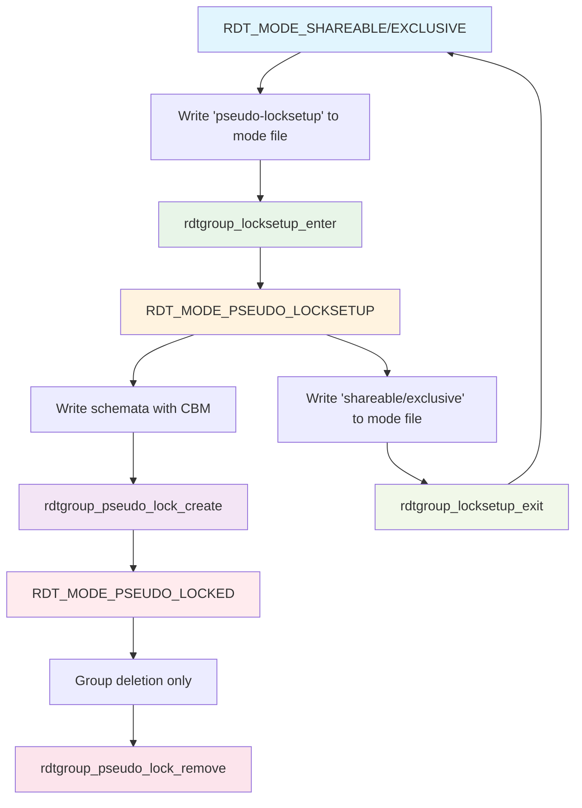

## 13. Pseudo-Lock Setup Flow (rdtgroup_locksetup_enter)

This diagram shows the validation and setup process when entering pseudo-lock setup mode.

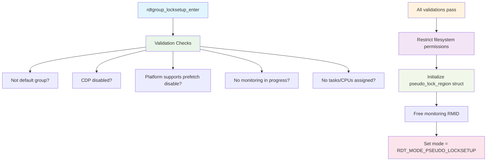

## 14. Pseudo-Lock Creation Flow (rdtgroup_pseudo_lock_create)

This diagram shows the complete process of creating an active pseudo-lock.

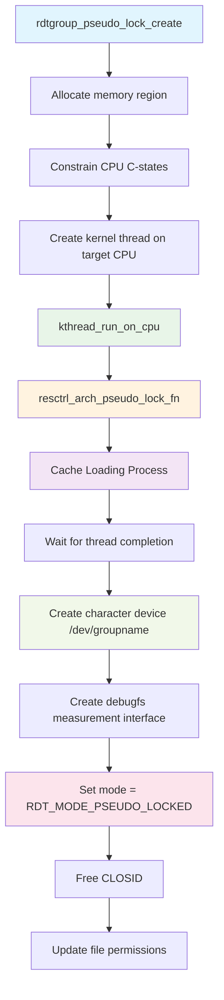

## 15. Arch-Specific Cache Loading Process (resctrl_arch_pseudo_lock_fn)

This diagram shows the low-level cache loading implementation in the architecture layer.

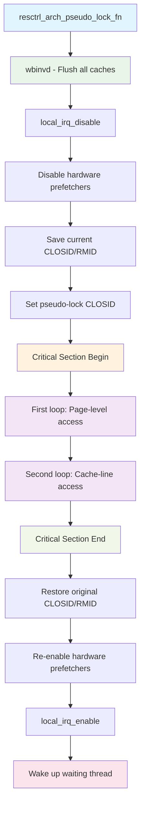

## 16. Pseudo-Lock Performance Measurement

This diagram shows how pseudo-lock effectiveness is measured using performance counters.

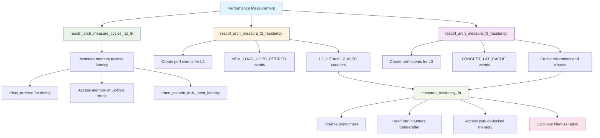

## 17. Pseudo-Lock Hardware Support Detection

This diagram shows how hardware support for pseudo-locking is detected.

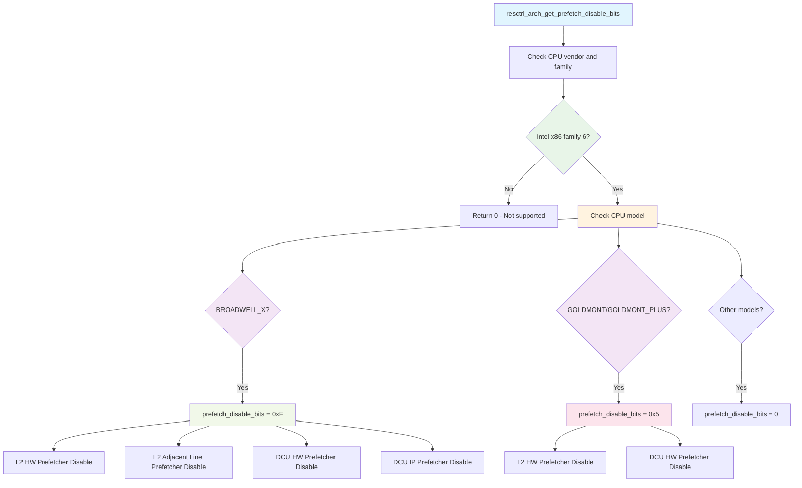

## Key Integration Points

The diagrams show several critical integration points between the filesystem and architecture layers:

1. **Reference Counting**: The `rdtgroup_kn_lock_live`/`rdtgroup_kn_unlock` mechanism ensures safe concurrent access
2. **MSR Abstraction**: Architecture layer provides clean MSR interface to filesystem layer
3. **Domain Management**: CPU hotplug events are handled transparently by the architecture layer
4. **Error Handling**: Hardware errors and unavailable conditions are properly propagated
5. **Resource Management**: Architecture-specific resource initialization is abstracted from the filesystem layer
6. **Rename Operations**: Monitoring groups can be safely moved between parent control groups with proper validation and MSR updates
7. **Task Migration**: When groups are reparented, all associated tasks are moved and their MSRs are updated atomically
8. **Pseudo-Lock Integration**: Mode transitions and cache loading operations bridge filesystem control with hardware-specific cache manipulation
9. **Performance Measurement**: Provides comprehensive measurement capabilities using hardware performance counters and tracing

## Rename Operation Characteristics

The rename/move workflow has several important characteristics:

- **Atomic Operations**: Uses kernfs_rename followed by mongrp_reparent to ensure consistency
- **Reference Safety**: Uses the same reference counting mechanism as other operations
- **Validation**: Extensive validation prevents invalid moves (e.g., moving control groups, moving to non-mon_groups directories)
- **CPU Constraint Enforcement**: Prevents moving MON groups that are actively monitoring CPUs between different parent CTRL_MON groups
- **MSR Synchronization**: All affected CPUs have their MSRs updated when tasks are moved between CLOSIDs
- **Error Recovery**: Proper cleanup on all error paths ensures no partial state corruption

## Pseudo-Lock Operation Characteristics

The pseudo-lock feature has several key characteristics:

- **Hardware Requirements**: Requires specific Intel CPU models with prefetch disable capability
- **State Machine**: Uses a 4-state model with clear transitions and validation
- **Deterministic Loading**: Two-pass memory access ensures reliable cache loading
- **Performance Measurement**: Comprehensive measurement using hardware performance counters
- **Resource Isolation**: Creates exclusive cache regions that cannot be evicted by other allocations
- **Thread Safety**: Uses kernel threads and proper synchronization for cache loading operations
- **Device Interface**: Provides character device and debugfs interfaces for user access and debugging

These flows demonstrate how the ResCtrl subsystem maintains a clean separation between filesystem operations and hardware-specific implementation details while ensuring proper synchronization and error handling throughout the stack.