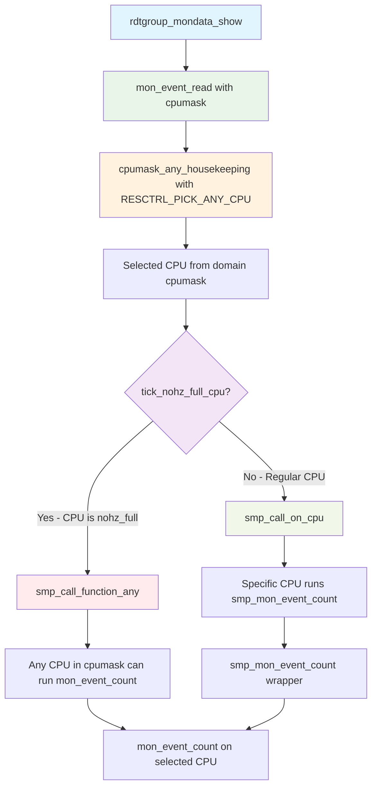
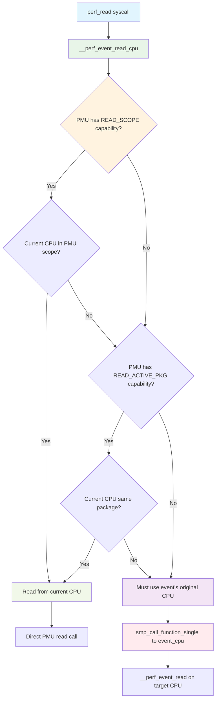
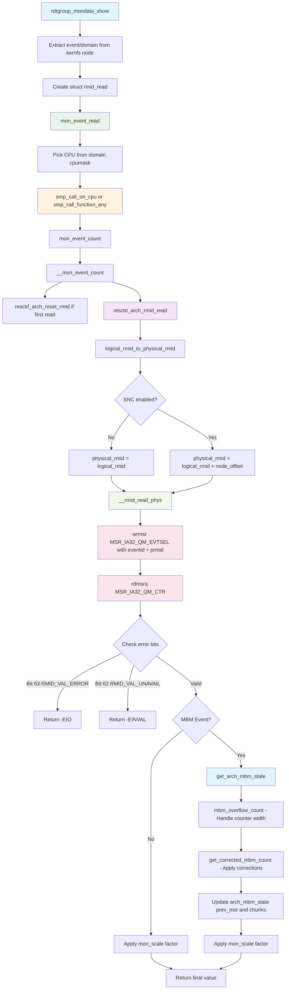
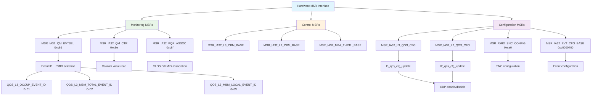

# x86 ResCtrl Architecture Function Flow Diagrams

This document contains mermaid diagrams showing the important function flows in the x86 ResCtrl architecture implementation, focusing on the interaction between the filesystem layer (`fs/resctrl/`) and the architecture-specific layer (`arch/x86/kernel/cpu/resctrl/`).

## 1. Reference Counting Flow - rdtgroup_kn_lock_live

This diagram shows the critical reference counting mechanism that ensures safe access to rdtgroup structures during concurrent operations.


## 2. rmdir Operation Flow

This diagram shows how directory removal operations flow through both the filesystem and architecture layers.


## 3. Monitoring Directory Creation Flow

This diagram shows how the monitoring directory structure is created, starting with mkdir_mondata_all().


## 4. CPU Selection for Monitoring Data Read

This diagram focuses on the CPU selection logic from rdtgroup_mondata_show to mon_event_count, highlighting the decision making based on CPU state (nohz_full).



## 5. Perf CPU Selection for Counter Reads

This diagram shows the CPU selection logic when reading perf counter values via read() syscall.



## 6. Monitoring Data Read Flow

This diagram shows how monitoring data flows from MSRs through the architecture layer to the filesystem layer. Key functions:
- `rdtgroup_mondata_show()` in `fs/resctrl/ctrlmondata.c:588`
- `mon_event_read()` in `fs/resctrl/ctrlmondata.c:549` 
- `mon_event_count()` in `fs/resctrl/monitor.c:455`
- `resctrl_arch_rmid_read()` in `arch/x86/kernel/cpu/resctrl/monitor.c:227`
- `__rmid_read_phys()` in `arch/x86/kernel/cpu/resctrl/monitor.c:141`



## 4. MSR Access and Hardware Interface

This diagram shows the low-level MSR access patterns for monitoring and control.



## 5. SNC (Sub-NUMA Cluster) Support Flow

This diagram shows how SNC support works for monitoring in multi-node configurations.


## 6. Architecture Resource Initialization

This diagram shows how architecture-specific resources are initialized and configured.


## 7. CPU Online and Domain Creation Flow

This diagram shows the complete flow from CPU coming online to domain creation and initialization.


## 8. Domain ID Resolution and CPU Topology Mapping

This diagram shows how CPU topology is mapped to domain IDs for different resource scopes.


## 8. Event Configuration Interface

This diagram shows how monitoring events are configured through the architecture layer.


## 9. Rename/Move Operation Flow

This diagram shows the complete workflow for renaming/moving monitoring groups between parent control groups.


## 10. Group Reparenting Details - mongrp_reparent

This diagram shows the detailed steps within the `mongrp_reparent` function.


## 11. Pseudo-Lock Operation Overview

Pseudo-locking is a feature that allows loading specific memory regions into cache and preventing them from being evicted by future cache allocation operations. This provides deterministic cache allocation for critical workloads.

### Pseudo-Lock Concepts

**Cache Pseudo-Locking** works by:
1. **Isolation**: Setting up a dedicated cache capacity bitmask (CBM) for the region
2. **Loading**: Reading the target memory while using the dedicated CBM to load it into cache
3. **Protection**: Preventing future CBM allocations from overlapping with the pseudo-locked region

**Key Components**:
- **Pseudo-Lock Region**: Memory region to be locked into cache
- **CLOSID**: Cache allocation class used during the locking process
- **CBM**: Cache capacity bitmask defining which cache ways are reserved
- **Thread**: Kernel thread that performs the actual cache loading
- **Measurement**: Performance monitoring to verify locking effectiveness

## 12. Pseudo-Lock State Machine and Mode Transitions

This diagram shows the state transitions in the pseudo-lock lifecycle.


## 13. Pseudo-Lock Setup Flow (rdtgroup_locksetup_enter)

This diagram shows the validation and setup process when entering pseudo-lock setup mode.


## 14. Pseudo-Lock Creation Flow (rdtgroup_pseudo_lock_create)

This diagram shows the complete process of creating an active pseudo-lock.


## 15. Arch-Specific Cache Loading Process (resctrl_arch_pseudo_lock_fn)

This diagram shows the low-level cache loading implementation in the architecture layer.


## 16. Pseudo-Lock Performance Measurement

This diagram shows how pseudo-lock effectiveness is measured using performance counters.


## 17. Pseudo-Lock Hardware Support Detection

This diagram shows how hardware support for pseudo-locking is detected.


## 18. RMID Limbo Mechanism Flow

This diagram shows how freed RMIDs are managed through the limbo system to ensure metrics have drained before reuse.

```mermaid
graph TD
    A[free_rmid] --> B{LLC occupancy monitoring enabled?}
    B -->|No| C[list_add_tail rmid_free_lru]
    B -->|Yes| D[add_rmid_to_limbo]
    
    D --> E[Mark RMID busy in rmid_busy_llc]
    E --> F[list_add_tail rmid_limbo_lru]
    F --> G[atomic_inc rmid_limbo_count]
    
    H[cqm_handle_limbo - Periodic worker] --> I[__check_limbo]
    I --> J[for each RMID in rmid_limbo_lru]
    J --> K[resctrl_arch_rmid_read QOS_L3_OCCUP_EVENT_ID]
    
    K --> L{LLC occupancy < threshold?}
    L -->|No| M[Keep in limbo]
    L -->|Yes| N[limbo_release_entry]
    
    N --> O[Clear RMID in rmid_busy_llc]
    O --> P[list_move_tail to rmid_free_lru]
    P --> Q[atomic_dec rmid_limbo_count]
    
    R[Configurable Parameters] --> S[resctrl_rmid_realloc_threshold]
    R --> T[CQM_LIMBOCHECK_INTERVAL = 1000ms]
    
    U[Force Release Option] --> V[limbo_release_entry - Force cleanup]
    V --> W[Used during resource cleanup]
    
    X[Tracing Support] --> Y[trace_mon_llc_occupancy_limbo]
    Y --> Z[Debug RMID occupancy values]
    
    style A fill:#e1f5fe
    style D fill:#fff3e0
    style H fill:#e8f5e8
    style I fill:#f3e5f5
    style K fill:#f1f8e9
    style N fill:#fce4ec
    style R fill:#e1f5fe
    style U fill:#ffebee
    style X fill:#e8f5e8
```

## 19. RMID Allocation and Lifecycle Management

This diagram shows the complete RMID lifecycle from allocation through limbo to reuse.

```mermaid
graph TD
    A[rmid_alloc] --> B{rmid_free_lru empty?}
    B -->|Yes| C[Return -ENOSPC]
    B -->|No| D[list_first_entry rmid_free_lru]
    
    D --> E[list_del RMID from free list]
    E --> F[Return allocated RMID]
    
    G[Resource Group Usage] --> H[RMID active monitoring]
    H --> I[Tasks assigned CLOSID/RMID]
    I --> J[MSR_IA32_PQR_ASSOC updates]
    
    K[Resource Group Deletion] --> L[free_rmid]
    L --> M{LLC occupancy enabled?}
    M -->|No| N[Immediate reuse - add to rmid_free_lru]
    M -->|Yes| O[Limbo processing - add_rmid_to_limbo]
    
    O --> P[Domain Processing]
    P --> Q[for each domain in L3 mon_domains]
    Q --> R[set_bit rmid, d->rmid_busy_llc]
    
    S[Periodic Limbo Worker] --> T[mod_delayed_work cqm_limbo]
    T --> U[Check interval: 1000ms]
    U --> V[__check_limbo for each domain]
    
    V --> W[Read LLC occupancy for each limbo RMID]
    W --> X{Occupancy < threshold?}
    X -->|Yes| Y[Move to free list]
    X -->|No| Z[Schedule next check]
    
    Y --> AA[Available for allocation]
    Z --> AB[Remain in limbo]
    
    style A fill:#e1f5fe
    style K fill:#e8f5e8
    style O fill:#fff3e0
    style P fill:#f3e5f5
    style S fill:#f1f8e9
    style V fill:#fce4ec
    style Y fill:#e1f5fe
```

## 20. Complete rmdir Operation Flow: From Syscall to RDT_DELETED and RMID Limbo

This diagram shows the complete call flow from the rmdir syscall on an rdtgroup through to where the group is marked as RDT_DELETED and the RMID is put on the limbo list. This flow is critical for understanding how safe measurement readings can occur even after deletion, since the RMID goes onto the limbo list ensuring gradual metric drainage.

```mermaid
graph TD
    A[rmdir syscall] --> B[vfs_rmdir - fs/namei.c]
    B --> C[kernfs_iop_rmdir - fs/kernfs/dir.c:1274]
    C --> D[rdtgroup_rmdir - fs/resctrl/rdtgroup.c:3850]
    
    D --> E[rdtgroup_kn_lock_live]
    E --> F{Group Type?}
    
    F -->|Control Group| G[rdtgroup_rmdir_ctrl - Line 3803]
    F -->|Monitor Group| H[rdtgroup_rmdir_mon - Line 3755]
    
    G --> I[Move tasks to parent group]
    G --> J[Set flags = RDT_DELETED - Line 3796]
    G --> K[update_closid_rmid]
    G --> L[rdtgroup_ctrl_remove]
    
    H --> M[Move tasks to parent group]
    H --> N[Set flags = RDT_DELETED - Line 3780]
    H --> O[update_closid_rmid]
    H --> P[free_rmid - fs/resctrl/monitor.c:320]
    
    L --> Q[closid_free]
    L --> R[kernfs_remove]
    
    P --> S{LLC occupancy monitoring enabled?}
    S -->|No| T[list_add_tail rmid_free_lru - Immediate reuse]
    S -->|Yes| U[add_rmid_to_limbo - Line 340]
    
    U --> V[add_rmid_to_limbo - Line 289-318]
    V --> W[Mark RMID busy in all domains]
    V --> X[set_bit idx, d->rmid_busy_llc]
    V --> Y[entry->busy++]
    V --> Z[rmid_limbo_count++ - Line 315]
    V --> AA[Setup limbo handler if needed]
    
    AA --> BB[cqm_setup_limbo_handler]
    BB --> CC[schedule_delayed_work cqm_limbo]
    
    DD[Async: cqm_handle_limbo - Line 651] --> EE[__check_limbo]
    EE --> FF[Read LLC occupancy for limbo RMIDs]
    FF --> GG{Occupancy < threshold?}
    GG -->|Yes| HH[limbo_release_entry]
    GG -->|No| II[Schedule next check]
    
    HH --> JJ[Clear RMID busy bit]
    HH --> KK[Move to rmid_free_lru]
    HH --> LL[rmid_limbo_count--]
    
    MM[Safety Mechanism] --> NN[RDT_DELETED flag prevents new operations]
    NN --> OO[RMID in limbo ensures safe measurements]
    OO --> PP[Gradual metric drainage before reuse]
    
    KK[Reference Management] --> QQ[rdtgroup_kn_unlock]
    QQ --> RR[rdtgroup_kn_put]
    RR --> SS{waitcount == 0 && RDT_DELETED?}
    SS -->|Yes| TT[rdtgroup_remove - Final cleanup]
    SS -->|No| UU[Keep structure alive]
    
    style A fill:#e1f5fe
    style D fill:#e8f5e8
    style J fill:#ffebee
    style N fill:#ffebee
    style P fill:#fff3e0
    style U fill:#f3e5f5
    style V fill:#f1f8e9
    style DD fill:#fce4ec
    style MM fill:#e8f5e8
    style SS fill:#fff3e0
```

## 20a. Compact rmdir Flow for Presentation Slides

This is a simplified version of the rmdir flow optimized for presentation slides - focusing on monitor group deletion with LLC occupancy monitoring enabled, including active reference draining.

```mermaid
graph TD
    A[rmdir syscall] --> B[vfs_rmdir]
    B --> C[kernfs_iop_rmdir]  
    C --> D[rdtgroup_rmdir]
    
    D --> E[rdtgroup_kn_lock_live]
    E --> F[waitcount++ & break_active_protection]
    F --> G[rdtgroup_rmdir_mon]
    
    G --> H[rdt_move_group_tasks]
    G --> I[Set flags = RDT_DELETED]
    G --> J[update_closid_rmid]
    G --> K[free_rmid]
    
    K --> L[add_rmid_to_limbo]
    L --> M[Mark RMID busy]
    L --> N[rmid_limbo_count++]
    L --> O[Schedule limbo worker]
    
    P[cqm_handle_limbo worker] --> Q[Check LLC occupancy]
    Q --> R[Move to free list when drained]
    
    S[rdtgroup_kn_unlock] --> T[waitcount-- & unbreak_active_protection]
    T --> U{waitcount == 0 & RDT_DELETED?}
    U -->|Yes| V[Final cleanup]
    U -->|No| W[Keep alive for other refs]
    
    style A fill:#e1f5fe
    style D fill:#e8f5e8
    style F fill:#fff3e0
    style I fill:#ffebee
    style K fill:#f3e5f5
    style L fill:#f1f8e9
    style P fill:#fce4ec
    style U fill:#fff3e0
```

## 20b. Reference Counting Flow: open(), close(), and perf_event_open() to rdtgroup_get/put

This diagram shows how file operations and PMU integration connect to rdtgroup reference counting.

```mermaid
graph TD
    %% File Operations Path
    A1[open mon_data file] --> B1[kernfs_fop_open]
    B1 --> C1[rdtgroup_mondata_open]
    C1 --> D1[rdtgroup_get]
    
    %% Close Operations Path  
    E1[close fd] --> F1[kernfs_fop_release]
    F1 --> G1[rdtgroup_mondata_release]
    G1 --> H1[rdtgroup_put]
    
    %% PMU Integration Path
    A2[perf_event_open with fd] --> B2[resctrl_event_init]
    B2 --> C2[get_rdtgroup_from_fd]
    C2 --> D2[rdtgroup_get]
    
    %% PMU Close Path
    E2[perf event close] --> F2[resctrl_event_del]
    F2 --> G2[rdtgroup_put]
    
    style A1 fill:#e1f5fe
    style E1 fill:#ffebee
    style A2 fill:#e8f5e8
    style E2 fill:#ffebee
    style D1 fill:#f3e5f5
    style H1 fill:#f1f8e9
    style D2 fill:#f3e5f5
    style G2 fill:#f1f8e9
```

## 21. RMID Limbo Data Structures and Organization

This diagram shows the key data structures involved in RMID limbo management.

```mermaid
graph TD
    A[RMID Management Data Structures] --> B[Global Lists]
    A --> C[Per-Domain State]
    A --> D[Worker Infrastructure]
    
    B --> E[rmid_free_lru - Ready for allocation]
    B --> F[rmid_limbo_lru - Draining metrics]
    B --> G[rmid_limbo_count - Atomic counter]
    
    C --> H[struct rdt_mon_domain]
    H --> I[rmid_busy_llc - Bitmap of limbo RMIDs]
    H --> J[cqm_limbo - Delayed work struct]
    H --> K[cqm_work_cpu - CPU for limbo worker]
    
    D --> L[cqm_handle_limbo - Worker function]
    D --> M[__check_limbo - Core logic]
    D --> N[limbo_release_entry - Release function]
    
    O[Configuration] --> P[resctrl_rmid_realloc_threshold]
    P --> Q[Default: resctrl_rmid_realloc_limit]
    P --> R[Sysfs configurable]
    
    O --> S[CQM_LIMBOCHECK_INTERVAL]
    S --> T[Fixed: 1000 milliseconds]
    
    U[Synchronization] --> V[domain_list_lock mutex]
    V --> W[Protects domain list operations]
    
    U --> X[rmid_busy_llc bitmap]
    X --> Y[Atomic bit operations]
    
    style A fill:#e1f5fe
    style B fill:#e8f5e8
    style C fill:#fff3e0
    style D fill:#f3e5f5
    style O fill:#f1f8e9
    style U fill:#fce4ec
```

## Key Integration Points

The diagrams show several critical integration points between the filesystem and architecture layers:

1. **Reference Counting**: The `rdtgroup_kn_lock_live`/`rdtgroup_kn_unlock` mechanism ensures safe concurrent access
2. **MSR Abstraction**: Architecture layer provides clean MSR interface to filesystem layer
3. **Domain Management**: CPU hotplug events are handled transparently by the architecture layer
4. **Error Handling**: Hardware errors and unavailable conditions are properly propagated
5. **Resource Management**: Architecture-specific resource initialization is abstracted from the filesystem layer
6. **Rename Operations**: Monitoring groups can be safely moved between parent control groups with proper validation and MSR updates
7. **Task Migration**: When groups are reparented, all associated tasks are moved and their MSRs are updated atomically
8. **Pseudo-Lock Integration**: Mode transitions and cache loading operations bridge filesystem control with hardware-specific cache manipulation
9. **Performance Measurement**: Provides comprehensive measurement capabilities using hardware performance counters and tracing
10. **RMID Limbo Management**: Freed RMIDs are managed through a limbo system to ensure metrics have drained before reuse, preventing measurement interference

## Rename Operation Characteristics

The rename/move workflow has several important characteristics:

- **Atomic Operations**: Uses kernfs_rename followed by mongrp_reparent to ensure consistency
- **Reference Safety**: Uses the same reference counting mechanism as other operations
- **Validation**: Extensive validation prevents invalid moves (e.g., moving control groups, moving to non-mon_groups directories)
- **CPU Constraint Enforcement**: Prevents moving MON groups that are actively monitoring CPUs between different parent CTRL_MON groups
- **MSR Synchronization**: All affected CPUs have their MSRs updated when tasks are moved between CLOSIDs
- **Error Recovery**: Proper cleanup on all error paths ensures no partial state corruption

## Pseudo-Lock Operation Characteristics

The pseudo-lock feature has several key characteristics:

- **Hardware Requirements**: Requires specific Intel CPU models with prefetch disable capability
- **State Machine**: Uses a 4-state model with clear transitions and validation
- **Deterministic Loading**: Two-pass memory access ensures reliable cache loading
- **Performance Measurement**: Comprehensive measurement using hardware performance counters
- **Resource Isolation**: Creates exclusive cache regions that cannot be evicted by other allocations
- **Thread Safety**: Uses kernel threads and proper synchronization for cache loading operations
- **Device Interface**: Provides character device and debugfs interfaces for user access and debugging

## RMID Limbo Operation Characteristics

The RMID limbo mechanism has several key characteristics:

- **Metric Draining**: Prevents immediate reuse of freed RMIDs to allow cache occupancy metrics to drain below threshold
- **Configurable Threshold**: Uses `resctrl_rmid_realloc_threshold` (configurable via sysfs) to determine when RMIDs can be reused
- **Periodic Processing**: Delayed work runs every 1000ms (`CQM_LIMBOCHECK_INTERVAL`) to check limbo RMIDs
- **Per-Domain Tracking**: Uses `rmid_busy_llc` bitmaps to track which RMIDs are in limbo per L3 cache domain
- **Atomic Operations**: Uses atomic counters and bit operations for thread-safe RMID state management
- **Force Release**: Supports forced cleanup during resource teardown to prevent resource leaks
- **Tracing Support**: Includes `trace_mon_llc_occupancy_limbo()` events for debugging and monitoring
- **Measurement Interference Prevention**: Ensures that reused RMIDs don't carry residual cache occupancy from previous usage

These flows demonstrate how the ResCtrl subsystem maintains a clean separation between filesystem operations and hardware-specific implementation details while ensuring proper synchronization and error handling throughout the stack.