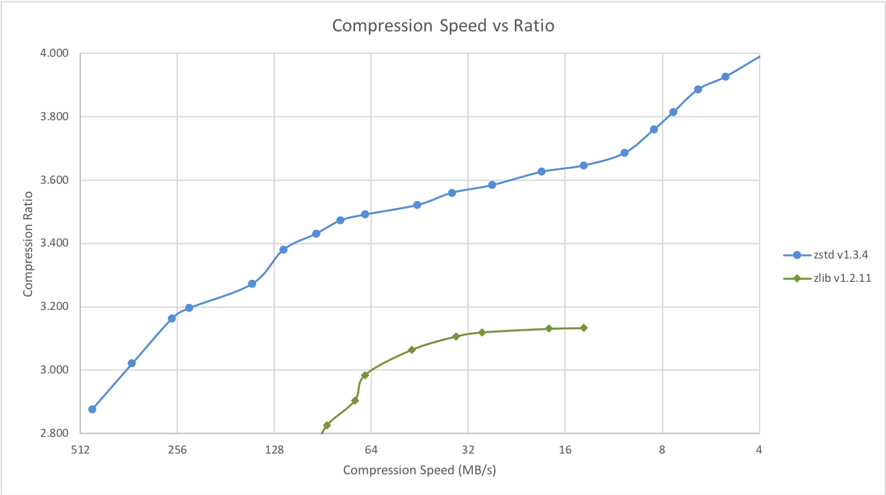
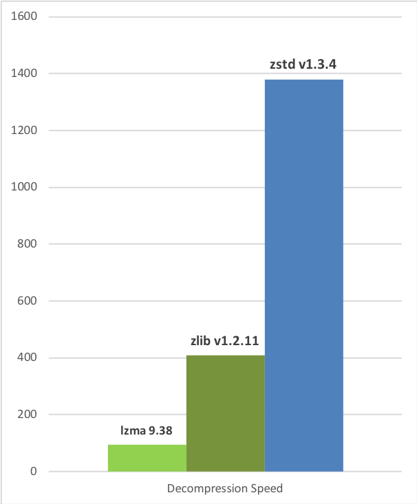
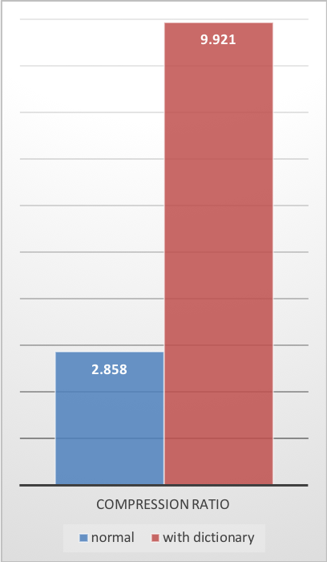
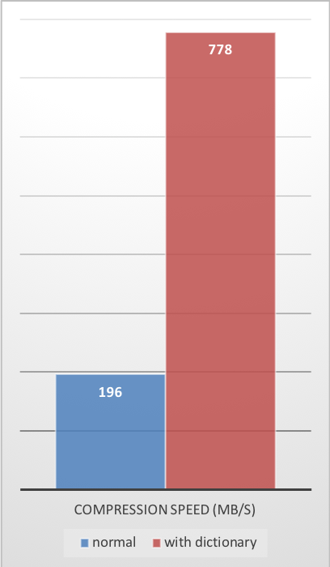
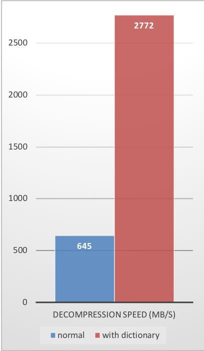

__Zstandard__, or `zstd` as short version, is a fast lossless compression algorithm,
targeting real-time compression scenarios at zlib-level and better compression ratios.
It's backed by a very fast entropy stage, provided by [Huff0 and FSE library](https://github.com/Cyan4973/FiniteStateEntropy).

The project is provided as an open-source dual [BSD](LICENSE) and [GPLv2](COPYING) licensed **C** library,
and a command line utility producing and decoding `.zst`, `.gz`, `.xz` and `.lz4` files.
Should your project require another programming language,
a list of known ports and bindings is provided on [Zstandard homepage](http://www.zstd.net/#other-languages).

**Development branch status:**

[![Build Status][travisDevBadge]][travisLink]
[![Build status][AppveyorDevBadge]][AppveyorLink]
[![Build status][CircleDevBadge]][CircleLink]

[travisDevBadge]: https://travis-ci.org/facebook/zstd.svg?branch=dev "Continuous Integration test suite"
[travisLink]: https://travis-ci.org/facebook/zstd
[AppveyorDevBadge]: https://ci.appveyor.com/api/projects/status/xt38wbdxjk5mrbem/branch/dev?svg=true "Windows test suite"
[AppveyorLink]: https://ci.appveyor.com/project/YannCollet/zstd-p0yf0
[CircleDevBadge]: https://circleci.com/gh/facebook/zstd/tree/dev.svg?style=shield "Short test suite"
[CircleLink]: https://circleci.com/gh/facebook/zstd

## Benchmarks

For reference, several fast compression algorithms were tested and compared
on a server running Linux Debian (`Linux version 4.14.0-3-amd64`),
with a Core i7-6700K CPU @ 4.0GHz,
using [lzbench], an open-source in-memory benchmark by @inikep
compiled with [gcc] 7.3.0,
on the [Silesia compression corpus].

[lzbench]: https://github.com/inikep/lzbench
[Silesia compression corpus]: http://sun.aei.polsl.pl/~sdeor/index.php?page=silesia
[gcc]: https://gcc.gnu.org/

| Compressor name         | Ratio | Compression| Decompress.|
| ---------------         | ------| -----------| ---------- |
| **zstd 1.3.4 -1**       | 2.877 |   470 MB/s |  1380 MB/s |
| zlib 1.2.11 -1          | 2.743 |   110 MB/s |   400 MB/s |
| brotli 1.0.2 -0         | 2.701 |   410 MB/s |   430 MB/s |
| quicklz 1.5.0 -1        | 2.238 |   550 MB/s |   710 MB/s |
| lzo1x 2.09 -1           | 2.108 |   650 MB/s |   830 MB/s |
| lz4 1.8.1               | 2.101 |   750 MB/s |  3700 MB/s |
| snappy 1.1.4            | 2.091 |   530 MB/s |  1800 MB/s |
| lzf 3.6 -1              | 2.077 |   400 MB/s |   860 MB/s |

[zlib]: http://www.zlib.net/
[LZ4]: http://www.lz4.org/

Zstd can also offer stronger compression ratios at the cost of compression speed.
Speed vs Compression trade-off is configurable by small increments.
Decompression speed is preserved and remains roughly the same at all settings,
a property shared by most LZ compression algorithms, such as [zlib] or lzma.

The following tests were run
on a server running Linux Debian (`Linux version 4.14.0-3-amd64`)
with a Core i7-6700K CPU @ 4.0GHz,
using [lzbench], an open-source in-memory benchmark by @inikep
compiled with [gcc] 7.3.0,
on the [Silesia compression corpus].

Compression Speed vs Ratio | Decompression Speed
---------------------------|--------------------
 | 

A few other algorithms can produce higher compression ratios at slower speeds, falling outside of the graph.
For a larger picture including slow modes, [click on this link](doc/images/DCspeed5.png).

## The case for Small Data compression

Previous charts provide results applicable to typical file and stream scenarios (several MB). Small data comes with different perspectives.

The smaller the amount of data to compress, the more difficult it is to compress. This problem is common to all compression algorithms, and reason is, compression algorithms learn from past data how to compress future data. But at the beginning of a new data set, there is no "past" to build upon.

To solve this situation, Zstd offers a __training mode__, which can be used to tune the algorithm for a selected type of data.
Training Zstandard is achieved by providing it with a few samples (one file per sample). The result of this training is stored in a file called "dictionary", which must be loaded before compression and decompression.
Using this dictionary, the compression ratio achievable on small data improves dramatically.

The following example uses the `github-users` [sample set](https://github.com/facebook/zstd/releases/tag/v1.1.3), created from [github public API](https://developer.github.com/v3/users/#get-all-users).
It consists of roughly 10K records weighing about 1KB each.

Compression Ratio | Compression Speed | Decompression Speed
------------------|-------------------|--------------------
 |  | 

These compression gains are achieved while simultaneously providing _faster_ compression and decompression speeds.

Training works if there is some correlation in a family of small data samples. The more data-specific a dictionary is, the more efficient it is (there is no _universal dictionary_).
Hence, deploying one dictionary per type of data will provide the greatest benefits.
Dictionary gains are mostly effective in the first few KB. Then, the compression algorithm will gradually use previously decoded content to better compress the rest of the file.

### Dictionary compression How To:

1. Create the dictionary

   `zstd --train FullPathToTrainingSet/* -o dictionaryName`

2. Compress with dictionary

   `zstd -D dictionaryName FILE`

3. Decompress with dictionary

   `zstd -D dictionaryName --decompress FILE.zst`

## Build instructions

### Makefile

If your system is compatible with standard `make` (or `gmake`),
invoking `make` in root directory will generate `zstd` cli in root directory.

Other available options include:
- `make install` : create and install zstd cli, library and man pages
- `make check` : create and run `zstd`, tests its behavior on local platform

### cmake

A `cmake` project generator is provided within `build/cmake`.
It can generate Makefiles or other build scripts
to create `zstd` binary, and `libzstd` dynamic and static libraries.

By default, `CMAKE_BUILD_TYPE` is set to `Release`.

### Meson

A Meson project is provided within [`build/meson`](build/meson). Follow
build instructions in that directory.

You can also take a look at [`.travis.yml`](.travis.yml) file for an
example about how Meson is used to build this project.

Note that default build type is **release**.

### Visual Studio (Windows)

Going into `build` directory, you will find additional possibilities:
- Projects for Visual Studio 2005, 2008 and 2010.
  + VS2010 project is compatible with VS2012, VS2013, VS2015 and VS2017.
- Automated build scripts for Visual compiler by [@KrzysFR](https://github.com/KrzysFR), in `build/VS_scripts`,
  which will build `zstd` cli and `libzstd` library without any need to open Visual Studio solution.

### Buck

You can build the zstd binary via buck by executing: `buck build programs:zstd` from the root of the repo.
The output binary will be in `buck-out/gen/programs/`.

## Status

Zstandard is currently deployed within Facebook. It is used continuously to compress large amounts of data in multiple formats and use cases.
Zstandard is considered safe for production environments.

## License

Zstandard is dual-licensed under [BSD](LICENSE) and [GPLv2](COPYING).

## Contributing

The "dev" branch is the one where all contributions are merged before reaching "master".
If you plan to propose a patch, please commit into the "dev" branch, or its own feature branch.
Direct commit to "master" are not permitted.
For more information, please read [CONTRIBUTING](CONTRIBUTING.md).
