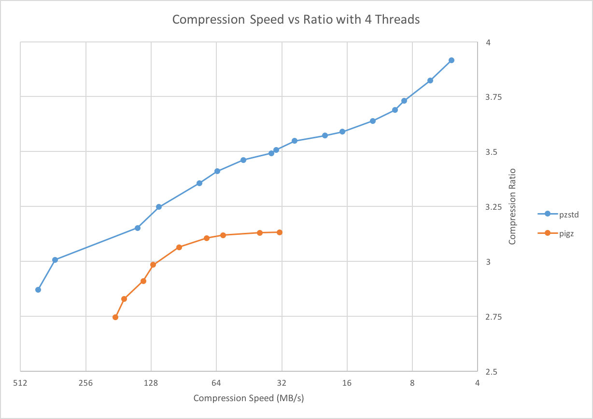
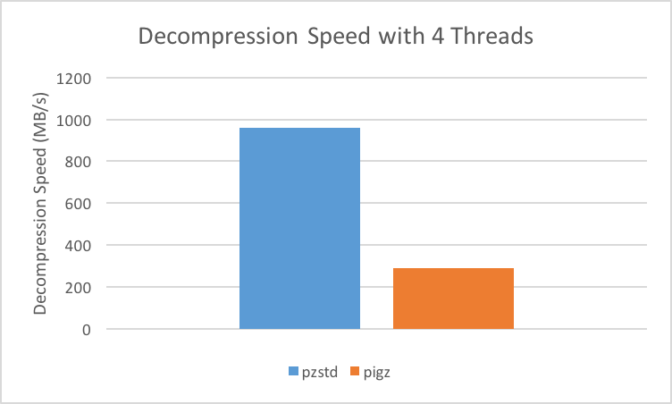

# Parallel Zstandard (PZstandard)

Parallel Zstandard is a Pigz-like tool for Zstandard.
It provides Zstandard format compatible compression and decompression that is able to utilize multiple cores.
It breaks the input up into equal sized chunks and compresses each chunk independently into a Zstandard frame.
It then concatenates the frames together to produce the final compressed output.
Pzstandard will write a 12 byte header for each frame that is a skippable frame in the Zstandard format, which tells PZstandard the size of the next compressed frame.
PZstandard supports parallel decompression of files compressed with PZstandard.
When decompressing files compressed with Zstandard, PZstandard does IO in one thread, and decompression in another.

## Usage

PZstandard supports the same command line interface as Zstandard, but also provides the `-p` option to specify the number of threads.
Dictionary mode is not currently supported.

Basic usage

    pzstd input-file -o output-file -p num-threads -#          # Compression
    pzstd -d input-file -o output-file -p num-threads          # Decompression

PZstandard also supports piping and fifo pipes

    cat input-file | pzstd -p num-threads -# -c > /dev/null

For more options

    pzstd --help

PZstandard tries to pick a smart default number of threads if not specified (displayed in `pzstd --help`).
If this number is not suitable, during compilation you can define `PZSTD_NUM_THREADS` to the number of threads you prefer.

## Benchmarks

As a reference, PZstandard and Pigz were compared on an Intel Core i7 @ 3.1 GHz, each using 4 threads, with the [Silesia compression corpus](http://sun.aei.polsl.pl/~sdeor/index.php?page=silesia).

Compression Speed vs Ratio with 4 Threads | Decompression Speed with 4 Threads
------------------------------------------|-----------------------------------
 | 

The test procedure was to run each of the following commands 2 times for each compression level, and take the minimum time.

    time pzstd -# -p 4    -c silesia.tar     > silesia.tar.zst
    time pzstd -d -p 4    -c silesia.tar.zst > /dev/null

    time pigz  -# -p 4 -k -c silesia.tar     > silesia.tar.gz
    time pigz  -d -p 4 -k -c silesia.tar.gz  > /dev/null

PZstandard was tested using compression levels 1-19, and Pigz was tested using compression levels 1-9.
Pigz cannot do parallel decompression, it simply does each of reading, decompression, and writing on separate threads.

## Tests

Tests require that you have [gtest](https://github.com/google/googletest) installed.
Set `GTEST_INC` and `GTEST_LIB` in `Makefile` to specify the location of the gtest headers and libraries.
Alternatively, run `make googletest`, which will clone googletest and build it.
Run `make tests && make check` to run tests.
